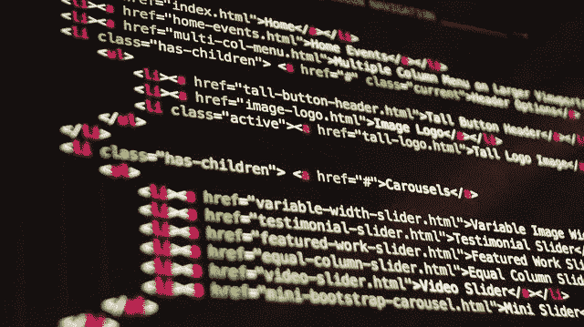
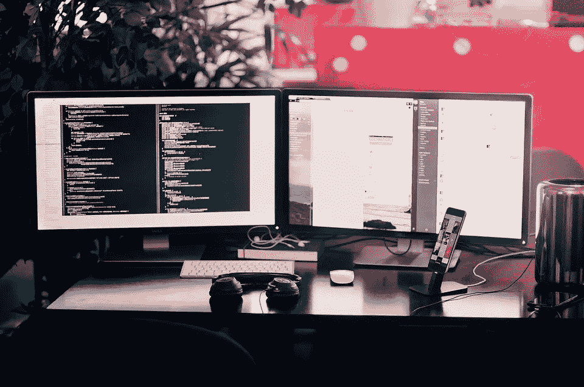
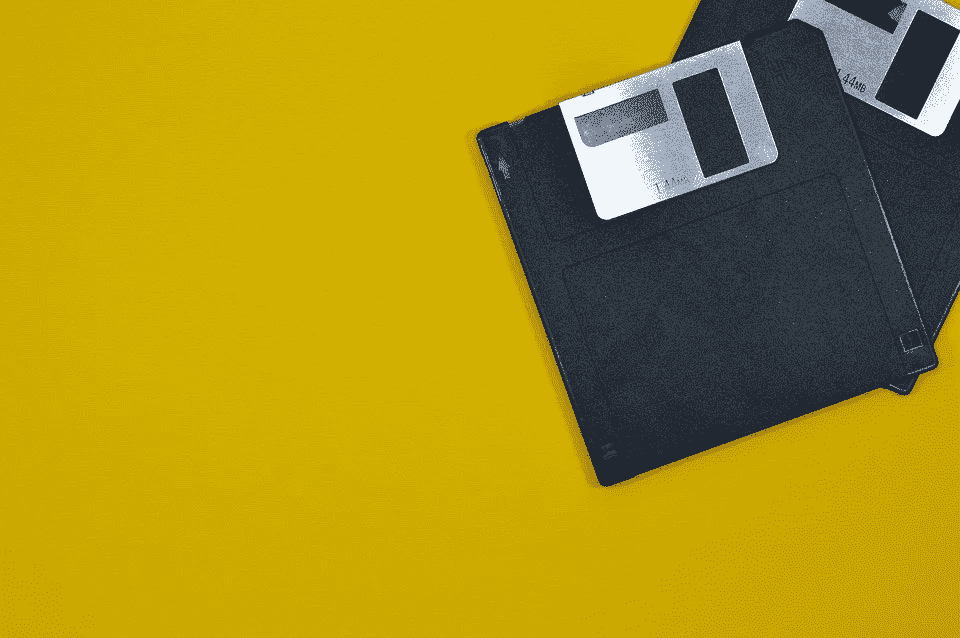

# 2021 年区块链开发者的 4 个技能

> 原文：<https://medium.com/coinmonks/4-skills-for-blockchain-initiates-to-develop-75f6f2a155fc?source=collection_archive---------2----------------------->

区块链在各个领域都充满了机会，适合任何希望为这个新兴行业做出贡献的人。那些拥有帮助运行、保护和开发项目和协议的知识的人处于众所周知的矛的尖端。

当然，区块链也需要相邻的支持领域，如设计、营销、运营等等；学习技术基础知识将使你成为一名积极的参与者。

# 编码

理解一些编码对理解和解释项目概念和指南大有帮助。项目利用各种软件、编码语言和协议来运行部分区块链或应用程序。

虽然存在大量甚至是多余的编码语言，但出于良好的理由，知道从哪里开始可能是一个挑战。对我来说，学习代码语言的最大障碍是获得语言的基本语法和定义。

当您遇到代码片段时，对 Javascript 或 Python 之类的东西的一般理解，将使您更有可能适应并理解该命令的作用。

许多人开始学习像 HTML 和 CSS 这样的网页设计协议，尽管对一些人来说这些并不被认为是“真正的代码语言”。网上到处都是指南和教程，有些比其他的好。我强烈推荐以下资源

*   [Codecademy Pro](http://ssqt.co/mQfHlNF)
*   [免费代码学院](https://www.codecademy.com/)

即使你一开始觉得不成功，编码也是一个放一些资源的好地方。

> 参加[这个 Web3 开发课程](http://blog.coincodecap.com/go/learn)并获得一份区块链开发者的工作。

# CLI —命令行界面

使用命令行界面是在区块链工作和活跃的一个重要部分，尤其是在中级和高级别。

理解如何在你运行的任何操作系统(Windows、Linux、MacOS)中使用代码片段是许多流行项目的必要条件。

> 如何从命令行启动应用程序？
> 
> *如何从命令行检查磁盘的逻辑和物理错误？*

熟悉安全和简单的命令可以填补你对我们每天使用的系统的工作理解的空白，并且可能永远不会注意到。

> *补充说明:如果你只使用过一个像 windows 这样的操作系统，也许可以考虑买一台旧的功能较弱的电脑，在上面安装一个版本的 Linux/Ubuntu。*

使用并熟悉命令行将有助于您对代码语言的理解，同时也填补了计算机如何在幕后操作的空白。

Windows: [普林斯顿 Windows 命令行。](https://www.cs.princeton.edu/courses/archive/spr05/cos126/cmd-prompt.html)

Macpaw.com

Linux: [Ubuntu](https://ubuntu.com/tutorials/command-line-for-beginners#1-overview)

# 文件、协议、系统等

就流行文化而言，计算机已经是“旧闻”了，现在已经成为大多数人日常生活的一部分，围绕文件层次和组织的许多规则已经消失了。

感谢聪明的程序员，我们内置了这么多用户友好的功能，使用电脑从未如此简单。我们只是简单地寻找我们所缺少的，文档以一种逻辑和直观的方式自动保存，我们被少数人的辛劳所拯救！

当您开始从命令行或终端运行和操作应用程序和可执行文件时，像了解文件层次结构这样的事情又开始变得重要起来，而且非常重要。

在错误的文件中执行命令，或者在正确的路径之外执行命令，将会给你带来耻辱和神秘的坚固的数字墙，或者更糟，一些代价高昂的问题。只有理解了文件系统、错误信息和其他细微差别，你才能成为一个成功的区块链人。当你理解了计算机的逻辑并在其中工作时，这些命令和应用程序就变得非常简单。

即使在 Windows、Linux 和 MacOS 之外，这些操作系统也会有所不同。

[Windows 文件协议](https://docs.microsoft.com/en-us/previous-versions/windows/internet-explorer/ie-developer/platform-apis/jj710207(v=vs.85))

# 网络和安全性

网络和安全对于许多节点、软件、应用程序或任何实际事物的运行都至关重要。

网络对区块链的一切都至关重要，因为没有通过网络连接和分发数据的能力，区块链就不存在。这是一个需要努力的领域，也是最容易出错的领域。

安全性也是一个需要重点关注的领域，因为这两者结合起来可以决定您未来运营的成败。

> *您可能经常会遇到要求您:*
> 
> 开放端口
> 
> 安全端口
> 
> 强化 SSH
> 
> 再直接的
> 
> 通过 Grpc *连接…等等。*

因为这些工具中的大多数都是 IT 工具包中的常用工具，所以信息可以广泛获得，但是它们在区块链世界中如何协同工作的框架并不十分明显，尤其是当您进入更复杂的操作时。

## 最后的想法

在教程和类似于 [Cybrary](https://www.cybrary.it/) 、 [Codecademy](https://www.codecademy.com/) 、Youtube 和其他地方的网上常见的上述技能中，没有什么可以替代培养通过各种方式自学的勇气和能力，以及为解决问题而奋斗和保持努力。

你可能会觉得这些太复杂或太困难，但我们都是人，完全有能力训练我们的大脑来完成紧张的功能。

今天花几分钟时间，看看你还能学到什么，朝着什么方向成长。你可能会感到惊讶。

让我们知道你认为作为区块链发起人必须知道的事情，或者你目前有困难的事情！

## 另外，阅读

*   最好的[密码交易机器人](/coinmonks/crypto-trading-bot-c2ffce8acb2a)
*   [Deribit 审查](/coinmonks/deribit-review-options-fees-apis-and-testnet-2ca16c4bbdb2) |选项、费用、API 和 Testnet
*   [FTX 密码交易所评论](/coinmonks/ftx-crypto-exchange-review-53664ac1198f)
*   [Bybit 交换审查](/coinmonks/bybit-exchange-review-dbd570019b71)
*   最好的比特币[硬件钱包](/coinmonks/the-best-cryptocurrency-hardware-wallets-of-2020-e28b1c124069?source=friends_link&sk=324dd9ff8556ab578d71e7ad7658ad7c)
*   [密码本交易平台](/coinmonks/top-10-crypto-copy-trading-platforms-for-beginners-d0c37c7d698c)
*   [bits gap vs 3 commas vs quad ency](https://blog.coincodecap.com/bitsgap-3commas-quadency)
*   最好的[加密税务软件](/coinmonks/best-crypto-tax-tool-for-my-money-72d4b430816b)
*   [最佳加密交易平台](/coinmonks/the-best-crypto-trading-platforms-in-2020-the-definitive-guide-updated-c72f8b874555)
*   最佳[加密贷款平台](/coinmonks/top-5-crypto-lending-platforms-in-2020-that-you-need-to-know-a1b675cec3fa)
*   [莱杰纳米 S vs 特雷佐 one vs 特雷佐 T vs 莱杰纳米 X](https://blog.coincodecap.com/ledger-nano-s-vs-trezor-one-ledger-nano-x-trezor-t)
*   [block fi vs Celsius](/coinmonks/blockfi-vs-celsius-vs-hodlnaut-8a1cc8c26630)vs Hodlnaut
*   Bitsgap 评论——一个轻松赚钱的加密交易机器人
*   为专业人士设计的加密交易机器人
*   [PrimeXBT 审查](/coinmonks/primexbt-review-88e0815be858) |杠杆交易、费用和交易
*   [享受九折优惠](/coinmonks/haasonline-review-d8d1a3400419)
*   [埃利帕尔泰坦评论](/coinmonks/ellipal-titan-review-85e9071dd029)
*   [SecuX Stone 评论](https://blog.coincodecap.com/secux-stone-hardware-wallet-review)
*   [BlockFi 评论](/coinmonks/blockfi-review-53096053c097) |从您的密码中赚取高达 8.6%的利息
*   [面向开发人员的最佳加密 API](/coinmonks/best-crypto-apis-for-developers-5efe3a597a9f)
*   [最佳区块链分析工具](https://bitquery.io/blog/best-blockchain-analysis-tools-and-software)
*   [加密套利](/coinmonks/crypto-arbitrage-guide-how-to-make-money-as-a-beginner-62bfe5c868f6)指南:新手如何赚钱
*   顶级[比特币节点](https://blog.coincodecap.com/bitcoin-node-solutions)提供商
*   最佳加密制图工具
*   了解比特币的[最佳书籍有哪些？](/coinmonks/what-are-the-best-books-to-learn-bitcoin-409aeb9aff4b)

> [直接在您的收件箱中获得最佳软件交易](/coinmonks/newsletters/coinmonks)

