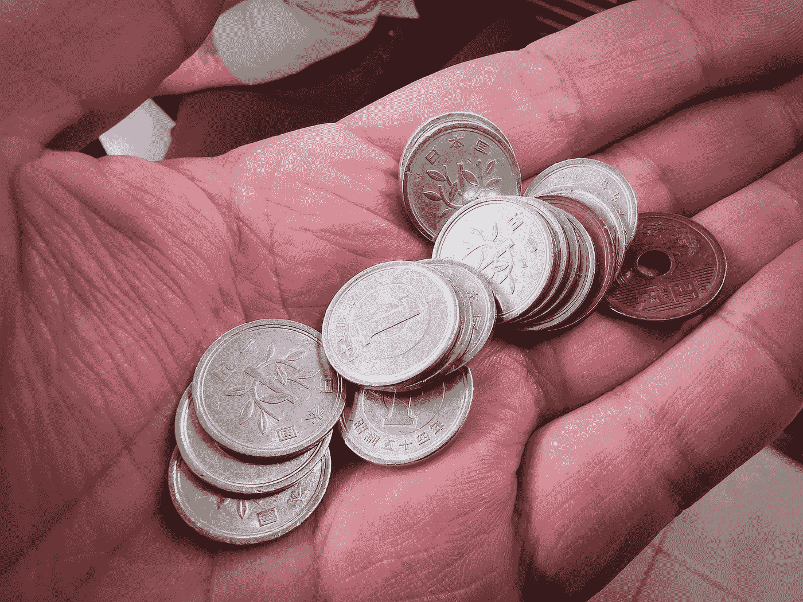

# 从熊市中复苏的 4 种方法

> 原文：<https://medium.com/coinmonks/4-ways-to-recover-from-a-bear-market-f1df22538d02?source=collection_archive---------3----------------------->

Photo by [Senad Palic](https://unsplash.com/@retrokram?utm_source=medium&utm_medium=referral) on [Unsplash](https://unsplash.com?utm_source=medium&utm_medium=referral)

2021 年开始了加密货币采用的爆炸性一年，许多人仅仅通过投资就赚了一大笔钱。无论你是因为 DogeCoin 的炒作而乘坐这趟列车，还是你看到了 NFTs 臭名昭著的疯狂价格并决定加入其中。无论是什么激发了你对不断变化的加密货币世界的兴趣，毫无疑问，该市场最终在 5 月下旬面临大幅下跌。哪里…