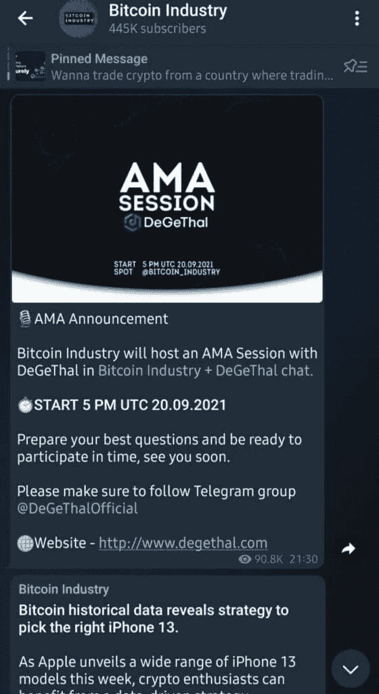

# 40 个最佳电报频道，用于加密、电影、表演和演讲

> 原文：<https://medium.com/coinmonks/40-best-telegram-channels-6b20b4084538?source=collection_archive---------5----------------------->

随着我们周围无限的信息，我们很难筛选和了解有价值的信息。Telegram 已成为数百万用户的选择，他们可以在保护您的隐私的同时，向大量观众分享知识、新闻和广播消息。Telegram 是用户下载有价值内容时最受欢迎和首选的平台之一。在这篇文章中，我们将重点关注交易者可以订阅的最佳电报渠道，并了解你想找到的信息的最佳交易。

# 加密货币的最佳电报渠道

## [1。Coincodecap 经典](https://t.me/coincodecap)

[Coincodecap Classic Telegram Channel](https://t.me/coincodecap)确保其用户定期更新市场分析、交易信号和各种与加密货币世界相关的文章。他们的分析师团队使用数学和技术指标来了解市场的进出价格。此外，他们还有一个收费频道，提供实时分析视频流、币安现货和期货信号、 [Cornix Bot 集成自动化交易](https://coincodecap.com/cornix-trading-bot)，以及许多其他好处。

CoinCodeCap Crypto Signals

## 2.[验证密码交易商的密码信号](https://t.me/VCT_Subscription_bot?start=a121)

经过验证的加密交易员主要关注来自[币安](https://coincodecap.com/binance-review)、币安期货[、Kucoin](https://coincodecap.com/kucoin-review) 、 [Bybit](https://coincodecap.com/bybit-in-the-usa) 、 [Bitmex](https://coincodecap.com/bitmex-review) 的交易信号，并在他们的白金俱乐部视频中对黄金、白银、[外汇](https://en.wikipedia.org/wiki/Forex_signal)和股票市场进行分析。在他们的 VIP 渠道中，他们以可承受的费用提供现货和杠杆交易。最后，他们有一个单独的渠道为他们的客户服务，这是很好的，相当活跃，因为他们张贴的信号结果。

该平台基于 Telegram，包括三个频道和一个白金会员组。您还可以使用 Cornix bot 来完全自动化您在平台上的交易。这里有一个关于 Cornix 交易机器人的教程。

How to use the Cornix trading bot?

## 3.肥猪信号

这是一个更受欢迎的电报频道，为其用户提供贸易信号。有经验的交易者领导它，市场分析师在彻底分析后发送每个信号，使其更加详细和个性化，并考虑几个技术指标。它为 VIP 会员提供了一个单独的渠道，他们必须付费。此外，它还提供短期、中期和长期信号。它还为您的中长期目标提供投资组合管理。

## 4.硬币信号

拥有超过 50000 名会员，硬币信号是由一群专业交易员和市场分析师引导的交易信号。他们的交易信号基于人工智能、自动交易以及技术分析。此外，它还为其成员提供加密货币新闻以及每日市场更新。该渠道声称由专业的交易团队领导。

## 5.免费加密信号

加密信号免费频道由一群经验丰富的交易员免费提供交易信号，这些交易员经历过加密货币世界的市场起伏。此外，他们的目的是免费教育这个社区的交易者，并提供高质量的信号，通过这些信号，他们达到目标，并从进入这一行业的人那里赚取利润。

## 6.加密 VIP 信号

这个特殊的渠道提供技术分析，通过他们的专家技术分析师团队赚取利润。它鼓励其成员在投资前进行研究。它们为其成员提供了深刻而清晰的理解和分析。他们为交易者提供了一个付费的溢价平台，还有额外的好处，如每日摆动/头皮交易信号、币安的保证金和期货交易等。

Crypto VIP Signals

## 7.MYC 信号

M.Y.C. Signals 允许其会员通过跟踪他们在币安期货和 Bitmex/Bybit 的交易来赚钱。他们为初学者提供交易课程，学习交易，避免过度交易的诱惑以及高风险。他们有一个单独的 V.I.P .集团——币安期货或 BitMEX/Bybit V.I.P .他们承诺提供良好的交易信号和 BTC 现货信号。

## 8.通用加密信号专业版

Universal Crypto Signals 及其来自印度的技术分析师团队提供定期交易信号。他们提供每日市场和价格更新。此外，他们有每月和每年的订阅。凭借其高级会员资格，您可以进行现货和保证金交易，并访问其他高级功能。他们创建了一个单独的客户服务渠道。

# 加密泵和转储电报通道

## 9.加密币安交易|信号和泵

这个特殊的电报频道是为加密货币交易者和投资者广播[交易信号而设置的。这个渠道通过他们的专家技术分析团队为你提供信息和市场分析。他们旨在通过宣布他们即将推出的大泵来确保每个成员都获得利润，这些大泵是他们与团队经过数小时的讨论和市场分析后提出的。他们目前正处于大规模牛市，创造了币安最强大、最庞大的水泵。](https://blog.coincodecap.com/free-crypto-signals)

## 10.大泵币安

这个特殊的渠道声称是币安交易所市场上最大的泵社区之一。拥有无数成功的水泵，所有的订户都有机会从中赚取荒谬的利润。他们提供交易信号、市场分析和信息。此外，他们在币安交易所公布了这组即将上市的泵的所有细节。

# 加密新闻电报频道

出发前，你可以订阅我们的 YouTube 频道，在不到 10 分钟的时间里欣赏一天的故事，而不是电报频道。

Crypto News by Coinmonks

## 11.[Wu 区块链](https://t.me/wublockchainenglish)

WuBlockchain 是加密世界中最受欢迎的 Twitter 句柄之一。此外，他们最近开始在电报和打破加密新闻直接通过他们的电报频道。你可以通过[点击这里](https://t.me/wublockchainenglish)加入它，并保持在加密市场的更新。

## 12.比特币新闻加密和技术分析师

比特币新闻加密和技术分析师频道是加密币安交易的一个分支。它提供专业技术分析团队收集的交易信号、新闻和信息。同样，前一个频道的目标也是其频道的订户可以从他们宣布的即将到来的大泵中受益。

## 13.加密硬币

加密硬币频道为其成员提供新闻、列表信息和加密货币市场分析。此外，它还发布突破/抛售警报，并提供不同分支渠道的指南。这个频道提供高级会员资格，提供诸如高级现货交易[币安信号](https://coincodecap.com/binance-crypto-signals)、上市前信息、专业的日常帮助、对基本面技术分析和图表的理解、币安的保证金交易等功能。

## 14.[币安公告](https://t.me/binance_announcements)

币安公告是币安的官方英语小组，币安交流平台的每一个新功能或内容都在这个电报频道上播出，以便成员及时了解他们可以访问的所有功能和内容，并从中受益，从而获得利润。

## 15.BTC 干线

BTC Trunk 与会员免费分享关于加密货币世界的有用资料，如新闻、市场分析和信息。它为用户了解加密货币交易提供了详细而清晰的信息。此外，他们还举办了一个“问我任何事情”的会议，让用户参与并提出有关贸易和加密货币行业的问题。

## 16.比特币行业

这个特别的频道声称比任何其他频道都更快地发布关于加密货币行业的每一条新闻、交易分析和信息。此外，比特币行业频道在其频道上组织了许多“问我任何问题”的会议，供其成员参与。除此之外，他们还鼓励其成员参加当地的大型贸易交换赠品活动。

## 17.BeInCrypto 贸易社区

BeInCrypto Trading Community 是另一个向用户提供交易信号服务的电报频道。除此之外，他们还提供交易课程和专家交易指导，以简化加密货币交易。此外，他们组织了大量的直播和项目评论来鼓励其成员。凭借其高级会员资格，您将获得独家交易信号，这是一个推荐计划，根据您带来的会员数量，您将获得一些 U.S.D.T .等。

# 电影最佳电报频道

## 18.电影帝国

这是一个基于娱乐的频道，你可以随时下载和观看众多高清好莱坞和南印度电影。

## 19. [Y.I.F.Y .电影](https://t.me/YTSmovies)

Y.I.F.Y. Movies telegram channel 为您提供众多宝莱坞和好莱坞电影，供订户娱乐，您可以下载并立即观看。

## 20.[恐怖电影电报频道区](https://t.me/joinchat/wiX5Xls_icE1MmFl)

作为这个特定频道的成员，您已经订阅了一个频道，该频道收集了最好、最令人毛骨悚然的高清恐怖电影以及最新的宝莱坞和好莱坞电影。

## 21.[全英文高清电影电报频道](https://t.me/latest_english_hd_hindi_movies)

全英文高清电影是一个娱乐电报频道，为其成员提供最好的高清恐怖和好莱坞电影，并随时观看。

## 22.[免费网飞显示电报频道](https://telegram.me/joinchat/AAAAAFAAi2uBX_Vjwrqbdw)

顾名思义，这个特殊的电报频道为您提供网飞原创内容，包括网飞电影、纪录片和电视连续剧，这些内容在那里都可以获得，并且可以随时访问。

## 23.[电影和网络电报频道](https://t.me/moviesandwebseries121)

电影和网络电报频道让您可以观看宝莱坞和好莱坞的电影，印地语的网络系列，以及供其成员欣赏的英语双音频。

## 24.[网飞粉丝](https://t.me/netflix)

网飞粉丝电报频道声称，它为无数想要充分享受这个平台的网飞粉丝提供了关于网飞系列、电影和纪录片的所有最新信息和更新。

## 25. [MovieARRAYS](https://t.me/moviearrays)

这个特殊的频道是一个基于娱乐的频道，其成员可以免费下载所有最新的好莱坞/网飞高清电影，带字幕和突发新闻/推文等。

## 26.[动漫电报频道](https://t.me/AnimeLibrary_Movies)

作为动画电影和系列的一种流行类型，动漫电影电报频道允许您下载和访问日语和英语的动漫电影。

## 27.[好莱坞高清电影电报频道](https://telegram.me/joinchat/AAAAAFLqViy9Gg2VXDjiZw)

如果你是一个电影爱好者，这个特定的频道可以让你下载和欣赏所有的好莱坞高清电影，并通过兑现其向订户提供他们所需的承诺而获得了大量订户。

## 28. [MF 马拉地电影电报频道](https://t.me/MFMIXMARATHI)

如果你正在 Telegram 上免费寻找马拉地语电影和电视连续剧，你可以成为会员，在 M.F .马拉地语 mix 频道上找到它们，它将为你提供优质的电影和连续剧

## 29. [MF Mix 古吉拉特语电影电报频道](https://t.me/mfmixgujarati)

MF Mix 古吉拉特语电报频道作为其频道的订户，让您享受和下载所有最新的古吉拉特语电影和系列。

## 30.[旁遮普电影电报频道](https://t.me/punjabicinemahub)

对于所有喜欢旁遮普电影的人来说，你可以在 Telegram 上结束搜索，在旁遮普 Cinemahub 频道上找到它们，这可以让你访问所有你喜欢的旁遮普电影。

## 31.[死亡笔记电报](https://t.me/Death_Note_Series)

所有你喜欢的动漫电影类型，无论是惊悚片、心理片、动作片还是悬疑片，在这个频道上都有，当你成为这个电报频道的成员时，你可以下载英语和日语版本。

# 最佳教育电报频道

## 32.门电报通道

作为这个渠道的成员，他们可以为你提供学习资料、书籍、pdf、笔记等，帮助你准备即将到来的 GATE 考试。，与后者相关，让你及时了解考试中会遇到什么类型的问题。

## 33.BYJU 的电报频道

如果您正在准备银行考试，可以加入这个电报频道，了解未来的事件和技巧，以应对 I . b . p . s . s . b . I . r . b . I . l . c .和其他考试。他们还有一个 youtube 频道和一个升级应用程序。

## 34.非机密电报通道

Unacademy NEET Toppers 帮助您准备和更新与 Unacademy NEET 相关的技巧、奖学金和模拟考试。事实证明，这些建议对学生很有帮助。

## 35.免费 Udemy、Unacademy、Etoos 课程

这个特别的频道可以证明是有用的，因为它在 Udemy 和 Unacademy 平台上为其成员免费提供课程视频，并且可以随时下载和访问

## 36.阿比雅安电报频道

假设你是一名准备 M.P.P.S.C .考试的学生。在这种情况下，Abhiyaan telegram 频道可以通过课程视频、技巧和其他对你有帮助的学习材料的链接来帮助你做准备。

## 37.MBA CAT 考试电报频道

这个频道可以为你提供来自不同的著名机构的学习资料，比如 t . I . m . e . Career Launcher，b . y . j . u . S .，C.E.T.K.I.N.G .，I.M.S .等等。，以及 GD/PI/WAT 材料和面试经验，对学生可能有用。

## 38.韦丹图电报频道

对于像 like NEET 这样准备考试的学生，这个频道可以让你受益，因为它提供了复习考试材料和课程及主题的视频，可以帮助你准备。

## 39.尼特·IIT·JEE 登上电报频道

像 NEET，I.I.T .和 JEE 这样的考试需要你从各个方面做好准备，NEET IIT JEE 董事会频道可以为你提供各种学习材料，视频课程和模拟考试。

## IIT | JEE |主要|高级| NEE

这个频道为你提供免费的学习资料、书籍和笔记，以及 11 和 12 年级、JEE 和啃老族的免费材料，对你的准备有所帮助。

## 40.AAKASH 研究所电报频道

这个特定的频道为其成员提供全印度著名的 IIT·JEE 和尼特学院的所有最好的学习资料。而且，他们为你提供免费的 I.I.T .、JEE、NEET、K.V.P.Y .的专属书籍

# 结论:最佳电报渠道

我们希望留给您的最后一个想法是，有许多选项可供您选择，您走向成功的第一步是选择正确的来源，因此我们这里有一个选项列表，您可以从中选择，并确定哪个选项最适合您，并帮助您赚取利润。

# 常见问题

## Q1。加密货币如何使用电报？

A1。您可以加入众多可以为您提供交易信号的团体，以指导您在正确的时间和地点投资加密货币。

## Q2。加密货币交易信号用哪个 app？

A2。你会在 Telegram 或 discord 上遇到许多加密货币信号提供商。

## Q3。Telegram 上最好的加密货币交易信号提供商是哪个渠道？

A3。Telegram 为您提供了大量的加密货币交易信号选项。Telegram 上的顶级加密货币交易信号渠道是加密币安交易|信号和泵、通用加密信号、验证加密交易商。

> 加入 Coinmonks [电报频道](https://t.me/coincodecap)和 [Youtube 频道](https://www.youtube.com/c/coinmonks/videos)了解加密交易和投资

## 另外，阅读

*   [非洲最佳密码交易所](https://coincodecap.com/crypto-exchange-africa) | [胡交易所评论](https://coincodecap.com/hoo-exchange-review)
*   [eToro vs robin hood](https://coincodecap.com/etoro-robinhood)|[MoonXBT vs Bybit vs Bityard](https://coincodecap.com/bybit-bityard-moonxbt)
*   [有哪些交易信号？](https://coincodecap.com/trading-signal) | [比特斯坦普 vs 比特币基地](https://coincodecap.com/bitstamp-coinbase)
*   [ProfitFarmers 点评](https://coincodecap.com/profitfarmers-review) | [如何使用 Cornix Trading Bot](https://coincodecap.com/cornix-trading-bot)
*   [如何在势不可挡的域名上购买域名？](https://coincodecap.com/buy-domain-on-unstoppable-domains)
*   [印度的秘密税](https://coincodecap.com/crypto-tax-india) | [altFINS 审查](https://coincodecap.com/altfins-review) | [Prokey 审查](/coinmonks/prokey-review-26611173c13c)
*   [赢取注册奖金——10 大最佳加密平台](https://coincodecap.com/earn-sign-up-bonus)
*   [Blockfi vs 比特币基地](https://coincodecap.com/blockfi-vs-coinbase) | [BitKan 点评](https://coincodecap.com/bitkan-review) | [Bexplus 点评](https://coincodecap.com/bexplus-review)