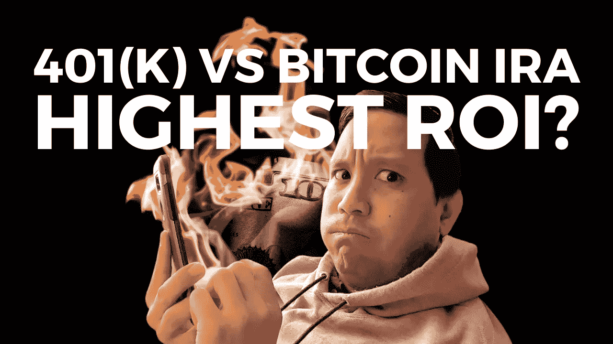
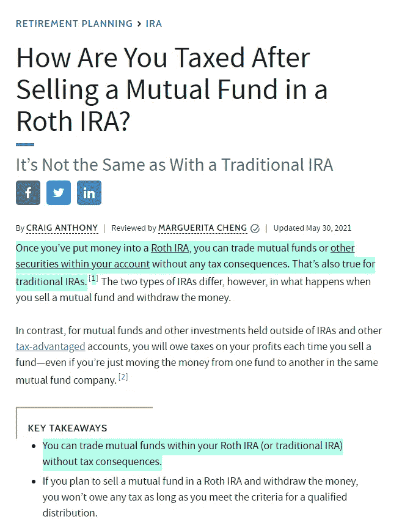
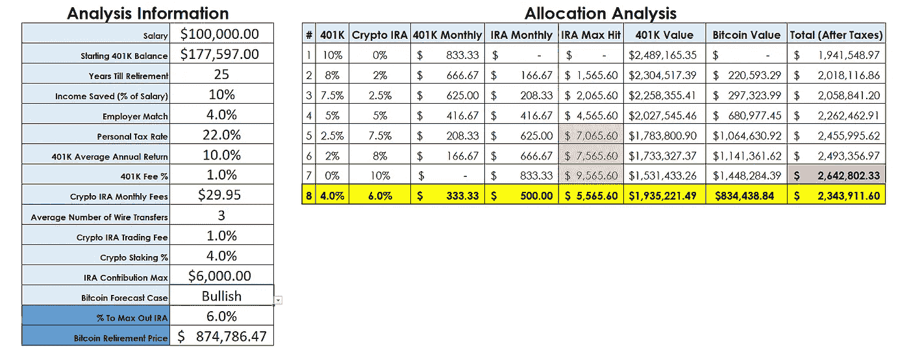

# 401(k)与比特币个人退休帐户/加密个人退休帐户(按中位年龄组划分的金融模型)相比，哪个投资回报率更高

> 原文：<https://medium.com/coinmonks/401-k-vs-crypto-ira-bitcoin-ira-af5fb005a427?source=collection_archive---------2----------------------->

If you prefer to watch a [YouTube video](https://youtu.be/_zhXrr1OTK4) instead, I covered the analysis in [this video](https://youtu.be/_zhXrr1OTK4).

投资 401(k)或加密个人退休账户/比特币个人退休账户值得吗？

有可能。如果一个人可以利用个人退休帐户的免税优势，加密个人退休帐户/比特币个人退休帐户可能会显示出更高的投资回报。

这包括 401(k)雇主匹配和其他加密个人退休账户/比特币个人退休账户费用。我们很快会深入分析，稍后会详细介绍。

> ***免责声明:*** 此外，我不是财务顾问，因此我在文章中涉及的内容是我的财务观点，不应作为财务或投资建议，仅用于教育和信息目的。请做额外的研究，看看这是否对你自己独特的财务状况有意义。

# 为什么是比特币个人退休账户/加密个人退休账户？

Source: [How to Invest in Tax-Free Crypto by iTrustCapital](/coinmonks/401-k-vs-crypto-ira-bitcoin-ira-af5fb005a427?referralcode=LOSARIA&utm_source=partner&utm_medium=cpa&utm_campaign=LOSARIA) (affiliate link)

两个字。免税的。

是的，你可以交易比特币和其他密码，并合法地免税复利。

不，你不必搬到像葡萄牙或波多黎各这样的秘密税收友好的地方。

Source: Source: [https://www.nasdaq.com/articles/7-most-crypto-friendly-countries-for-bitcoin-investors-2021-06-30](https://www.nasdaq.com/articles/7-most-crypto-friendly-countries-for-bitcoin-investors-2021-06-30)

不，你不会被指控逃税。

这是通过比特币个人退休帐户/加密个人退休帐户来完成的，这实质上是一个专门的罗斯个人退休帐户(个人退休帐户)，专注于比特币和其他加密货币。

虽然这看起来好得令人难以置信，但这是有道理的，因为罗斯个人退休帐户对各种投资选项都有相同的税收优惠，包括共同基金、股票、债券、ETF、CDs 和货币市场基金。

Source: [https://www.investopedia.com/ask/answers/072016/how-are-you-taxed-after-selling-mutual-fund-roth-ira.asp#:~:text=Once%20you've%20put%20money,also%20true%20for%20traditional%20IRAs.](https://www.investopedia.com/ask/answers/072016/how-are-you-taxed-after-selling-mutual-fund-roth-ira.asp#:~:text=Once%20you've%20put%20money,also%20true%20for%20traditional%20IRAs.)

有一些缺点，例如:

*   不到 59 岁半不能退出
*   该账户至少开立了 5 年
*   你需要收入低于 140，000 美元或 206，000 美元，如果已婚并共同申报。

如果你还没看过我之前的视频《比特币/加密 IRA 值不值》……9 个需要回答的关键问题。你可以看下面的视频。

但如果你有，你知道我的一个大问题是，是继续资助我的 401(k)还是资助一个加密个人退休帐户更好？

你可能和我一样，我被免税加密投资的想法迷住了，所以这是彩虹和独角兽的快乐…起初。

在我的房间里独自掀起一场风暴。

但后来，我看到了一个比特币/加密 IRA 的额外费用，每月 29.95 美元的费用！(至少用 iTrustCapital。)

25 年后，这 8985 美元可以留在我的 401(k)里并复利！

一个错误的决定可能会让我在退休时损失几十万美元。

一点压力都没有，对吧？

我投资的更高回报是什么？

*   继续把我的钱投资到 401(k)里面
*   使用比特币/加密个人退休帐户中未来资金
*   投资于两者的结合

如果你正在读这篇文章，你可能也在想同样的事情。我将回顾一下我的发现，同时也是每个退休年龄组的平均人数。

很快会有更多的报道…

# 好得难以令人相信

起初，我的自然倾向是最初驳回这个想法，并对任何主张保持高度警惕。然后，我想起了这句名言。

Source: [https://www.brainyquote.com/quotes/mark_twain_122378](https://www.brainyquote.com/quotes/mark_twain_122378)

"每当你发现自己站在大多数人一边时，就该停下来反思一下了。"——马克·吐温

通常，当大多数人不理解时，就有一个潜在的机会。

想想互联网。

大多数人认为我为什么要在网上买东西。或者在社交媒体上，大多数人说我为什么要用脸书/推特/Instagram，因为没人关心我做什么或者晚餐吃什么。

互联网和社交媒体继续拥有巨大的机会来发展人们的业务和在线影响力。

这就是我对加密货币行业和区块链技术的看法。但对于大众来说，它正在慢慢改变。

我是一名商业分析顾问，我的日常工作是为一家世界 500 强公司工作。深入挖掘数据以做出更明智的决策是我日常工作的一部分。

# 为什么多层次营销人员讨厌我

MLM 人讨厌我，因为我喜欢自己做更深入的分析。

像任何销售人员一样，他们利用人们对损失的恐惧，引用股票市场的巨大损失。展示了不同股票市场崩溃的疯狂图表，以及如果你把钱存在 401(k)账户中，你会遭受的百分比损失。

然后拿出一张纸来做一些基本的数学计算，在一个案例中，他们用一张餐巾纸作为他们终极的金融分析上帝的礼物来证明他们的金融产品更好。

然后，他们向你展示如果招募这么多人，他们能卖这么多钱。然后如果他们招聘这么多，而他们下面的人卖这么多…

…你可以买一辆法拉利。

让我们以 IUL 为例。IUL 代表指数化普遍人寿保险。流行的多层次营销金融产品。

吹捧其上限损失，只会损失一定的百分比，所以你不能失去超过 0%，如果市场去是消极的一年。想想 COVID 或 2008 年的房地产崩盘，而不是两位数的损失，你损失了 0%。

当大规模撞车事故发生时，这看起来是一项伟大的投资，对吗？

但是他们没有彻底解释缺点，不仅你的损失被限制，你的收益被限制在 14%到 6%之间。

虽然这限制了你在下跌趋势的熊市中的潜在损失，但它限制了你在牛市中的收益。

Source: [http://www.billboersmaonlifeinsurance.info/indexed-universal-life-back-testing-and-cap-rates-and-averages-oh-my/](http://www.billboersmaonlifeinsurance.info/indexed-universal-life-back-testing-and-cap-rates-and-averages-oh-my/)

这是 billboersmaonlifeinsurance.info 对 IUL 上限如何影响回报的分析

即使股市回报率达到两位数，市场的实际回报率也只有 8.12%左右，接近 IUL 的回报率(14%的上限)。

Witt actuarial services 还指出，iul 不包括股息，因此实际年化回报低于上面的网格。

Source: [https://www.wittactuarialservices.com/news/critical-review-indexed-universal-life](https://www.wittactuarialservices.com/news/critical-review-indexed-universal-life)

上面有 IUL 上限回报网格的说明，它不包括 2020 年和 2021 年，这是有史以来最快的复苏之一，S&P、道琼斯和纳斯达克分别飙升 90%、88%和近 112%。

虽然 IUL 对有特定需求的人来说是有意义的，但对像我这样的人来说，将我的 401(k)计划展期的直接投资产品是没有意义的。

我的 401(k)正在返回 11.7%。尽管这个多层次的营销人员做了很多激烈的涂鸦和扭曲的脸，我还是会损失很多钱。

我举 IUL 的例子并不是因为我讨厌多层次营销者…

# 但是因为我讨厌表面分析

大多数 MLM 人习惯于在销售时不考虑每个人的情况和潜在的细微差别。

在这篇文章中，我不想误导读者，所以我将提出这个分析的缺点。

我已经尽可能透明了。

> ***免责声明:*** 此外，我不是财务顾问，因此我在文章中涉及的内容是我的财务观点，不应作为财务或投资建议，仅用于教育和信息目的。请做额外的研究，看看这是否对你自己独特的财务状况有意义。

# 这种财务分析和预测方法的局限性

这一分析是通过 Excel 中的预测表完成的。

据 ablebits.com 称，这种预测方法“是基于指数三重平滑(ETS)算法的 AAA 版本(附加误差、附加趋势和附加季节性)。”

Source: [https://www.ablebits.com/office-addins-blog/2019/03/20/forecast-excel-linear-exponential-smoothing-forecasting-models/](https://www.ablebits.com/office-addins-blog/2019/03/20/forecast-excel-linear-exponential-smoothing-forecasting-models/)

三重指数平滑也被称为霍尔茨-温特。它基于简单指数平滑法的局限性，考虑了趋势、季节性和置信区间。

我在网上翻了很多资源，对这种预测方法有了更多的了解。我将在最后的参考资料列表中列出我阅读的所有内容。

简而言之，这是当今业务中最流行的预测方法之一。

背后的数学和代码非常复杂(至少对我来说)。

Source: [https://en.wikipedia.org/wiki/Exponential_smoothing](https://en.wikipedia.org/wiki/Exponential_smoothing)

但是因为 Excel 的预测表是基于 ETS 算法的，所以它是一个黑匣子，因为我们无法通过查看内部代码来更好地理解其局限性。

这是第一个限制，即不能完全理解 Excel 是如何创建预测数据的。这是我用来创造比特币未来价格的方法。

像许多预测一样，这种方法使用历史值来预测未来价格。但历史价值不是未来价格走势的指标。

这是预测的一个普遍局限性，即无法预测会导致重大趋势逆转的异常事件。

这方面的一个例子是 COVID 和疫情的影响和复苏。但最终，它对比特币和加密货币价格的影响。

趋势逆转可能因为任何原因而发生，如全球创新、国家立法或社交媒体以及媒体影响。这种预测无法预测或解释这些逆转。

一个相关的限制是当异常事件在用于预测的历史数据内时。预测者会认为这些异常事件是价格运动的正常趋势和季节性的一部分。

因为 COVID 崩溃和快速恢复在我使用的历史比特币数据范围内，所以这被计入了预测。

Photo by [Chris Liverani](https://unsplash.com/@chrisliverani?utm_source=medium&utm_medium=referral) on [Unsplash](https://unsplash.com?utm_source=medium&utm_medium=referral)

但我不介意，因为它应该重量创建一个较低的预测。但认为 COVID 崩溃和快速复苏是趋势和季节性的一部分将会扭曲数据。

我很想把我学到的更多的东西写出来，但是这篇文章反而会变成一个讲座。

同样，请查看本文末尾的所有附加资源。

虽然我尽了最大努力来构建它，并仔细检查了我的工作，但最后一个限制是潜在的人为错误。

我不会犯错，也可能犯错误。

我不知道我不知道什么。

# 401(k)与 Crypto IRA 工具的内部工作原理

现在我们已经了解了一些限制，让我们来看看我构建的工具/财务模型的内部工作原理。

我想在此分析中说明的主要因素:

*   Crypto IRA 每月账户费用
*   银行电汇费用(幸运的是，随着 iTrustCapital 在 2021 年第四季度实施直接存款，这种情况将会消失)
*   加密个人退休帐户交易费用
*   401 费用
*   不同的退休税级(考虑到潜在的免税储蓄)
*   基于每年预测价格和平均比特币价格的累积比特币
*   雇主 401(k)匹配
*   加密个人退休帐户的最大缴款额
*   可调 401(k)年化收益率
*   能够改变值来测试 401(k)和比特币的预期退休回报的不同场景

该工具的工作原理如下:

*   “摘要”选项卡基本上是一个表单，我可以在其中更改重要信息，如工资、401(k)余额等

*   我想测试不同的自动收入分配组合

*   配置组合从仅投资于我的 401(k)账户到仅投资于比特币/加密个人退休账户，以及介于两者之间的 5 种情景
*   1 收入分配，如果需要，我可以手动将节省的收入调整到我想测试的任何项目

*   有 8 个选项卡包含动态公式，这些公式将根据“摘要”选项卡中的重要值自动更新
*   比特币历史标签是从 2014 年 7 月 17 日到 2021 年 4 月 23 日拉入 excel 的比特币数据
*   2014 年 7 月 17 日我可以访问的最早比特币数据
*   2021 年 4 月 23 日是我第一次创建分析的时候(比特币= 50，543.35 美元)

Example of one of the income allocation tabs

您可能会想，“等等，Jeff，为什么不重新运行并更新这个工具呢？”

是的，我打算这么做，但是…

…我停下来，想看看预测对未来价格的预测有多准确。

因为当我在太平洋标准时间 8 月 13 日上午 10:01 写这篇文章时，比特币的价格是 46551.73 美元。

Source: Tradingview.com

看涨预测在 46，374.85 美元。

令人惊讶的是，比特币的价格仅比看涨预测高出 176.88 美元。

虽然之前的日期不太准确，但我很高兴看到预测数据的总体表现，希望通过这种比较来增强工具。

模型不考虑:

*   加薪或年度调整
*   通货膨胀
*   超过 100 年报废的预测值
*   401(k)最大缴款额
*   比特币之外的其他加密货币

# 401(k)与比特币个人退休帐户/加密个人退休帐户的对比结果基于美国的中值数据

让我们来看看美国人的中位数和平均数。

美国工资中位数= 44，835 美元

Source: [https://www.ziprecruiter.com/Salaries/Census-Bureau-Salary#:~:text=Census%20Bureau%20Annual%20Salary%20(%2444%2C835%20Avg%20%7C%20Jul%202021)%20%2D%20ZipRecruiter](https://www.ziprecruiter.com/Salaries/Census-Bureau-Salary#:~:text=Census%20Bureau%20Annual%20Salary%20(%2444%2C835%20Avg%20%7C%20Jul%202021)%20%2D%20ZipRecruiter)

中位数 401(k)余额=

*   < 25 = $2,240
*   25–34 = $13,265
*   35–44 = $32,664
*   45–54 = $56,722
*   55–64 = $84,714
*   65+ = $82,297

Source: [https://institutional.vanguard.com/content/dam/inst/vanguard-has/insights-pdfs/21_CIR_HAS21_HAS_FSreport.pdf](https://institutional.vanguard.com/content/dam/inst/vanguard-has/insights-pdfs/21_CIR_HAS21_HAS_FSreport.pdf)

平均 401(k)匹配= 4.5% |中位数 401(k) = 4%

Source: [https://institutional.vanguard.com/content/dam/inst/vanguard-has/insights-pdfs/21_CIR_HAS21_HAS_FSreport.pdf](https://institutional.vanguard.com/content/dam/inst/vanguard-has/insights-pdfs/21_CIR_HAS21_HAS_FSreport.pdf)

IRS 个人税级:如果单身，平均工资为 44，835 美元，税率为 22%

Source: [https://www.bankrate.com/finance/taxes/tax-brackets.aspx#:~:text=There%20are%20seven%20tax%20brackets,separately%2C%20and%20head%20of%20household.](https://www.bankrate.com/finance/taxes/tax-brackets.aspx#:~:text=There%20are%20seven%20tax%20brackets,separately%2C%20and%20head%20of%20household.)

401(k)根据 Investopedia 的平均年回报率= 5%-8%

Source: [https://www.investopedia.com/ask/answers/041015/what-rate-return-should-i-expect-my-401(k).asp](https://www.investopedia.com/ask/answers/041015/what-rate-return-should-i-expect-my-401k.asp)

根据中大西洋资本集团的 401(k)平均年回报率(来自 SoFi Learn 文章)= 9.5%

Source: [https://www.sofi.com/learn/content/401k-rate-of-return/](https://www.sofi.com/learn/content/401k-rate-of-return/)

当然，这只是 5 年多的时间。在他们选择的时间范围内，年化回报率会更高。

在美国消费者新闻与商业频道 2021 年的最终退休规划指南中，它提到了自 1920 年以来标准普尔 500 10%的年回报率。

Source: [https://www.cnbc.com/guide/retirement-planning/](https://www.cnbc.com/guide/retirement-planning/)

由于 10%符合大多数财务规划师的说法，我选择了 10% 401(k)回报率的高端进行分析。

还因为我偏向于把未来的钱投资到 401(k)上。

平均 401(k)费用=每年资产的 1%

Source: [https://humaninterest.com/learn/articles/401(k)-fees-too-high/](https://humaninterest.com/learn/articles/401k-fees-too-high/)

接下来，我使用 iTrustCapital 的 Crypto IRA 费用，因为这是我拥有自己的 Crypto IRA 的地方，我发现他们有一些最低的费用和很好的客户服务。

If you’re interested in opening up a Crypto IRA, use my affiliate link to get one free month when you sign-up, and I do get a small affiliate commission at no extra cost to you. The link shows you the iTrustCapital’s fees too: [https://itrustcapital.com/fees](https://itrustcapital.com/fees?referralcode=LOSARIA&utm_source=partner&utm_medium=cpa&utm_campaign=LOSARIA)

加密个人退休帐户费用:

*   每月账户费= 29.95 美元
*   银行电汇费= $25(我把自己一年转账的次数限制在 3 次。在第 4 季度，他们将实施直接存款/ACH，因此这项费用将会取消)
*   1%交易费(买入或卖出时收取 1%的费用。为了便于分析，我每年只买不卖，直到退休。)

# 每个退休年龄组用于分析的数字

接下来，让我们来看看每个年龄组(除了 25 岁以下)使用全国中位数和这个金融模型。

我不考虑 25 岁以下的人，因为这个分析没有考虑工资增长。通常，人们不会保持 25 岁以下时的工资中位数。(如果想看这个分析，可以在下面留言评论。)

我们将使用收入的 10%,因为这通常是建议为退休储蓄的最低金额。

Source: [https://www.investopedia.com/articles/retirement/082716/your-401(k)-whats-ideal-contribution.asp#:~:text=Most%20financial%20planning%20studies%20suggest,and%2020%25%20of%20gross%20income.](https://www.investopedia.com/articles/retirement/082716/your-401k-whats-ideal-contribution.asp#:~:text=Most%20financial%20planning%20studies%20suggest,and%2020%25%20of%20gross%20income.)

我将使用 Vanguard 按年龄划分的 401(k)余额中位数数据。

中位数 401(k)余额=

*   < 25 = $2,240
*   25–34 = $13,265
*   35–44 = $32,664
*   45–54 = $56,722
*   55–64 = $84,714
*   65+ = $82,297

Source: [https://institutional.vanguard.com/content/dam/inst/vanguard-has/insights-pdfs/21_CIR_HAS21_HAS_FSreport.pdf](https://institutional.vanguard.com/content/dam/inst/vanguard-has/insights-pdfs/21_CIR_HAS21_HAS_FSreport.pdf)

根据 dqydj.com 的数据，按年龄划分的收入中位数(美国)。

Source: [https://dqydj.com/average-median-top-income-by-age-percentiles/](https://dqydj.com/average-median-top-income-by-age-percentiles/)

最近的消息，iTrustCapital 计划在 2021 年第 4 季度纳入加密堆栈！

因为这是在地平线上，但还不可用，分析包括有和没有桩。

但我要猜测，iTrustCapital 的赌注利率会有市场竞争力。

让我们比较一下 Voyager 和 Celcius，你现在对你的密码感兴趣的地方。

旅行者号:

Source: [https://rewards.investvoyager.com/interest/](https://rewards.investvoyager.com/interest/)

摄氏度:

Source: [https://celsius.network/rates/](https://celsius.network/rates/)

航海家号提供 5.75%，摄氏号提供 6.20%(最多 1 BTC)和 3.51%(1 BTC 后)

为了简单起见，我们来平均一下 3 = 5.15%。(是的，不是最精密的猜测兴趣的方法，但它将不得不做。)

四舍五入到 5%,再减去 1%,以防 iTrustCapital 的回报没有这两个平台丰厚，所以我们将使用 4%的赌注利息。

基于此，我假设有竞争力的比特币赌注率为 4%。

# 401(k)与 Crypto IRA 第 1 轮-25 岁分析

年龄组:25-34 岁

*   用于分析的年龄= 25 岁
*   工资中位数= 31，001 美元
*   中位数 401(k)余额= 13，265 美元
*   退休前的年数= 35

保守预测:

*   最佳预测回报:
*   401(k)Only = 799 512.15 美元
*   比特币退役价格:356552.12 美元

保守估计有 4%的赌注:

*   最佳预测回报:
*   仍然只有 401(k)= 799，512.15 美元

看涨预测:

*   最佳预测回报:
*   401(k)Only = 799 512.15 美元
*   比特币退役价格:
*   $1,334,812.65

看涨 4%赌注:

*   最佳预测回报:
*   仅加密个人退休帐户= 1，119，282.58 美元

# 401(k)与 Crypto IRA 第二轮—35 岁分析

年龄组:35-44 岁

*   用于分析的年龄= 35 岁
*   工资中位数= 50，008 美元
*   中位数 401(k)余额= 32，664 美元
*   退休前的年数= 25

保护预测:

*   最佳预测回报:
*   401(k)Only = 593 273.44 美元
*   比特币退役价格:
*   $268,262.83

保守估计有 4%的赌注:

*   最佳预测回报:
*   仅加密个人退休帐户= 616，541.84 美元

看涨预测:

*   最佳预测回报:
*   401(k)Only = 593 273.44 美元
*   比特币退役价格:
*   $874,786.47

看涨 4%赌注:

*   最佳预测回报:
*   仅加密个人退休帐户= 900，798.38 美元

# 401(k) vs. Crypto IRA 第 3 轮—45 岁分析

年龄组:45-54 岁

*   用于分析的年龄= 45 岁
*   工资中位数= 53，002 美元
*   中位数 401(k)余额= 56，722 美元
*   退休前的年数= 15

保护预测:

*   最佳预测回报:
*   仅加密个人退休帐户= 299，485.41 美元
*   比特币退役价格:
*   $166,560.79

保守估计有 4%的赌注:

*   最佳预测回报:
*   仅加密个人退休帐户= 316，068.45 美元

看涨预测:

*   最佳预测回报:
*   仅加密个人退休帐户= 322，071.12 美元
*   比特币退役价格:
*   $465,741.33

看涨 4%赌注:

*   最佳预测回报:
*   仅加密个人退休帐户= 401，629.93 美元

# 401(k)与加密个人退休帐户第 4 轮-55 岁分析

年龄组:55-64 岁

*   用于分析的年龄= 55 岁
*   工资中位数= 54，510 美元
*   中位数 401(k)余额= 84，714 美元
*   退休前的年数= 5

保护预测:

*   最佳预测回报:
*   401(k)Only = 132 020.07 美元
*   比特币退役价格:
*   $78,276.69

保守估计有 4%的赌注:

*   最佳预测回报:
*   2.5%的 401(k)和 7.5%的加密个人退休帐户= 132，160.48 美元

看涨预测:

*   最佳预测回报:
*   仅加密个人退休帐户= 136，054.35 美元
*   比特币退役价格:
*   $152,067.17

看涨 4%赌注:

*   最佳预测回报:
*   仅加密个人退休帐户= 139，744.83 美元

# 401(k)与 Crypto IRA 奖金轮-收入 100，000 美元的富人分析(35 岁，收入在 90%以内)

接下来，我们将输入一个富裕示例的数字。35 岁时年薪达到六位数的人。这将代表 90%的人或该年龄收入最高的 10%的人。

Source: Source: [https://www.visualcapitalist.com/american-income-levels-by-age-group/](https://www.visualcapitalist.com/american-income-levels-by-age-group/)

让我们使用 Business Insider 文章中更高的预测值，平均 401(k)余额为 177，597 美元。

Source: [https://www.businessinsider.com/personal-finance/average-401(k)-balance](https://www.businessinsider.com/personal-finance/average-401k-balance)

六位数收入分析

*   用于分析的年龄= 35 岁
*   薪水= 10 万美元
*   平均 401(k)余额= 177，597 美元
*   退休前的年数= 25

保守预测:

*   最佳预测回报:
*   401(k)Only = 1 891 765.66 美元
*   比特币退役价格:
*   $268,262.83

4%赌注的保守预测:

*   最佳预测回报:
*   4%的 401(k)和 6%的加密个人退休帐户= 1，926，243.32 美元
*   这是因为我们达到了 Crypto IRA 最高缴费限额
*   这是一个手动检查，以最大化贡献

看涨预测:

*   最佳预测回报:
*   401(k)Only = 1 891 765.66 美元
*   比特币退役价格:
*   $874,786.47

4%赌注的看涨预测:

*   最佳预测回报:
*   4%的 401(k)和 6%的加密个人退休帐户= 2，281，597.73 美元
*   这是因为我们达到了 Crypto IRA 最高缴费限额
*   这是一个手动检查，以最大化贡献

# 我对调查结果的想法(和意见)

*   在大多数没有赌注的保守情况下，401(k)有较高的预期回报，除了 55 岁，离退休只有 5 年。
*   由于加密的不稳定性，如果我 55 岁，5 年内退休，我会继续投资 401(k)账户，而不会开设加密个人退休账户。对我来说，失去大部分投资组合的潜在收益是不值得的。因为如果我是 55 岁，我不会有足够的时间来度过波动或意外的经济低迷，但这是我个人的看法和自己的风险承受能力。
*   Crypto IRA 赌注是创造更高回报的关键。
*   由于分析只使用了最低 10%的储蓄收入，因此还有投资更多的空间来达到 Crypto IRA 的最大贡献。就我自己而言，我希望削减开支，重新分配我自己的收入，以达到最高供款限额。
*   对于一些人来说，保守和乐观的价格预测可能太高了，但基于不同的公司，思想领袖和分析师，我相信这是一致的(或者至少，这是我的希望！)
*   该分析假设 10%的年化 401(k)回报，但对于较低或较高的 401(k)回报以及这种回报是否可以持续到退休，都需要进行调整。较低的 5%-8%的 401(k)年化回报率将降低 401(k)的整体回报率。但有些人在更长的时期内保持了超过 10%的更高回报。
*   由于复利，无论 401(k)或 Crypto IRA 如何，越早节省的时间和金钱将获得越多的回报。基本上，早点存。多存点。

# 为什么我几乎关闭了我的加密个人退休帐户，但为什么我最终没有

这篇文章几乎成了我关闭加密个人退休帐户的原因！因为执行的第一次分析不包括定位。

我的 401(k)预测最初在所有保守的情况下都较高(这是我做决定的依据)。

一股悲伤席卷了我，因为那时我已经打开了我的加密 IRA。关于我是如何浪费金钱的，我有一种不祥的感觉。

幸运的是，我之前就 ACH/direct deposit 联系了团队，然后他们向我介绍了计划于 2021 年第 4 季度推出的跑马圈地功能。

之后，我在金融模型/工具中加入了赌注。

但是一旦我加入了赌注，我就很容易决定继续开一个加密的 IRA，直到我达到最大限额。

加密个人退休帐户对我来说很有意义，因为:

*   我有更高的风险承受能力
*   我离退休还有很长时间(25 年)
*   我仍在为自己的 401(k)计划贡献更高的比例。(我总共为退休存了 18%的工资。10%还会到我退休的时候。)
*   我可以应付比特币的波动，而不会失眠
*   我相信比特币和加密货币的未来。(例如，我相信比特币将在遥远的未来超越黄金的市值。)

4%赌注的保守分析推动了我的决定。

我还是(有点)多元化，以防万一我错了。我的大部分收入仍然进入 401(k)计划，因为这抵消了我的风险，因为 401(k)对我来说是更稳定的退休投资。

此外，在 iTrustCapital 的 Crypto IRA 中，还有其他大型加密货币可供投资，如以太坊、Cardano 和 Polkadot，因此回报可能会更高，这取决于你对这些加密货币增长潜力的看法。

这个预测只是一个预测，因为我们无法预测未来。无论如何，对我来说，我是加密货币和区块链的信徒，所以我押注于光明的未来。

会是蓝天和绿色上升趋势的增长条吗？

我相信是这样，但时间会证明一切。

# 有兴趣开设一个加密个人退休帐户(获得一个月的免费下文)

[https://itrustcapital.com/?referralcode=LOSARIA&UTM _ source = partner&UTM _ medium = CPA&UTM _ campaign = LOSARIA](https://itrustcapital.com/?referralcode=LOSARIA&utm_source=partner&utm_medium=cpa&utm_campaign=LOSARIA)

如果你有兴趣开设一个加密的 IRA，我个人正在使用 iTrustCapital，并且喜欢他们目前的服务。

使用我上面的链接查看它们。当你开户时，你将得到 1 个月的免费服务！

这是一个附属链接，所以它没有帮助我和渠道，没有增加你的成本。

使用链接获取更多信息，看看这对你是否有意义。他们非常有助于联系团队，让您的任何问题得到解答。

请在评论中告诉我这是否有帮助，以及你希望在未来看到什么类型的未来分析或视频。

## **文章使用的资源**

**IUL 信息**

1.  [http://www . billboersmaonlifeinsurance . info/indexed-universal-life-back-testing-and-cap-rates-and-averages-oh-my/](http://www.billboersmaonlifeinsurance.info/indexed-universal-life-back-testing-and-cap-rates-and-averages-oh-my/)
2.  [https://www . wittnactuarialservices . com/news/critical-review-indexed-universal-life](https://www.wittactuarialservices.com/news/critical-review-indexed-universal-life)
3.  [https://www . investopedia . com/articles/personal-finance/042115/comparing-iul-insurance-iras-and-401 ks . ASP](https://www.investopedia.com/articles/personal-finance/042115/comparing-iul-insurance-iras-and-401ks.asp)
4.  [https://www . investopedia . com/articles/personal-finance/070215/pros-consenses-indexed-universal-life-insurance . ASP](https://www.investopedia.com/articles/personal-finance/070215/pros-cons-indexed-universal-life-insurance.asp)
5.  [https://www . investopedia . com/articles/personal-finance/012416/pros-and-cons-indexed-universal-life-insurance . ASP](https://www.investopedia.com/articles/personal-finance/012416/pros-and-cons-indexed-universal-life-insurance.asp)

**三重指数平滑(霍尔茨-温特斯)**

1.  [https://www . able bits . com/office-addins-blog/2019/03/20/forecast-excel-linear-index-smoothing-forecasting-models/](https://www.ablebits.com/office-addins-blog/2019/03/20/forecast-excel-linear-exponential-smoothing-forecasting-models/)
2.  [https://help . sap . com/viewer/2 CFB C5 cf 2 BC 14 f 028 cfbe 2 a2 BBA 60 a 50/1 . 0 . 12/en-US/a 25 B1 dee 883 a4 BC 4a 984 BF 9496 c7a 954 . html #:~:text = Triple % 20 exponential % 20 smoothing % 20 is % 20 used，can % 20 be % 20 additive % 20 or % 20 multiplication](https://help.sap.com/viewer/2cfbc5cf2bc14f028cfbe2a2bba60a50/1.0.12/en-US/a25b1dee883a4bc4a984bf9496c7a954.html#:~:text=Triple%20exponential%20smoothing%20is%20used,can%20be%20additive%20or%20multiplicative)。
3.  [https://machine learning mastery . com/index-smoothing-for-time-series-forecasting-in-python/](https://machinelearningmastery.com/exponential-smoothing-for-time-series-forecasting-in-python/)
4.  [https://www.statisticshowto.com/exponential-smoothing/](https://www.statisticshowto.com/exponential-smoothing/)
5.  [https://grisha . org/blog/2016/01/29/三重指数平滑预测/](https://grisha.org/blog/2016/01/29/triple-exponential-smoothing-forecasting/)
6.  [https://www . semantic scholar . org/paper/The-Holt-Winters-Approach-to-index-Smoothing % 3A-Goodwin/2e e9b 088 af 87 cc 854796 ca 4305d 575136320 D4 de](https://www.semanticscholar.org/paper/The-Holt-Winters-Approach-to-Exponential-Smoothing%3A-Goodwin/2ee9b088af87cc854796ca4305d575136320d4de)
7.  [https://en.wikipedia.org/wiki/Exponential_smoothing](https://en.wikipedia.org/wiki/Exponential_smoothing)
8.  [https://medium . com/@ analy ttica/Holt-winters-model-leaps-functionality-1e 74747 C4 b 86](/@analyttica/holt-winters-model-leaps-functionality-1e74747c4b86)
9.  [https://towards data science . com/Holt-winters-指数平滑-d703072c0572](https://towardsdatascience.com/holt-winters-exponential-smoothing-d703072c0572)
10.  [https://www.jstor.org/stable/2348687](https://www.jstor.org/stable/2348687)

> 加入 [Coinmonks 电报频道](https://t.me/coincodecap)，了解加密交易和投资

## 也阅读

 [## 最佳加密交易所| 2021 年十大加密货币交易所

### 加密货币交易所的加密交易需要了解市场，这可以帮助你获得利润…

blog.coincodecap.com](https://blog.coincodecap.com/crypto-exchange)  [## 2021 年 9 大最佳加密借贷平台

### 当谈到加密货币贷款时，大量因素等同于良好的收入状况。此外，借款的一部分…

blog.coincodecap.com](https://blog.coincodecap.com/crypto-lending)  [## 2021 年最佳加密交易机器人(免费和付费)

### 2021 年币安、比特币基地、库币和其他密码交易所的最佳密码交易机器人。四进制，位间隙…

medium.com](/coinmonks/crypto-trading-bot-c2ffce8acb2a)  [## 最佳 4 个加密交易信号电报通道

### 这是乏味的找到正确的加密交易信号提供商。因此，在本文中，我们将讨论最好的…

medium.com](/coinmonks/best-crypto-signals-telegram-5785cdbc4b2b)  [## BlockFi 评论 2021:利弊和利率

### 今天，我们提出了一个全面的 BlockFi 评论，这是一个成立于 2017 年的加密贷款平台，拥有其…

blog.coincodecap.com](https://blog.coincodecap.com/blockfi-review)  [## 如何在印度购买比特币？2021 年购买比特币的 7 款最佳应用[手机版]

### 如何使用移动应用程序购买比特币印度

medium.com](/coinmonks/buy-bitcoin-in-india-feb50ddfef94)  [## 加密税务软件——五大最佳比特币税务计算器[2021]

### 不管你是刚接触加密还是已经在这个领域呆了一段时间，你都需要交税。

medium.com](/coinmonks/best-crypto-tax-tool-for-my-money-72d4b430816b)  [## Pionex 评论-被动交易者的简单交易机器人

### 在本文中，我们将回顾 Pionex，它提供了加密交易机器人自动化工具，集成了一个…

blog.coincodecap.com](https://blog.coincodecap.com/pionex-review-exchange-with-crypto-trading-bot)  [## 存储比特币的最佳加密硬件钱包[2021]

### 保管您的数字资产很容易，但找到正确的存储方式却是一项繁琐的任务。在线钱包有一个风险…

blog.coincodecap.com](https://blog.coincodecap.com/best-hardware-wallet-bitcoin)