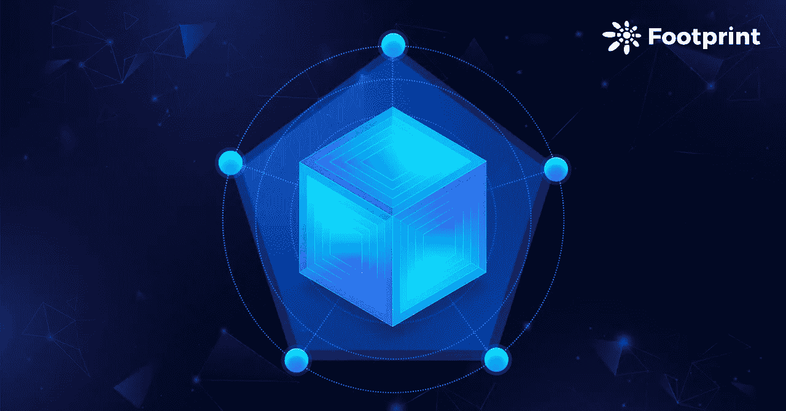
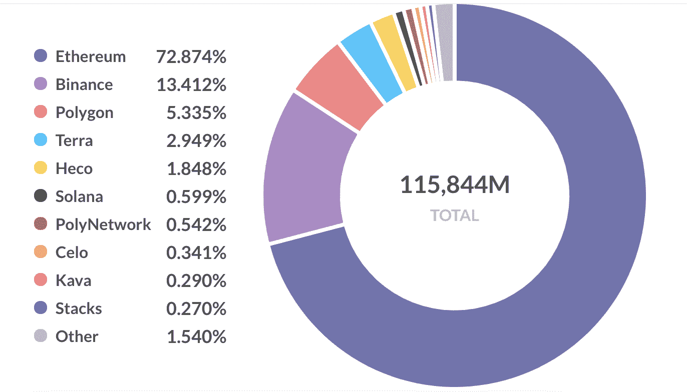
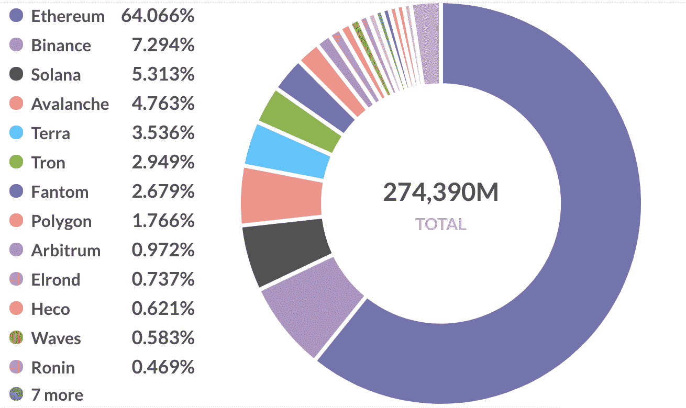
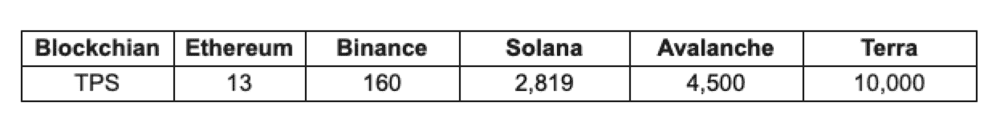
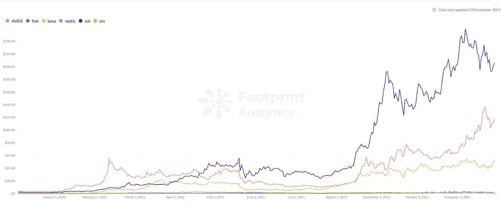
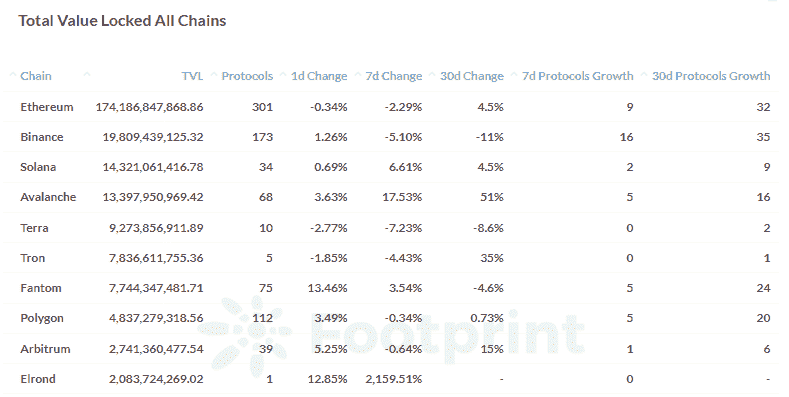
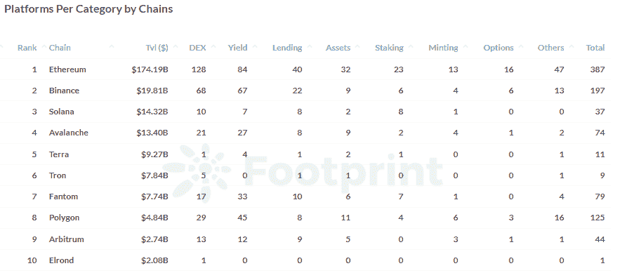
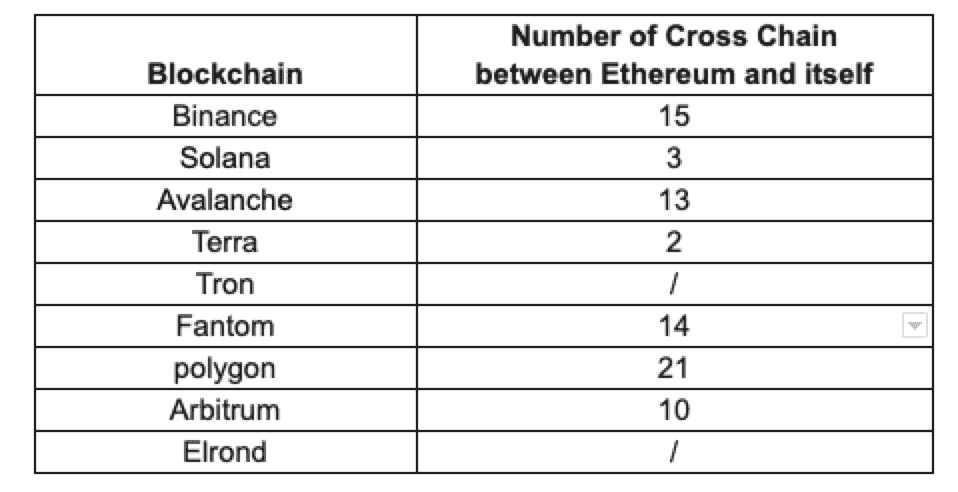

# 评估新区块链的 5 个方面

> 原文：<https://medium.com/coinmonks/5-aspects-to-evaluate-a-new-blockchain-dffd1b3e5f32?source=collection_archive---------9----------------------->

# 区块链发展的背景

简而言之，区块链是一种支持各种类型的应用程序开发(如 DeFi)的网络。

在区块链 1.0 时期，区块链应用通过比特币开始快速发展。而区块链的舞台只支持加密货币之间的转移，这种单一的应用场景导致普及度较低。因此智能合约应运而生。

智能合约和区块链的结合拓展了区块链的应用场景，以以太网为优秀代表进入了 2.0 阶段。大多数 DeFi 项目(与今天相比数量较少)由于其用户友好的开发体验和成熟的网络环境，基本上只在以太坊上开发。因此，以太坊引领了区块链的这一产业。

到了 2021 年，以太坊更强的竞争对手已经出现，原因有以下三点:

1.  DeFi 发展的爆发自 2020 年 6 月的 DeFi Summer 以来，以太坊上发生的交易活动越来越多。
2.  以太坊的拥堵问题暴露出来了，而且越来越严重。Ehereum 天然气费用的飙升促使每个开发商和投资者寻找效率更高、成本更低的替代品。
3.  以太坊缺少的更多功能需要通过自己的更新或其他区块链来完成。

# 封锁的现状

2021 年，DeFi 市场将继续增长，NFT 和 Gamefi 的蓬勃发展也推动了整个区块链生态系统的爆发。从[开始，区块链 TVL](https://www.footprint.network/guest/question/5e9d1178-2403-490b-81b0-3e2a98f292c6#key=eyJwYXJhbWV0ZXJzIjpbeyJuYW1lIjoiQ2hhaW4iLCJzbHVnIjoiY2hhaW4iLCJpZCI6ImY4NzA0ODRiIiwidHlwZSI6ImNhdGVnb3J5IiwiZmllbGRfaWRzIjpbNDM4XSwiZmllbGRfaWQiOjQzOCwiaGFzT25seUZpZWxkVGFyZ2V0cyI6dHJ1ZX1dLCJwYXJhbWV0ZXJWYWx1ZXMiOnt9LCJwYXJhbWV0ZXJfbWFwcGluZ3MiOltdLCJkYXNoYm9hcmRVdWlkIjoiMzVkZmRmMGYtNWM1OS00NTA0LTk5MDctNzM3NGVhZTkyOTgxIn0%3D) 的市场份额，以太坊的市场份额在 6 个月内从 73%下降到 64%,下降了 9%,表明其他区块链正在快速发展，并不断抢占以太坊的市场份额

[*Footprint Analytics : Market Share of Blockchains TVL by June 30, 2021*](https://www.footprint.network/)

[*Footprint Analytics : Market Share of Blockchains TVL by November 23, 2021*](https://www.footprint.network/)

# 如何评价一个新的区块链

与链上项目不同，作为基础设施的区块链网络更注重其生态系统的建设。一旦生态系统形成，马太效应就会出现(富人越来越富)，最终头部区块链将占据 80%以上的市场份额。

ETH 的价格显示了以太坊的繁荣，从 10 美元(2016 年 12 月)涨到最高 4000 美元(2021 年 11 月)。当一个新的区块链出现时，我们如何确定它是否有强大的增长潜力？

本文主要从以下五个方面来评价区块链的价值。

## **1。性能**

交易处理效率是衡量区块链性能的重要指标。TPS(每秒事务数)是指网络每秒可以处理的事务数。TPS 越高，效率越高。

五大区块链 TPS 比较:

大部分新区块链声称有很高的 TPS。而在 DeFi 世界中存在一个“不可能的三角”，即高性能、安全性和去中心化。例如，Solana 主要提高传输速率(性能)，但当它达到峰值时，网络变得不稳定。

9 月，Solana 经历了网络宕机。仍然需要找到更好的解决方案。

## **2。代币价格**

[代币价格](https://footprint.cool/4rvS)反映了用户对区块链的评价，也影响了用户交易的成本

[*Footprint Analytics: Token Price of Some New Chains*](https://www.footprint.network/)

索拉纳的象征索尔的价格从 1.80 美元涨到最高 259 美元，涨幅 143 倍；雪崩令牌 AVAX 也从 2 美元涨到 135 美元，增长了 66 倍。这两个案例都显示了很高的市场预期。

## **3。区块链生态系统**

发展 DeFi 生态系统从来都不容易。为了评估区块链的价值，其生态系统的完整性非常重要，无论是从数量上还是从部门上。

## **项目数量**

虽然部署的项目很多，但是真正上线的项目并没有那么多。根据足迹分析[的数据](https://footprint.cool/jrb7)，在排名前 10 的区块链中，只有 5 个拥有超过 50 个连锁项目。

少于 10 个项目的区块链需要进一步审查。例如，埃尔隆德，最近受欢迎的区块链，本月在 TVL 激增，只有 1 个 DeFi 项目，其稳定性不确定。

[*Footprint Analytics — Total Number of DeFi Projects on TOP 10 Blckcains*](https://www.footprint.network/)

## **项目部门**

区块链生态系统的多样性有利于其平衡和稳定，其中 DEX 扮演着关键角色。链上项目部门有限的区块链缺乏足够的基础设施，导致脆弱的生态系统。

[*Footprint Analytics — Number of DeFi Projects by Sectors on TOP 10 Blckcains*](https://www.footprint.network/)

DeFi 项目的活跃度，开发者的活跃度，项目启动的速度，都暗示着区块链能否吸引开发者在上面部署项目。

## **4。交叉链工具**

看看以太坊和区块链之间目前的跨链桥的数量。

构建区块链的生态系统，跨链桥梁极其重要，因为它允许资金跨链流动，用户可以轻松转移资产。这有利于增加链上交易的数量。

对于没有或很少有跨链桥的区块链项目，我们需要考虑其与其他主要区块链的互动方式。

## **5。生态系统建设和激励的长期计划**

对于区块链来说，最重要的是建立一个生态系统，这需要一个友好的开发环境，更好的性能和用户体验。

良好的兼容性为将项目直接部署到其他新区块链提供了便捷的方式。还有一个支持新兴项目类型的区块链，比如 NFT，GameFi 最受欢迎。例如，NFT 在索拉纳的项目相当活跃，迄今为止交易金额已超过 7 亿美元。

今年，许多区块链为未来的生态系统发展建立了自己的发展基金:

*   Polygon 于 4 月推出了 1 亿美元的 DeFi 基金，
*   Terra 在 7 月宣布启动 1.5 亿美元的生态系统基金，
*   雪崩基金会在 8 月宣布了一项 1.8 亿美元的流动性开采激励计划
*   Fantom 在 8 月份向 tvl 超过 500 万美元的项目授予了总计 3.7 亿美元的 ftm
*   今年 8 月，Celo 与 Aave 和 Curve 等公司宣布了一项 1 亿多美元的“DeFi for the People”计划
*   Harmony 宣布将在未来四年提供超过 3 亿美元的资金支持生态建筑。
*   投资于近距离生态系统的研发机构 Proximity Labs 宣布，将在未来四年内拨款 4000 万个近距离令牌来支持 DeFi 生态系统，价值超过 3 亿美元

这些区块链激励计划旨在激励生态系统。除了推动 TVL 和令牌价格，激励计划还将吸引更多的开发者部署链上项目。

**总结**

总的来说，一个有价值的区块链应该有许多优点，例如:

1.  **环保体验友好型**:相比以太坊的拥堵和高昂的油费，新区块链基本上速度更快，成本更低
2.  **跨链桥的部署**:对跨链桥日益增长的需求使其不可或缺
3.  **强兼容性**:支持项目快速部署并迁移到新区块链
4.  **探索新领域**:生态系统吸引开发者部署 NFT、GameFi 等潮流项目。
5.  **激励计划:**与 Avalanche 类似，Polygon 推出了 Defi 基金计划来鼓励开发者

以上五个方面反映了区块链日益增长的实力。

目前，由于高流动性和交易量，以太坊仍然是大多数 DeFi 项目的首选。

然而以太坊不会是唯一的选择。它需要从性能、开发生态系统和创新方面与其他区块链竞争。区块链产业将是多链共存。

以太坊还能继续占据市场领先地位吗？我们将看到跨链项目带来的数据集成问题以及跨链治理问题将如何解决。

> 加入 Coinmonks [电报频道](https://t.me/coincodecap)和 [Youtube 频道](https://www.youtube.com/c/coinmonks/videos)了解加密交易和投资

## 也阅读

 [## 杠杆代币[多头代币]终极指南

### 杠杆化令牌是具有杠杆化风险敞口的 ERC20 令牌，不考虑保证金、要求、管理…

medium.com](/coinmonks/leveraged-token-3f5257808b22)  [## 最佳加密交易所| 2021 年十大加密货币交易所

### 加密货币交易所的加密交易需要了解市场，这可以帮助你获得利润。之前…

blog.coincodecap.com](https://blog.coincodecap.com/crypto-exchange)  [## 2021 年最佳加密借贷平台| 6 大比特币借贷平台

### 获得比特币和其他加密货币的最佳贷款利率

medium.com](/coinmonks/top-5-crypto-lending-platforms-in-2020-that-you-need-to-know-a1b675cec3fa)  [## 2021 年最佳免费加密交易机器人

### 2021 年币安、比特币基地、库币和其他密码交易所的最佳密码交易机器人。四进制，位间隙…

medium.com](/coinmonks/crypto-trading-bot-c2ffce8acb2a)  [## 最佳 4 个加密交易信号电报通道

### 这是乏味的找到正确的加密交易信号提供商。因此，在本文中，我们将讨论最好的…

medium.com](/coinmonks/best-crypto-signals-telegram-5785cdbc4b2b)  [## 5 个最佳社交交易平台[2021] | CoinCodeCap

### 困惑于社交交易和副本交易哪个平台最好？本文将带您了解各种…

blog.coincodecap.com](https://blog.coincodecap.com/best-social-trading-platforms)  [## BlockFi 评论 2021:利弊和利率| CoinCodeCap

### 今天，我们提出了一个全面的 BlockFi 评论，这是一个成立于 2017 年的加密贷款平台，拥有其…

blog.coincodecap.com](https://blog.coincodecap.com/blockfi-review)  [## 如何在印度购买比特币？2021 年购买比特币的 7 款最佳应用[手机版]

### 如何使用移动应用程序购买比特币印度

medium.com](/coinmonks/buy-bitcoin-in-india-feb50ddfef94)  [## 加密税务软件——五大最佳比特币税务计算器[2021]

### 不管你是刚接触加密还是已经在这个领域呆了一段时间，你都需要交税。

medium.com](/coinmonks/best-crypto-tax-tool-for-my-money-72d4b430816b)  [## 存储比特币的最佳加密硬件钱包[2021] | CoinCodeCap

### 保管您的数字资产很容易，但找到正确的存储方式却是一项繁琐的任务。在线钱包有一个风险…

blog.coincodecap.com](https://blog.coincodecap.com/best-hardware-wallet-bitcoin)  [## Pionex 评论 2021 |免费加密交易机器人和交换

### Pionex 是为交易自动化提供工具的后起之秀。Pionex 上提供了 9 个加密交易机器人…

medium.com](/coinmonks/pionex-review-exchange-with-crypto-trading-bot-1e459d0191ea)