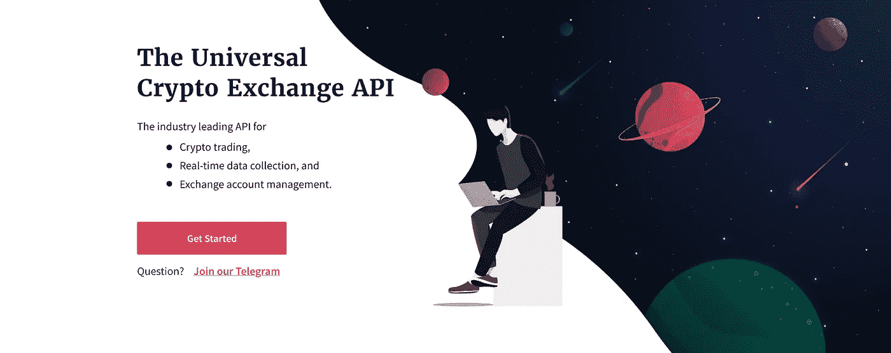

# 5 个最佳加密市场数据聚合器和 API(2021 年更新)

> 原文：<https://medium.com/coinmonks/5-best-crypto-market-data-aggregators-and-apis-3a1109e6839f?source=collection_archive---------0----------------------->

对于寻求更深入了解加密货币市场并希望分析特定事件的投资者来说，市场数据聚合器是一种强大的资源。

多年来，一些加密数据聚合器已经成为访问市场数据的首要平台。这些平台中的每一个都得到了业内最老练的投资者的信任。

虽然每个平台都有自己独特的方式，但我们将重点关注每个公司如何为行业服务的几种不同方式。

 [## 如何使用 Python 制作加密交易机器人——开发者指南

### 开始时，交易加密货币可能会感觉势不可挡。有许多组件要考虑，数据要…

blog.shrimpy.io](https://blog.shrimpy.io/blog/how-to-make-a-crypto-trading-bot-using-python) 

选择市场数据提供商时要考虑的一些重要因素包括:

*   历史市场数据的准确性(汇总的、单独的)
*   涵盖的市场范围(交易所、交易对、资产)
*   支持的数据历史长度(年、月)
*   数据类型的可用性(订单簿、交易、烛台)
*   数据访问产品(实时 Websocket APIs、历史 Rest API、实时 Rest API)

在本文中，我们将讨论各种不同的数据聚合器，每一个都专注于数据市场的一个细分领域。

# 多虾的

[**Shrimpy**](https://developers.shrimpy.io/) 以拥有世界一流的订单执行引擎而闻名。但是，如果没有一套强大的工具来访问实时和历史市场数据，这个平台就不一样了。

与其他数据聚合器不同，Shrimpy 是唯一一个专门为开发人员设计的数据聚合器。Shrimpy 的目标不是投资者或机构，而是专注于为建筑商提供最佳体验。

Shrimpy 开发人员 API 提供了对 16 个不同交易所的简化访问。强大的动态数据 websockets 和市场数据 rest APIs 使开发人员能够访问订单簿、交易数据和定价信息。

寻求构建交易机器人、投资组合管理服务或套利系统的开发人员只需看看 Shrimpy 就够了。交易量超过 10 亿美元，没有更好的解决方案。

*   **历史市场数据的精确性:** Shrimpy 为每个交易所和市场对提供精确的数据，没有汇总或估计
*   **覆盖的市场范围:** 3，000 多个市场对、16 个交易所和 1，000 多个资产
*   **支持数据历史长度:**早于 2014 年
*   **数据类型的可用性:**订单快照、逐笔交易数据、逐笔订单、资产价格和烛台
*   **数据访问产品:**实时 websockets、历史 REST API 和实时 REST API

[**开始您的 Shrimpy 开发者 API 免费试用！**](https://developers.shrimpy.io/)

# Kaiko

[**Kaiko**](https://www.kaiko.com/) 自 2014 年以来一直是历史数据之王。Kaiko 为机构和企业客户提供了广泛的 OHLCV 数据、订单快照和 100 个不同交易所的逐笔交易数据。

在最近的发展中，Kaiko 已经开始提供更深入的加密市场分析。通过提供市场报告，它们继续吸引着寻求额外优势的机构的注意力。

说到精准的历史数据，企业用 Kaiko 不会错。该平台支持的大量数据类型让其他历史数据提供者相形见绌。

*   **历史市场数据的精确度:** Kaiko 支持每个交易所和市场对的精确数据
*   **覆盖的市场范围:** 35，000 多个市场对、100 多个交易所和 3，000 多个资产
*   **支持数据历史长度:**早于 2014 年
*   **数据类型的可用性:**订单快照、逐笔交易数据、OHLCV 烛台、VWAP 和衍生品数据
*   **数据访问产品:**实时 websockets、历史 REST APIs 和平面文件

[**试用 Kaiko。**](https://www.kaiko.com/)

# 共同市场资本

[**CoinMarketCap**](https://coinmarketcap.com/)**最初于 2013 年推出。从那时起，它已经成为密码领域事实上的网站，可以了解新的资产，查看资产价格的高层次概览，获得交易的市场对，当然还可以访问市值数据。**

**虽然与其他数据提供商相比，CoinMarketCap 的历史数据很一般，但 CoinMarketCap 比业内任何人都做得好的一点是跟踪交易所之间的资产，并跟踪每项资产的市值。**

> **这当然是一项需要大量人力来完成的壮举。**

**谈到历史和实时市场数据，CoinMarketCap 在许多方面都存在不足。首先，数据只能在汇总的基础上访问，这使得数据对于任何技术分析都是无效的。**

**此外，CoinMarketCap 缺乏对最有意义的数据类型——订单簿和贸易数据——的支持。因此，大多数投资者将对 CoinMarketCap APIs 中的可用内容感到不满意。**

*   ****历史市场数据的精确度:** CoinMarketCap 仅提供不精确的汇总数据**
*   ****覆盖的市场广度:** 32，000 多个市场对，300 多个交易所，7，500 多个资产**
*   ****支持数据历史长度:**最早 2014 年**
*   ****数据类型的可用性:**聚集的 OHLCV 烛台和市值数据**
*   ****数据访问产品:**历史 REST APIs**

****

**[**试用 CoinMarketCap。**](https://coinmarketcap.com/)**

# **硬币壁虎**

****

**[**CoinGecko**](https://www.coingecko.com/) 在某些方面类似于 CoinMarketCap。与 CoinMarketCap 相反，它们提供了一些替代指标，如资产和开发者活动的社会统计数据。**

**CoinGecko 是与市场没有直接联系的补充数据的绝佳资源。它们还提供了访问索引列表、金融产品、空间事件等的 API。**

**不幸的是，CoinGecko 提供的大部分数据都是以类似于 CoinMarketCap 的方式聚合的。这使得数据对于更深入的市场分析无效。**

**CoinGecko 的主要优点是提供了独特的补充数据。**

*   ****历史市场数据的精确度:** CoinGecko 只提供不精确的汇总数据**
*   ****覆盖的市场范围:** 25，000 多个市场对，400 多个交易所，6，000 多个资产**
*   ****支持数据历史长度:**早于 2014 年**
*   ****数据类型的可用性:**汇总的 OHLCV 烛台数据、市值数据和社会数据**
*   ****数据访问产品:**历史 REST APIs**

****

**[**试用 CoinGecko。**](https://www.coingecko.com/en)**

# **梅萨里**

****

**[**梅萨里**](https://messari.io/) 被誉为机构和专业投资者的资源。该平台是基于这样一种理解而构建的，即他们不会关注底层的 exchange 数据，而是关注他们可以从原始数据中计算出的分析。**

**Messari 最受欢迎的方面是 screener 应用程序，其 API 的核心产品是通过 API 轻松访问这些数据。**

**客户可以使用 Messari 访问资产描述、各种资产指标、市场配对、新闻和区块链统计数据。**

**虽然 Messari 不是主要的市场数据提供商，但他们通过其 API 提供了独特的数据选择，为加密市场增添了一个新的维度。**

**当然，Messari 可能无法提供许多投资者所需的完整数据集，但补充数据可以提供其他服务无法提供的背景。**

*   ****历史市场数据的精确度:**迈萨里只提供不精确的汇总数据**
*   ****覆盖的市场广度:** 35，000 多个市场对，100 多个交易所，3，000 多个资产**
*   ****支持数据历史长度:**最早 2014 年**
*   ****数据类型的可用性:**资产概况、资产指标、新闻和交易市场**
*   ****数据访问产品:**Rest API**

****

**[**报名 Messari**](https://messari.io/)**

# **结论**

**在了解加密货币市场时，这些数据聚合器都有不同的目的。如果你在寻找精确的交换数据，最好的资源将是 [**Shrimpy**](https://developers.shrimpy.io/) 和 [**Kaiko**](https://www.kaiko.com/) 。然而，如果你正在寻找可以为市场增加额外背景的补充数据，那么像 [**Messari**](https://messari.io/) 和 [**CoinGecko**](https://www.coingecko.com/) 这样的服务将是最好的。**

# **额外的好读物**

** [## 用于历史加密交易订单簿快照的 Python 脚本

### 加密货币市场存在一个重大问题。数不清的交易所运营着数以千计的交易市场和…

blog.shrimpy.io](https://blog.shrimpy.io/blog/historical-crypto-exchange-order-book-snapshots)  [## 用于加密贸易数据 Websockets 的 Python 脚本

### 从加密交易所收集交易数据是一场噩梦。建立基础设施需要几个月的时间，然后…

blog.shrimpy.io](https://blog.shrimpy.io/blog/python-scripts-for-crypto-trade-data-websockets)  [## 加密交易机器人的套利脚本

### 加密货币市场的波动性使其成为一个有吸引力的套利交易场所。然而，困难…

blog.shrimpy.io](https://blog.shrimpy.io/blog/arbitrage-scripts-for-crypto-trading-bots) 

## 另外，阅读

*   最好的[密码交易机器人](/coinmonks/crypto-trading-bot-c2ffce8acb2a)
*   [密码本交易平台](/coinmonks/top-10-crypto-copy-trading-platforms-for-beginners-d0c37c7d698c)
*   最好的[加密税务软件](/coinmonks/best-crypto-tax-tool-for-my-money-72d4b430816b)
*   [最佳加密交易平台](/coinmonks/the-best-crypto-trading-platforms-in-2020-the-definitive-guide-updated-c72f8b874555)
*   最佳[密码借贷平台](/coinmonks/top-5-crypto-lending-platforms-in-2020-that-you-need-to-know-a1b675cec3fa)
*   [最佳区块链分析工具](https://bitquery.io/blog/best-blockchain-analysis-tools-and-software)
*   [加密套利](/coinmonks/crypto-arbitrage-guide-how-to-make-money-as-a-beginner-62bfe5c868f6)指南:新手如何赚钱
*   最佳[加密制图工具](/coinmonks/what-are-the-best-charting-platforms-for-cryptocurrency-trading-85aade584d80)
*   [莱杰 vs 特雷佐](/coinmonks/ledger-vs-trezor-best-hardware-wallet-to-secure-cryptocurrency-22c7a3fd391e)
*   了解比特币的[最佳书籍有哪些？](/coinmonks/what-are-the-best-books-to-learn-bitcoin-409aeb9aff4b)
*   [3 商业评论](/coinmonks/3commas-review-an-excellent-crypto-trading-bot-2020-1313a58bec92)
*   [AAX 交易所评论](/coinmonks/aax-exchange-review-2021-67c5ea09330c) |推荐代码、交易费用、利弊
*   [Deribit 审查](/coinmonks/deribit-review-options-fees-apis-and-testnet-2ca16c4bbdb2) |选项、费用、API 和 Testnet
*   [FTX 密码交易所评论](/coinmonks/ftx-crypto-exchange-review-53664ac1198f)
*   [n 零审核](/coinmonks/ngrave-zero-review-c465cf8307fc)
*   [比特交换评论](/coinmonks/bybit-exchange-review-dbd570019b71)
*   [3Commas vs Cryptohopper](/coinmonks/cryptohopper-vs-3commas-vs-shrimpy-a2c16095b8fe)
*   最好的比特币[硬件钱包](/coinmonks/the-best-cryptocurrency-hardware-wallets-of-2020-e28b1c124069?source=friends_link&sk=324dd9ff8556ab578d71e7ad7658ad7c)
*   最佳 [monero 钱包](https://blog.coincodecap.com/best-monero-wallets)
*   [莱杰纳米 s vs x](https://blog.coincodecap.com/ledger-nano-s-vs-x)
*   [bits gap vs 3 commas vs quad ency](https://blog.coincodecap.com/bitsgap-3commas-quadency)
*   [莱杰纳米 S vs 特雷佐 one vs 特雷佐 T vs 莱杰纳米 X](https://blog.coincodecap.com/ledger-nano-s-vs-trezor-one-ledger-nano-x-trezor-t)
*   [block fi vs Celsius](/coinmonks/blockfi-vs-celsius-vs-hodlnaut-8a1cc8c26630)vs Hodlnaut
*   Bitsgap 评论——一个轻松赚钱的加密交易机器人
*   为专业人士设计的加密交易机器人
*   [PrimeXBT 审查](/coinmonks/primexbt-review-88e0815be858) |杠杆交易、费用和交易
*   [埃利帕尔泰坦评论](/coinmonks/ellipal-titan-review-85e9071dd029)
*   [SecuX Stone 点评](https://blog.coincodecap.com/secux-stone-hardware-wallet-review)
*   [BlockFi 评论](/coinmonks/blockfi-review-53096053c097) |从您的密码中赚取高达 8.6%的利息**