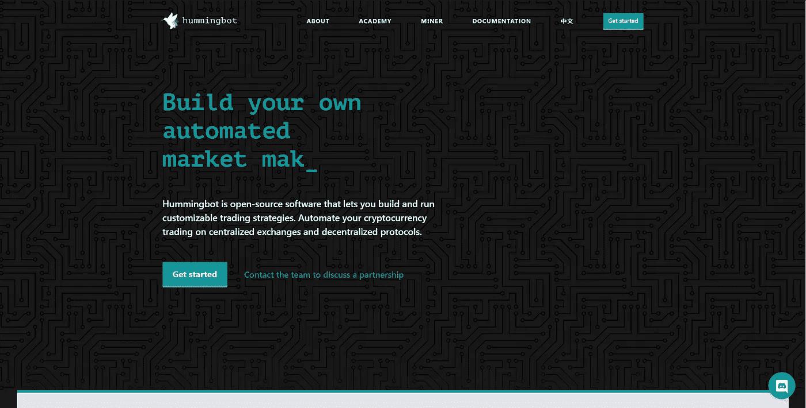

# 帮助投资者的 5 个最佳加密交易平台(2021 年更新)

> 原文：<https://medium.com/coinmonks/5-best-crypto-trading-platforms-that-help-investors-eac3b5ae54d9?source=collection_archive---------0----------------------->

直接在加密货币交易所交易可能会很麻烦和困难。从一个交易所到另一个交易所寻找最佳定价，手动下单，监控无数的头寸是交易者经常遇到的问题。

大多数密码交易者已经转向交易平台来帮助解决这些问题。交易平台不仅可以帮助简化你的交易体验，还可以帮助你利用交易者以前没有的机会。

本文的其余部分将涵盖强烈推荐给交易者的前 5 大交易平台。

 [## 5 个最佳加密市场数据聚合器和 API

### 市场数据聚合器是一个强大的资源，为投资者谁正在寻找一个更深入的了解…

medium.com](/coinmonks/5-best-crypto-market-data-aggregators-and-apis-3a1109e6839f) 

# 多虾的

[**虾肉**](https://blog.coincodecap.com/go/shrimpy) 为不同的人服务不同的目的。由于该平台提供了多样化的功能，投资者能够实施最适合自己投资组合的策略。

## 终端/订单管理系统

投资者使用 Shrimpy 内部的交易终端可以轻松执行日内交易策略。该交易终端支持限价单和智能市价单。

Shrimpy 不是盲目地执行市场订单，而是使用定制的市场订单系统，该系统仔细监控市场并执行交易，以减少滑点，改善交易位置，并防止过度损失。

## 社交交易

如果你是交易新手，或者想尝试一些独特的东西，社交交易可能是你的选择。社交交易允许投资者复制领导者的投资组合和策略。社交交易项目的追随者可以利用更有经验的交易者的专业知识，而不是实施你自己的策略。

社交交易是学习不同策略、获得理解市场的经验以及从专业交易者那里获得知识的好方法。

## 投资组合自动化

加密货币市场是全天候的。这意味着跟上市场变化会让人筋疲力尽。你可以利用 Shrimpy 中提供的专业投资组合自动化选项，而不是试图击败机器人。

与其他交易平台不同，Shrimpy 只关注最突出、最值得信赖的策略。他们可以帮助你自动重新平衡，平均成本，投资组合止损。这些战略都经受住了时间的考验。

像机构或专业投资者一样交易从来没有比 Shrimpy 更容易。

## 策略回溯测试

在分配投资组合之前，你也可以在回溯测试套件中测试你的策略。这是了解不同自动化设置如何长期影响性能的最佳方式。

> 配置一个多样化的投资组合好还是几个高市值的资产好？

这些是策略回溯测试功能可以帮助您回答的问题类型。

另外，请阅读我们的 [Shrimpy 评论](https://blog.coincodecap.com/shrimpy-crypto-trading-bot-review)。

 [## Shrimpy -加密货币的社交交易平台

### Shrimpy 是一个加密货币社交交易平台，专为简单的投资组合管理而打造

www.shrimpy.io](https://www.shrimpy.io/) 

# 盖柯

Gekko 是一个开源的交易项目，可以用来聚合实时市场数据、计算指标和模拟订单执行。

由于服务的性质，为了利用这个交易资源，几乎需要对交易、编程和交换有高度的技术理解。

## 战略

Gekko 旨在让程序员通过自定义的技术分析指标来实现自己的交易策略。

这些 TA 指标可以在你的本地系统上运行，实时分析市场，执行交易。

不幸的是，由于 Gekko 不是一个托管解决方案，这意味着你需要运行你的计算机 24/7，以充分利用这种交易解决方案。

## 回溯测试

一旦在 Gekko 中实现了一个策略，就可以使用同一个存储库中提供的 paper trader 对其进行回溯测试。

由于准确的订单簿数据的成本，回溯测试主要利用 OHLCV 烛台数据，这可能是非常不准确的。因此，通常建议对回溯测试的结果持保留态度。

## 插件

Gekko 支持各种插件，可用于通过 IRC、电报、电子邮件和许多其他平台更新您的信息。

只需很少的努力，开发人员也可以向 Gekko 添加额外的插件，以访问当前无法开箱即用的新集成。

 [## 盖柯

### 在 Gekko 上工作多年后，我决定不再参与维护这个项目。你可以阅读…

gekko.wizb.it](https://gekko.wizb.it/) 

# Zenbot

Zenbot 在很多方面和 Gekko 很像。它主要作为一个开源的[交易机器人](/coinmonks/crypto-trading-bot-c2ffce8acb2a)存在，开发者可以访问它来制定自己的交易策略。

与 Gekko 非常相似，这种解决方案使用复杂，维护困难。我们只推荐 Zenbot 给那些愿意花时间开发交易策略、编程解决方案和管理平台缺陷的高技术交易者。

## 战略

Zenbot 提供了一些现成的可以配置的选择策略。这些策略包括卖出止损、买入止损和跟踪止盈。

尽管这是一个良好的开端，但绝大多数策略都需要手动实现。Zenbot 是一个完全基于技术分析的交易平台。

这意味着 Zenbot 用户将需要设计技术指标，实现策略，然后通过定制代码自动化策略。

## 回溯测试模拟器

历史数据可以用来回溯测试你制定的交易策略。虽然这很有用，但和 Gekko 一样，Zenbot 主要会查看不准确的 OHLCV 数据。

除了回溯测试模拟器，Zenbot 还支持纸上交易功能，允许开发人员根据实时市场数据模拟交易。这是在真实市场数据上测试新策略的理想方法。

## 插件

Zenbot 支持一种方便的插件架构，用于实现新策略、集成交换以及与第三方服务通信。

在原生解决方案中，Zenbot 支持币安、Bitfinex、Bitstamp、Bittrex、CEX。IO、比特币基地 Pro 和其他几个主要交易所。

 [## DeviaVir/zenbot

### 此时您不能执行该操作。您已使用另一个标签页或窗口登录。您已在另一个选项卡中注销，或者…

github.com](https://github.com/DeviaVir/zenbot/tree/unstable/extensions/strategies) 

# 蜂鸣机器人

Hummingbot 是一个开源软件包，专为正在构建定制交易策略的机构而设计。

交易可在集中交易所和分散协议中进行，以提供广泛的流动性。

## 战略

Hummingbot 最出名的是其预建的做市模板。这些模板已被机构和交易所用来为市场提供额外的流动性。

除了做市模板，Hummingbot 还支持套利交易、跨交易所做市和 CELO 套利的模板。

这些策略中的每一个都是为针对机构的不同用例而设计的。Hummingbot 主要服务于机构市场，而不是为交易者或专业投资者实施策略。

## 连接器

Hummingbot 提供了实现您自己的连接器的功能。这些连接器可用于在 Hummingbot 目前不支持的交易所执行交易。

每个连接器都需要对正在集成的交换或协议有深入的了解。一般来说，这主要是推荐给机构或专业开发团队的一个选项。

## 集成

电报可以通过使用本地功能集成到 Hummingbot 流中。不幸的是，除了 Telegram 之外，其他集成的数量少之又少。

 [## 蜂鸣机器人

### 用 hummingbot 构建并运行你自己的 algo 加密交易机器人。在云中全天候交易。立即开始交易…

hummingbot.io](https://hummingbot.io/) 

# 神秘的闪光

CryptoBlizz 是一个交易机器人，面向希望配置和开发定制交易策略的交易者。

没有任何编程，交易者可以利用信号、指标和其他条件实施独特的交易策略。

## 战略

CryptoBlizz 主要关注客户设计的定制策略。客户需要自己实施这些高级策略，而不是提供现成的策略。

每个策略都可以通过一系列的行动来实现，这些行动可以为一个策略买入、卖出、止损或获利。

虽然编程不是必需的，但大多数交易者仍然会发现 CryptoBlizz 的策略构建需要大量的时间和精力。

## 回溯测试

没有某种类型的回溯测试工具，任何平台都是不完整的。在 CryptoBlizz 中，他们提供了一个基于 1 分钟蜡烛线数据的策略回溯测试套件。

不幸的是，与前面讨论的类似，烛台数据是不精确的，会导致不正确的结果。因此，我们建议对这些结果持保留态度。

除了回溯测试功能，我们还可以在平台中找到纸面交易功能，允许交易者根据实时数据模拟策略。

 [## 主页

### Cryptoblizz，一个自动加密货币交易机器人！加密交易机器人与多种算法，多种交流…

www.cryptoblizz.com](https://www.cryptoblizz.com/) 

# 结论

这些交易平台各有不同的用途。如果你正在寻找一个方便的资源来管理你的投资组合和自动交易，那么只需看看**。您会对它们提供的简单性和强大的工具感到满意。**

**另一方面，如果你想从头开始建立自己的加密交易策略，并想自己编程。那么 Gekko 或 Zenbot 将更适合您的用例。这两个工具将为您提供构建自己的解决方案的灵活性，但是由于繁重的开发需求，这将是一个漫长的旅程。**

# **额外的好读物**

** [## 新手被动加密投资策略

### 加密货币是全球增长最快的市场之一。全世界有数百万人…

blog.shrimpy.io](https://blog.shrimpy.io/blog/passive-crypto-investing-strategies-for-beginners)  [## 加密交易机器人终极指南[2020 年更新]

### 加密交易机器人已经成为全球数百万加密货币用户的热门话题。寻找方法来…

blog.shrimpy.io](https://blog.shrimpy.io/blog/cryptocurrency-trading-bots-the-complete-guide)  [## 复制世界上最好的密码交易者的社会投资组合

### 谈到交易，加密货币社区一直很活跃。在过去的几年里，人们开发了…

blog.shrimpy.io](https://blog.shrimpy.io/blog/crypto-social-trading-how-to-copy-the-worlds-best-traders) 

## 另外，阅读

*   最好的[密码交易机器人](/coinmonks/crypto-trading-bot-c2ffce8acb2a)
*   [Deribit 审查](/coinmonks/deribit-review-options-fees-apis-and-testnet-2ca16c4bbdb2) |选项、费用、API 和 Testnet
*   [FTX 密码交易所评论](/coinmonks/ftx-crypto-exchange-review-53664ac1198f)
*   最好的比特币[硬件钱包](/coinmonks/the-best-cryptocurrency-hardware-wallets-of-2020-e28b1c124069?source=friends_link&sk=324dd9ff8556ab578d71e7ad7658ad7c)
*   最好的[加密税务软件](/coinmonks/best-crypto-tax-tool-for-my-money-72d4b430816b)
*   [最佳加密交易平台](/coinmonks/the-best-crypto-trading-platforms-in-2020-the-definitive-guide-updated-c72f8b874555)
*   最佳[密码借贷平台](/coinmonks/top-5-crypto-lending-platforms-in-2020-that-you-need-to-know-a1b675cec3fa)
*   [block fi vs Celsius](/coinmonks/blockfi-vs-celsius-vs-hodlnaut-8a1cc8c26630)vs Hodlnaut
*   [莱杰 vs 特雷佐](/coinmonks/ledger-vs-trezor-best-hardware-wallet-to-secure-cryptocurrency-22c7a3fd391e)
*   bits gap review——一个轻松赚钱的加密交易机器人
*   为专业人士设计的加密交易机器人
*   [3commas Review](https://blog.coincodecap.com/3commas-review-an-excellent-crypto-trading-bot) |一款优秀的密码交易机器人
*   [PrimeXBT 审查](/coinmonks/primexbt-review-88e0815be858) |杠杆交易、费用和交易
*   Bitmex 上的[保证金交易的白痴指南](/coinmonks/the-idiots-guide-to-margin-trading-on-bitmex-dbbd7742c6fc?source=friends_link&sk=7bfa99d2a181142510c8442c8ddb0786)
*   [加密摇摆交易权威指南](/coinmonks/the-definitive-guide-to-crypto-swing-trading-7e4af6496d4d?source=friends_link&sk=70448050bd9323b42f63bfc0bb1e60d1)
*   [Bitmex 高级保证金交易指南](/coinmonks/bitmex-advanced-margin-trading-guide-2270c195ce25?source=friends_link&sk=1d986cca731f5084b9a2db4a4bc4a7ad)
*   开发人员的最佳加密 API
*   [加密套利](/coinmonks/crypto-arbitrage-guide-how-to-make-money-as-a-beginner-62bfe5c868f6)指南:新手如何赚钱
*   顶级[比特币节点](https://blog.coincodecap.com/bitcoin-node-solutions)提供商
*   最佳[加密制图工具](/coinmonks/what-are-the-best-charting-platforms-for-cryptocurrency-trading-85aade584d80)
*   了解比特币最好的[书籍有哪些？](/coinmonks/what-are-the-best-books-to-learn-bitcoin-409aeb9aff4b)

> [直接在您的收件箱中获得最佳软件交易](https://coincodecap.com?utm_source=coinmonks)

**