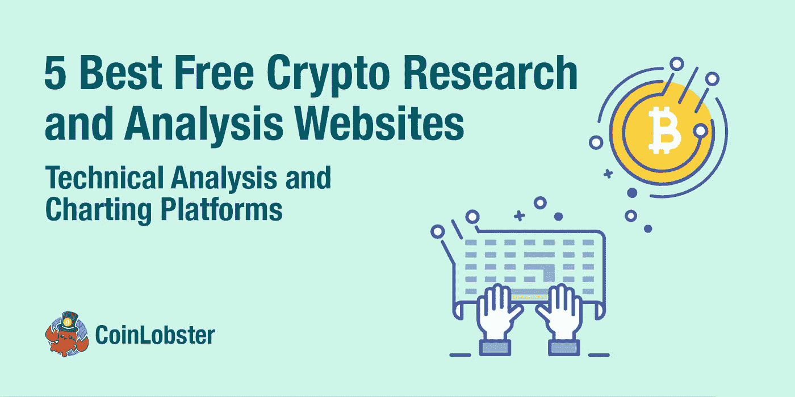
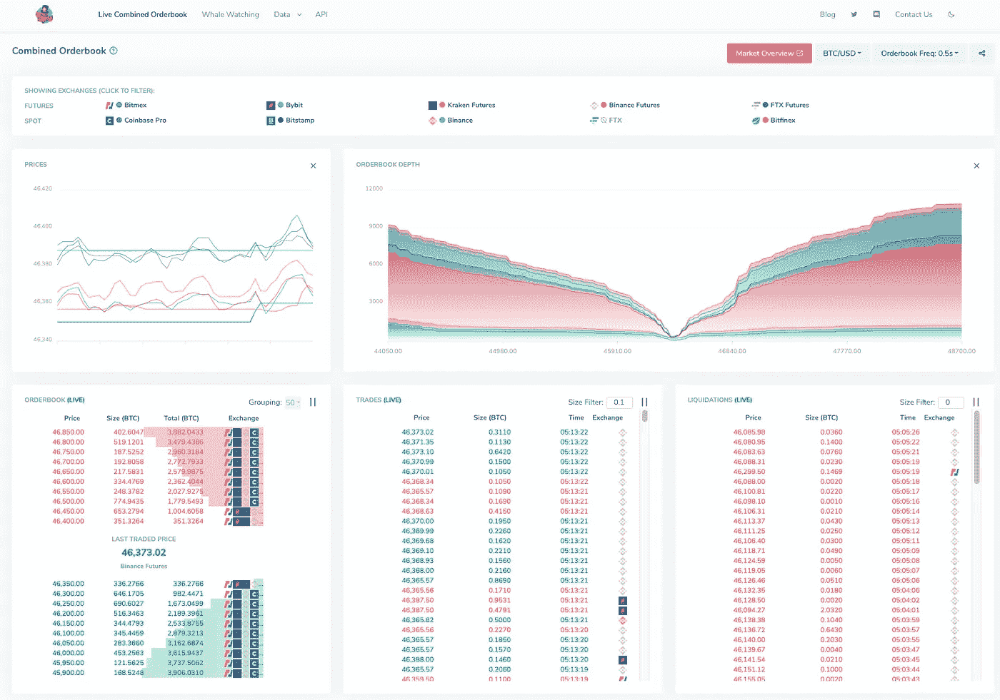
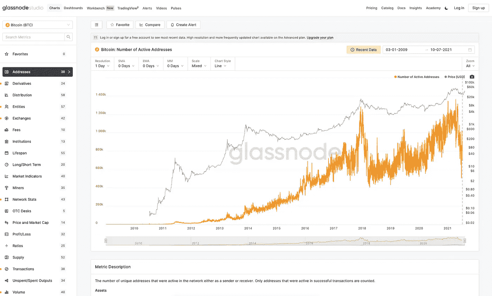
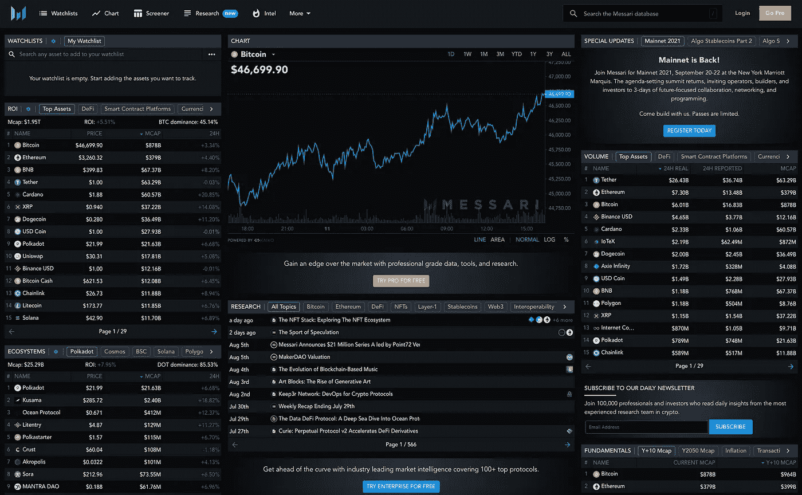
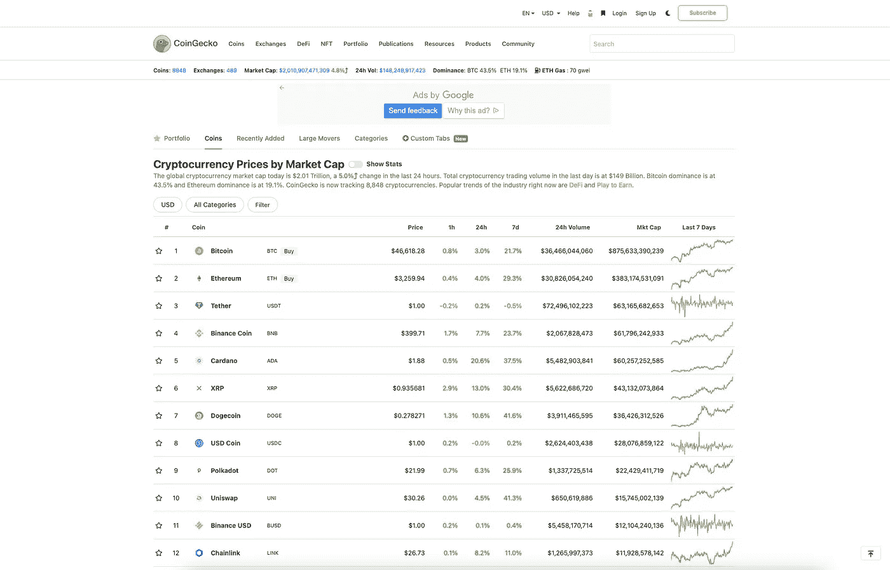
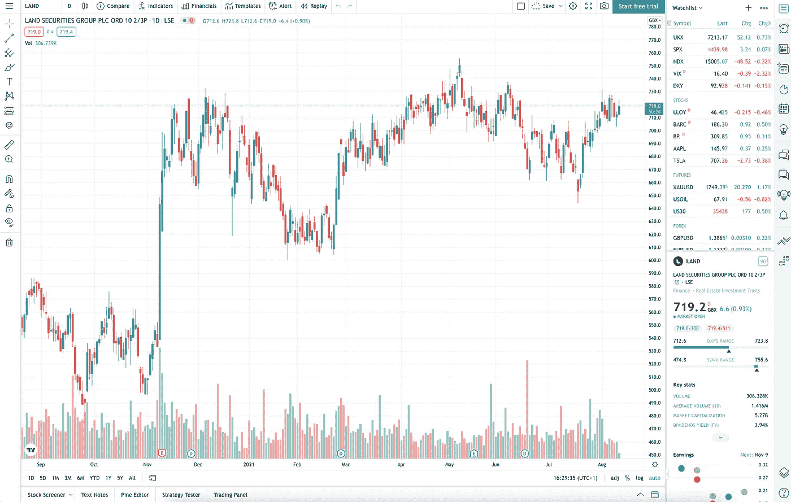

# 2022 年 5 个最佳免费加密研究和分析网站

> 原文：<https://medium.com/coinmonks/5-best-free-crypto-research-and-analysis-websites-for-2021-28e76fae5598?source=collection_archive---------0----------------------->

密码交易员成功的一个重要部分，尤其是那些频繁交易的人，是评估交易数据模式的能力。

一个有用的加密市场研究网站将包含来自几个著名来源的统计数据和分析。您需要能够快速查看相关数据以及各种加密趋势。

我们列出了一些最好的免费加密货币研究网站，您可以在这些网站上获得关于公司、经济和市场的新闻和数据。

# **最佳免费加密货币网站**

1.  [**coin lobster**](http://www.coinlobster.com)**—快捷方便**
2.  **[**glass node**](https://glassnode.com/)**—自动化技术分析****
3.  ********—大多数定制选项********
4.  **********—简约设计**********
5.  ******[**交易视图**](https://www.tradingview.com/) —最佳制图技术******

# ******1。** **CoinLobster******

****[CoinLobster](http://www.coinlobster.com) 为临时交易者提供简单、整洁且易于使用的实时综合市场数据。****

****它们提供 10 个现货和永久期货交易所的免费实时综合订单簿、交易和清算数据。该网站有简单的过滤器，用于分组、交易规模、清算规模。****

******优点:******

*   ****完全免费。****
*   ****唯一一个综合了多个交易所数据的网站。****
*   ****图表易于阅读和过滤。****
*   ****低延迟；实时查看 exchange 活动****

******缺点:******

*   ****没有高级图表功能****

********

# ******2。** **玻璃节点******

****[Glassnode](https://glassnode.com/) 为比特币和以太坊生成创新的链上市场指标。他们的免费仪表板包括地址活动、流通供应量、交易量、交易数量和交易费用等信息。****

****Glassnode 提供大量数据，但他们最有价值的数据只对付费用户开放。他们的高级会员每月 29 美元，专业会员每月高达 799 美元。****

******优点:******

*   ****创新的图表和指标。****
*   ****易于阅读和自定义的简洁图表。****

******缺点:******

*   ****最好的功能被锁在付费墙后面。****

********

# ******3。** **梅萨里******

****Messari 是一个加密数据聚合器，面向希望通过数据分析更深入地了解市场的高级交易者。****

****Messari 最有用的功能，如筛选、研究和过滤工具，涵盖 100 多个指标和分类，每月收费 24.99 美元。****

******优点:******

****-高级数据图表和分析。****

****-所有硬币的衡量标准不同。****

******硬币。******

****-乍一看很难使用。****

****-定义功能仅限会员。****

********

# ******4。** **守宫******

****[CoinGecko](https://www.coingecko.com/en) 在一个简单易用的平台上提供了密码市场的基本分析。****

****除了跟踪价格、数量和市值，CoinGecko 还跟踪社区增长、开源代码开发、重大事件和链上指标。CoinGecko 还提供加密投资组合管理工具，因此加密交易员可以管理他们的加密货币和 DeFi 交易投资组合。****

******优点:******

*   ****图表易于阅读和过滤。****

****缺点:****

*   ****没有高级图表功能****

********

# ******5。** **交易视图******

****TradingView 是最受股票和密码交易者欢迎的图表和技术分析工具。TradingView 还支持非常详细的图表，适用于那些希望访问高级功能和/或实时数据的用户。****

****他们的在线图表工具对免费和专业用户开放。免费帐户可以像专业用户一样使用同样的专业工具，但每个图表仅限于三个技术指标和覆盖图。****

******优点:******

*   ****灵活图表****
*   ****出色的社区功能****
*   ****伟大的图表工具和指标****

******缺点:******

*   ****免费用户的有限功能。****
*   ****社区功能需要时间来学习。****

********

****作为加密市场的投资者，有很多东西需要学习。花点时间了解如何阅读图表和分析跨多个不同网站和应用程序的数据。熟悉这个空间需要时间，所以不要着急。****

****本文中讨论的每种资源都有不同的价值主张。进入加密投资领域时，利用每项服务做出重要决策。****

> ****加入 Coinmonks [电报频道](https://t.me/coincodecap)和 [Youtube 频道](https://www.youtube.com/c/coinmonks/videos)获取每日[加密新闻](http://coincodecap.com/)****

## ****另外，阅读****

*   ****[复制交易](/coinmonks/top-10-crypto-copy-trading-platforms-for-beginners-d0c37c7d698c) | [加密税务软件](/coinmonks/crypto-tax-software-ed4b4810e338)****
*   ****[网格交易](https://coincodecap.com/grid-trading) | [加密硬件钱包](/coinmonks/the-best-cryptocurrency-hardware-wallets-of-2020-e28b1c124069)****
*   ****[密码电报信号](http://Top 4 Telegram Channels for Crypto Traders) | [密码交易机器人](/coinmonks/crypto-trading-bot-c2ffce8acb2a)****
*   ****[最佳加密交易所](/coinmonks/crypto-exchange-dd2f9d6f3769) | [印度最佳加密交易所](/coinmonks/bitcoin-exchange-in-india-7f1fe79715c9)****
*   ****开发人员的最佳加密 API****
*   ****最佳[密码借贷平台](/coinmonks/top-5-crypto-lending-platforms-in-2020-that-you-need-to-know-a1b675cec3fa)****
*   ****杠杆代币的终极指南****
*   ****[AscendEx Staking](https://coincodecap.com/ascendex-staking)|[Bot Ocean Review](https://coincodecap.com/bot-ocean-review)|[最佳比特币钱包](https://coincodecap.com/bitcoin-wallets-india)****
*   ****[Bitget 评论](https://coincodecap.com/bitget-review)|[Gemini vs BlockFi](https://coincodecap.com/gemini-vs-blockfi)|[OKEx 期货交易](https://coincodecap.com/okex-futures-trading)****
*   ****[美国最佳加密交易机器人](https://coincodecap.com/crypto-trading-bots-in-the-us) | [经常性评论](https://coincodecap.com/changelly-review)****
*   ****[在印度利用加密套利赚取被动收入](https://coincodecap.com/crypto-arbitrage-in-india)****
*   ****[霍比评论](https://coincodecap.com/huobi-review) | [OKEx 保证金交易](https://coincodecap.com/okex-margin-trading) | [期货交易](https://coincodecap.com/futures-trading)****
*   ****[麻雀交换评论](https://coincodecap.com/sparrow-exchange-review) | [纳什交换评论](https://coincodecap.com/nash-exchange-review)****