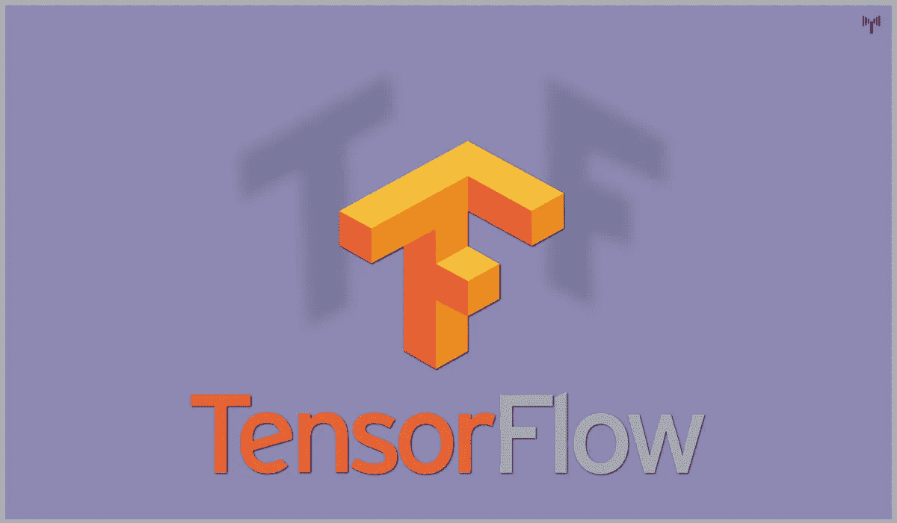
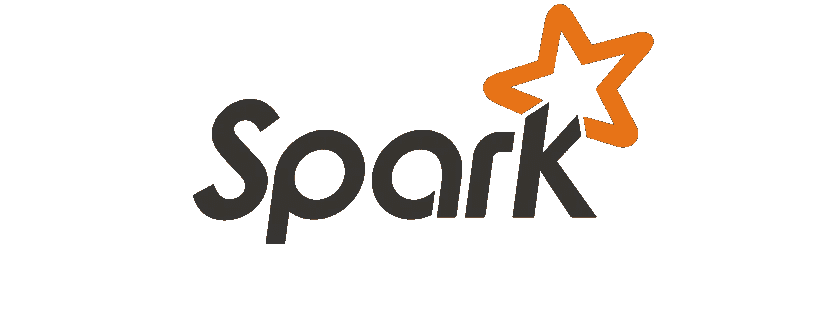
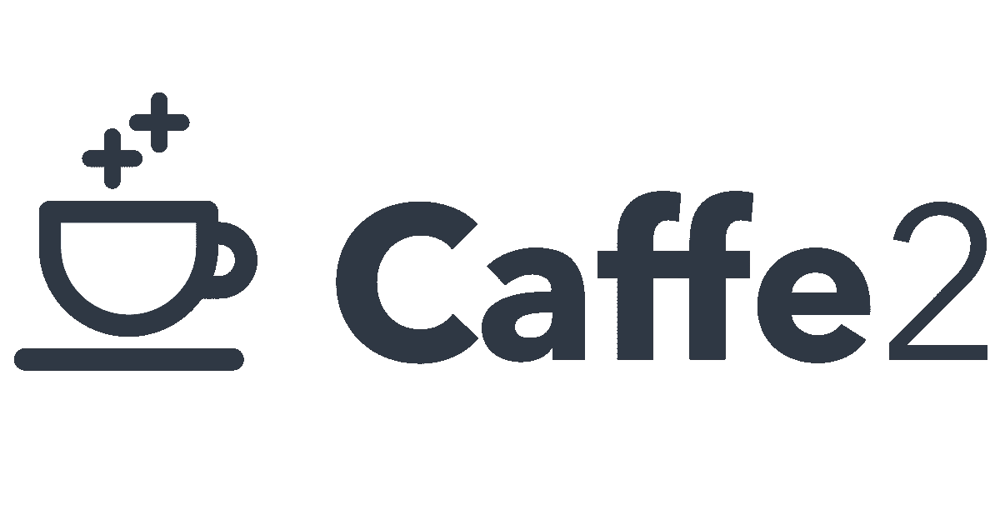
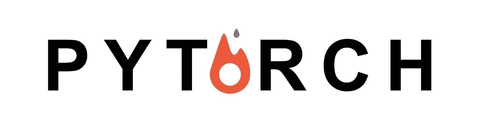
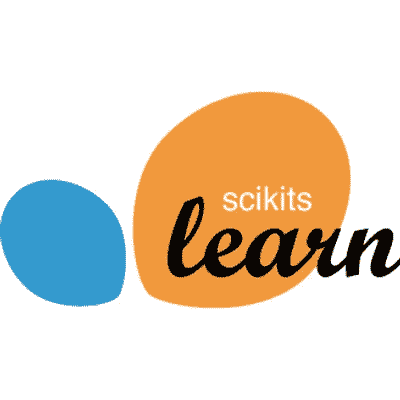

# 机器学习的 5 个最佳开源框架

> 原文：<https://medium.com/coinmonks/5-best-open-source-frameworks-for-machine-learning-739d06170601?source=collection_archive---------1----------------------->

在本文中，让我们来看看机器学习的一些最佳框架和库。这个列表是我根据各种参数创建的，有些人肯定不会接受，但这是根据我的情况，因人而异。

这些框架各不相同，需要花很多时间来学习，在制作这个列表的时候，我们关注了除基本功能之外的其他功能，用户群和社区&支持是最重要的参数之一。一些框架更加面向数学，因此更加面向统计而不是神经网络。其中一些提供了丰富的线性代数工具；有些主要只专注于深度学习。

让我们分析一下这个列表:

1.  **张量流**

TensorFlow 是一个开源软件库，用于跨一系列任务的基于数据的编程，由 Google Brain 团队开发，最初于 2015 年 11 月 9 日发布，但稳定版本仅在今年 4 月 27 日发布。它能够进行回归、分类、神经网络等。非常有效，甚至能够在 CPU 和 GPU 上运行。TensorFlow 由于其复杂的函数，在早期阶段很难掌握，因为用户需要很好地理解 Numpy 数组。Numpy 是一个 Python 框架，有助于处理 n 维数组。

**张量流的优势:**

*   **灵活性:**这是一个高度灵活的系统，为用户提供多个模型和同一模型的多个版本，可以同时提供服务。这种灵活性有助于非自动迁移到新版本。
*   **可移植性:**它运行在 GPU、CPU、台式机、服务器和移动计算平台上。你可以在你的手机上部署一个经过训练的模型，作为你产品的一部分，这就是它如何作为一个真正的可移植特性的。
*   研究与开发
*   自动微分
*   表演

2.**阿帕奇 SPARK**

Spark 是一个开源集群计算框架，最初由伯克利实验室开发，最初于 2014 年 5 月 26 日发布，主要用 Scala、Java、Python 和 r 编写，虽然是由伯克利加州大学实验室开发的，但后来捐赠给了 Apache 软件基金会。

Spark core 基本上是这个项目的基础，这也很复杂，但它让您可以使用自己的 Spark RDD 数据结构，而不是担心 Numpy 数组，任何了解大数据的人都会理解它的用途。作为用户，我们也可以使用 Spark SQL 数据框。有了所有这些特征，它为你创建了密集的和火花的特征标签向量，从而带走了许多复杂的东西，以馈送给 ML 算法。

**Spark ML 的优势:**

*   **简单:**来自 R 和 Python 等工具的数据科学家所熟悉的简单 API
*   **可扩展性:**在小型和大型机器上运行相同的 ML 代码的能力
*   首尾相连的流线型
*   和睦相处

3.**cafe**

Caffe 是一个在 BSD 许可下的开源框架。CAFFE(用于快速特征嵌入的卷积结构)是由加州大学伯克利分校开发的深度学习工具，该框架主要用 CPP 编写。它支持许多不同类型的深度学习架构，主要关注图像分类和分割。它支持几乎所有的主要方案，是完全连接的神经网络设计，它提供 GPU 以及基于 CPU 的加速，以及像 TensorFlow。

CAFFE 主要用于学术研究项目和设计初创公司原型。甚至雅虎也将 caffe 与 Apache Spark 相结合，创建了 CaffeOnSpark，这是另一个伟大的深度学习框架。

**cafe 框架优势:**

*   Caffe 是将深层神经网络应用于该问题的最快方法之一
*   支持现成的图形处理器培训
*   组织良好的 Mat 实验室和 python 界面
*   通过设置单个标志在 GPU 机器上训练，然后部署到商品集群或移动设备，在 CPU 和 GPU 之间切换。
*   速度使 Caffe 成为研究实验和行业部署的完美选择。
*   Caffe 一台 NVIDIA K40 GPU*每天可处理 6000 万张图像。推理需要 1 ms/image，学习需要 4 ms/image，更新的库版本和硬件速度更快。我们认为 Caffe 是可用的最快的修道院实现之一。

4. **TORCH**

Torch 也是一个机器学习的开源库，一个合适的科学计算框架。它的制造者吹嘘它是最简单的 ML 框架，尽管它的复杂性相对简单，这来自它的脚本语言接口和 Lua 编程语言接口。里面只有数字(没有 int、short 或 double ),没有像其他语言那样进一步分类。所以它便于许多操作和功能。
Torch 由脸书人工智能研究集团、IBM、Yandex 和伊迪普研究所使用，最近还扩展了对 Android 和 iOS 的使用。

**火炬接力优势:**

*   手电筒的使用非常灵活
*   火炬提供了高水平的速度和效率
*   有许多经过预先培训的模型可供选择

5.**sci kit-lean**

Scikit-Learn 是一个非常强大的免费的 ML Python 库，广泛用于构建模型。它是在许多其他库(即 SciPy、Numpy 和 matplotlib)的基础上建立起来的，也是统计建模技术(即分类、回归、聚类)最有效的工具之一。

Scikit-Learn 具有监督和非监督学习算法甚至交叉验证等功能。Scikit-learn 大部分是用 Python 写的，一些核心算法是用 Cython 写的，以达到性能。支持向量机是由围绕 LIBSVM 的 Cython 包装器实现的。

**Sci-Kit Learn 的优势:**

*   许多主要算法的可用性
*   对于数据挖掘非常有效
*   支持大多数实际任务
*   广泛用于复杂任务

来源:[技术通知](https://www.technotification.com)

> 加入 Coinmonks [电报频道](https://t.me/coincodecap)和 [Youtube 频道](https://www.youtube.com/c/coinmonks/videos)获取每日[加密新闻](http://coincodecap.com/)

## 另外，阅读

*   [复制交易](/coinmonks/top-10-crypto-copy-trading-platforms-for-beginners-d0c37c7d698c) | [加密税务软件](/coinmonks/crypto-tax-software-ed4b4810e338)
*   [网格交易](https://coincodecap.com/grid-trading) | [加密硬件钱包](/coinmonks/the-best-cryptocurrency-hardware-wallets-of-2020-e28b1c124069)
*   [密码电报信号](http://Top 4 Telegram Channels for Crypto Traders) | [密码交易机器人](/coinmonks/crypto-trading-bot-c2ffce8acb2a)
*   [最佳加密交易所](/coinmonks/crypto-exchange-dd2f9d6f3769) | [印度最佳加密交易所](/coinmonks/bitcoin-exchange-in-india-7f1fe79715c9)
*   [从 WazirX 切换到 CoinDCX 的 5 个理由](https://coincodecap.com/reasons-to-switch-from-wazirx-to-coindcx)
*   [NFT 十大市场造币集锦](https://coincodecap.com/nft-marketplaces)
*   [iTop VPN 审查](https://coincodecap.com/itop-vpn-review) | [曼陀罗交易所审查](https://coincodecap.com/mandala-exchange-review)
*   [最佳期货交易信号](https://coincodecap.com/futures-trading-signals) | [流动性交易所评论](https://coincodecap.com/liquid-exchange-review)
*   面向开发者的最佳加密 API
*   最佳[密码借贷平台](/coinmonks/top-5-crypto-lending-platforms-in-2020-that-you-need-to-know-a1b675cec3fa)
*   [杠杆代币的终极指南](/coinmonks/leveraged-token-3f5257808b22)