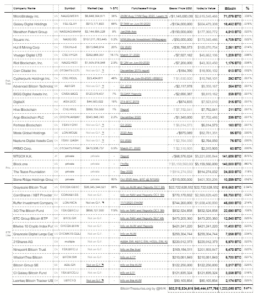
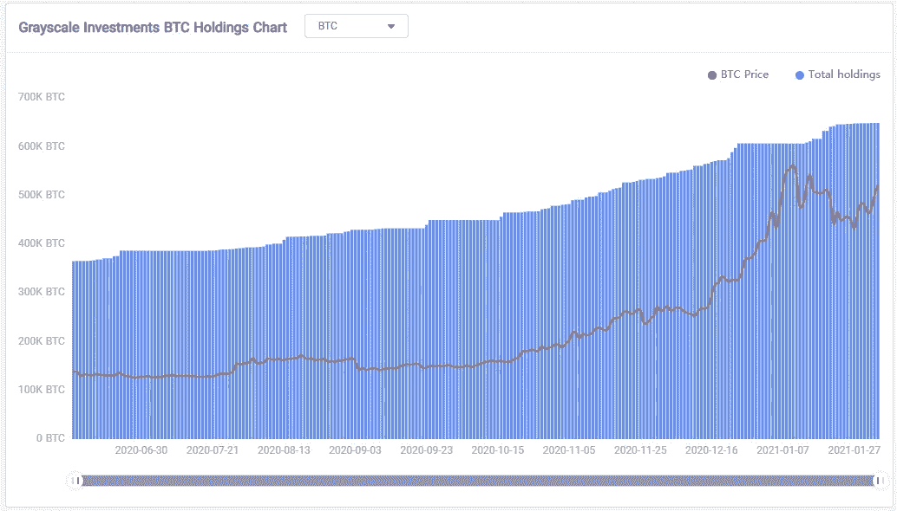
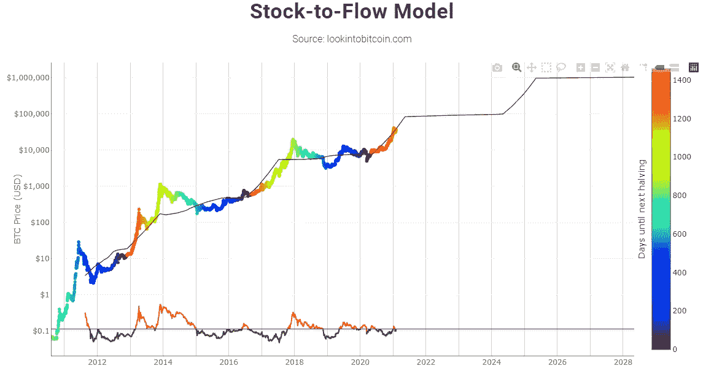
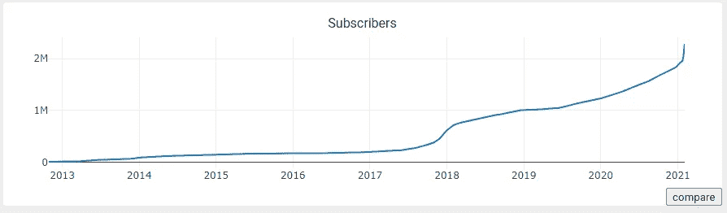
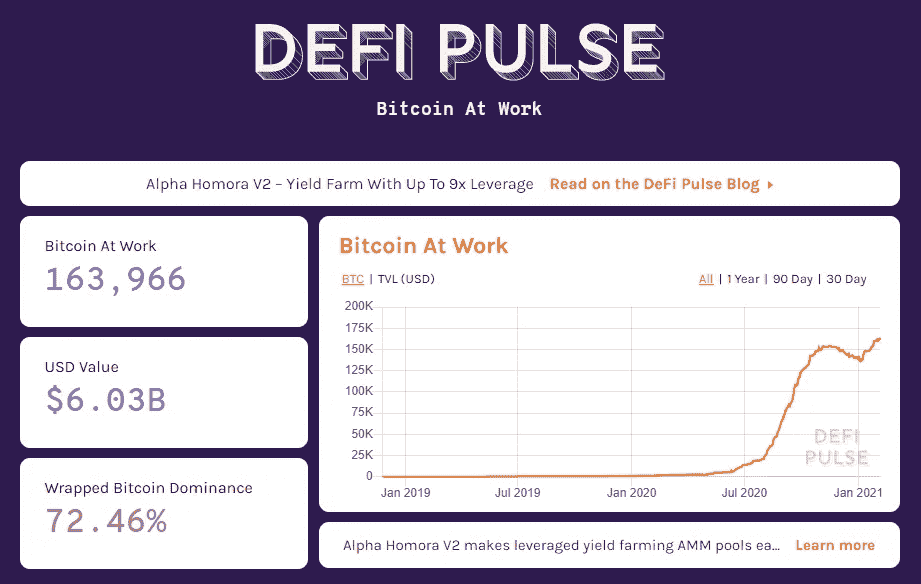
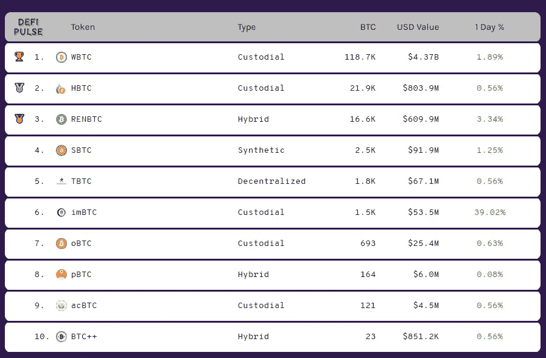

# 追踪比特币采用情况的 5 个最重要图表

> 原文：<https://medium.com/coinmonks/5-bitcoin-charts-you-need-to-follow-811129c76caf?source=collection_archive---------6----------------------->

Photo by [Thought Catalog](https://unsplash.com/@thoughtcatalog?utm_source=unsplash&utm_medium=referral&utm_content=creditCopyText) on [Unsplash](https://unsplash.com/s/photos/bitcoin?utm_source=unsplash&utm_medium=referral&utm_content=creditCopyText)

比特币是一项全球社会经济实验，对于那些不再信任央行的人来说，它已被证明是一种价值储存手段。如果你正在读这篇文章，而且你生活在一个发达国家，那么你可能会对上面的说法有一些怀疑。

但是如果你生活在一个发展中国家，那么我相信你很清楚低效、过时和腐败的决策实践会导致国家货币膨胀，在全球竞争中没有任何力量。我说的是像委内瑞拉和津巴布韦这样的国家，稳定的国家货币已经成为过去。这些都不是孤立的例子。时间会证明，许多其他国家注定会走上同样的道路。

**这就是比特币旨在解决的问题。**

Genesis(第一个)比特币区块于 2009 年 1 月 3 日被开采，其中包括《泰晤士报》头版的一段文字摘录，内容如下:

> **《泰晤士报》03/01/2009 财政大臣濒临第二次银行救助】**

这不是巧合。比特币的产生是央行无能的结果。

[https://en.bitcoin.it/wiki/Genesis_block](https://en.bitcoin.it/wiki/Genesis_block)

我们认为，比特币不会很快消失，对于那些厌倦了看到自己的储蓄和资产因国家货币膨胀而贬值的人来说，比特币将继续充当价值储存手段。

为了支持这一观点，我们决定突出显示最重要的图表，这些图表显示了代表全球比特币**采用率不断增长的实时数据。**

# [1。bitcointreasuries.org](https://bitcointreasuries.org/)

Bitcointreasuries.org 追踪公共、私人和电子转账等公司持有的比特币数量。这是追踪机构对比特币兴趣的一个很好的指标。领先的是 MicroStrategy，它持有上市公司的最大股份(71，079 BTC)。当谈到 ETF 的，灰度比特币信托领先(649，130 BTC)。在撰写本文时，bitcointreasuries.org 上市公司的比特币总持有量占比特币总供应量的 5.87%。

[https://bitcointreasuries.org/](https://bitcointreasuries.org/)

# 2.灰度比特币信托

灰度比特币信托，如上所述，是目前**最大的**比特币交易所交易基金(ETF)产品。由于监管义务，无法直接购买比特币的投资公司将发现，通过 ETF 风格的上市产品进行投资更容易。Grayscale 和其他几个加密货币 ETF 是这个领域的先行者。ETF 代表机构投资者购买比特币，价格略有溢价。

下面你会看到代表基金规模增长的蓝条。在撰写本文时，该基金持有不到 65 万比特币。随着机构兴趣的不断增长，我们可以预计这个数字还会上升。此外，有趣的是看到价格(红色)和持有量增长(蓝色)之间的相关性。下面的 tokenview 链接显示实时每日持有量值。

[https://tokenview.com/en/Grayscale](https://tokenview.com/en/Grayscale)

# 3.库存到流动模型

库存-流量模型用于评估一种商品的当前库存(目前可获得的 BTC 总量)与新的生产流量(BTC 当年开采的总量)。

基本上，图表显示了预期的比特币价格方向，基于新开采的比特币供应量的**下降。你可以在这里** 阅读更多关于减半过程 [**。你需要知道的是，比特币的供应会随着时间的推移而减少，这本质上是通货紧缩。**](https://www.investopedia.com/bitcoin-halving-4843769)

目前，每天大约有 900 枚 BTC 地雷。如果比特币的日均需求超过 900，从长期来看，那么我们可以预计比特币的价格会随着时间的推移而上涨。这就是下面的模型所显示的。像 gray 这样的公司每天都会购买超过 900 个比特币。2020 年 11 月，他们单日购买了[超过 15000 枚比特币](https://decrypt.co/48277/grayscale-buys-240m-in-bitcoin-in-largest-capital-raise-week-ever)。

[www.lookintobitcoin.com/charts/stock-to-flow-model](https://www.lookintobitcoin.com/charts/stock-to-flow-model/)

# 4.r/比特币

r/Bitcoin subreddit 论坛是最大的致力于比特币的在线社区。它拥有超过 220 万订户，是目前 Reddit 上增长最快的频道之一。这个在线社区分享关于比特币的见解、模因和内容，并成为比特币社区的重要声音。

正如你在下面看到的，随着越来越多的人被比特币所吸引，论坛订阅量持续增长。比特币采用的另一个重要指标。您可以通过下面的 [subredditstats](https://subredditstats.com/r/bitcoin) 链接跟踪实时订户数量

[https://subredditstats.com/r/bitcoin](https://subredditstats.com/r/bitcoin)

# 5.包装比特币

包装比特币，也称为“工作中的比特币”，是一个术语，指的是经过“包装”并转换为合成版本的比特币，可以在以太坊网络上使用。

它开启了比特币的其他使用案例，因为以太坊和 DEFI 允许个人访问各种 Dapps 和金融服务。

DEFI PULSE 提供了包裹并“锁定”到以太坊网络中的比特币总量的实时视图。正如你在下面看到的，这目前是 163，966。这个数字还会继续增长。

[https://defipulse.com/btc](https://defipulse.com/btc)

下面你可以看到不同的合成“包装”比特币选项的数量。随着以太坊网络上比特币数量的增加，可在交易所购买的 BTC 将会减少。这给供应带来了进一步的压力。

[https://defipulse.com/btc](https://defipulse.com/btc)

上面的 5 张图让你很好地了解了比特币使用现状。更好的是，这些数据对公众开放，并且每天更新！请参见图片下方的链接，获取相应的链接。

比特币的前景正在快速变化，我们相信这 5 个数据集提供了急需的清晰度。我们希望这篇文章将作为一个有用的参考，在写作时(2021 年 2 月 4 日)，与你今天的阅读相比，存档上述 5 个数据点。你可以衡量收养。

永远只会有**2100 万比特币**。随着越来越多的比特币被锁定在公司资产负债表、投资基金和以太坊网络上，可用的比特币越来越少。这是未来几年推动比特币价格的供需动态。这也是世界上许多人将比特币**作为终极价值储存手段的原因。**