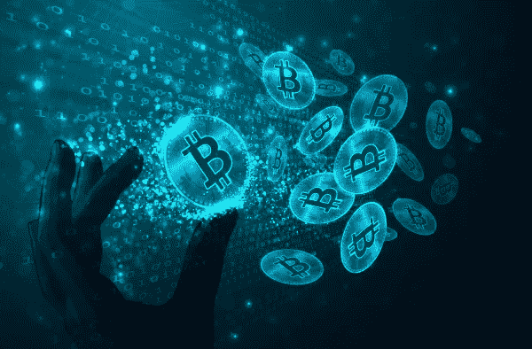
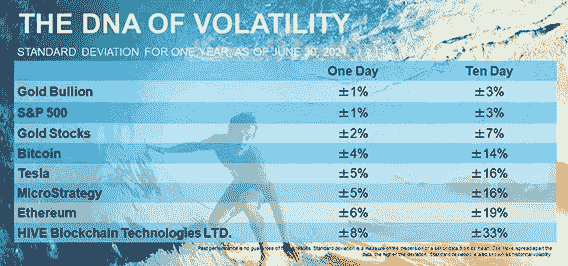
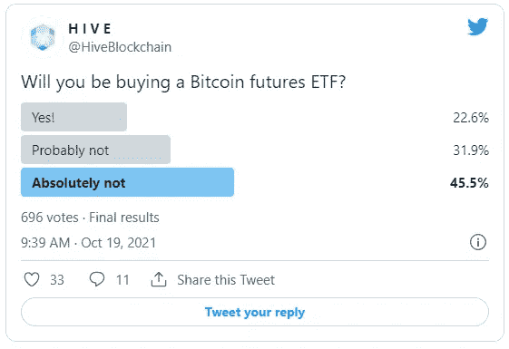
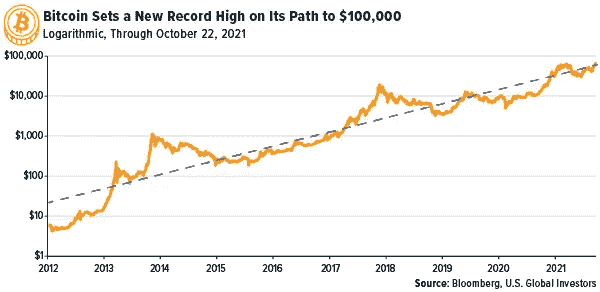
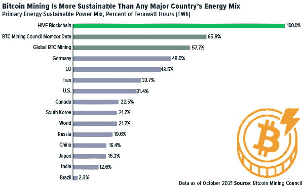

# 你需要知道的 5 个比特币发展

> 原文：<https://medium.com/coinmonks/5-bitcoin-developments-you-need-to-know-about-8d8707909ce2?source=collection_archive---------11----------------------->

我想从最近比特币和以太网价格的回落以及加密矿工的股票开始，因为比特币上周创下了新的历史新高。对于投资者来说，重要的是要记住，加密生态系统仍然是，而且预计将继续是高度不稳定的。

金条和标准普尔 500 在一个交易日内的标准差为 1%，而比特币的标准差接近 4%。Ether 的更高，为 6%，HIVE Blockchain Technologies 在任何给定的交易时段都可以轻松上涨或下跌 8%。

不用说，加密生态系统是高风险和潜在高回报的，考虑参与的投资者必须管理好自己的预期。

上周还有更多的内容要讲。以下是你需要知道的五个比特币发展。

> 订阅 [**Coinmonks Youtube 频道**](https://www.youtube.com/c/coinmonks/videos) 获取每日加密新闻。

# 1.第一只比特币 ETF 也是最快达到 10 亿美元资产的

读到这里的许多人可能知道，华尔街终于推出了与比特币挂钩的 ETF。追踪比特币期货合约表现的 ProShares 比特币策略 ETF (BITO)于上周一首次推出，就在几天前，美国证券交易委员会(SEC)表示，将不再阻止与该数字资产相关的投资产品的发行。

但这并不是 BITO 现在保持的唯一记录。这只 ETF 在首次亮相后短短两天内就吸引了超过 10 亿美元的资金，成为有史以来最快达到这一里程碑的基金。前一个纪录保持者是道富银行 2004 年推出的 SPDR 黄金股票 ETF (GLD)。受欢迎的黄金支持的 ETF 花了三天时间才达到 10 亿美元的资产。

BITO 可能是第一个，但绝不会是最后一个。第二只比特币期货基金，积极管理的瓦尔基里比特币策略 ETF (BTF)于周五开始交易。

话虽如此，并不是所有人都在跳着买比特币期货合约。在最近参加 HIVE 民意调查的近 700 人中，超过四分之三的人表示，他们“可能”或“绝对”对跟踪期货市场的 ETF 不感兴趣。据推测，他们正在坚持比特币现货 ETF，或者他们更愿意直接拥有加密技术。

# 2.比特币的历史最高价格重新引发了对 10 万美元的猜测

上周三，比特币的价格首次突破 66，000 美元，其市值超过了令人难以置信的 1.3 万亿美元。这种激增主要是由 BITO 的首次亮相以及 FOMO 不可否认的力量推动的，或者说是对错过的恐惧。

这再次引发了人们的猜测，即这种密码最早可能在年底达到 10 万美元。看看下面的对数图。每条水平线代表 10 的增长系数。

从算术上来说，66，000 美元到 100，000 美元之间有很多数字，但从几何上来说，这是一个跳跃。

# 3.一家美国公共养老基金购买了比特币和以太

上周，BITO 并不是比特币唯一受到机构投资者青睐的地方。有史以来第一次，美国养老基金投资了这个领域。周四，55 亿美元的休斯顿消防队员救济和退休基金(HFRRF)宣布，它已经购买了[2500 万美元的比特币和以太网，](https://www.prnewswire.com/news-releases/houston-firefighters-relief-and-retirement-fund-announces-bitcoin-purchase-301405769.html)代表着“比特币及其在公共养老金中的地位的分水岭时刻，”纽约数字投资集团(NYDIG)资产管理全球负责人内特·康拉德(Nate Conrad)表示，他促成了这笔交易。“受托人越来越意识到，随着时间的推移，即使是很小的数字资产分配也会产生很大的影响，”康拉德继续说道。

像 BITO 一样，这种分配可能是第一次，但我不认为这将是最后一次。想象一下，如果美国最大的此类基金、约 4400 亿美元的加州公共雇员退休系统(CalPERS)参与进来，比特币和以太网的价格会发生什么变化。

# 4.沃尔玛现在有比特币自动取款机，并计划增加数千台

多年来，比特币被称为很多东西。是“比郁金香还不如。”是泡沫。沃伦·巴菲特将其描述为“老鼠药的平方”。最近，摩根大通首席执行官杰米·戴蒙说它“一文不值”。

好吧，现在几乎任何人都可以在附近的沃尔玛将他们的零钱兑换成“一文不值”的比特币。上周，据报道，沃尔玛悄悄开始在特定地点安装特殊的 Coinstar 机器，让顾客可以选择购买比特币。

这家巨型零售商目前有大约 200 个信息亭，但据彭博称，计划在一段时间内安装[多达 8000 个这样的](https://www.bloomberg.com/news/articles/2021-10-21/walmart-shoppers-can-now-buy-bitcoin-at-200-kiosks-in-its-stores?sref=1pPyLRr7)。

# 5.全球比特币网络消耗的能量比节日灯还少

最后，比特币采矿委员会(BMC)上周发布了季度报告，其中包含了许多值得庆祝的比特币。如果你还记得的话，这个小组是在今年夏天聚集在一起回应埃隆·马斯克的说法，即比特币采矿消耗了太多的能源，以及[太多的*肮脏的*能源。另一方面，委员会的发现讲述了一个非常不同的故事。](https://www.usfunds.com/investor-library/frank-talk-a-ceo-blog-by-frank-holmes/note-to-elon-crypto-miners-are-part-of-the-solution-to-curbing-greenhouse-gas-emissions1)

该组织由 MicroStrategy 首席执行官迈克尔·塞勒(Michael Saylor)领导，HIVE 也是其成员之一。根据该组织的说法，与任何主要国家甚至任何主要行业(包括黄金开采)相比，比特币开采在全球范围内使用的能源微不足道。

事实上，你可能会惊讶地发现，比特币采矿每年消耗的能源甚至比节日灯还少。

与埃隆·马斯克的说法相反，该网络使用的能源组合比地球上任何一个主要国家都更可持续。德国以近一半的可再生能源领先于此，而全球比特币挖矿网络估计占 57.7%。BMC 成员的这一数字上升到近 66%。然后还有 HIVE，用 100%绿色可再生能源开采比特币和以太。

***要了解目前可能推动比特币价格的其他因素，请务必点击这里观看我的视频***[***【Metcalfe’s Law！***](https://www.youtube.com/watch?v=daOCH_0lZIE)

# 美国全球表彰卫生保健英雄

美国全球投资公司非常自豪能够成为 2021 医疗保健英雄的赞助商，这是一年一度的活动，旨在庆祝为我们的家乡圣安东尼奥服务的医生、护士、研究人员和其他医疗保健专业人员。我代表公司的每个人，向你们所有人脱帽致敬！感谢您保持我们社区的安全和健康，特别是在过去的一年里。

**披露** : *标准普尔 500 指数(S & P 500 Stock Index)是一个被广泛认可的美国公司 500 种普通股价格的资本化加权指数。标准偏差是一组数据偏离其平均值的程度。数据越分散，偏差就越大。标准差也被称为历史波动率。弗兰克·霍姆斯(Frank Holmes)被任命为 HIVE Blockchain Technologies 董事会非执行主席。霍姆斯和美国全球投资者都持有 HIVE 的股份。自 2018 年 8 月 31 日起，Frank Holmes 担任 HIVE 的临时执行主席。*

*持仓可能每日变动。截至最近一个季度末，报告了持股情况。截至 2021 年 9 月 30 日，文章中提到的以下证券由美国全球投资者管理的一个或多个账户持有:特斯拉公司*

*所有表述的观点和提供的数据如有变更，恕不另行通知。其中一些观点可能并不适合每一位投资者。单击上面的链接，您将被定向到第三方网站。美国环球投资公司不认可本网站/这些网站提供的所有信息，也不对其内容负责。*

> 加入 Coinmonks [电报频道](https://t.me/coincodecap)和 [Youtube 频道](https://www.youtube.com/c/coinmonks/videos)了解加密交易和投资

## 另外，阅读

*   [用信用卡购买密码的 10 个最佳地点](https://blog.coincodecap.com/buy-crypto-with-credit-card)
*   [OKEx 回顾](/coinmonks/okex-review-6b369304110f) | [Kucoin 交易机器人](/coinmonks/kucoin-trading-bot-automate-your-trades-8cf0ca2138e0) | [期货交易机器人](/coinmonks/futures-trading-bots-5a282ccee3f5)
*   [AscendEx Staking](https://blog.coincodecap.com/ascendex-staking)|[Bot Ocean Review](https://blog.coincodecap.com/bot-ocean-review)|[最佳比特币钱包](https://blog.coincodecap.com/bitcoin-wallets-india)
*   [霍比评论](https://blog.coincodecap.com/huobi-review) | [OKEx 保证金交易](https://blog.coincodecap.com/okex-margin-trading) | [期货交易](https://blog.coincodecap.com/futures-trading)
*   [Godex.io 审核](/coinmonks/godex-io-review-7366086519fb) | [邀请审核](/coinmonks/invity-review-70f3030c0502) | [BitForex 审核](https://blog.coincodecap.com/bitforex-review)
*   [Crypto.com 费用](/coinmonks/binance-fees-8588ec17965) | [僵尸加密审查](/coinmonks/botcrypto-review-2021-build-your-own-trading-bot-coincodecap-6b8332d736c7) | [替代品](https://blog.coincodecap.com/crypto-com-alternatives)
*   [有哪些交易信号？](https://blog.coincodecap.com/trading-signal) | [Bitstamp vs 比特币基地](https://blog.coincodecap.com/bitstamp-coinbase) | [买索拉纳](https://blog.coincodecap.com/buy-solana)
*   [ProfitFarmers 回顾](https://blog.coincodecap.com/profitfarmers-review) | [如何使用 Cornix 交易机器人](https://blog.coincodecap.com/cornix-trading-bot)
*   [MXC 交易所评论](/coinmonks/mxc-exchange-review-3af0ec1cba8c) | [Pionex vs 币安](https://blog.coincodecap.com/pionex-vs-binance) | [Pionex 套利机器人](https://blog.coincodecap.com/pionex-arbitrage-bot)
*   [我的加密副本交易经历](/coinmonks/my-experience-with-crypto-copy-trading-d6feb2ce3ac5) | [比特币基地评论](/coinmonks/coinbase-review-6ef4e0f56064)
*   [CoinFLEX 评论](https://blog.coincodecap.com/coinflex-review) | [AEX 交易所评论](https://blog.coincodecap.com/aex-exchange-review) | [UPbit 评论](https://blog.coincodecap.com/upbit-review)
*   [AscendEx 保证金交易](https://blog.coincodecap.com/ascendex-margin-trading) | [Bitfinex 赌注](https://blog.coincodecap.com/bitfinex-staking) | [bitFlyer 点评](https://blog.coincodecap.com/bitflyer-review)
*   [麻雀交换评论](https://blog.coincodecap.com/sparrow-exchange-review) | [纳什交换评论](https://blog.coincodecap.com/nash-exchange-review)
*   [维护卡审核](https://blog.coincodecap.com/uphold-card-review) | [信任钱包 vs 元掩码](https://blog.coincodecap.com/trust-wallet-vs-metamask)
*   [Exness 评测](https://blog.coincodecap.com/exness-review)|[moon xbt Vs bit get Vs Bingbon](https://blog.coincodecap.com/bingbon-vs-bitget-vs-moonxbt)
*   [加密保证金交易交易所](/coinmonks/crypto-margin-trading-exchanges-428b1f7ad108) | [赚取比特币](/coinmonks/earn-bitcoin-6e8bd3c592d9)
*   [WazirX vs coin dcx vs bit bns](/coinmonks/wazirx-vs-coindcx-vs-bitbns-149f4f19a2f1)|[block fi vs coin loan vs Nexo](/coinmonks/blockfi-vs-coinloan-vs-nexo-cb624635230d)