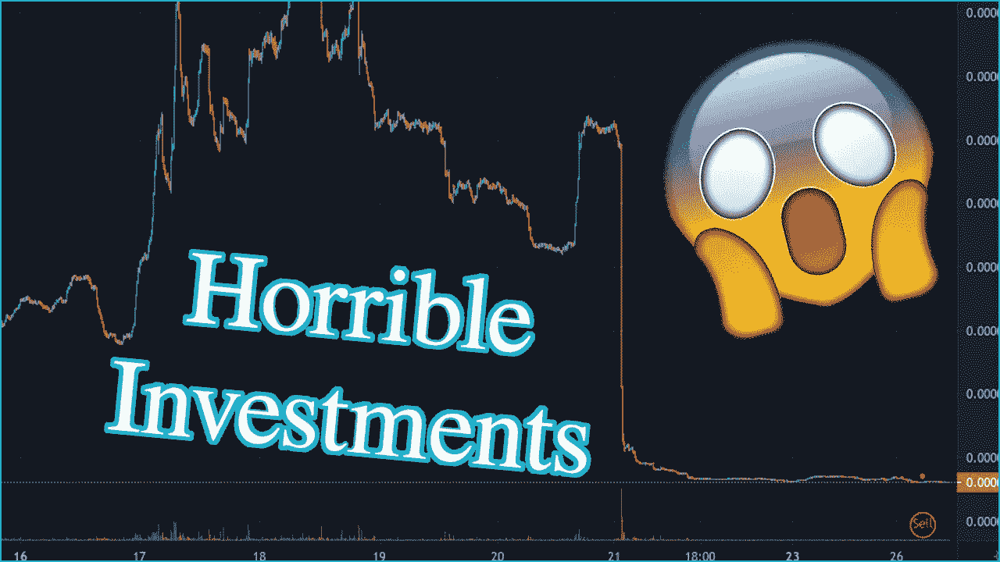
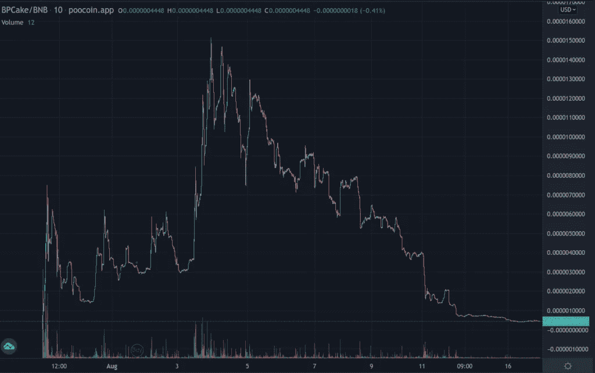
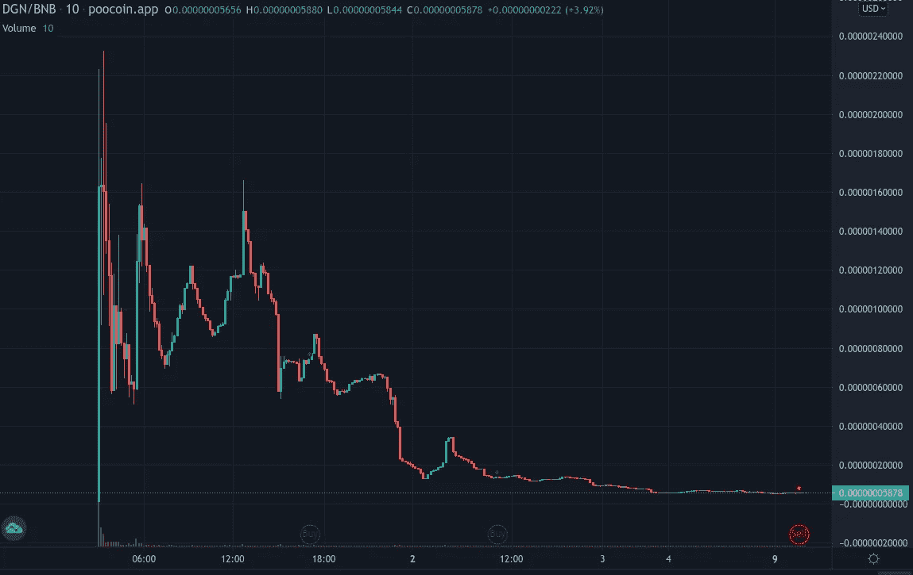
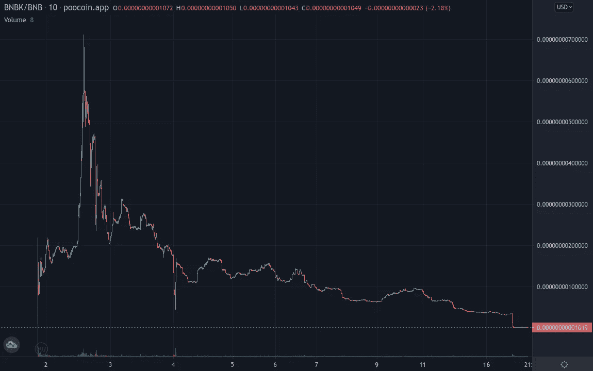
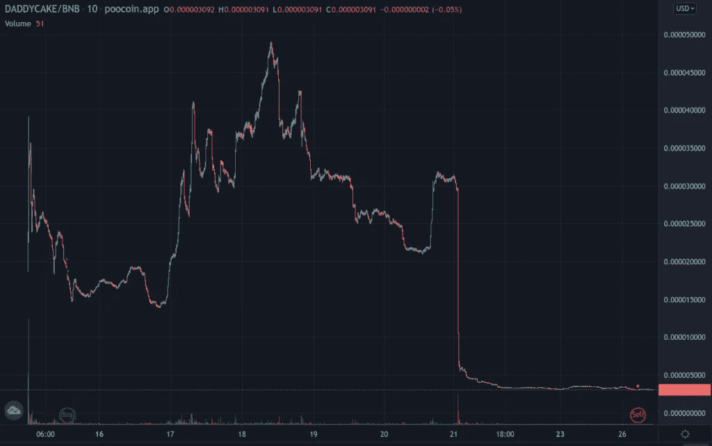
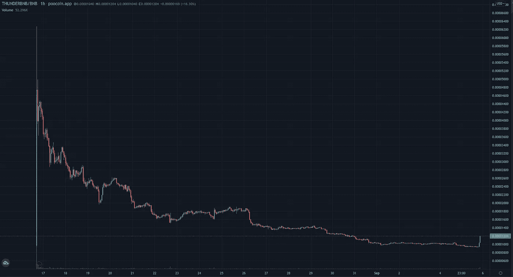

# 我的 5 次秘密投资失败案例分析

> 原文：<https://medium.com/coinmonks/5-crypto-investment-failures-of-mine-analyzed-1c27c5fdfe5e?source=collection_archive---------10----------------------->

Created by author, background taken from poocoin.app

我投资了我在 [r/CryptoMoonShots](https://www.reddit.com/r/CryptoMoonShots/) 上发现的几个硬币，我想和你分享其中的 5 个是如何变成我的。

不可否认，现在看这些硬币的表现似乎还为时过早。因为我持有它们的时间都不超过一个月。更多的钻石交易可能是他们去太空的全部代价。
然而，我已经可以说我犯了很多错误，也学到了很多。我写这篇文章是希望让你不要犯同样的错误，并给你描绘一幅不像所有 Reddit 帖子和电报小组希望你相信的那样美好的画面。

所有的硬币都有一个共同点，那就是奖励持有者。这个概念立刻说服了我。买一次硬币，从所有的买卖中获益。等待足够长的时间，你一定会收支平衡，对不对？

我计划将来写一篇关于奖励硬币的更细致的文章，所以我现在不想详细回答这个问题。一句简单的“事情不像看上去那么美好”就足够了。但是我想我将要讲述的故事将会说明一切。

这 5 枚硬币的顺序与我购买的顺序一致。你会看到我花钱的意愿增加了，但对我投资的审查却没有增加。

这里的方法对他们来说都是一样的。在简单介绍之后，接下来是对社交媒体现状的分析。主要以他们的推特和电报为代表。
接下来，我们将更深入地了解令牌组学，然后对我的头寸进行核算。我花了多少钱？在写的时候值多少钱？我通过奖励变得富有了吗？
请注意，在我的计算中，我将忽略汽油费，并给出四舍五入的数值，但不会总是提及。都是为了简单。

最重要的是令牌图，它会显示我什么时候进去的，我现在在哪里，或者在某些情况下:我从哪出来的。

# [小煎饼](https://www.babypancaketoken.com/)

这一切都始于一张价值 100 美元的蛋糕奖励代币.我立刻就被吸引住了，因为 PancakeSwap 是我最喜欢的 Dex 之一。所以我怎么能拒绝更多蛋糕的承诺呢？

## 社会化媒体

Twitter 账户有 1 万名粉丝，最后一篇帖子写于 8 月 10 日。
电报组有 3k 成员，几乎没有什么活动。唯一正在进行的活动是宣布这枚硬币已经死了。

## 令牌组学

每笔交易都有 15%的税。8%作为美元蛋糕奖励分配给持有人，4%用于提供流动性，5%用于营销。我知道这不合情理，但这实际上是从网站上截取的。

至少要持有 200，000 个代币才有资格获得奖励，并且钱包不能持有超过代币总额 1.5%的代币。

## 我的账户

我买了价值 23 美元的代币，现在价值 3 美元。出售我的股份并不有利可图，因为当我尝试时，汽油费更高。

根据仪表盘显示，我赚了 0.43 美元蛋糕，目前价值 10.69 美元。

这让我损失了 53%。我们有了一个良好的开端。

Taken from poocoin.app

# [DualGamingNFT](https://dgn.finance/)

这个代币奖励两个代币，AXS 和 DPET。这引起了我的兴趣，因为我非常清楚$AXS 是多么成功(现在仍然如此)。我甚至想自己动手开发 [Axis Infinity](https://axieinfinity.com/) ，但却被必要的初始投资打消了念头。

## 社会化媒体

这个推特账户拥有惊人的 100 名粉丝。不，等等，没有那么多。电报集团在规模和活动上不相上下。500 名成员，其中大多数可能是风滚草，因为这是你检查时得到的氛围。

## 令牌组学

象征经济学的细节和我最终从中获得的回报一样稀少。

我们又征收了 15%的税，其中 5%变成了$AXS，另外 5%变成了$DPET。3%用于开发和营销，最后 2%用于流动性。

缺少一份包含更多信息的白皮书，这应该是一个危险信号。我想，后知后觉永远是 20/20。

## 我的账户

这一切都始于一笔价值 23 美元的交易。依稀记得第一天过后对奖励的印象。可能是我投入了初始投资的 10%。但是现在细节对我来说已经很模糊了。
长话短说，第二天我决定再扔 33 美元进去。总共 56 美元。

我的奖励有多棒？如此令人震惊，以至于我坐在这里摇头，因为它们我买了更多的硬币。我得到了 0.281 美元的 DPET 和 0.0455 美元的 AXS，这两个货币在今天分别相当于 1.38 美元和 3.39 美元。

当我意识到这枚硬币是多么的无趣时，我把它换成了另一枚我在 poocoin 上随机找到的硬币。现在我很确定另一枚硬币是个骗局。但是这是一个不同的故事，充满了无知和愚蠢，我想推迟到…永远。

底线:我可以记录 91%的偏航下降损失。

Taken from poocoin.app

# BNBack

一想到不断获得 BNB，可以用来支付其他交易的汽油费，我立刻就着了迷。

那么，我现在可以终身拥有 BNB 了吗？足够支付所有交易？

让我们找出答案。

## 社会化媒体

自 8 月 13 日以来，拥有 33000 名粉丝的 Twitter 账户已经陷入沉默。Telegram group 也有大约 33000 名成员，似乎它试图模仿 Twitter 账户，也主要表现为沉默。

开始看出规律了吗？

## 令牌组学

在象征经济学方面也不奇怪。我们对每笔购买征收 15%的税，其中 10%用于 BNB 股息，3%用于营销，2%用于流动性和回购。值得注意的是，20%的更高销售税降低了销售利润并防止倾销。

## 我的账户

我最初的热情体现在我投入的金额上。我在桌子上放了 50 美元。目前我的头寸价值令人难以置信的 0.5 美元。是的，你没看错！50 美分。

太神奇了！

图表清楚地显示，更高的销售税并没有阻止人们出售……可能是为了离开这条正在下沉的船。

这是否意味着这枚硬币记录的损失比前一枚更大？令我惊讶的是，事实并非如此，因为我的调查显示我获得了 0.0437 BNB，实际价值约 21 美元。实际上，我对这个数字感到非常惊讶，所以我不得不再次检查它。结果却是一样的。

我损失了 58%。

Taken from poocoin.app

# [爸爸蛋糕](https://daddycake.net/)

啊，是的，蛋糕爸爸。我会永远记得你。不是因为你出色的表现。
没有！仅仅因为你是我投资的第一枚硬币，在那里我亲身经历了“崩溃”。

对于之前的硬币，我花了相当长的时间才意识到它们已经死了。
看图表给了我一种预感，但在这篇文章的过程中，我发现了更令人信服的证据。比如电报里每个人都说它死了。很有说服力，如果你问我的话。

但是有了爸爸蛋糕，结果就不一样了。我是电报小组的积极成员，非常喜欢这个团体。
我们一直在发布 memes，让彼此更加相信这是一项强有力的投资。销售人员被称为“纸人”，我们对此嗤之以鼻。我们是“钻石手”。不管怎样，我们都紧紧抓住这枚硬币。坚信只要有足够的毅力，你就会得到一次登月之旅的回报。

事情发生时，这是一个和往常一样的早晨。我想去看看我的战友们。这将被证明是不同于其他任何一个早晨。该组被重命名为“此失败”。如果你问我，我会觉得这有点戏剧性。
不仅改名了，还关了。不可能联系到我的投资伙伴。雪上加霜的是，最后一条消息是显示当前图表的价格机器人。它展示了一个巨大的红色蜡烛和价格的全面崩溃。

## 社交媒体和令牌经济学

我刚才在长篇大论地谈论在全盛时期有 12k 成员的电报集团。

该网站已被撤下，这让我很难找到 Twitter 账户和令牌组学。所以我会简单地说一下这枚硬币。

有 15%的购买税和 22%的销售税。令牌的分发和进一步的细节将永远丢失…这是另一种说法，我太懒了，不想再调查这个令牌了。

## 我的账户

我坚信这枚硬币。这解释了我为什么买了三次。62 美元，41 美元和惊人的 3.15 美元。最后一笔交易是我把之前的$AXS 兑换成现金。

10 美元是我平仓时得到的，总共奖励了我 0.56 美元。今天大约是 12 美元。

总之，我损失了 80%,心碎了。

Taken from poocoin.app

# [ThunderBNB](https://thunderbnb.app/)

最后但同样重要的是，我们有一个项目，我认为它不是完全失败的，因为它仍然是活跃的。钱仍然花在营销上，我经常在 Poocoin 和其他网站上看到广告。
背后的团队正在围绕他们自己的硬币创造一个完整的奖励代币生态系统， [Thoreum](https://thoreum.finance/) 。

他们生态系统的不断进化可能对 ThunderBNB 有利，也可能意味着旧的奖励令牌将被遗忘，唯一真正受益的令牌是他们自己的创造。

时间会证明…

## 社会化媒体

毫不奇怪，他们不断的活动导致了活跃的社交媒体关注。Twitter 上有 36k 名粉丝，每天都有帖子，主要是关于新代币的。由一个拥有 85，000 名成员的电报组加入。

令人震惊！

如果不是因为大多数看起来都是假的。至少群内活动本身感觉不像 85k 成员。

## 令牌组学

我们有一个惊人的 18%的购买税，分为 8%的 BNB 奖励，2%的 Thoreum 奖励，2%的 Thundercake(他们的另一个创作)，2%的回购和 Thunderbnb 的燃烧，4%的营销和开发基金。
卖出费是买入费的 1.5 倍，最高可达 27%。

但这还不是全部。最重要的是，整个动物园的金库和游泳池是可用的，在那里你可以下注你的硬币，挖掘新的并获得奖励。跟踪所有这些选择是一项挑战。

老实说，我已经迷失了方向。

你可能认为这就是全部，我不怪你。这一切之后会发生什么呢？

嗯……就一个词。兰博！

即使在我打字的时候，我也能感觉到你的困惑。是的，你有机会赢得兰博基尼胡拉坎，只要把它放在你的钱包里，不要转移到其他地方。

这些家伙确实知道如何做营销。

## 我的账户

浮华的网站和最后但并非最不重要的赢得一辆兰博基尼的机会一定让我大吃一惊。否则我为什么要花 280 美元买这个。

因为硬币具有不可思议的潜力？根据他们自己的仪表盘，我现在的仓位是 82 美元。

因为我收到源源不断的奖励？同一个仪表盘显示我的总奖励加起来是 20 美元。

迄今为止损失了 64%。

我猜是兰博说服了我。

Taken from poocoin.app

# 结论

你可能会感到惊讶，但这篇文章的目的不仅仅是取悦你。我想从这些错误中总结经验。当然也是为了你，但首先是为了我自己。

我学到了很多。我可能会写一篇关于每一课的文章。因此，我有一个建议给你:我会给出一个高水平的要点总结，你一定要在未来回来阅读详细的文章。成交？成交！

开始学习吧！

## 永远不要错过研究日

谁会想到，仅仅因为网上一个人说一枚硬币会涨到 1000 倍就去买它会导致灾难呢？除非那家伙是我，否则就太酷了！

以下是你在投资前应该尝试回答的一系列问题。可以肯定的是，这个列表还远远不够完整，只能作为一个起点。此外，所提到的几点不应被视为是必要的。只是降低风险的因素。

*   硬币试图解决哪个问题，还有其他类似的硬币吗？
*   背后的团队是谁？他们做过其他项目吗？他们的身份为人所知吗？
*   项目是否经过审计，结果如何？
*   网站是什么样子的？是付出了努力还是充满了错别字？
*   白皮书是什么样的？
*   目前有多少持有人？持有的最大仓位是什么？
*   有多少流动资金？

## 社交媒体的存在很重要

我曾经读过 Mehta、Agashe 和 Detroja 的书《区块链:泡沫还是革命》( T0 ),内容如下:

货币的价值由三个因素决定:

*   内在价值，例如黄金和把它变成珠宝
*   实用性，例如能够购买食物
*   大肆宣传

由于其无形的数字本质，加密货币没有内在价值。全都是互联网上的代码和数字。

不过，它们也有用处。见鬼，我可以用比特币订披萨。[尽管那不是新的](https://www.investopedia.com/news/bitcoin-pizza-day-celebrating-20-million-pizza-order/)。但大多数硬币，尤其是非常小的硬币，缺乏实用性。

在奖励令牌的情况下，我想质疑作为奖励令牌是否是效用，因为在我看来它绑定了这么多条件。但这肯定是另一篇文章的内容。

这基本上使得炒作成为价值创造背后的主要力量。因此，问题是这枚硬币及其背后的团队能产生多大的宣传效应。这就是社交媒体存在如此重要的原因。

这里，再问几个问题:

*   有哪些社交媒体渠道？里面有多少追随者？
*   社区有多活跃？
*   更重要的是:开发者有多活跃？
*   他们定期发帖吗？
*   他们在营销上花了钱吗？
*   他们投资广告还是赠品？
*   他们有 AMAs 吗？

## 霍德林并不总是这样

有趣的是。对于 5 项投资中的 3 项，我实际上是在有利的时机进入的。因为我买了之后，它们就涨价了。我想说，其中有些甚至意义重大。

如果我卖出了我的部分头寸，我将会零损失，或者，我敢说，甚至有所盈利。

但我没有这么做。我甚至没有考虑去做这件事！

在非加密金融领域，我是买入并持有的忠实粉丝。也就是说，不管市场上发生什么，你都要买入并持有它。这通常是通过 ETF 来实现的。

当涉及到加密投资时，我很自然地被“钻石交易”所吸引。我高兴地加入了其他霍德勒的行列，嘲笑卖家是“纸人”。它给人一种团结和优越感。

但是当涉及到加密时，严格的黑白思维似乎是危险的。买入并持有对指数基金来说很有效，它最终会从崩溃中恢复，但一枚纳米硬币通常会在崩溃后烧毁。

## 我们没有什么可害怕的，除了害怕(错过)本身

FOMO 或害怕错过是任何投资者最大的敌人。

进入我顽固头脑的一个重要教训是，我将不能参与每一个月亮硬币。这没关系。我没有理由去追逐每一个机会。

恐惧只会导致仓促的决定，而这些决定大多只会导致一件事:红色数字。

对我来说，专注而冷静的方法似乎更有前途。

最后的话

如果说写这篇文章教会了我什么的话，那就是谨慎。

我在最初的几笔投资上有点烧伤，我最初的热情也冷却了很多，但我对进一步了解 crypto 的渴望丝毫没有停止。

这篇文章比我预期的要长得多。对于每一个走到这一步的人，我想说:谢谢你们。

我真的希望你喜欢这篇文章，甚至可能学到了一些东西。欢迎在评论中分享你的新手亏损故事。

**如果你想保持最新，那么** [**订阅我的简讯**](https://dedicated-composer-737.ck.page/817c0a5528) **。**

> 加入 Coinmonks [电报频道](https://t.me/coincodecap)和 [Youtube 频道](https://www.youtube.com/channel/UCbyDhTbOiKh2iUMKBi4-4Zg)了解加密交易和投资

## 另外，阅读

*   [尤霍德勒 vs 科恩洛 vs 霍德诺特](/coinmonks/youhodler-vs-coinloan-vs-hodlnaut-b1050acde55a) | [Cryptohopper vs 哈斯博特](https://blog.coincodecap.com/cryptohopper-vs-haasbot)
*   [币安 vs 北海巨妖](https://blog.coincodecap.com/binance-vs-kraken) | [美元成本平均交易机器人](https://blog.coincodecap.com/pionex-dca-bot)
*   [如何在印度购买比特币？](/coinmonks/buy-bitcoin-in-india-feb50ddfef94) | [WazirX 审核](/coinmonks/wazirx-review-5c811b074f5b) | [BitMEX 审核](https://blog.coincodecap.com/bitmex-review)
*   [比特币主根](https://blog.coincodecap.com/bitcoin-taproot) | [Bitso 回顾](https://blog.coincodecap.com/bitso-review) | [排名前 6 的比特币信用卡](/coinmonks/bitcoin-credit-card-bc8ab6f377c6)
*   [双子座 vs 比特币基地](https://blog.coincodecap.com/gemini-vs-coinbase) | [比特币基地 vs 北海巨妖](https://blog.coincodecap.com/kraken-vs-coinbase) | [硬币罐 vs 硬币点](https://blog.coincodecap.com/coinspot-vs-coinjar)
*   [印度加密交易所](/coinmonks/bitcoin-exchange-in-india-7f1fe79715c9) | [比特币储蓄账户](/coinmonks/bitcoin-savings-account-e65b13f92451) | [Paxful 审核](/coinmonks/paxful-review-4daf2354ab70)
*   [杠杆令牌](/coinmonks/leveraged-token-3f5257808b22) | [最佳加密交易所](/coinmonks/crypto-exchange-dd2f9d6f3769) | [AscendEX 评论](/coinmonks/ascendex-review-53e829cf75fa)
*   [Godex.io 审核](/coinmonks/godex-io-review-7366086519fb) | [邀请审核](/coinmonks/invity-review-70f3030c0502) | [BitForex 审核](https://blog.coincodecap.com/bitforex-review) | [HitBTC 审核](/coinmonks/hitbtc-review-c5143c5d53c2)
*   【Crypto.com 费用】 | [僵尸密码审查](/coinmonks/botcrypto-review-2021-build-your-own-trading-bot-coincodecap-6b8332d736c7) | [币安替代品](https://blog.coincodecap.com/crypto-com-alternatives)
*   [有哪些交易信号？](https://blog.coincodecap.com/trading-signal) | [Bitstamp vs 比特币基地](https://blog.coincodecap.com/bitstamp-coinbase) | [买索拉纳](https://blog.coincodecap.com/buy-solana)
*   [ProfitFarmers 回顾](https://blog.coincodecap.com/profitfarmers-review) | [如何使用 Cornix 交易机器人](https://blog.coincodecap.com/cornix-trading-bot)
*   [MXC 交易所评论](/coinmonks/mxc-exchange-review-3af0ec1cba8c) | [Pionex vs 币安](https://blog.coincodecap.com/pionex-vs-binance) | [Pionex 套利机器人](https://blog.coincodecap.com/pionex-arbitrage-bot)
*   [我的加密副本交易经历](/coinmonks/my-experience-with-crypto-copy-trading-d6feb2ce3ac5) | [比特币基地评论](/coinmonks/coinbase-review-6ef4e0f56064)
*   [CoinFLEX 评论](https://blog.coincodecap.com/coinflex-review) | [AEX 交易所评论](https://blog.coincodecap.com/aex-exchange-review) | [UPbit 评论](https://blog.coincodecap.com/upbit-review)
*   [AscendEx 保证金交易](https://blog.coincodecap.com/ascendex-margin-trading) | [Bitfinex 赌注](https://blog.coincodecap.com/bitfinex-staking) | [bitFlyer 审核](https://blog.coincodecap.com/bitflyer-review)
*   [麻雀交换评论](https://blog.coincodecap.com/sparrow-exchange-review) | [纳什交换评论](https://blog.coincodecap.com/nash-exchange-review)
*   [加密货币储蓄账户](/coinmonks/cryptocurrency-savings-accounts-be3bc0feffbf) | [赌注加密](https://blog.coincodecap.com/staking-crypto) | [加密交易机器人](https://blog.coincodecap.com/best-crypto-trading-bots)