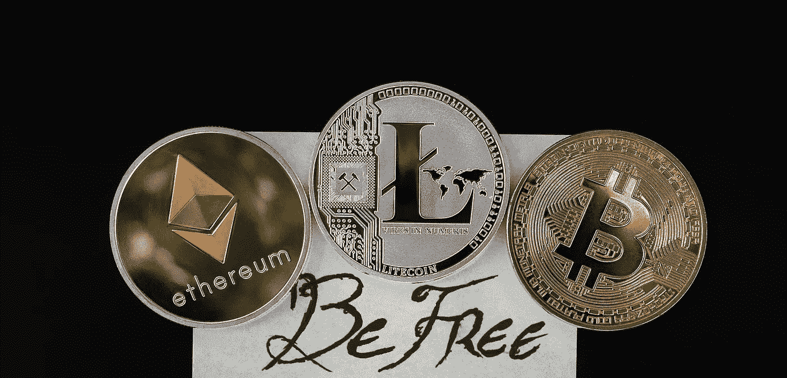

# 2022 年将飙升的 5 种加密货币

> 原文：<https://medium.com/coinmonks/5-cryptocurrencies-that-will-soar-in-2022-921bbfa3c27e?source=collection_archive---------0----------------------->

## 加入 Coinmonks [电报频道](https://t.me/coincodecap)和 [Youtube 频道](https://www.youtube.com/c/coinmonks/videos)了解加密交易和投资

It’s going to be a challenge for [cryptocurrency values in 2022](https://coinmarketcap.com/invite?ref=XQW6VFQN) after a year like 2021.

像 2021 年这样的一年之后，2022 年对[加密货币的价值将是一个挑战。](https://coinmarketcap.com/invite?ref=XQW6VFQN)

[比特币和其他数字货币](https://asedeyhotnaija.com/why-should-i-buy-and-use-bitcoin/)见证了该资产类别历史上一些最戏剧性的涨跌；现在，这一年似乎在高调中结束。

但是，将来可能会出现一些问题。

2022 年，下一个崛起的大密码会是什么？

美联储决定在周三召开会议，股票市场因此受到震动。

由于该实体计划大幅减少紧急支出，投资者将更加谨慎投资。

随着通货膨胀继续攀升，它也是一个令人担忧的原因。

然而，这种悲观情绪因美联储承诺在 2022 年加息三次而加剧。

> 另请参见:[加密货币黑客:他们偷了多少钱？](https://asedeyhotnaija.com/cryptocurrency-hacks-how-much-did-they-steal/)

# 1.通量(通量)

虽然 [Flux](https://coinmarketcap.com/currencies/zel/) 是我们榜单上最小的加密货币，但它的网络也不容忽视。

随着 Web 3.0 现象变得更加普遍，Flux 很快将成为最受欢迎的密码之一。

由于号称“*亚马逊(Amazon)为区块链提供在线服务，*”，它有能力挑战任何网络服务巨头。

AWS 提供软件即服务(SaaS)，Flux 提供区块链即服务与 AWS (BaaS)竞争。

从性能的角度来看，这些变化可以忽略不计。

虽然云计算和分布式公共分类帐是互补的，但 BaaS 技术使客户能够利用两者的优势来获益。

使用 Flux 的 FluxOS，你可以操作神谕、托管服务器和存储数据，无论这些数据有多机密，就像 AWS 为绝大多数互联网所做的那样。

然而，最终，它有望成为一个值得信赖的信息来源。

为了保持网络运行，可以使用磁通节点。

通过在全球范围内对 FluxNode 运营商进行地理标识，用户可以在使用节点提供的 BaaS 服务的同时链接到可能最快的节点。

即使你不使用互联网，你也听说过最近的 AWS 故障。AWS 在 12 月已经有过两次停机。

在这些中断期间，许多最受欢迎的社交网络和电子商务网站以及在线游戏服务器都无法使用。

当 Flux 被广泛采用时，由于大量的 FluxNode 运营商，这些中断将成为过去。

> 另外，请看:[必读评论:Victory Crypto 是合法的还是骗局](https://asedeyhotnaija.com/a-must-read-review-is-victory-crypto-legit-or-a-scam/)

# 2.涟漪(XRP)

整个 2021 年，[涟](https://coinmarketcap.com/currencies/xrp/)都是一手烂牌。美国证券交易委员会提起的诉讼阻止了 Ripple 在美国交易所的交易。

如果没有这个障碍，诉讼会吓跑那些不想投资陷入困境的公司的潜在投资者。

然而，有些人对 Ripple 非常感兴趣，因为他们认为这将是国际资金转移的未来。

另一方面，当这场诉讼在 2022 年结束时，Ripple 可能有能力弥补失去的时间。

眨眼间，Ripple 用户就可以通过将法币转换成 XRP 币，转移 XRP 币，并让接收者将其转换成他们选择的法币来进行国际货币转移。

使用 Ripple，用户可以进行国际货币交易。

该网络的 XRP 令牌将在废黜当前的国际电汇交易世界中发挥重要作用。

由于 Ripple 的法律诉讼，该行业今年大幅上涨的股票已经损失了一大部分。

81 美分比年初的 22 美分有了显著的增长。

然而，XRP 能够实现 100%或者 1000%的利润吗？

我们永远无法确定。

然而，Ripple 继续向投资者提供信息，甚至在上个月组织了一次会议。现在，它希望结束对 SEC 的指控。

美国证券交易委员会的审议程序特权让该网络占了上风，因为法院要求美国证券交易委员会出具一封信，解释其保密的材料(DPP)。

然而，如果它不能，Ripple 可能能够尽早胜利地走出法庭，这可能会带来价格爆炸。

> 另请参见:[加密货币和投资的基础知识](https://asedeyhotnaija.com/the-basics-of-cryptocurrency-and-investing/)

# 3.茄属植物

索拉纳将成为 2021 年的大赢家。

1 月初，索尔汇率为 1.40 美元，投资者现在以 183.10 美元的价格获得了 13，000%的回报。

由于各种因素，如波动的市场运动或成功转向不可替代的代币，这种繁荣已经发生(NFTs)。

相反，Solana 挑战以太坊(ETH)作为世界领先的区块链网络的立场是这个开源 DApp 游乐场背后的驱动力。

Solana 的可扩展性是它最大的优势。

毫无疑问，随着这项技术得到更广泛的应用，区块链的数据交易量将会增加。

某些网络可以比其他网络更好地处理更高的交易量。

索拉纳就是这样一个网络，它正在利用这种日益上升的人气。

以太坊最近涨了气费怎么办？一个简单的交易，以太坊的汽油费用今年早些时候攀升至 50 美元。

以太坊用户对 2300%的费用增长越来越失望，导致一些人转向索拉纳网络。

使用 Solana 每秒可以进行多达 50，000 次交易，Solana 声称这些交易的费率不到 1 便士。

以太坊中的合并更新旨在提高可扩展性，然而，这还有很长的路要走。

至少在 2022 年夏天之前，该网络不会对其股权证明系统进行重大升级。

与此同时，索拉纳的规模和市值都在持续增长。

在 1 月份有 50 万新成员加入该网络后，SOL 的市值已超过 1000 亿美元。

> 另外，请看:[脸书和 Instagram 上的最终加密广告！](https://asedeyhotnaija.com/finally-crypto-ads-on-facebook-and-instagram/)

# 4.多边形(MATIC)

[Polygon](https://coinmarketcap.com/currencies/polygon/) 是一个旨在保持区块链业务平稳运行的网络。

在可伸缩性游戏 Solana 以及其他采用这种新技术的大型网络(如工作验证以太坊网络)中，可伸缩性问题已经出现。

第二层缩放是 Polygon 避免未来瓶颈的尝试。

以太坊网络是多边形设计的主要焦点。

以太坊顶部的一层就是它如何做到这一点的。

Polygon 允许用户将他们的以太坊交易移动到 Polygon 链中。

由于使用了这项服务，主网络上的通信量减少了。

因此，Polygon 还可以为其消费者提供极低的交易成本。

第 2 层解决方案允许用户以多种方式跨链传输交易数据。

多边形有十种不同的工具供你使用。

多边形零(Polygon Zero)是一种零知识的卷起技术，最近被引入到网络中，使得在几乎不消耗能量的情况下跨网络传输数据变得容易。

> 另外，请看:[我为什么要投资比特币？](https://asedeyhotnaija.com/why-should-i-invest-in-bitcoin/)

# 5.分散土地(法力)

仔细想想，元宇宙只是一个虚拟的地方，在那里人们可以做很多他们在现实生活中可以做的事情玩游戏，和朋友出去玩，看现场音乐，等等。

然后，这是一个由区块链产业和大型科技公司共同支持的领域。

如果你把脸书向元平台的转型作为证据，你可以肯定这个行业会一直存在下去。

该公司的市值接近 1 万亿美元，其历史已经产生了关于其起源的电影。

有鉴于此，来自分散之地的[法力](https://coinmarketcap.com/currencies/decentraland/)令牌是一种在新的一年里需要关注的加密货币。

尽管元宇宙得到了很多硅谷的支持，但许多人希望看到它分散化。

他们不希望 Meta 参与虚拟现实，而是希望虚拟现实由人民来管理。分散土地的投资者正在带头冲锋。

欢迎任何人加入位于区块链元宇宙的分散式沙盒世界，这里充满了各种活动。

有可能获得一块土地，开发它，并邀请一个人的朋友在那里度过时光。

如果他们愿意，他们可以上网玩游戏，也可以去虚拟世界购物。只要他们在家，他们就可以做所有这些事情。

索斯比等组织和几位在该网络首届音乐活动上演奏的艺术家也对 MANA 给予了大力支持。

> 还有，参见:[2022 年新手如何用比特币赚钱](https://asedeyhotnaija.com/how-to-make-money-with-bitcoin-for-beginners-in-2022/)

# 作为总结

因此，如果投资者希望他们的加密货币投资在未来一年继续成为赢家，他们需要更有鉴别力。

一年后，我们将需要比套利代币、价值储存手段和迷因货币更好的东西。

这些货币和代币将能够保持其头以上的水，然后一些因为他们的使用和上升的技术趋势。

> 加入 Coinmonks [电报频道](https://t.me/coincodecap)和 [Youtube 频道](https://www.youtube.com/c/coinmonks/videos)了解加密交易和投资

## 另外，阅读

*   [币安 vs Bitstamp](https://blog.coincodecap.com/binance-vs-bitstamp) | [Bitpanda vs 比特币基地 vs Coinsbit](https://blog.coincodecap.com/bitpanda-coinbase-coinsbit)
*   [如何购买 Ripple (XRP)](https://blog.coincodecap.com/buy-ripple-india) | [非洲最好的加密交易所](https://blog.coincodecap.com/crypto-exchange-africa)
*   [非洲最佳加密交易所](https://blog.coincodecap.com/crypto-exchange-africa) | [胡交易所评论](https://blog.coincodecap.com/hoo-exchange-review)
*   [eToro vs robin hood](https://blog.coincodecap.com/etoro-robinhood)|[MoonXBT vs Bybit vs Bityard](https://blog.coincodecap.com/bybit-bityard-moonxbt)
*   [Stormgain 回顾](https://blog.coincodecap.com/stormgain-review) | [Bexplus 回顾](https://blog.coincodecap.com/bexplus-review) | [币安 vs Bittrex](https://blog.coincodecap.com/binance-vs-bittrex)
*   [Bookmap 评论](https://blog.coincodecap.com/bookmap-review-2021-best-trading-software) | [美国 5 大最佳加密交易所](https://blog.coincodecap.com/crypto-exchange-usa)
*   [如何在 FTX 交易所交易期货](https://blog.coincodecap.com/ftx-futures-trading) | [OKEx vs 币安](https://blog.coincodecap.com/okex-vs-binance)
*   [如何在势不可挡的域名上购买域名？](https://blog.coincodecap.com/buy-domain-on-unstoppable-domains)
*   [印度的秘密税](https://blog.coincodecap.com/crypto-tax-india) | [altFINS 审查](https://blog.coincodecap.com/altfins-review) | [Prokey 审查](/coinmonks/prokey-review-26611173c13c)
*   [Blockfi vs 比特币基地](https://blog.coincodecap.com/blockfi-vs-coinbase) | [比特坎评论](https://blog.coincodecap.com/bitkan-review) | [币安评论](/coinmonks/binance-review-ee10d3bf3b6e)
*   [Coldcard 评论](https://blog.coincodecap.com/coldcard-review) | [BOXtradEX 评论](https://blog.coincodecap.com/boxtradex-review)|[unis WAP 指南](https://blog.coincodecap.com/uniswap)
*   [阿联酋 5 大最佳加密交易所](https://blog.coincodecap.com/best-crypto-exchanges-in-uae) | [SimpleSwap 评论](https://blog.coincodecap.com/simpleswap-review)
*   [购买 Dogecoin 的 7 种最佳方式](https://blog.coincodecap.com/ways-to-buy-dogecoin) | [ZebPay 评论](https://blog.coincodecap.com/zebpay-review)
*   [iTop VPN 审查](https://blog.coincodecap.com/itop-vpn-review) | [曼陀罗交易所审查](https://blog.coincodecap.com/mandala-exchange-review)