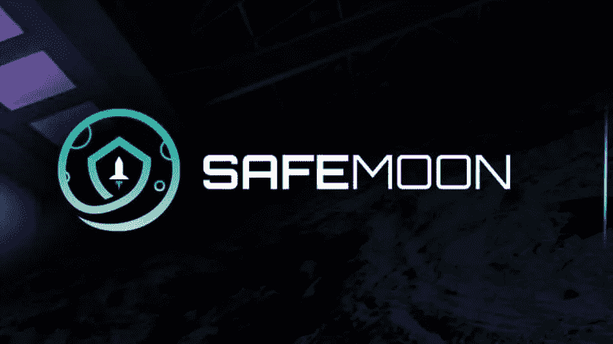
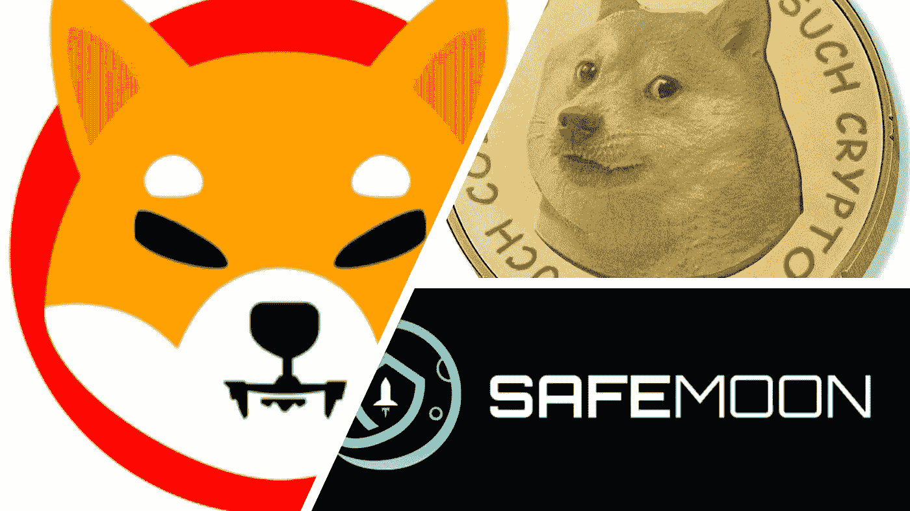
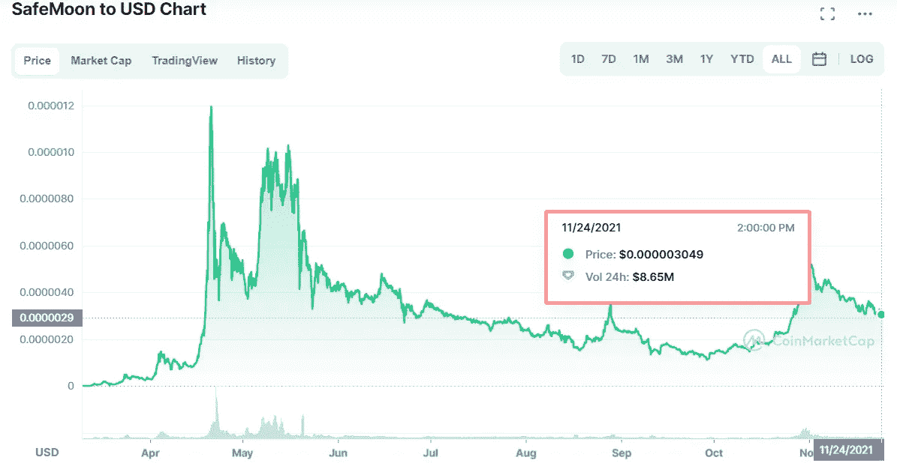

# 关于 SafeMoon 的 5 个常见问题

> 原文：<https://medium.com/coinmonks/5-frequently-asked-questions-about-safemoon-token-499168154339?source=collection_archive---------5----------------------->

# 1.SafeMoon 如何通过少量气体更新数万持有人的余额？

有对智能合约一知半解但不专业的人问，SafeMoon 怎么更新持有人余额少气？

> “为了更新持有人余额，合同应逐个增加他们的余额。那么持有人数超过 100k，燃气费应该在 1BNB 以上。但是现在 SafeMoon 没有问题。这是什么原因？”

我的回答是:

> “没有必要更新所有持有人的余额。智能合同只需要更新一个变量 **_rTotal** 。”

让我们看看安全月合同

每个持有者都有代表反射量的**行**变量。为了得到夹持器的精确平衡，应将**_ 行**除以**电流。**

> **currentRate**=**_ r total**/**_ t total**；—不完全一样。为解释而总结

当交易发生时，他们从总数**_ r 中减去 **_rFee** 。
如果 **_rTotal** 下降， **currentRate** 也下降。另一方面， **_rOwned** 增加，因此持有人的代币余额与其持有量成比例增加。**

以上是对 SafeMoon 工作原理的总结。

# 2.我可以用 SafeMoon 做什么？

The most famous meme coins

和其他 meme 币一样，SafeMoon 什么都不做。

你应该把你的 SafeMoon 放在你的钱包里，享受观察余额增长的过程。

对安全卫星的使用有未来的计划。Safemoon 团队已在其网站上并通过定期视频直播介绍了未来计划。但这些想法无处不在，有些似乎只是为了宣传 Safemoon。以下是这些计划的一些例子:

*   发布 Safemoon 应用、钱包和视频游戏
*   创建安全月交易所
*   将 Safemoon 融入非洲市场
*   通过“凤凰计划”(故意拼错)，将安全月变成“无银行账户者的自由燃料”

# 3.安全月在比特币基地吗？

比特币基地不支持 SafeMoon。

比特币基地是美国最大的加密货币交易所，该服务将 SafeMoon 列入其众多资产可能是有道理的。不幸的是，SafeMoon 不能在比特币基地上购买，因为该交易所通常不会列出许多较小的加密货币

但你可以在观察列表中添加 SafeMoon，并通过比特币基地账户阅读新闻等。

# 4.为什么 SafeMoon 价格小？

这是一种象征经济学。他们用非常低的安全月价格吸引人们。任何人都可以用价值 100 美元的零花钱购买 3125 万英镑的 SafeMoon。

# 5.SafeMoon 安全吗？

如你所知，SafeMoon 非常不稳定。自从推出以来，Safemoon 的价格一直非常不稳定，上涨了 20，000%以上，最近下跌了 80%以上。因为加密货币没有潜在价值，所以你的回报取决于你可以把它卖给别人的价格。

SafeMoon 价格目前比 10 月 29 日创下的历史高点下跌了 57%以上。有人说今年 SafeMoon 的价格会低于 0.0000015 美元，有人说会超过 0.00000500 美元。

总之，SafeMoon 拥有 2，909，920 名 telegram 的持有人和 150，988 名社区成员。

> “我想说持有人越多越安全。”
> 
> “得益于自动 LP 收购，SafeMoon 比其他产品更安全。这意味着每笔交易有 5 %的费用进入流动性池”

这篇文章是我对 SafeMoon 的看法，而不是投资建议。

> 加入 Coinmonks [电报频道](https://t.me/coincodecap)和 [Youtube 频道](https://www.youtube.com/c/coinmonks/videos)了解加密交易和投资

## 另外，阅读

*   [币安期货交易](https://blog.coincodecap.com/binance-futures-trading)|[3 commas vs Mudrex vs eToro](https://blog.coincodecap.com/mudrex-3commas-etoro)
*   [在印度利用加密套利赚取被动收入](https://blog.coincodecap.com/crypto-arbitrage-in-india)
*   [德国最佳加密交易所](https://blog.coincodecap.com/crypto-exchanges-in-germany) | [WazirX P2P](https://blog.coincodecap.com/wazirx-p2p)
*   [如何购买 Monero](https://blog.coincodecap.com/buy-monero) | [IDEX 评论](https://blog.coincodecap.com/idex-review) | [BitKan 交易机器人](https://blog.coincodecap.com/bitkan-trading-bot)
*   如何在 Bitbns 上购买柴犬(SHIB)币？ | [印度的币安](https://blog.coincodecap.com/binance-in-india)
*   [币安 vs Bitstamp](https://blog.coincodecap.com/binance-vs-bitstamp) | [Bitpanda vs 比特币基地 vs Coinsbit](https://blog.coincodecap.com/bitpanda-coinbase-coinsbit)
*   [如何购买瑞波(XRP)](https://blog.coincodecap.com/buy-ripple-india) | [非洲最好的加密交易所](https://blog.coincodecap.com/crypto-exchange-africa)
*   [非洲最佳加密交易所](https://blog.coincodecap.com/crypto-exchange-africa) | [Hoo 交易所评论](https://blog.coincodecap.com/hoo-exchange-review)
*   [eToro vs robin hood](https://blog.coincodecap.com/etoro-robinhood)|[MoonXBT vs by bit vs Bityard](https://blog.coincodecap.com/bybit-bityard-moonxbt)
*   [Stormgain 回顾](https://blog.coincodecap.com/stormgain-review) | [Bexplus 回顾](https://blog.coincodecap.com/bexplus-review) | [币安 vs Bittrex](https://blog.coincodecap.com/binance-vs-bittrex)
*   [Bookmap 评论](https://blog.coincodecap.com/bookmap-review-2021-best-trading-software) | [美国 5 大最佳加密交易所](https://blog.coincodecap.com/crypto-exchange-usa)
*   [如何在 FTX 交易所交易期货](https://blog.coincodecap.com/ftx-futures-trading) | [OKEx vs 币安](https://blog.coincodecap.com/okex-vs-binance)
*   [如何在势不可挡的域名上购买域名？](https://blog.coincodecap.com/buy-domain-on-unstoppable-domains)
*   [印度的加密税](https://blog.coincodecap.com/crypto-tax-india) | [altFINS 审核](https://blog.coincodecap.com/altfins-review) | [Prokey 审核](/coinmonks/prokey-review-26611173c13c)