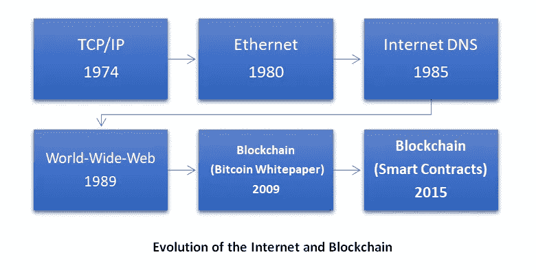
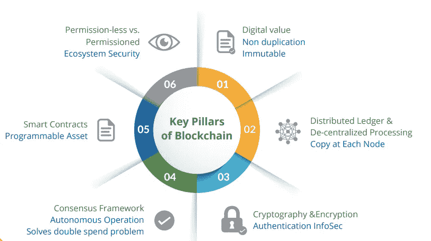
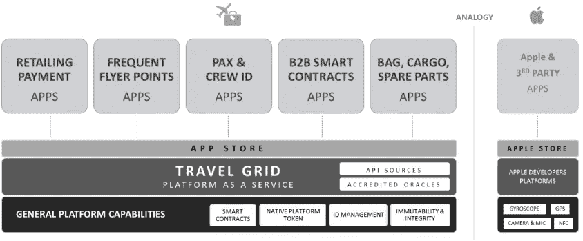

# 到 2025 年，将改变航空领域区块链的 5 个全球领域

> 原文：<https://medium.com/coinmonks/5-global-domains-that-will-transform-blockchain-in-aviation-by-2025-48f8f332c101?source=collection_archive---------4----------------------->

在中本聪发布比特币区块链白皮书十年后，我开始了我的区块链科技之旅。在过去的几个月里，我一直在关注从智能合同黑客到最近发布的脸书 Libra 区块链白皮书的发展。我对这个行业十多年来的发展很感兴趣；但即使是现在，大多数人还是专注于这项技术的负面影响。作为人类，毫无疑问，我们倾向于批评一个新的想法，而不是看它对一个更美好和不信任的世界的积极影响。数字世界从 1974 年到 2019 年的演变:

在本文中，我将阐述区块链的重要性以及加密货币如何与航空业相关联。在任何区块链生态系统中，加密货币都是一种从甲方到乙方的金融交易/支付手段。区块链的六大支柱是形成新的安全生态系统的机制。

自从越来越多的开发者、爱好者和传播者引领区块链技术以来，它一直在以比想象中更持久的速度发展。每个区块链社区都在确保建立一个安全和用户友好的生态系统，以实现更好的多功能性。据 IDC 估计，2019 年全球在区块链解决方案上的支出预计约为 29 亿美元，比 2018 年增长 88.7%。预计到 2025 年将达到 210 亿美元，其中航空航天行业在 75%的整体活动中使用区块链技术，即每年在工业结算和支付、数字身份管理、B2B 业务采购转型等领域的价值为 7540 亿美元。

# 航空业区块链技术概述:

[我之前的文章](https://www.linkedin.com/pulse/three-reasons-why-you-should-choose-career-aviation-industry-rama/)强调了航空业的潜在增长和导致 7.6 万亿美元产业的因素。由于新的技术改造将是解决某些缺陷的基本方法，区块链技术将成为降低成本和最大化效率的主要因素之一。区块链适应计划的五个关键领域是:

1.  **行李、货物和备件**:区块链有助于以非常可靠和不可改变的方式跟踪有价值资产的状态和位置，如乘客行李、货物和飞机备件，因为这些资产改变了保管；这提供了一个机会，以提高能见度和透明度，因为这种类型的项目移动整个价值链。这些能力可能会打开新产品开发领域，支持流程的简化，并使供应商能够应对中断。
2.  **旅游价值链**:航空公司和价值链上的其他参与者交易产品&服务，在合同、合同执行、监控履行阶段、对帐、开具发票和结算上花费大量精力和资源。利用智能合同的概念，所有这些工作都可以消除或大大简化。
3.  **常旅客积分**:区块链可以通过将这些资产标记为数字化和无处不在，显著简化常旅客积分的收入、支出、会计和对账。虽然客座率的持续上升是一个好消息，但这使得航空公司更难促进积分兑换机票。除了资产负债表负债问题，盈利、赎回和交换创新时机的过程也是其他挑战。
4.  **乘客和机组人员身份管理**:区块链可以简化乘客的身份管理，增强体验，保护隐私，还可以让航空公司和广泛的价值链在数字环境中开展业务。
5.  **分销和支付**:区块链允许航空公司、旅行社和分销领域的其他人更好地合作，同时共同提供旅游产品和服务。预期的变化可能会扩大分销范围，影响相关方，并提高旅游产品和服务的整合效率。它还可以让支付变得更加透明、实时和低成本。

国际航空运输协会运输部主任 Eric LEOPOLD 最近发布了航空业白皮书《预测 2035 年航空业的未来》。

# 国际航空运输协会对区块链技术的倡议包括:

**由欧元、美元和英镑支持的国际航空运输协会硬币**。

**IATA 数字认证机构**专注于

*   实体的身份管理(例如，旅行社 ID)
*   促进内容的完整性(例如，航空公司报价的完整性)
*   证书验证平台的可用性。

**数字金融**将使用智能合同来降低航空公司的直接运营后台成本并提高后台效率，该计划得到了 IATA 金融发展工作组的支持。

这些好处预计将来自合同的简化、合同的执行、通过单一的事实来源防止纠纷、在履行阶段监测服务交付和引入实时服务验收，以及简化会计、对账、发票和结算流程。

**行程网格:**

# 在航空航天领域集成区块链技术的公司:

**在供应链领域:**
[14bls](https://14bis.aero/) :供应跟踪一种区块链技术，允许飞机部件的供应链以绝对透明的方式进行全面记录。

Sorablocks:一个位于区块链的航空业平台，为所有航空公司和机场的煤油管理带来透明度。

[Skyy network](https://skyy.network/) :一个总部位于区块链的解决方案，将无人机的航空管理整合到一个分散且明确监管的系统中，实现无人机基于规则的自动化操作。

**在旅行者体验领域:**
[Sweetbridge](https://www.sweetbridge.com/) :一个基于区块链的虚拟市场，为多供应商忠诚度计划提供可扩展的解决方案。

[SkyBuys](https://www.skybuys.net/welcome) :总部位于区块链的全球机场零售奖励平台。

Avinoc :一个免费、透明的数据库，用于协调私人商务航班，无需第三方中介。

**改善航空公司的具体运营和相关流程:**
[Vchain](https://www.vchain.tech/) :区块链 SaaS 公司的数字身份管理专利解决方案。

BagX:由瑞士港口团队开发的中立的区块链行李处理平台。这将使该过程在所有相关利益方之间完全可记录和透明。

500labs:一个分散的数据网络，用于全球航空业，以减轻航班延误的影响。

QuillHash :提供区块链服务的咨询和开发。跟踪和追踪 BAAS(区块链即服务)服务广泛应用于不同的领域。

[缠绕树](https://windingtree.com/#howitworks):旨在扰乱旅游业的分销和库存管理，其范围包括航班和酒店。设想的概念是使用分布式和分散式分类账，创建一个记录旅行预订相关交易的市场。

# 为航空业开发更好的区块链生态系统的一些举措:

1.  通用航空公司为全球 60%的航空业提供喷气发动机，它在微软 Azure 的帮助下建立了一个供应链跟踪和追踪区块链。
2.  新加坡航空公司常旅客计划:常旅客计划利用区块链来简化积分兑换以及其他好处。
3.  波音公司已经申请了一项使用基于区块链的反欺骗 GPS 系统的专利。
4.  法国飞机制造商空中客车公司已经正式加入超级账本项目，这是由 Linux 基金会领导的区块链计划。
5.  法国航空公司、荷兰皇家航空公司和缠绕树公司合作。
6.  汉莎航空/SAP —航空区块链挑战
7.  SITA —航空区块链挑战赛

> 区块链只做一件事:它用数学证明取代了第三方的信任。——亚当·德雷珀

随着 IOT、人工智能、机器学习、AR/VR 和自动化将在未来几天得到简化，我相信区块链技术将在使这些创新对环境友好以实现可持续发展的未来方面发挥重要作用！

## IOT 和区块链在供应链管理中的整合会产生更强大的优化吗？

## 缩写:

**令牌:**加密令牌是一种特殊的虚拟货币令牌，驻留在自己的区块链上，代表一项资产或公用事业。

**区块链:**区块链可以抵抗对数据的修改。它是“一个开放的、分布式的分类账，可以有效地、可验证地、永久地记录双方之间的交易。

**智能合约:**智能合约是自动执行的合约，买卖双方之间的协议条款被直接写入代码行。守则和其中包含的协议存在于一个分散的区块链网络中。

**工作证明(PoW):** 工作证明描述了一个系统，它需要付出相当大但可行的努力，以阻止对计算能力的轻率或恶意使用，如发送垃圾邮件或发起拒绝服务攻击。

**授权利益证明(DPoS):** 授权利益证明(DPoS)是区块链的一种验证和共识机制。作为验证交易和促进区块链组织的一种方式，它与其他工作证明和利益证明模型竞争。

**共识:**这只是一种由不同的个人/实体组成的群体共同做出决策并朝着共同目标前进的方式。

**使用首字母缩略词👇**

国际航空运输协会

SaaS: 软件即服务

**IOT:** 物联网

**AR/VR:** 增强现实/虚拟现实

## 参考:

[https://www . fine xtra . com/blogposting/16452/区块链和航空业——系好起飞的安全带/](https://www.finextra.com/blogposting/16452/blockchain-and-the-aviation-industry-fasten-seatbelts-for-take-off/)

[https://news room . lufthansa group . com/English/news room/news-releases/lufthansa-and-sap-select-the-nine-the-first-aviation-区块链挑战赛/s/b2a 97099-b65b-46 F6-94 a3-1 E6 bacf 5 e 62 f](https://newsroom.lufthansagroup.com/english/newsroom/news-releases/lufthansa-and-sap-select-the-nine-finalists-for-the-world-s-first-aviation-blockchain-challenge/s/b2a97099-b65b-46f6-94a3-1e6bacf5e62f)

[https://www . IATA . org/publications/Documents/区块链航空白皮书. pdf](https://www.iata.org/publications/Documents/blockchain-in-aviation-white-paper.pdf)

[https://www . Sita . aero/resources/blog/let-collaborate-to-explore-区块链-sitas-航空-区块链-沙盒](https://www.sita.aero/resources/blog/lets-collaborate-to-explore-blockchain-sitas-aviation-blockchain-sandbox)

[https://www . air France klm . com/en/air-France-klm-partners-winding-tree-enhance-innovation-travel-industry-using-区块链](https://www.airfranceklm.com/en/air-france-klm-partners-winding-tree-strengthen-innovation-travel-industry-using-blockchain)

[https://www2 . Deloitte . com/insights/us/en/industry/public-sector/IOT-in-smart-airports . html？](https://www2.deloitte.com/insights/us/en/industry/public-sector/iot-in-smart-airports.html?)

[https://www . nafa . aero/articles/区块链航空-所有者-受托者-交易-潜力是什么](https://www.nafa.aero/articles/blockchain-in-aviation-owner-trustee-transactions-what-is-the-potential)

[https://www . LinkedIn . com/pulse/aviation-industry-resilience-research-Simon-brown/](https://www.linkedin.com/pulse/aviation-industry-resilience-research-simon-brown/)

[https://en.wikiquote.org/wiki/Bitcoin](https://en.wikiquote.org/wiki/Bitcoin)

 [## 区块链:释放航空业的潜力

### 航空业高度依赖中介网络来满足其大部分关键需求。多重…

www.niit-tech.com](https://www.niit-tech.com/resource-library/white-papers/blockchain-unlocking-potential-airline-industry) 

> [直接在您的收件箱中获得最佳软件交易](https://coincodecap.com/?utm_source=coinmonks)

