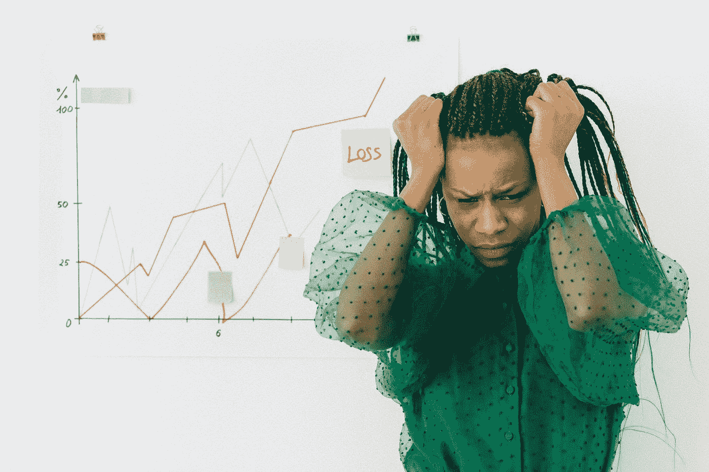

# 我从 9 月 7 日比特币崩盘中学到的 5 个教训

> 原文：<https://medium.com/coinmonks/5-lessons-i-learnt-from-september-7s-bitcoin-crash-73ce4487a434?source=collection_archive---------5----------------------->

Photo by [Nataliya Vaitkevich](https://www.pexels.com/@n-voitkevich?utm_content=attributionCopyText&utm_medium=referral&utm_source=pexels) from [Pexels](https://www.pexels.com/photo/marketing-businessman-fashion-man-7172857/?utm_content=attributionCopyText&utm_medium=referral&utm_source=pexels)

如果你晚上熬夜，你要么是网飞·宾格，要么是 T2 的秘密交易者。

我恰好是后一种。

*我这么说并不是说我是下一个* [*小川孝(Takashi Kotegawa*](https://www.timothysykes.com/blog/the-day-trader-who-turned-13600-into-153-million/) *)靠吃拉面为生，疯狂进行日内交易。我离那还远着呢。我只是喜欢称自己为加密投资者，喜欢更频繁地交易一些硬币。*