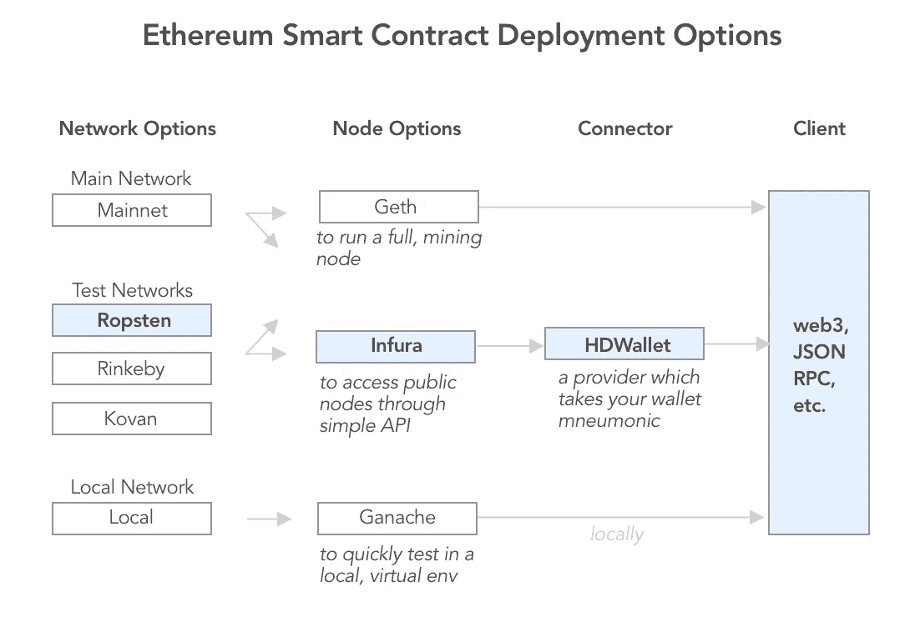

# 使用 Truffle 和 Ropsten 部署智能合约的 5 分钟指南

> 原文：<https://medium.com/coinmonks/5-minute-guide-to-deploying-smart-contracts-with-truffle-and-ropsten-b3e30d5ee1e?source=collection_archive---------0----------------------->

## 推荐使用样板文件快速设置 DApp 开发

对于部署、迁移和访问智能合同，您有各种设置选项。根据您对 EVM(以太坊虚拟机)的控制和可见性级别，您可以选择使用在线 IDE，如 [Remix](http://remix.ethereum.org/) ，或者通过 [Geth](https://geth.ethereum.org/) 运行完整的以太坊挖掘节点。

当然，Truffle 使编译和部署智能合约变得更加容易，同时仍然给你可见性和控制权。

## **1 分钟快捷方式**:叉此[样板模板](https://github.com/nczhu/truffleRopstenBoilerplate)



Here’s a framework depicting both common setups and what we’ll tackle today: **the path in blue**.

> 查看[区块链课程](https://coincodecap.com/blockchain-courses)并学习 Solidity

## 本教程涵盖

1.  为 Ropsten 测试网络配置 Truffle 框架
2.  使用它来部署(或迁移)合同实例
3.  访问已部署的实例并与之交互(通过 Truffle 控制台)

## 确保你已经有了

*   从[元掩码](https://metamask.io/)中保存您的钱包助记符
*   弄点[测试乙醚](https://faucet.metamask.io/)
*   从 [Infura](https://infura.io/) 中获取 [Ropsten API](https://infura.io/docs/gettingStarted/chooseaNetwork) 密钥

## 详细演练

**1。设置** [**松露**](https://truffleframework.com/truffle)

```
npm install -g truffle
```

制作一个空的储存库，`cd`放入其中，然后

```
truffle init
```

安装 HDWalletProvider

```
npm install --save truffle-hdwallet-provider
```

**2。创建您的合同**

在`./contracts`中，使用以下代码创建一个名为`HelloWorld.sol`的新合同:

```
pragma solidity ^0.4.23;contract HelloWorld {
    function sayHello() public pure returns(string){
        return(“hello world”);
    }
}
```

**3。部署您的合同**

在`./migrations`中，使用以下代码创建一个名为`2_deploy_contracts.js`的部署脚本:

```
var HelloWorld = artifacts.require(“HelloWorld”);module.exports = function(deployer) {
    deployer.deploy(HelloWorld, “hello”);
    // Additional contracts can be deployed here
};
```

**4。配置 Ropsten 网络和提供商**

在`truffle.js`中，在 module.exports 中添加以下代码片段:

确保用自己的替换`mnemonic`和`API_KEY`。

> 安全提示:记得把包含你钱包助记符的文件`.gitignore`！

现在，将您的契约部署(或迁移)到 Ropsten，如下所示。默认情况下，Truffle 只部署到本地开发者网络。

```
truffle deploy --network ropsten
```

您应该会看到如下控制台日志:

```
Running migration: 1_initial_migration.js
Deploying Migrations…
… 0xd01dd7...
Migrations: 0xf741...
Saving successful migration to network…
… 0x78ed...
Saving artifacts…
Running migration: 2_deploy_contracts.js
Deploying HelloWorld…
… 0x0aa9...
HelloWorld: [SAVE THIS ADDRESS!!]
Saving successful migration to network…
… 0xee95...
Saving artifacts…
```

> **提示:**确保保存好你的合同地址，以备将来参考。如果丢失，请继续[以太扫描](https://ropsten.etherscan.io/address/0xc9ff10dcc6e830577e4aff457ad9bf858e0cabad)检查您的钱包地址交易。

**5。访问您部署的合同**

设置您的 Truffle 控制台以支持网络:

```
truffle console --network ropsten
```

通过以下方式访问您部署的合同实例:

```
HelloWorld.deployed().then(function(instance){return instance });
```

或者，您可以通过以下方式按其公共地址检索实例:

```
web3.eth.contract(HelloWorld.abi, contractAddress)
```

其中 HelloWorld.abi 是本地编译的 abi，contractAddress 是您公开部署的契约实例。

**6。最后调用契约函数，打个招呼！**

```
HelloWorld.deployed().then(function(instance){return instance.sayHello()});Also, Read
```

> 加入 Coinmonks [电报频道](https://t.me/coincodecap)和 [Youtube 频道](https://www.youtube.com/c/coinmonks/videos)获取每日[加密新闻](http://coincodecap.com/)

## 另外，阅读

*   [密码电报信号](http://Top 4 Telegram Channels for Crypto Traders) | [密码交易机器人](/coinmonks/crypto-trading-bot-c2ffce8acb2a)
*   [复制交易](/coinmonks/top-10-crypto-copy-trading-platforms-for-beginners-d0c37c7d698c) | [加密税务软件](/coinmonks/crypto-tax-software-ed4b4810e338)
*   [网格交易](https://coincodecap.com/grid-trading) | [加密硬件钱包](/coinmonks/the-best-cryptocurrency-hardware-wallets-of-2020-e28b1c124069)
*   [加密交换](/coinmonks/crypto-exchange-dd2f9d6f3769) | [印度的加密应用](/coinmonks/buy-bitcoin-in-india-feb50ddfef94)
*   [面向开发人员的最佳加密 API](/coinmonks/best-crypto-apis-for-developers-5efe3a597a9f)
*   最佳[加密贷款平台](/coinmonks/top-5-crypto-lending-platforms-in-2020-that-you-need-to-know-a1b675cec3fa)
*   [杠杆代币](/coinmonks/leveraged-token-3f5257808b22)终极指南
*   购买 Dogecoin 的 7 种最佳方式 | [ZebPay 评论](https://coincodecap.com/zebpay-review)
*   [最佳期货交易信号](https://coincodecap.com/futures-trading-signals) | [流动性交易回顾](https://coincodecap.com/liquid-exchange-review)
*   【Huobi 的加密交易信号 | [Swapzone 审查](/coinmonks/swapzone-review-crypto-exchange-data-aggregator-e0ad78e55ed7)
*   [最佳加密交易机器人](/coinmonks/crypto-trading-bot-c2ffce8acb2a) | [购买索拉纳](https://coincodecap.com/buy-solana) | [矩阵导出评论](https://coincodecap.com/matrixport-review)
*   [Coldcard 评论](https://coincodecap.com/coldcard-review) | [BOXtradEX 评论](https://coincodecap.com/boxtradex-review)|[uni swap 指南](https://coincodecap.com/uniswap)
*   [比特币基地评论](/coinmonks/coinbase-review-6ef4e0f56064) | [德里比特评论](/coinmonks/deribit-review-options-fees-apis-and-testnet-2ca16c4bbdb2) | [FTX 评论](/coinmonks/ftx-crypto-exchange-review-53664ac1198f)