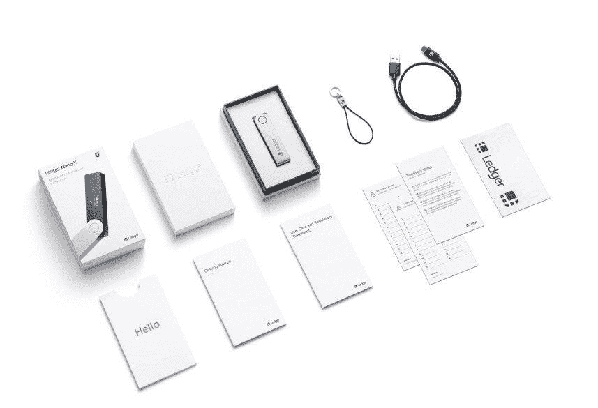

# 为每位加密投资者提供 5 种个人理财产品

> 原文：<https://medium.com/coinmonks/5-personal-finance-products-for-every-crypto-investor-8d861220fb77?source=collection_archive---------0----------------------->

个人理财是管理自己的钱的行为。对你的资金如何投资、资产存放在哪里以及你的钱如何使用有直接的决定权。从事个人理财的人通过计划、设定目标和实现目标来为自己的成功负责。

> 努力控制你的个人财务是一种解放。它提供了一种成就感和成长感，这将改变你对自己财务状况的看法。

在加密货币领域，个人金融正在蓬勃发展。加密货币用户不再信任另一个人或系统来管理他们的钱，而是重新控制他们的财务。使用个人理财工具为自己的成功负责。它已经成为加密市场文化身份的核心。

每个人都想对自己的资产拥有基本的控制权。人们希望选择进入他们投资组合的加密货币，保护他们自己的投资，决定他们的资金应该如何分配，并在没有任意边界或限制的情况下自由移动他们自己的资金。

以下加密个人理财产品将帮助你收回你的钱的控制权。这些服务将使您能够管理自己的全部资产组合，而不是委托第三方公司来管理您的资金。

# [莱杰纳米 X](https://www.ledger.com/)

最重要的是，在密码市场管理你自己的个人财务时，要记住的最重要的事情是安全。如果没有安全基础，我们的资金可能会受到黑客和安全漏洞的攻击。

因此，在我们进一步深入之前，我们必须了解参与这个市场的最佳安全实践。

> **把你的加密资产放在硬件钱包里。**

硬件钱包是对资金长期安全性的投资。花费大量时间、精力和金钱来构建多样化的加密货币投资组合，却因为我们没有安全地存储资产而被窃取，这是毫无意义的。

> 这是莱杰纳米 X 的入口。分类帐系列产品是市场上最完整的。它们为加密用户提供了无缝体验，让他们可以安全地存储资金，随时监控投资组合，并在必要时安全地转移资金。

## 五金器具

Ledger Nano X 是市场上最受欢迎的硬件钱包。2018 年，前身“莱杰 Nano S”销量达到 130 多万台。这个全球成功的故事不是偶然发生的。时尚的设计、多样化的资产选择和强大的安全性都促成了这一巨大成功。

随着 Ledger Nano X 的推出，Ledger Nano S 的所有优点都在这款出色的继任者中得到了放大。对于个人资产管理，我们推荐分类账产品胜过所有其他硬件钱包。

在这里浏览他们的全线产品。

## 软件

Ledger Nano X 的卓越品质并不仅限于硬件。ledger 团队开发了一个完整的投资组合仪表板，与硬件钱包完美契合。

Ledger Live 允许您一目了然地查看您的投资组合，即使您的分类帐没有连接到您的计算机。每笔交易都被仔细跟踪和标记，让您安心。

# [Bittrex](https://bittrex.com/)

> 安全交易。

虽然我们建议将您的资产存储在您的硬件钱包或冷存储解决方案中，但有时您需要进行交易。在这些时候，我们使用在市场上享有盛誉的安全交易所是非常重要的。

毫无疑问， [Bittrex](https://bittrex.com/) 就是那个交易所。由 Bill Shihara 和两个商业伙伴创立，他们都是微软的安全专家，你可以肯定他们的基本原则来源于安全。

Bittrex 为美国客户提供了最多样化的数字资产选择。干净的界面、便捷的交易功能和直观的用户界面，是投资者交易加密货币的最佳场所。

[**在这里报名 Bittrex。**](https://bittrex.com/)

# [虾肉](https://shrimpy.io/referral?r=I6VFZ7d2E)

一旦你有了适合你的交易。是时候自动化你的投资组合了。在一个 24/7 的市场中交易是令人精疲力尽的。通过投资组合管理策略来简化你的生活，这种策略可以在长期内实现自动化，从而为你省去了头痛的事情。

你努力工作，所以得到一个像你一样努力工作的个人加密自动化工具。通过将 [Shrimpy](https://shrimpy.io/referral?r=I6VFZ7d2E) 连接到您的 Bittrex 帐户(或任何其他 exchange 帐户),保持对您资金的完全控制。您还可以将您的分类帐 Nano X 余额输入到 Shrimpy 中，这样就可以从一个应用程序中跟踪所有信息。

> 对于需要在一个地方跟踪、交易和自动化所有资金的忙碌人士来说，这是一个完美的解决方案。

在不到 5 分钟的时间内，您可以构建自己的市场指数策略，或通过自定义分配来自动化您的投资组合。Shrimpy 还支持一个社交程序，交易者可以互相讨论，分享投资组合策略，并遵循其他用户的交易策略。

其他受欢迎的功能包括:

*   跨所有 exchange 帐户的性能监控
*   自定义索引生成器和策略自动化
*   投资组合再平衡和平均成本
*   策略回溯测试和分析

[**注册 Shrimpy，开始自动化您的加密组合。**](https://www.shrimpy.io/)

# [CoinStats](https://coinstats.app/)

你忙忙碌碌，所以这意味着你并不总是有时间检查你的投资组合。通过使用像 [CoinStats](https://coinstats.app/) 这样的投资组合跟踪工具，接收投资组合中资产的通知。

拥有一个好的移动应用程序可以在很多方面补充你的投资组合。通过移动设备获取提醒、最新消息并跟踪您的投资组合。

CoinStats 允许您同步您的钱包和交易所，以自动跟踪您投资组合中的每项资产。CoinStats 支持 100 多家交易所和 5，000 项资产，是市场上最大的移动投资组合跟踪公司之一。

> 说到加密货币的移动配套应用，没有比 CoinStats 更好的服务了。

[**今天试试 CoinStats！**](https://coinstats.app/)

# [CoinTracker](https://www.cointracker.io/)

当该说的都说了，该做的都做了，每年我们都需要报税。为此，我们建议使用 [CoinTracker](https://www.cointracker.io/) 。

CoinTracker 连接到每个主要的交易所和钱包。这使得它成为个人投资组合管理的理想选择，因为在你的交易活动中不会有任何空隙。事实上，您可以将您的分类帐硬件钱包和 Bittrex exchange 帐户连接到 CoinTracker。这样，你就可以自动确定你的纳税义务，而不用痛苦地手工计算一切。

CoinTracker 在加密市场享有极高的声誉，并已被证明在确保您遵守税务规定方面处于领先地位。

使用 CoinTracker 计算您的加密税！

# 结论

在资产管理方面，加密货币市场有着强烈的个人独立文化。对于不知道从哪里开始的新加密用户来说，这可能是压倒性的。

如果没有合适的工具，构建多样化的投资组合可能会很累。这份产品列表将简化流程，节省您的时间，并让您的加密货币体验成为一次爆炸。

我们鼓励您尝试这些产品，并找到将它们整合到您的投资组合管理策略中的方法。

[**Shrimpy**](https://shrimpy.io/referral?r=I6VFZ7d2E) 是一款个人密码投资组合管理应用。连接您的每个 exchange 帐户，开始自动化您的投资组合策略。设置只需 5 分钟，所以 [**今天就来试试吧！**](https://shrimpy.io/referral?r=I6VFZ7d2E)

[**Shrimpy 的通用加密交换 API**](https://developers.shrimpy.io/)是唯一专门为应用开发者设计的加密交换统一 API。收集实时交易或订单数据，管理用户交易所账户，执行交易策略，并简化您连接到每个交易所的方式。

在 [Twitter](https://twitter.com/ShrimpyApp) 和[脸书](https://www.facebook.com/ShrimpyApp)上关注我们的更新，并在[Telegram](https://t.me/ShrimpyGroup)&[Discord](https://discord.gg/gXyy95y)上向我们令人惊叹的活跃社区提问。

> [直接在您的收件箱中获得最佳软件交易](https://coincodecap.com/?utm_source=coinmonks)

