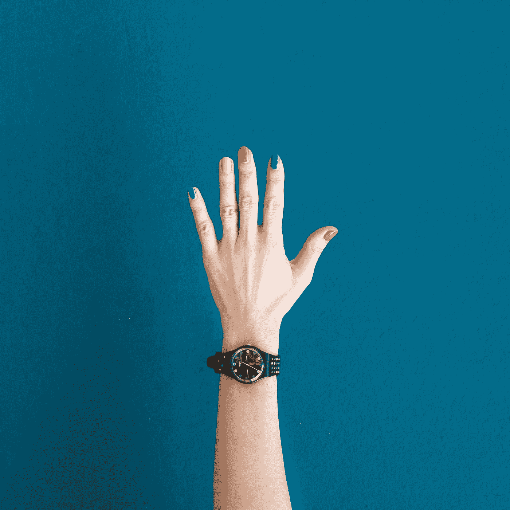

# 投资加密货币前要问自己的 5 个问题

> 原文：<https://medium.com/coinmonks/5-questions-to-ask-yourself-before-investing-in-cryptocurrencies-d79d251d01ef?source=collection_archive---------9----------------------->

*Photo by* [*Andrea Piacquadio*](https://www.pexels.com/@olly?utm_content=attributionCopyText&utm_medium=referral&utm_source=pexels) *from* [*Pexels*](https://www.pexels.com/photo/portrait-photo-of-shocked-woman-in-blue-t-shirt-standing-in-front-of-white-background-3768905/?utm_content=attributionCopyText&utm_medium=referral&utm_source=pexels)

自从比特币重新突破 50，000 美元大关后，人们再次睁大了眼睛。

*Photo by* [*Andrea Piacquadio*](https://www.pexels.com/@olly?utm_content=attributionCopyText&utm_medium=referral&utm_source=pexels) *from* [*Pexels*](https://www.pexels.com/photo/portrait-photo-of-shocked-woman-in-blue-t-shirt-standing-in-front-of-white-background-3768905/?utm_content=attributionCopyText&utm_medium=referral&utm_source=pexels)

所有的新手都带着同样的老问题回来了，“我应该投资加密货币吗？” …