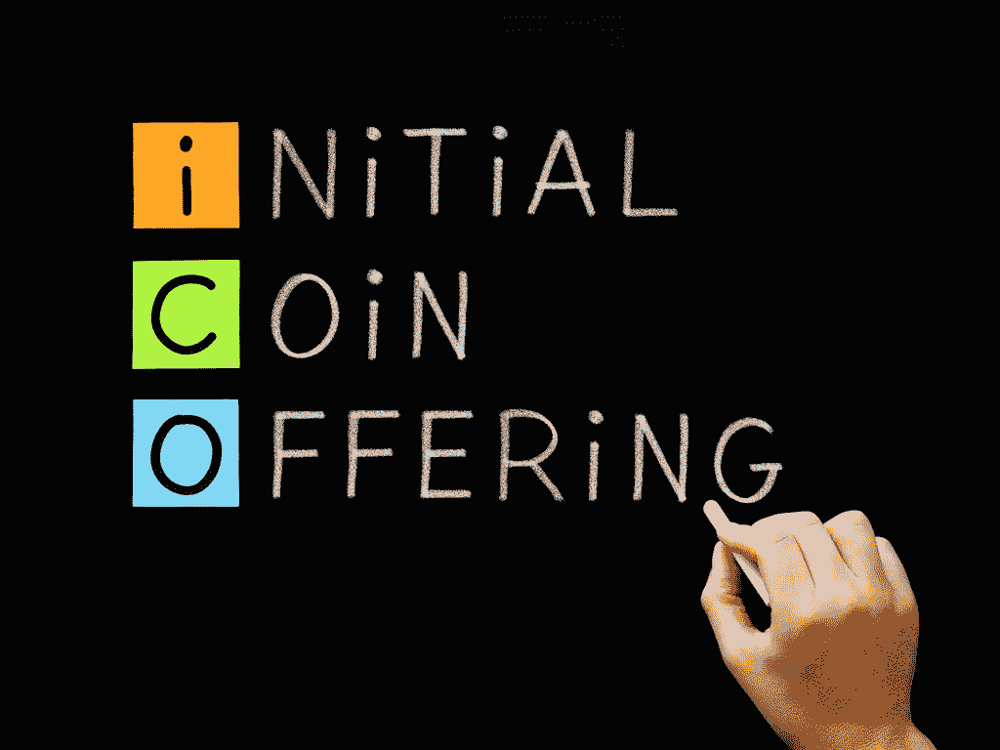

# 一家名副其实的 ICO 咨询机构永远不会告诉你的 5 件事

> 原文：<https://medium.com/coinmonks/5-things-an-honest-to-god-ico-consulting-agency-will-never-tell-you-da5e1fa0df88?source=collection_archive---------18----------------------->

Credits: Shutterstock

ICO 咨询机构已经开始在发达国家和发展中国家出现。这更多的是互联网渗透的成功，而不是区块链的成功。ico 提供了比股票发行更简单、更具成本效益的解决方案。尽管最近政府机构在 ico 中的数量激增，但几乎没有任何对 ico 的监管，以及早期 ico 的过度谨慎，这一事实创造了一个蓬勃发展的区块链专家生态系统。

这些区块链专家来自各行各业，并不仅限于工科毕业生。这些自称的区块链专家/顾问/布道者/影响者之间的唯一联系是以下五点，每个人都会默默地同意，但永远不会公开接受。

**1。他们宁愿在家工作，但租用办公空间只是为了在客户面前显得专业**

Source: Ravi Shankar Rajan

最老的区块链专家诞生于上世纪 80 年代。它们是互联网的商业用例。如果某件事不能通过在触摸屏或键盘上敲几下来完成，对他们来说就是低技术含量的，很可能会过时。不幸的是，在 Skype 等上的会议。仍然不能取代“离线”会议，因此，ICO 顾问将获得一个办公室，不是因为他/她需要它，而是为了与潜在的和现有的客户举行会议。

**2。创建一个客户网站比你公司的网站更容易**

Source: Techinexpert

实际上有一种叫做“专家困境”的东西。问任何一个懂 10 种编程语言的程序员，他/她最喜欢的编程语言是什么。你不会得到一个明确的答案。但是问问那些只懂 Javascript 的人，猜猜他/她最喜欢的编程语言是什么？因此，当客户想要一个网站，他/她有一个明确的愿景，他们想要什么。但是当一个 ICO 咨询机构开始为他们自己的网站编码时，他们就卡住了。

> (给顾问的建议:外包出去。我知道这听起来很荒谬，但这是值得研究的事情)

**3。令牌组学是黑魔法**

Source: Blackmagichealer

接受或拒绝一个提议的象征性组学没有充分的理由。由于客户对象征经济学的了解少于经济学，ICO 咨询机构基本上屈从于客户的意愿，而不是争辩将公司准备金减少 5%，因为没有确凿的证据支持这一论点。

> **4。新技术对他们的打击和对其他人一样大，只是他们恢复得更快。**

**5。不是每个区块链专家都是专家**

Source: Diabetesdaily

像所有其他新兴行业一样，密码领域也充斥着优秀的推销员和演说家，他们可以用胡扯来蒙混过关。

> 知识的标志是沉默地接受自我怀疑。

不幸的是，商务会议和董事会议不是展示弱点的地方。

总而言之，ICO 咨询机构是一个缩影，代表了雄心勃勃的 Y 一代和 z 一代的抱负。他们受到互联网推动的 x 一代的巨大成功故事的鼓舞。

> 不言而喻，下一个盖茨、乔布斯和扎克伯格将来自区块链和分布式账本技术的背景。

*原载于 2018 年 5 月 16 日*[*【steemit.com】*](https://goo.gl/fG96WW?originalUrl=https://medium.com/r/?url=https%3A%2F%2Fsteemit.com%2Fblockchain%2F%40utsavjaiswal%2F5-things-an-honest-to-god-ico-consulting-agency-will-never-tell-you)*。*