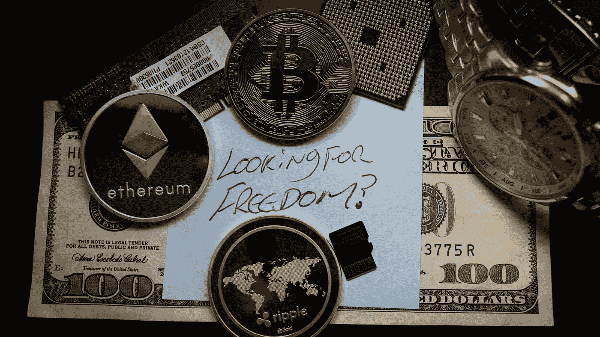

# 投资加密货币前你应该知道的 5 件事

> 原文：<https://medium.com/coinmonks/5-things-you-should-know-before-diving-into-cryptocurrency-3640b1bf3f08?source=collection_archive---------7----------------------->

## 加密货币世界既创新又无情。这 5 个建议将帮助你开始投资数字货币。

# 1.研究研究研究！

Confidence is born from knowledge. Knowledge is born from experience.

在你开始投资任何东西之前，找出并了解每一个看起来不错的投资的来龙去脉是很重要的。对于以太币或莱特币等较大的硬币来说是如此，对于金恩、火花点和霍格等较小的替代硬币和代币来说尤其如此。

当你研究 8，000 多种加密货币中的任何一种时，重要的是不分先后地研究每种货币的以下方面:

价格
市值
社区的相对规模
硬币背后的团队是谁，他们是否有信誉
团队有多少资金
硬币的象征意义以及对你和其他持有人的好处
当前的流通供应量
最大可能的流通供应量
目前有多少人持有硬币
项目的发展路线图
如果鲸鱼(财大气粗的人希望抽水并倾倒)持有很大比例的流通供应量

在投资你的血汗钱之前，做这项研究是很重要的，因为你的目标是审查你感兴趣的项目，并看看它是否足够安全，可以让你的钱在 X 时间内。一枚硬币的发展需要相当长的时间(我的意思是看看 Doge-coin，它花了 7 年时间才达到今天的价格——明智的。)

在一个非常小的市值硬币上全押，没有资金，没有路线图，只有少数持有人，没有经过验证的团队，这意味着你可能会在一个"[地毯拉](https://news.bitcoin.com/another-binance-smart-chain-project-turtledex-rug-pulls-with-tokens-worth-2-5-million-confirmed-stolen/)"骗局中输掉所有的钱。这意味着，如果你不做适当的研究，你可能会处于这样一种情况，硬币的团队从项目中抽走所有集体支持者的钱——给每个人留下一堆毫无价值的硬币。与此同时，硬币的“[开发团队](https://www.theblockcrypto.com/linked/97082/rug-pull-defi-meerkat-31-million)”跑去银行将你的投资收入囊中。

由于加密货币不受监管的性质，这种情况以前发生过，并且可能会继续发生。

请记住，如果你犯了一个错误或错过了一个重要的项目细节，随着最终的隐私和财务自由而来的是整体安全和宽恕的减少。

但是，嘿，这就是为什么我这样写指南！

# 2.通过最大限度地减少错误和知道把它放在哪里来保护你的投资

You wouldn’t leave your front door unlocked, why not keep your crypto dead-bolted as well

所以，你现在已经做了你的研究，并确定了一些硬币有一个良好的团队，资金，增长空间，和一个稳定的社区。很好，但是要知道密码游戏的第二阶段和研究一样重要。

对于加密空间留给用户的潜在财务自由，它也同样不可饶恕。我听到的最大的抱怨之一是有人的在线加密钱包被黑客攻击，允许黑客通过访问他们钱包的私钥和恢复短语来窃取他们所有的加密货币。

这当然是个问题，我绝对讨厌那些偷别人钱的人。受害者面临的问题是，如果你把钱包信息放在电脑(或移动设备)的某个地方，你就增加了被黑客入侵的机会。

对这些人渣来说，通过欺诈性的电子邮件或其他同样邪恶的手段让键盘记录器进入你的电脑并不太难。所以，最好的办法是把你钱包的密码、钥匙或恢复短语写在一张纸上，安全地藏在家里。

这也不是你唯一要小心的事情。

从一个钱包向另一个钱包汇款，或者从像币安这样的交易所向你的钱包汇款是相当容易的。您需要小心的是将您的货币发送到:

**A.**

和

**B.** *向与所述硬币不兼容的钱包发送或接收特定硬币*

在这两种情况下，您的密码将完全丢失。大多数时候，也不会有人联系(事后)来帮你追回资金。正是加密货币的本质——去中心化——让数字货币成为一种完全功能化的货币(以及更多)，而不需要银行(或银行系统)作为中间人。

不用说，要非常小心——对你收发的钱包也要再三检查。不要将密码保存在浏览器中，并将恢复短语离线保存在安全的位置。做到这一切，你将减少很多风险。

至于存放密码的地方，我个人会将部分、大部分或全部密码存放在一个集中的密码交易所，如比特币基地或 Binance.US。它们的安全性并不完全 100%可靠(这种情况并不多)，但这是更安全的选择。

如果你不得不把你的货币放在网上钱包(比如 Metamask)或手机钱包(比如金恩)里，那么就实践我一直宣扬的东西，享受这些收益吧！

# 3.平均成本——增加投资组合的关键

grow your investment exponentially over time as you buy dips!

你们中的大多数人可能会发现简单地购买你的密码并长期持有它是最好的做法——大多数时候是这样的！

对于门外汉来说，持有(或者密码领域的大多数人这样称呼它)就是把你的密码放在钱包或交易所里，几个月甚至几年都不碰它。希望当你再次检查它时，它已经增加了 10 倍甚至 100 倍！

这也是我经常做的事情。然而，如果你找到了一个你相信的项目，但它继续从你的购买点越来越低，你怎么能从中获得任何好处呢？

答案当然是多买！这叫做“[买蘸](https://www.investopedia.com/terms/b/buy-the-dips.asp)”当你选择的项目价格下跌时，你可以投入更多的钱。这样做的结果是降低了你购买该项目的总平均价格。如果你的硬币持续下跌，你持续买入，那么当硬币回到你最初买入的位置时，你可能会有可观的利润。和以前一样，如果不逢低买入，你会盈亏平衡。

我喜欢做的另一个策略是投资 4 到 5 个不同的项目。从那里开始，你要关注最有潜力和成功血统的项目。如果硬币开始下跌，一旦它再次上涨，你可以从你的其他投资中转移资金来提高你的主要硬币的潜在收益。

如果你的其他几项投资中有任何一项已经为你赚到了利润，那么上述方法尤其有效！

# 4.保持理性，不要在交易时屈服于 FOMO 或 FUD

It’s incredibly hard to know what the market will do. Keep your faith!

当我说 [FOMO](https://www.verywellmind.com/how-to-cope-with-fomo-4174664) 时，我的意思是“害怕错过”，当我说 [FUD](https://www.webopedia.com/definitions/fud/) 时，我的意思是“恐惧、不确定、怀疑”这两种反应在整个加密社区中普遍存在，而且理由似乎很充分。假设你在一枚硬币上投资了 35，000 美元，结果它下跌了 50%,看不到升值的迹象。在这种情况下，感到恐惧、不确定和怀疑是完全合理的。

记住这一点，你能做的最糟糕的事情就是跳上 Twitter 这样的社交网络，说出你的恐惧和疑虑。这个行动可以很容易地在那些和你持有相同硬币的人，甚至整个硬币的群体中创造一个负面的反馈循环。

重要的是要记住，当正面或负面消息占据了社区的集体意识时，加密硬币的价格随时都可能波动。如果负面消息占据上风，你的投资组合大幅跳水，尽最大努力保持希望，在一些积极消息和发展的帮助下，它会反弹。

就我个人而言，我宁愿处理暂时的怀疑和恐惧，并搁置我的投资，直到它完全爆掉——摧毁以前的历史高点。相比于屈服于恐惧，撤回投资，承受损失，然后看着我以后可能获得的潜在收益。

记住，卖了才亏钱！

# 5.有一个退出计划

Know when to get out and take profits!

所以你已经做了调查，选择了一个很好的项目，你的钱包没有犯任何错误，在下跌时没有屈服于恐惧，而是买了更多。

你现在是加密领域的冠军，但是还有最后一步要完成。

最后一个挑战是既要知道如何又要知道何时卖出你的货币，并最终获得一些利润。你必须知道的一件大事是，出售任何数量的密码都是要纳税的。你的利润被征税，就像你正常产生收入一样。

减轻这种情况的一个方法是，如果你持有你的密码至少一年，并且不出售任何密码。如果你这样做，然后出售，你将被降低税率！

不管出于什么原因，如果你不得不在持有一整年前卖出，你至少可以拿出你的初始投资利润。目标是在接下来的五年(甚至十年)里仍有可增长的投资。

也很难把钱取出来。只是因为阅读图表需要大量的时间和经验，才能知道市场何时见顶，或者已经见顶。理想情况下，你想在市场最高时套现，但如果你没有触及市场的绝对顶部(没有很多人这样做)，也不要觉得不好。如果你真的要回购，确保在市场见顶后的一段时间内大幅下跌时回购！

现在你知道了！我希望你喜欢阅读我的进入加密空间前你需要知道的 5 件事，并发现它很有帮助。今天就成为粉丝，千万不要错过你的新加密货币文章！

每周都有新文章。

我接受以太坊形式的写作技巧。然而，阅读我的作品不需要任何提示。只有当你觉得自己很慷慨并且负担得起的时候。

非常感谢，敬请期待更多。

以太坊小费钱包地址:0x 6522 da 07 f 7d 7 Fe 2d 24 a2 f 4513 Fe 96569 f 836479 c

> 加入 Coinmonks [Telegram group](https://t.me/joinchat/EPmjKpNYwRMsBI4p) 并了解加密交易和投资

## 另外，阅读

*   [什么是融资融券交易](https://blog.coincodecap.com/margin-trading)
*   最好的[密码交易机器人](/coinmonks/crypto-trading-bot-c2ffce8acb2a) | [网格交易](https://blog.coincodecap.com/grid-trading)
*   [3 商业评论](/coinmonks/3commas-review-an-excellent-crypto-trading-bot-2020-1313a58bec92) | [Pionex 评论](/coinmonks/pionex-review-exchange-with-crypto-trading-bot-1e459d0191ea) | [Coinrule 评论](/coinmonks/coinrule-review-2021-a-beginner-friendly-crypto-trading-bot-daf0504848ba)
*   [AAX 交易所评论](/coinmonks/aax-exchange-review-2021-67c5ea09330c) | [德里比特评论](/coinmonks/deribit-review-options-fees-apis-and-testnet-2ca16c4bbdb2) | [FTX 交易所评论](/coinmonks/ftx-crypto-exchange-review-53664ac1198f)
*   [n 平均零点评审](/coinmonks/ngrave-zero-review-c465cf8307fc) | [Phemex 评审](/coinmonks/phemex-review-4cfba0b49e28) | [PrimeXBT 评审](/coinmonks/primexbt-review-88e0815be858)
*   [by bit Exchange Review](/coinmonks/bybit-exchange-review-dbd570019b71)|[bit yard Review](/coinmonks/bityard-review-7d104239be35)|[coin spot Review](https://blog.coincodecap.com/coinspot-review)
*   [3 commas vs crypto hopper](/coinmonks/3commas-vs-pionex-vs-cryptohopper-best-crypto-bot-6a98d2baa203)|[赚取秘密利息](/coinmonks/earn-crypto-interest-b10b810fdda3)
*   最好的比特币[硬件钱包](/coinmonks/the-best-cryptocurrency-hardware-wallets-of-2020-e28b1c124069?source=friends_link&sk=324dd9ff8556ab578d71e7ad7658ad7c) | [BitBox02 回顾](/coinmonks/bitbox02-review-your-swiss-bitcoin-hardware-wallet-c36c88fff29)
*   [莱杰 vs n rave](/coinmonks/ledger-vs-ngrave-zero-7e40f0c1d694)|[莱杰 nano s vs x](/coinmonks/ledger-nano-s-vs-x-battery-hardware-price-storage-59a6663fe3b0)
*   [密码本交易平台](/coinmonks/top-10-crypto-copy-trading-platforms-for-beginners-d0c37c7d698c)
*   [CoinLoan 评论](/coinmonks/coinloan-review-18128b9badc4) | [YouHodler 评论](/coinmonks/youhodler-4-easy-ways-to-make-money-98969b9689f2) | [BlockFi 评论](/coinmonks/blockfi-review-53096053c097)
*   最好的[加密税务软件](/coinmonks/best-crypto-tax-tool-for-my-money-72d4b430816b) | [硬币追踪评论](/coinmonks/cointracking-review-a-reliable-cryptocurrency-tax-software-5114e3eb5737)
*   最佳[加密借贷平台](/coinmonks/top-5-crypto-lending-platforms-in-2020-that-you-need-to-know-a1b675cec3fa) | [杠杆令牌](/coinmonks/leveraged-token-3f5257808b22)
*   [BlockFi vs 摄氏](/coinmonks/blockfi-vs-celsius-vs-hodlnaut-8a1cc8c26630) | [Hodlnaut 回顾](/coinmonks/hodlnaut-review-best-way-to-hodl-is-to-earn-interest-on-your-bitcoin-6658a8c19edf)
*   [Bitsgap 审查](/coinmonks/bitsgap-review-a-crypto-trading-bot-that-makes-easy-money-a5d88a336df2) | [Quadency 审查](/coinmonks/quadency-review-a-crypto-trading-automation-platform-3068eaa374e1) | [Bitbns 审查](/coinmonks/bitbns-review-38256a07e161)
*   [埃利帕尔泰坦评论](/coinmonks/ellipal-titan-review-85e9071dd029) | [赛克斯斯通评论](/coinmonks/secux-stone-hardware-wallet-review-15-discount-coupon-2020-7577032faa6e)
*   [本地比特币评论](/coinmonks/localbitcoins-review-6cc001c6ed56) | [加密货币储蓄账户](https://blog.coincodecap.com/cryptocurrency-savings-accounts)
*   最佳[区块链分析](https://bitquery.io/blog/best-blockchain-analysis-tools-and-software)工具| [赚比特币](/coinmonks/earn-bitcoin-6e8bd3c592d9)
*   [加密套利](/coinmonks/crypto-arbitrage-guide-how-to-make-money-as-a-beginner-62bfe5c868f6)指南| [如何做空比特币](/coinmonks/how-to-short-bitcoin-568a2d0b4ae5)
*   最佳[加密制图工具](/coinmonks/what-are-the-best-charting-platforms-for-cryptocurrency-trading-85aade584d80) | [最佳加密交易所](/coinmonks/crypto-exchange-dd2f9d6f3769)
*   [如何在印度购买比特币？](/coinmonks/buy-bitcoin-in-india-feb50ddfef94) | [瓦济克斯审查](/coinmonks/wazirx-review-5c811b074f5b)
*   [印度比特币交易所](/coinmonks/bitcoin-exchange-in-india-7f1fe79715c9) | [比特币储蓄账户](/coinmonks/bitcoin-savings-account-e65b13f92451)
*   [CoinDCX 评论](/coinmonks/coindcx-review-8444db3621a2) | [加密保证金交易交易所](https://blog.coincodecap.com/crypto-margin-trading-exchanges)

> [在您的收件箱中直接获得最佳软件交易](/coinmonks/newsletters/coinmonks)

