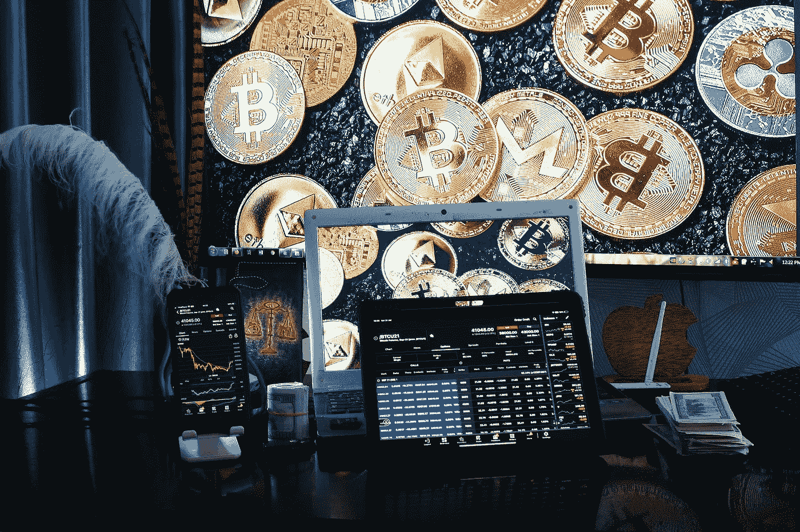

# 在秘密投资计划中发现欺诈的 5 种方法

> 原文：<https://medium.com/coinmonks/5-ways-to-spot-fraud-in-a-crypto-investing-s-49f6a5ba8aed?source=collection_archive---------10----------------------->

Investment in cryptocurrencies is an individual choice.

吸引新成员最常用的方法是在流行的社交网络上发布信息，并随机标记其他用户。报纸上出现的新闻通常是关于贝佐斯、马斯克或扎克伯格等大亨的，他们声称通过投资一枚硬币在短时间内获得了巨额收益。

应不惜一切代价避免使用经过验证的帐户。Twitter 经历了一次历史性的黑客攻击事件，去年几个最著名的 Twitter 账户被侵入。许多知名人士同时发表了评论，包括埃隆·马斯克、比尔·盖茨、杰夫·贝索斯和金·卡戴珊。

“我们已经与 CryptoForHealth 合作，我们正在向社区返还 5000 BTC”被重复了两次，链接到一个网站和声明“每个人都要求我返还，现在是时候了”。你汇 1000 美元，我汇 2000 美元”还有第二个环节。为了鼓励人们捐赠比特币，一些通信包括一个数字钱包的链接，捐款将翻倍并用于慈善目的。

> 订阅 [**Coinmonks Youtube 频道**](https://www.youtube.com/c/coinmonks/videos) 获取每日加密新闻。

根据公开的区块链数据，推文中的链接吸引了数百笔捐款，总额超过 606，503.63 美元(€ 519，311.28)。

有一个安全漏洞影响了许多知名的 Twitter 账户，我们已经意识到了。

据英国广播公司报道，这些账户“似乎是为了实施比特币欺诈而被黑客攻击的。”联邦调查局在一份声明中也这么说了。

也就是说，不要因为在一个验证过的账户里看到了奇迹般的投资机会，就盲目投资。毕竟，正如谚语所说，“没有人会给四个比塞塔太多钱。”

需要注意许多警告信号。因此，以下是如何辨别一个骗局是否是其中之一:

*   短时间内的巨大收益。
*   低成本的初始投资产生高利润率。
*   优惠或佣金可能会促使他们把这件事告诉他们的朋友和家人。
*   他们宣传自己是一家声誉良好的公司，向客户保证他们不是骗子。
*   他们在宣传中利用名人的照片。
*   如果你在看到这些警告信号后仍不确定，请咨询你的银行或理财顾问。

## **1。超出预期的结果**

第一个危险信号是利用诱人的回报来吸引个人投资。随着加密或比特币的狂热，欺骗不熟悉该行业的人的新方法也随之发展。

有些人可能试图说服你，他们的计划不是一个骗局，你会得到非常有吸引力的回报，如 200%的回报。

## **2。他们有古怪的个性**

这些角色有着古怪的个人资料，从他们展示昂贵的汽车和名牌服装，冒充投资经理，甚至发布他们收入的视频就可以看出这一点。他们的目标是创造一个他们的成就蒙太奇，并显示炫耀，以说服他们的观众。

## **3。他们创造诱人的促销活动**

人们很容易被“现在投资，因为价格以后会上涨”或“现在是购买的好时机，因为它正在打折”这样的说法所左右。

如果有人提出一个未知的项目，他可能没有支持令牌的法律文件，他不能证明他们将在哪个或哪些加密交易所上市，或者没有团队推动他们，这是非常值得怀疑的。

## **4。屏蔽看似合法的网站**

另一件要记住的事情是，为了显得合法和有信誉，他们会利用专业网站。然而，因为现在任何人都可以创建网站，所以安全性没有保证。进入网站并确保一切“正常”不会阻止你成为身份盗窃的受害者。

## **5。庞氏骗局**

加密货币欺诈的一个有趣方面是，为了欺诈，骗子利用推荐系统，鼓励已经在里面的人吸引更多的人。其他人使用会员制，在这种情况下，个人首先支付投资费用，然后获得收益。

# 投资加密货币安全吗？

投资加密货币是个人的选择，但重要的是要了解这些投资是如何操作的，而不是将钱提供给中间人，他们可能会带着钱消失或保留大部分投资优势。甚至比特币本身也对某些当代加密货币保持警惕，比如圆周率币，这种货币可以通过圆周率网络应用程序获得。

大多数挖掘都是通过移动设备上的应用程序完成的，这已经让许多熟悉虚拟货币挖掘消耗多少能源的“加密”用户感到好奇。它的计划也是一个分层的金字塔，创作者通过出售程序内的广告来赚钱，老用户比新用户拥有更多特权。也可以通过其他用户的邀请来访问它。

各地的一些加密用户呼吁谨慎，并希望在投资或使用 PI Network 等平台之前，先看看这种新货币如何发展，因为有 AfriCryp 这样的例子。这种虚拟货币的另一个问题是终端特权。

当南非的这家加密货币交易所在没有通知的情况下突然关闭并冻结其所有客户的账户时，其两名所有者窃取了 69，000 个比特币。

> 加入 Coinmonks [电报频道](https://t.me/coincodecap)和 [Youtube 频道](https://www.youtube.com/c/coinmonks/videos)了解加密交易和投资

## 另外，阅读

*   [尤霍德勒 vs 科恩洛安 vs 霍德诺特](/coinmonks/youhodler-vs-coinloan-vs-hodlnaut-b1050acde55a) | [Cryptohopper vs 哈斯博特](https://blog.coincodecap.com/cryptohopper-vs-haasbot)
*   [如何匿名购买比特币](https://blog.coincodecap.com/buy-bitcoin-anonymously) | [比特币现金钱包](https://blog.coincodecap.com/bitcoin-cash-wallets)
*   [币安 vs FTX](https://blog.coincodecap.com/binance-vs-ftx) | [最佳(SOL)索拉纳钱包](https://blog.coincodecap.com/solana-wallets)
*   [如何在 Uniswap 上交换加密？](https://blog.coincodecap.com/swap-crypto-on-uniswap) | [喜美元评论](https://blog.coincodecap.com/hi-dollar-review)
*   [有哪些交易信号？](https://blog.coincodecap.com/trading-signal) | [Bitstamp vs 比特币基地](https://blog.coincodecap.com/bitstamp-coinbase) | [买索拉纳](https://blog.coincodecap.com/buy-solana)
*   [ProfitFarmers 回顾](https://blog.coincodecap.com/profitfarmers-review) | [如何使用 Cornix Trading Bot](https://blog.coincodecap.com/cornix-trading-bot)
*   [MXC 交易所评论](/coinmonks/mxc-exchange-review-3af0ec1cba8c) | [Pionex vs 币安](https://blog.coincodecap.com/pionex-vs-binance) | [Pionex 套利机器人](https://blog.coincodecap.com/pionex-arbitrage-bot)
*   [我的加密副本交易经历](/coinmonks/my-experience-with-crypto-copy-trading-d6feb2ce3ac5) | [比特币基地评论](/coinmonks/coinbase-review-6ef4e0f56064)
*   [CoinFLEX 评论](https://blog.coincodecap.com/coinflex-review) | [AEX 交易所评论](https://blog.coincodecap.com/aex-exchange-review) | [UPbit 评论](https://blog.coincodecap.com/upbit-review)
*   [AscendEx 保证金交易](https://blog.coincodecap.com/ascendex-margin-trading) | [Bitfinex 赌注](https://blog.coincodecap.com/bitfinex-staking) | [bitFlyer 评论](https://blog.coincodecap.com/bitflyer-review)
*   [麻雀交换评论](https://blog.coincodecap.com/sparrow-exchange-review) | [纳什交换评论](https://blog.coincodecap.com/nash-exchange-review)
*   [支持卡审核](https://blog.coincodecap.com/uphold-card-review) | [信任钱包 vs 元掩码](https://blog.coincodecap.com/trust-wallet-vs-metamask)
*   [Exness 点评](https://blog.coincodecap.com/exness-review)|[moon xbt Vs bit get Vs Bingbon](https://blog.coincodecap.com/bingbon-vs-bitget-vs-moonxbt)
*   [如何开始通过加密贷款赚取被动收入](https://blog.coincodecap.com/passive-income-crypto-lending)
*   [加密货币储蓄账户](/coinmonks/cryptocurrency-savings-accounts-be3bc0feffbf) | [加密交易机器人](https://blog.coincodecap.com/best-crypto-trading-bots)
*   [BigONE 交易所评论](/coinmonks/bigone-exchange-review-64705d85a1d4) | [CEX。IO 审查](https://blog.coincodecap.com/cex-io-review) | [交换区审查](/coinmonks/swapzone-review-crypto-exchange-data-aggregator-e0ad78e55ed7)
*   [最佳比特币保证金交易](/coinmonks/bitcoin-margin-trading-exchange-bcbfcbf7b8e3) | [比特币保证金交易](https://blog.coincodecap.com/bityard-margin-trading)
*   [加密保证金交易交易所](/coinmonks/crypto-margin-trading-exchanges-428b1f7ad108) | [赚取比特币](/coinmonks/earn-bitcoin-6e8bd3c592d9)
*   [WazirX vs coin dcx vs bit bns](/coinmonks/wazirx-vs-coindcx-vs-bitbns-149f4f19a2f1)|[block fi vs coin loan vs Nexo](/coinmonks/blockfi-vs-coinloan-vs-nexo-cb624635230d)