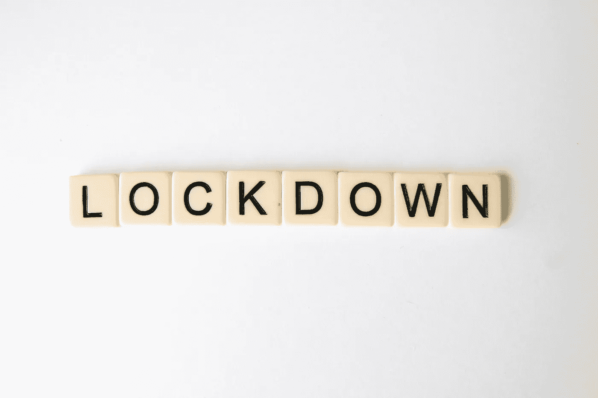

# 新冠肺炎封锁期间学到的 50 条投资经验

> 原文：<https://medium.com/coinmonks/50-investment-lessons-learned-during-the-covid-19-lockdown-34fd1470fefe?source=collection_archive---------1----------------------->

## 投资者可以在下一次提款时从中受益

Photo by [Glen Carrie](https://unsplash.com/@glencarrie?utm_source=unsplash&utm_medium=referral&utm_content=creditCopyText) on [Unsplash](https://unsplash.com/s/photos/lockdown-stocks?utm_source=unsplash&utm_medium=referral&utm_content=creditCopyText)

**1。了解职业投资者面临的职业风险可以帮助个人投资者:**职业投资者通常会因为流动性问题、止损或超出投资组合的风险预算而被迫卖出。在市场不确定期间，职业生涯…