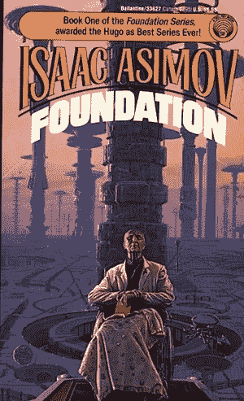
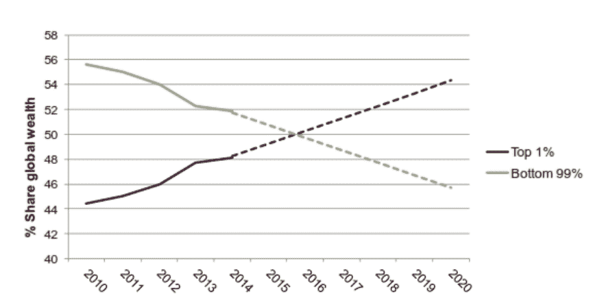
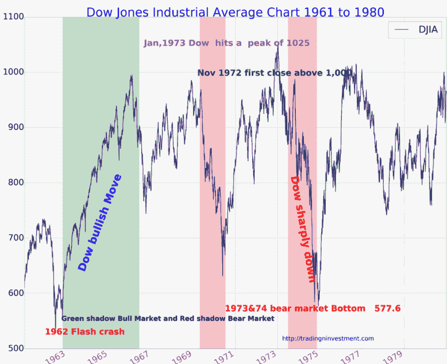
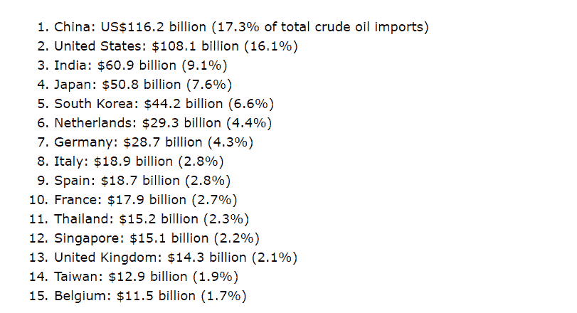

# 菲亚特遭遇 51%的攻击

> 原文：<https://medium.com/coinmonks/51-attack-on-fiat-2524279afd82?source=collection_archive---------4----------------------->

这篇文章的产生要感谢大思想家和推动者的努力，也要感谢占世界人口 99%的人的努力，他们拥有我们所知道的地球上 50%的财富。

艾萨克·阿西莫夫基金会——特别是心理史学

《脱壳:金钱的起源》,作者尼克·萨伯

《金钱、区块链和社会可伸缩性》

共识算法、区块链技术和比特币

我将从总结上面的每个内容开始，以便读者更容易理解。

阿西莫夫被认为是科幻小说的先驱。早在 1942 年，他就开始在报纸上发表他的基础系列的部分内容。在他的基础系列中，他提出了一个被称为心理史学的概念。简而言之，心理史学是借助心理学理论对历史事件的解释。在基础系列中，我们体验了一位名叫哈里·谢顿的数学教授如何试图开发一种基于历史事件和心理反应的算法，这种算法的目标是对未来做出有根据的预测。哈里·谢顿走遍银河系，尽可能多地收集历史数据。

Nick Szabo 在 2002 年发表了一篇文章。这篇文章讲的是货币的历史。它从物物交换，物物交换的成本开始，接着讲述我们如何学会对事物估价，以及我们如何通过使用被称为硬币的普通贸易媒介来摆脱对事物估价的极端成本。在这篇文章中，尼克·萨伯连续解释了法定货币的弱点以及如何进一步改善法定货币。他的解释为比特币奠定了基础，这是一种真正的 p2p 数字现金系统。

关于金钱、区块链和社会可扩展性，尼克·萨伯主要谈到了邓巴数。邓巴数理论认为，150 是任何一个人都能与之保持稳定关系的人数。在这篇文章中，Nick Szabo 告诉我们，随着互联网的发明，人类成功地克服了邓巴数。这是正确的，由于互联网，特别是社交媒体的帮助，我们可以保持更稳定的关系。我们可以交往并保持稳定关系的人的数量增加了很多。只要想想我们在你的脸书、Instagram、Linkedin、Reddit、Youtube 和无数让你进行社交互动的平台上的不同人的总和。然而，在这样做的同时，我们改变了友谊和稳定关系的意义。只要看看彼此的照片，通过最少的互动，我们就可以把 Instagram 列表上的人称为朋友。我们将他们指定为朋友，因为他们与我们分享他们的私人生活，但我们忽略了一个事实，即在使用这些平台时，展示你想展示自己的方式是如此容易。所以，是的，联系的次数增加了，但是我们对什么是稳定的关系，什么是不稳定的关系的看法也增加了。

最后，我要感谢 Andreas M. Antonopoulos，他努力传播这个词，并解释了什么是比特币。在视频中，我提到他设法解释了共识机制是如何工作的，以至于我作为一个没有编程技能的人可以理解在区块链真实发生的事情以及为什么它如此有价值。

有几十种不同的交流和互动方式。我个人能够理解并与之互动的一点是缩放。当我在小范围内思考一些事情，然后尝试用水平和垂直的尺度在更大的范围内模拟它，对我来说变得容易多了。纵向尺度可以被认为是增加了行动的力度，而横向尺度对我来说基本上是将行动延伸到更远的时间线。

比例对于理解和简化事物之间的相互作用非常重要。我们将看看两种不同类型的比例。

正比:当一个量增加时，另一个量以相同的速率乘以一个常数增加

反比例:当一个值减少时，另一个值以相同的速率乘以常数增加，反之亦然。

正比举例:如果成本增加，价格也增加

反比:如果速度增加，行驶相同距离的时间减少

通过理解事物之间的相互作用，人们可以很容易地掌握数学和物理。公式代表一堆相互依赖的东西，它们只是有不同的常数。

因此，这些准备工作将有助于我们了解世界是如何演变的，它将走向何方，以及区块链将如何成为生活的一个主要部分。

让我们从一个小例子开始，在这个例子中，我们的例子是一个 100 人的小村庄。在我们村，一个人拥有土地。让我们把这个人命名为 A。其余的土地由 99 个人共享，让我们把每个人都叫做 75/99 B。在 t=0 A 时，这个人拥有我们村所有产品的制造商。在 t=1 开始时，与其他人相比，他有一些额外的现金(与平均 99%相比，他有 33 倍的收入)。这给了他优势，他现在可以投资更高的技术和更好的种子以及更好的肥料。所以在 t=1 结束时，由于他更有效的耕作方式，他现在生产了总产量的 27%。现在他甚至有更多的可支配收入。在 t=3 开始时，他再次种植最好的种子，给它们施肥等等，但作为一个转折，让我们说在 t=3 也有干旱。a 现在可以挖更深的井，获得更多的水来维持他的生意，但 75/99 B 的一些人不能这样做，他们最终卖掉了他们的土地。猜猜谁买了这块地。拥有可支配收入的 a 现在是 75/99 出售土地的新主人。他从 t=4 开始有更多的可支配收入，即使他做了一些投资，买了土地，更好的种子，更好的肥料，甚至更多的土地。(因为 t=3 是干旱的一年，负担不起水源的人产量较低。这导致食物供应减少，但我们仍有 100 人在镇上，保持需求稳定。这增加了每单位的价格，从而使更丰富。)横向扩展这个循环，达到 t= 100，你会看到 A 将拥有超过 50%的土地。纵向展开，从全球的角度来看，你会看到这个系统的走向。这听起来很可怕，对吗？这很可怕，2017 年 11 月 14 日瑞士瑞信银行公布的一份报告显示，“最富有的 1%，拥有世界一半的财富。”超级富豪与全球其他人口之间的差距达到了历史最高水平。所以我认为当前的价值分配是错误的。这非常类似于股权证明。POS 是公共区块链的一类共识算法，依赖于网络中验证者的经济利益。所以在 POS 中，富人变得更富。这个世界就像一个 POS 和一个不公平的工作证明的组合，我们都出生在父母和世界上我们不能选择的某个地方。我们的父母和我们出生的地方在这个系统中有利害关系，他们用这个利害关系来照顾和养育我们。好吧，如果你出生在美国的某个千万富翁家庭，你的人生会有很高的赌注。假设你的父母在纽约有几处房产，他们所有的收入都来自他们收到的租金。在你的生活中，你实际上什么都不用做，除了保留它们，用那些你甚至都花不完的收入积累更多。你有你的股份，你选择分配你的股份来购买一些商品和服务。例如，你雇了一个遛狗的人，你把你的一些股份分给他，作为他服务的报酬，这就是工作证明发挥作用的地方。工作证明有助于股权分配。

几乎没有替代方案(目前是法定货币)的主要利益证明的问题是，肥胖的利益相关者不必为了保持他们想要的生活而增加系统的价值，他们对系统的工作方式感到满意，只专注于通过很少的努力或无附加值的活动扩大他们的股份。即便如此，他们也能设法增加自己在金融体系中的股份。另一方面，很多人努力工作，创造真正的价值，勉强度日。

在上面的段落中，关键点是利害关系的主要证据。如果你是一个新兴的利益相关者，那么你需要让高利益相关者为系统增加价值，以便不作为利益相关者机制而消失。Bitconnect 是一个骗局，是一个新兴的利益机制证明，我们都看到了结果。除了假的，没有人为硬币本身做任何事

营销和不可持续的支付。由于这是一个零和游戏，变得不可持续，Bitconnect 创始人关闭了商店，消失了。

所以世界的现状是:

我们有衍生品市场，估计在 544 万亿到 1.2 万亿美元之间。我完全忽略了这一点，因为它们是零和交易，双方都有赢家和输家。

全球房地产总额是 217 万亿美元，然而，全球债务也是 215 万亿美元。我将假设房地产是这笔债务的抵押品，因此也从等式中省略了全球房地产和全球债务。

瑞士瑞信银行编制的《2017 年全球财富报告》称，全球财富为 280 万亿美元。

然后，我们有价值 82 亿美元的黄金，以美元为首的价值约 80 亿美元的法定货币和价值 2700 亿美元的加密货币。这是将要讨论的前三种流动性货币。

石油也是利益的证明(至少对沙特阿拉伯来说，每桶花 5 美元来开采石油，然而，因为它的价值很高，所以它在使法定货币成为主导货币方面发挥了很大的作用。世界上最有价值的资源仍然是石油。按照目前的价格/桶，17.8 亿桶石油总储量大约价值超过 120 万亿美元。(包括巴林发现的 800 亿桶储量)。石油也是一种消费品，不太适合储存。每年有超过 2 万亿美元的桶装石油贸易。

为什么石油在菲亚特的统治地位中起着很大的作用，这是一些历史事件的结果。

导致这种情况的历史事件有:

布雷顿森林协定:它是 1944 年建立的具有里程碑意义的货币和汇率管理体系。有了这个协议，世界脱离了金本位制，从此有了美元本位制。世界银行和国际货币基金组织也成立了，它们的作用是监督这一新体系。

根据布雷顿森林协定，一美元相当于一盎司黄金的 1/35，美国政府必须为中央银行印刷的每 35 美元储存一盎司黄金。当其他国家要求时，美国政府也必须用一盎司黄金兑换 35 美元。

然而，在 1971 年，美国出现了一次大的停滞。根据定义，停滞是一种发展停止的状态。虽然开发停止了，但通货膨胀并没有停止，因此导致了美元价值的损失。美元必须印刷钞票，但他们无法用一盎司黄金支持每 35 美元。于是理查德·尼克松让美元对黄金贬值，先是贬值到 1/38 盎司到 1/42 盎司以上。由于美元处于贬值趋势，人们开始要求他们的黄金对美元贬值，美元进一步贬值。1973 年 3 月经 G10 批准，布雷顿森林体系被彻底废弃。

在放弃布雷顿森林协定后，美国不得不增加对美元的需求，当时中东一片沸腾。有赎罪日战争，欧佩克国家对美国实施禁运，因为美国在赎罪日战争期间向以色列提供了军事援助。禁运使美国的石油价格翻了两番，导致通货膨胀飙升和股市崩盘。

为了扭转这种崩溃，美国不得不采取一些行动，最终签署了一项协议，再次增加了对美元的需求。

沙特同意完全以美元为其石油销售定价。

沙特人将会开放他们剩余的石油收益投资于美国债券。

作为上述协议条款的回报，美国将购买沙特阿拉伯的石油，并提供沙特所需的军事援助和装备。不久之后，其他欧佩克国家紧随沙特阿拉伯之后，大多数石油生产国用美元为石油定价。

通过完全以美元定价所有的石油销售，美国设法建立了对美元的需求。

到 1977 年，沙特已经积累了大约 20%的海外持有的美国国债。

因此，欧佩克独家石油美元交易已经持续了 40 多年。最近，世界上最大的石油进口国正在挑战美元在石油合同中的主导地位。2016 年，中国是世界上最大的石油进口国，并且正在逐年增加进口。

中国和印度的进口超过全球原油进口的四分之一。最近，印度也在增加从俄罗斯购买石油(因为印度公司在 Rosneft 有股份，Rosneft 购买了印度 Essar Oil 98%的股份)。中国和俄罗斯想做的是用黄金支持的人民币进行石油交易，最终取代美元。

这将导致以美元为首的法定货币和以人民币为首的黄金支持货币之间的巨大冲突。

在未来，这是不太遥远的未来，我看到一场替代货币的大竞赛。这场竞赛似乎是在法定货币和资产支持货币之间展开的。由于美元计价的债务和汽油交易导致的持续需求，对美元有巨大的需求。然而，如果有更可靠的结算工具，需求的恒定部分可能会发生变化。稳定的需求转移也使美元贬值，并使其更容易偿还已经积累的债务。中国希望通过提供黄金支持的人民币来参与竞争，但中国无法实时广播其黄金库存并得到验证，这是一个大问题。既然审计它是困难的，它需要信任。事实证明，随着时间的推移，信任会产生巨大的成本。

当所有这些发生时，最适合的工具不断地在块的顶部添加块。比特币是最容易审计的资产，具有流动性，可以作为需要的结算层。你可以通过数字签名在几分钟内公开你在比特币中拥有的东西。它甚至可以被时间锁定，以防止交易，直到某个特定的日期。比特币很稳定。一个人知道难度变化会发生在哪个街区。人们可以确定在给定的散列值和难度水平下将生成多少个块。人们知道每个区块将产生多少比特币。人们知道通胀调整将发生在哪个阶段。人们可以很容易地计算出每个区块交易的比特币总价值。如果你拥有在 block 630 000 发行的所有比特币的 1%，而不增加或减少你持有的比特币，你会知道到 block 840 000 时你将拥有 0.9334%的供应量。

资源:

[https://www . the balance . com/Brett on-Woods-system-and-1944-agreement-3306133](https://www.thebalance.com/bretton-woods-system-and-1944-agreement-3306133)

[https://www . quora . com/Why-is-oil pricing and trade-in-U-S-dollars](https://www.quora.com/Why-is-oil-priced-and-traded-in-U-S-dollars)

【https://history.state.gov/milestones/1969-1976/nixon-shock 

[http://www . jewishbvirtuallibrary . org/middle-east-terrorist-incidents-1968-1973](http://www.jewishvirtuallibrary.org/middle-east-terrorist-incidents-1968-1973)

[https://tradingeconomics.com/country-list/gold-reserves](https://tradingeconomics.com/country-list/gold-reserves)

美国霸权的隐藏之手:石油美元回收和国际市场。