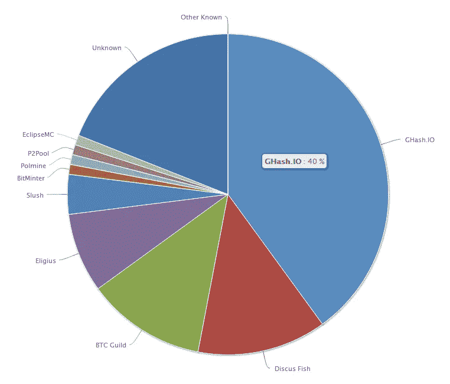
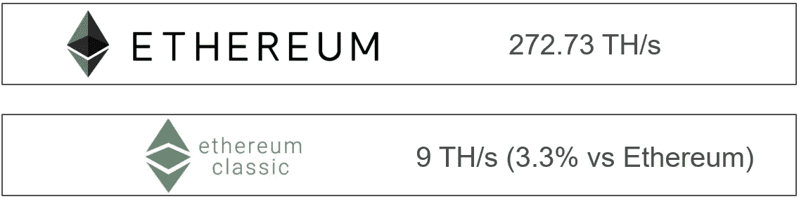
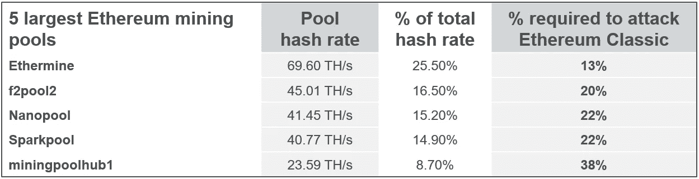
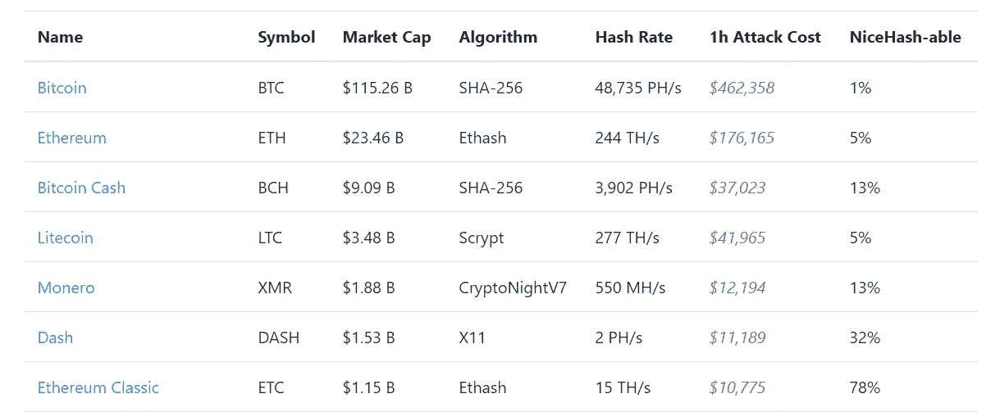

# 51%的攻击。风险、成本和可行性

> 原文：<https://medium.com/coinmonks/51-attacks-risks-and-feasibility-d25b3b13955?source=collection_archive---------0----------------------->

比特币解决的一大计算机科学问题是双重消费问题。在证明有效之前，如果没有一个中央权威点来执行规则，数字现金可以被复制而不会稀缺。比特币解决了这个问题。虽然，由于比特币的设计，如果一个人或一个团体控制了 51%或更多的网络哈希功能，仍然会发生双重花费。

比特币区块链的定义是最长的链和最多的累积工作证明。如果两个挖掘器找到两个有效块，则由具有最大散列能力的挖掘器找到的块更受青睐，因为它代表最长的工作证明链。因此，如果一个恶意组织获得了 51%或更多的哈希能力，他们就有可能操纵他们所挖掘的块中的事务。当多个有效块被广播到网络时，这可能导致分叉，由于节点的分布，一些可能暂时遵循少数链。因为只有一个区块被附加到区块链，所以只有一个奖励，其他矿工消耗的能量是不可回收的。

**51%的攻击使攻击者能够:**

*   在交易所转移并快速出售硬币，然后向交易所广播一个新的秘密开采的区块，逆转最初的交易。也就是双重消费。
*   其他人的反向或感应交易
*   在市场恐慌时使用卖空策略
*   在许多交易所使用高杠杆交易
*   通过挖掘空块来执行 DDOS 攻击，从而降低网络吞吐量
*   防止矿工或池追加块，导致分叉和矿工收入损失(浪费电力)

下面是比特币挖矿池的哈希功率分布图。在这个例子中是 GHash。IO 所占比例相当大，为 40%。如果这个数字增加 11%或者另一个大型矿池退出网络，GHash。IO 可以获得 51%或更多的总散列功率，这为可能的攻击打开了大门。

# 以太坊经典 51%攻击示例

如果挖掘池具有兼容的挖掘硬件和足够大的哈希速率，它可以执行 51%的攻击。在本例中，一个大型以太坊挖掘池可以执行并攻击以太坊经典，因为相比之下，该挖掘池具有相等或更大的总哈希能力。

这里你可以看到以太坊和以太坊经典的总哈希能力的差异，单位是每秒万亿次。太拉哈希(TH/s)可以与 CPU 千兆赫兹(GH/s)相提并论，因为两者都是计算硬件所做工作的衡量标准。

Ethereum and Ethereum Classic hash rate comparison — Spring 2018

查看排名前 5 的以太坊矿池，可以看到每个攻击以太坊经典所需的哈希速率。哈希速率越大，攻击就越成功，因为仍然有可能找到与哈希功率百分比成比例的块。

5 largest Ethereum mining pools hash rate compared to Ethereum Classic — Spring 2018

使用资源 [Crypto51.app](https://www.crypto51.app/) 您可以在撰写本文时看到，攻击加密货币排名列表所需的来自挖掘池 NiceHash 的散列率百分比以及与此相关的成本。

**针对不同加密货币的 51%攻击成本**

> [在您的收件箱中直接获得最佳软件交易](https://coincodecap.com/?utm_source=coinmonks)

