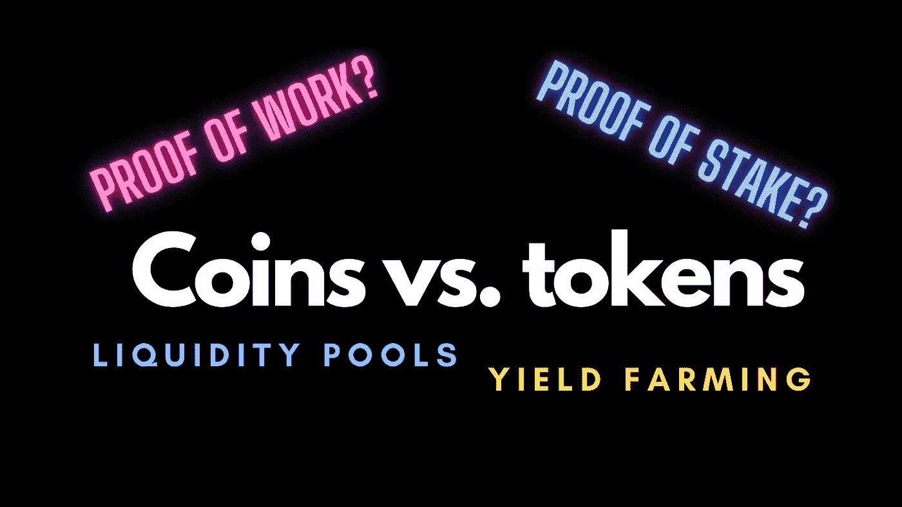

# 投资前你应该知道的 6 个加密货币流行语

> 原文：<https://medium.com/coinmonks/6-cryptocurrency-buzzwords-you-should-know-before-investing-95f76187cb0d?source=collection_archive---------2----------------------->

## 常见的误解被揭穿

Image by author

随着 Defi(去中心化金融)在 2021 年的本轮牛市周期中占据中心舞台，加密货币再次爆发。

自然，有太多的术语让我们一头雾水——尤其是对初学者而言。在以下几节中…