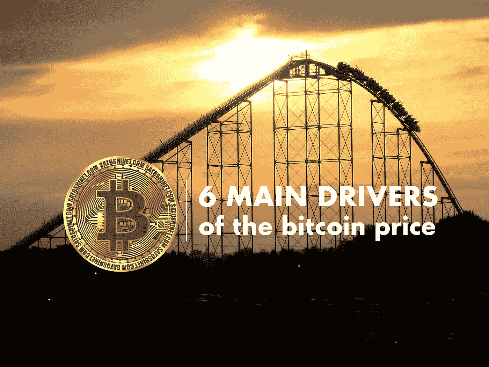

# 比特币价格的 6 个主要驱动因素

> 原文：<https://medium.com/coinmonks/6-main-drivers-of-the-bitcoin-price-264994befc90?source=collection_archive---------0----------------------->

**过山车**也就是**比特币价格**没有限制:它徘徊在 40，000 美元大关附近，尽管在线巨头亚马逊否认了媒体报道称零售商将接受比特币作为支付手段。
这一次，导致价格大幅上涨的不是埃隆·马斯克，而是亚马逊这样的公司。

What drives the bitcoin price? — Photo by [Meg Boulden](https://unsplash.com/@mboulden?utm_source=unsplash&utm_medium=referral&utm_content=creditCopyText) on [Unsplash](https://unsplash.com/s/photos/rollercoaster?utm_source=unsplash&utm_medium=referral&utm_content=creditCopyText), edited by the author