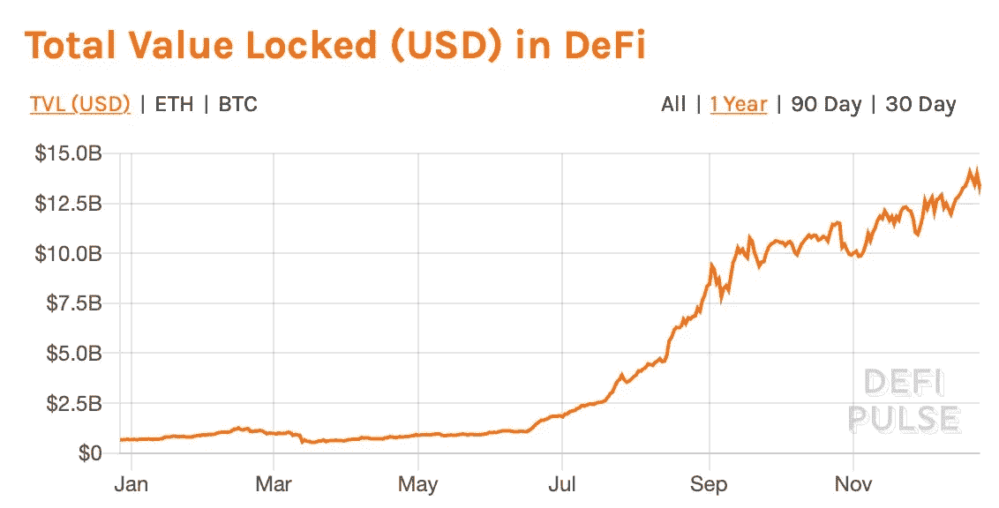
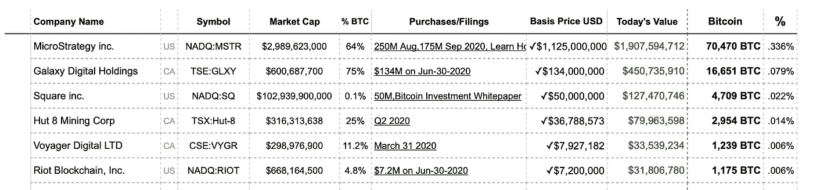
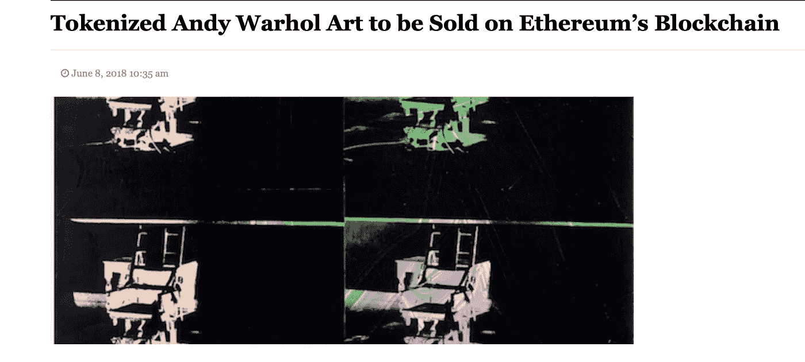
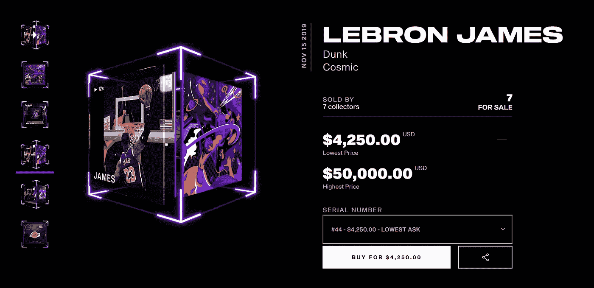
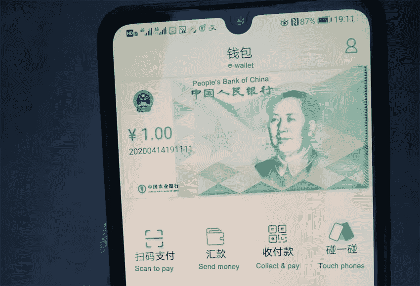
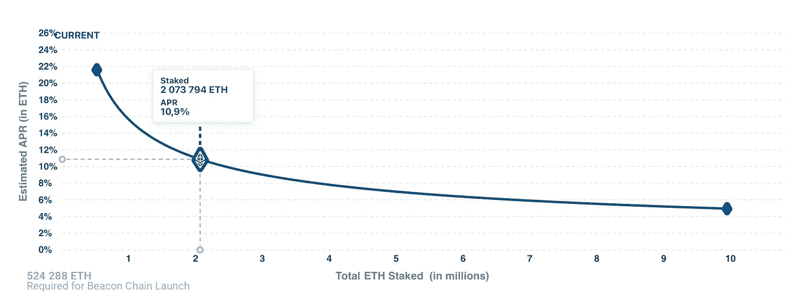

# 6 对 2021 年密码行业的预测(无交易)

> 原文：<https://medium.com/coinmonks/6-predictions-for-crypto-industry-in-2021-without-trading-9d9f5ff32f8a?source=collection_archive---------3----------------------->

区块链和加密世界正在一眨眼的功夫发生变化。一种趋势取代另一种趋势，新的有前途的代币、筹款方法、社区互动方法每个月都会出现。

对于那些监控和参与加密市场的人来说，2020 年是令人兴奋的——DeFi 和 DEX 的蓬勃发展，ETH 2.0 的推出，新的有趣项目和利基，当然 BTC 突破了其 ATH——引起了每个人的注意。

由于我与许多金融科技和区块链公司合作，我能够发现新的趋势，我觉得与你分享我的观点可能很重要。我们应该对 2021 年有什么期待。(但让我们抛开交易建议和 BTC 或其他货币的价格率预测)。

Crypto trends 2021

# 1.DeFi 和 DEX 将继续增长

今年对于 DeFi 部门来说的确令人印象深刻。不同项目锁定美元的快速增长(目前估计为 135 亿美元)，新的有趣项目的兴起，全世界都熟悉了“赌注”、“农业”和“治理令牌”等词。

Total value locked in DeFi

我猜 2021 年将会带来越来越多的项目和更高的 DeFi 市场供应量。尽管如此，要时刻注意财务安全，反复检查项目信息，不要只相信口头上的超快利润。

分散式交易所，即所谓的 DEX，正伴随着 DeFi Industry 出现。2020 年对于很多 dex 来说是一个真正的突破， [UniSwap](https://hackernoon.com/how-to-list-your-defi-token-on-uniswap-d4s3w7s?ref=hackernoon.com) 就是最生动的例子。这种趋势在即将到来的 2021 年以及 [IDO 趋势](https://hackernoon.com/what-is-ido-the-new-alternative-to-ieo-and-ico-70l34zf?ref=hackernoon.com)期间只会变得更强。

# 2.国际公司和机构投资者转向 BTC

今年，几家公司宣布将部分储备资产转移到 BTC。例如，其中呼声最高的是 MicroStrategy、PayPal、Galaxy 和 Square。几乎每个月都有新的类似交易的报道。当然，这对整个市场来说是一个积极的信号。我觉得 2021 年这种趋势还会继续。与此同时，这些巨头购买如此大的数量几乎不是为了快速投机，这意味着他们将 HODL 他们的比特币。这反过来会对主要资产的价格产生积极影响。

Big companies buy BTC

顺便说一下，你可以在这里跟踪购买 BTC [的公司。](https://bitcointreasuries.org/?ref=hackernoon.com)

# 3.NFT 代币和项目的增长

我今年写了关于 [NFT 代币和它是什么](https://hackernoon.com/issuing-non-fungible-tokens-nfts-a-how-to-guide-ckj3wz2?ref=hackernoon.com)。这个想法本身并不新鲜，在密码市场上已经存在很长时间了。甚至已经有相当高知名度的案例，例如，安迪沃霍尔的一幅画[被符号化并以这种方式出售](https://finance.yahoo.com/news/andy-warhol-multi-million-dollar-162928721.html?ref=hackernoon.com)。

Art NFT

2021 年，NFTs 会发展的更快。毕竟，有大量不同的应用，不仅包括游戏和艺术。它可以在很多行业实施:从房地产到法律。

像 NBA 和 UFC 这样的大型媒体巨头已经开始与 NFT 产业合作。

NBA goes NFT

# 4.中央银行数字货币(CBDC)

自 2016 年以来，许多政府将很快开始向央行电子货币(媒体也经常称之为政府加密货币)过渡的传言和专家观点一直在流传。

然而，今年变得明显的是，世界比以往任何时候都更接近这样的过渡。首先，比赛的速度是由中国设定的。[我在这里写了这个](https://hackernoon.com/how-chinas-new-national-cryptocurrency-changes-everything-sc4032eq?ref=hackernoon.com)。与此同时，中国已经开始测试其电子货币，许多国家已经宣布，他们正在准备自己在政府电子货币领域的发展。我们不太可能在等待菲亚特的瞬间被拒绝，但在 2021 年，国与国之间的竞赛肯定会升温。

Chinese government cryptocurrency tests

# 5.ETH 2.0 及其基础设施

2020 年的主要加密事件之一是 ETH 2.0 的发布。已经有超过 200 万个以太网被锁定在网络中。然而，这仍然只是更新的第一阶段。在未来，我们期待一种新的共识算法，赌注，快速和廉价的交易——所有这些都是有希望的，并将潜在地以巨大的速度推动 DeFi 市场。2021 年，ETH 将比以往任何时候都更有看头。

Total ETH staked by the end of 2020

# 6.STO 市场和令牌化资产将会增加

2020 年，STO 市场并不活跃，尤其是与 DeFi 市场相比。但是，我确信，令牌化资产有很大的前途。第一个消息来自 2020 年底——美国证券交易委员会(SEC)发布了一项重要公告，宣布将通过所谓的监管众筹活动筹集的监管基金费用上限从 100 万美元提高到 500 万美元。这将允许在没有向证券交易委员会登记的情况下出售证券。此外，许多欧洲国家开始悄悄地支持以这种方式将资产证券化并筹集资金的可能性。例如，[最大的交易所之一 Bittrex Global 已经推出了](https://global.bittrex.com/discover/tokenized-stocks?ref=hackernoon.com)令牌化股票交易。

2021 年会是 STO 年吗？虽然很难说，但可以肯定的是，冰层已经移动，我们将看到[更多的病例](https://x10.agency/sto?ref=hackernoon.com)和来自这个地区的消息。

我试图使这篇综述尽可能的简短，同时又尽可能的有用。事实上，我们可以谈论的话题还有很多。但是，这些都是我现在看到的行业趋势，没有触及交易话题或者价格预测。我们可以在我的推特上继续讨论。

分享你的观点，你看到了什么趋势？你认为以下哪个是最大的趋势？都是 2021 年的！

*与此同时，如果你有任何关于加密和区块链的问题，或者你是一个 IDO/DeFi/crypto 项目，想知道更多如何推广你的项目，你可以随时通过*[*Telegram(@ baloyan)*](http://t.me/baloyan?ref=hackernoon.com)*或* [*LinkedIn 联系我。*](https://www.linkedin.com/in/sbaloyan/?ref=hackernoon.com)

## 查看我以前在 HackerNoon 的文章:

*   [营销 DeFi 项目的最终清单](https://hackernoon.com/the-ultimate-checklist-for-marketing-defi-projects-f71a3wod?ref=hackernoon.com)
*   [发行不可替代代币(NFT):操作指南](https://hackernoon.com/issuing-non-fungible-tokens-nfts-a-how-to-guide-ckj3wz2?ref=hackernoon.com)
*   [如何在 UniSwap 上列出您的 DeFi 令牌](https://hackernoon.com/how-to-list-your-defi-token-on-uniswap-d4s3w7s?ref=hackernoon.com)
*   [中国新的国家加密货币如何改变一切](https://hackernoon.com/how-chinas-new-national-cryptocurrency-changes-everything-sc4032eq?ref=hackernoon.com)

## 另外，阅读

*   [学习以太坊和 Web3 开发](http://blog.coincodecap.com/go/learn)
*   最好的[密码交易机器人](/coinmonks/crypto-trading-bot-c2ffce8acb2a)
*   [3 商业评论](/coinmonks/3commas-review-an-excellent-crypto-trading-bot-2020-1313a58bec92)
*   [Pionex 审查](/coinmonks/pionex-review-exchange-with-crypto-trading-bot-1e459d0191ea)
*   [AAX 交易所评论](/coinmonks/aax-exchange-review-2021-67c5ea09330c) |推荐代码、交易费用、利弊
*   [Deribit 审查](/coinmonks/deribit-review-options-fees-apis-and-testnet-2ca16c4bbdb2) |选项、费用、API 和 Testnet
*   [FTX 密码交易所评论](/coinmonks/ftx-crypto-exchange-review-53664ac1198f)
*   [n 零审核](/coinmonks/ngrave-zero-review-c465cf8307fc)
*   [比特交换评论](/coinmonks/bybit-exchange-review-dbd570019b71)
*   [3Commas vs Cryptohopper](/coinmonks/3commas-vs-pionex-vs-cryptohopper-best-crypto-bot-6a98d2baa203)
*   最好的比特币[硬件钱包](/coinmonks/the-best-cryptocurrency-hardware-wallets-of-2020-e28b1c124069?source=friends_link&sk=324dd9ff8556ab578d71e7ad7658ad7c)
*   [密码本交易平台](/coinmonks/top-10-crypto-copy-trading-platforms-for-beginners-d0c37c7d698c)
*   最佳 [monero 钱包](https://blog.coincodecap.com/best-monero-wallets)
*   [莱杰 nano s vs x](https://blog.coincodecap.com/ledger-nano-s-vs-x)
*   [bits gap vs 3 commas vs quad ency](https://blog.coincodecap.com/bitsgap-3commas-quadency)
*   最好的[加密税务软件](/coinmonks/best-crypto-tax-tool-for-my-money-72d4b430816b)
*   [最佳加密交易平台](/coinmonks/the-best-crypto-trading-platforms-in-2020-the-definitive-guide-updated-c72f8b874555)
*   最佳[加密借贷平台](/coinmonks/top-5-crypto-lending-platforms-in-2020-that-you-need-to-know-a1b675cec3fa)
*   [莱杰纳米 S vs 特雷佐 one vs 特雷佐 T vs 莱杰纳米 X](https://blog.coincodecap.com/ledger-nano-s-vs-trezor-one-ledger-nano-x-trezor-t)
*   [block fi vs Celsius](/coinmonks/blockfi-vs-celsius-vs-hodlnaut-8a1cc8c26630)vs Hodlnaut
*   [Bitsgap 评论](/coinmonks/bitsgap-review-a-crypto-trading-bot-that-makes-easy-money-a5d88a336df2)——一个轻松赚钱的加密交易机器人
*   为专业人士设计的加密交易机器人
*   [共同追踪审查](/coinmonks/cointracking-review-a-reliable-cryptocurrency-tax-software-5114e3eb5737)
*   [优霍德勒评论](/coinmonks/youhodler-4-easy-ways-to-make-money-98969b9689f2)
*   [埃利帕尔泰坦评论](/coinmonks/ellipal-titan-review-85e9071dd029)
*   [SecuX Stone 评论](https://blog.coincodecap.com/secux-stone-hardware-wallet-review)
*   [BlockFi 评论](/coinmonks/blockfi-review-53096053c097) |从您的密码中赚取高达 8.6%的利息
*   [共同规则审查](https://blog.coincodecap.com/coinrule-review-a-perfect-trading-bot)
*   [最佳区块链分析工具](https://bitquery.io/blog/best-blockchain-analysis-tools-and-software)
*   [加密套利](/coinmonks/crypto-arbitrage-guide-how-to-make-money-as-a-beginner-62bfe5c868f6)指南:新手如何赚钱
*   最佳[加密制图工具](/coinmonks/what-are-the-best-charting-platforms-for-cryptocurrency-trading-85aade584d80)
*   了解比特币的[最佳书籍有哪些？](/coinmonks/what-are-the-best-books-to-learn-bitcoin-409aeb9aff4b)

> [直接在您的收件箱中获得最佳软件交易](/coinmonks/newsletters/coinmonks)

