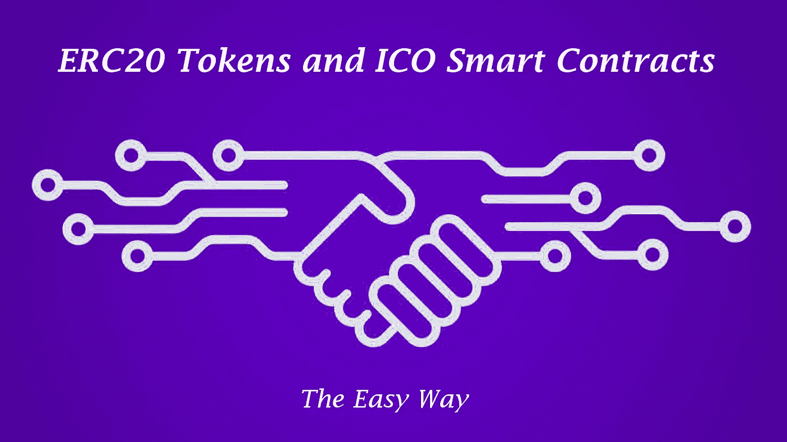

# ERC20 令牌和 ICO 智能合约的 6 个步骤

> 原文：<https://medium.com/coinmonks/6-steps-to-erc20-tokens-and-ico-smart-contracts-e90523afafa1?source=collection_archive---------1----------------------->

Step by step guide to ERC20 ICO Smart Contracts

## 循序渐进，简单易行。

最近，我在网上看到了很多文章，给出了如何推出自己的 ERC20 令牌或如何建立自己的 ICO(初始硬币发行)的基本示例。这些总是高层次的、匆忙的概述，遗漏了许多细节，这反过来会导致许多错误、浪费金钱和令人头痛的问题。