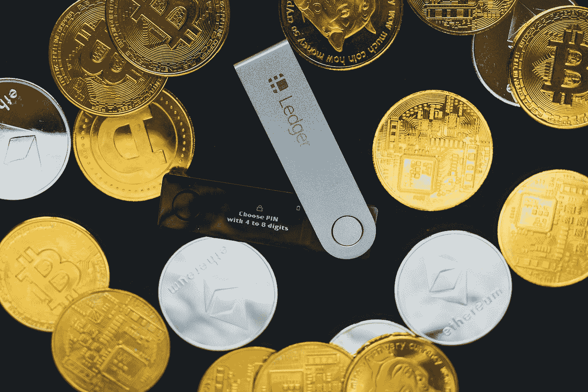

# 世界上最私密的 6 种加密货币

> 原文：<https://medium.com/coinmonks/6-top-most-private-cryptocurrencies-in-world-b7f81ade1acf?source=collection_archive---------4----------------------->

Photo by [olieman.eth](https://unsplash.com/@moneyphotos?utm_source=medium&utm_medium=referral) on [Unsplash](https://unsplash.com?utm_source=medium&utm_medium=referral)

政府已经在其行政战略中记录了加密货币法案。《加密货币和官方数字货币监管法案 2021》在最近的议会金融计划会议上首次被记录为对话和章节。印度储备银行正在检查派遣自己的国家银行预付款的可行性，然而，目前似乎无法确定派遣试点项目的潜在日期。

加密货币收费的发布是在行业和公共当局之间的一些聚会的背景下进行的，以给出数字货币在印度的使用结构。根据行业统计，印度大约有 1500 万种数字货币，总资产超过 60 亿美元。以下是印度私人加密货币的概况。

加密货币因为一些元素而出名，包括保护和匿名。他们中的一些人帮助客户隐藏他们的个性和交流。在对比特币等早期加密货币形式的保密性日益担忧的同时，客户正在寻找新的选择。

不如我们研究一些著名的安全的数字货币形式，它们有许多内在的保护亮点。这些案例提供了先进的安全元素或选择，有助于隔离客户的个性和锻炼。

# 1.莫内罗

Monero 的地位越来越突出，主要是因为它有能力帮助客户匿名。Monero 交易所很难跟踪，因为他们使用环形标记和秘密地址。这些技术有助于隔绝发送者和接收者的个性。此外，Ring Confidential Transactions(简称 RingCity)隐藏了交易金额，同时提供了更高的安全性。

截至 2021 年 7 月 4 日，Monero 的交易价格为 221.46 美元，按绝对市值计算，Monero 是第 26 大加密货币，保持在 28 亿美元左右。

# 2.Zcash

Zcash (ZEC)将自己描述为“假设比特币类似于现金的 HTTP，那么，在这一点上，Zcash 就是 HTTPS，”强调了其改进的安全性和保护亮点。Zcash 已经实施了一个名为零信息验证的加密工具，让会员可以选择保护交易。这允许成员执行时几乎没有人向其他人公开他们的地址。零信息验证还模糊了交易的衡量标准。

Zcash 在数字货币排行榜上排名第 60 位，市值为 14.9 亿美元，截至 2021 年 7 月 4 日，其交易价格为每 ZEC 122.68 美元。

# 3.破折号

DASH 创建了 2014，允许客户利用其 PrivateSend include 选择他们的交流是否神秘和隐私。这使得希望留在本国行政规范内的客户可以这样做。这个组件的工作原理是模糊资产的开始。决定使用私人结算办公室将略微增加交易费用。Run 通过一种混合约定来实现这一点，这种混合约定利用了一种被称为主节点的富有想象力的分散式服务器组织。

截至 2021 年 7 月 4 日，Dash 的市值排名第 61 位，总资产超过 14.6 亿美元。在这篇作文的时候，大约是 142.60.1 美元。继续工作

# 4.Horizen

Horizen (Zen)提供安全保护的 Z 位置和公共 T 地址，与比特币相比工作更好。尽管如此，从一个 Z 地址发送资产将显示得到的总数。Horizen 还有一个巨大的枢纽组织，进一步发展无名。

2021 年 7 月 4 日，Horizen 的交易价格为 68.93 美元，总市值约为 7.7656 亿美元。这使其成为第 83 大加密货币。

# 5.边缘

Verge 银行没有依赖加密货币策略，而是从洋葱路由器(TOR)和隐形互联网项目(I2P)入手，尝试现有的创新，以保护客户的个性。Peak bobs 的客户通信通过一个由志愿者运行的循环组织传输，遍布全球，隐藏了客户的个性。另一方面，I2P 对客户信息进行编码，然后通过一个未知的、共享的、由志愿者工作的国际传播网络发送出去。它允许隐藏交易所成员的区域和 IP 地址。

当一家知名的成人网站开始接受加密货币支付时，The Verge 脱颖而出，成为真正有新闻价值的网站。前进背后的基本理由是边缘的安全亮点。

截至 2021 年 7 月 4 日，Verge 以市值排名第 111 位，总资产为 3.9363 亿美元，转换规模为 0.024 美分。

# 6.光线

Beam Token 是一种以安全为中心的令牌，其中心元素整合了对您的保护的全部命令。所有的交换自然是私有的，没有位置或其他私有数据被放在区块链上。它标榜更好的适应性，由于其保守的区块链大小，选择不可闻，支持在网络上和断开交换，核交易，设备钱包组合。

截至 2021 年 7 月 4 日，Beam tokens 的交易价格为 0.43 美元，绝对市值为 3977 万美元，是第 462 种最重要的加密货币。

# 结论

虽然隐私是虚拟世界中备受期待的组成部分，但它同样也带来了更大的犯罪风险。加密货币管理员需要阻止恶意成员的许多黑客行为。具有大量交换的个人同样必然会被法律实施组织和控制者探究。

尽管比特币仍然是最广为人知的选择，但它是由政府机构提供的。他们已经变得非常擅长追踪比特币交易所，为转向更私人的数字货币形式提供了坚实的动力。比特币一直是一个众所周知的确保客户特征的决定，随后，交易所不断被政府部门指定和观察。他们在跟踪比特币交易所方面变得非常出色，给客户带来了坚实的动力，让他们转向更私人的数字货币，就像这里记录的那样。

# 阅读更多信息:

[15 年终极&今年要投资的高回报替代货币](https://xbmproject.com/index.php/2021/11/20/15-ultimate-high-return-altcoins-to-invest-this-year/) [10 种最要投资的廉价加密货币 202](https://xbmproject.com/index.php/2021/11/19/10-best-and-low-risk-cryptocurrencies-to-invest-in-2021/) 2

[2021 年投资的 10 种最便宜的加密货币](https://xbmproject.com/10-best-and-low-risk-cryptocurrencies-to-invest-in-2021/)

[15 终极&今年要投资的高回报替代币](https://xbmproject.com/15-ultimate-high-return-altcoins-to-invest-this-year/)

*原载于 2021 年 11 月 25 日 https://xbmproject.com**的* [*。*](https://xbmproject.com/6-top-most-private-cryptocurrencies-in-world/)