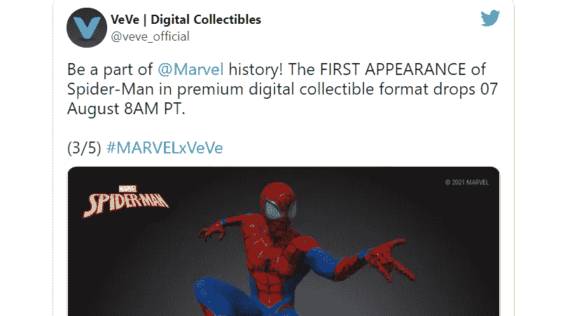

# +6 亿聚网络黑客/前谷歌员工骗局/基础设施法案

> 原文：<https://medium.com/coinmonks/600-million-poly-network-hack-ex-google-employee-scam-infrastructure-bill-73afc1131304?source=collection_archive---------3----------------------->

Follow us [instagram](https://www.instagram.com/p/CSW8xHipvmC/)

## NFT 繁荣/这是最后的牛市吗？

跨链协议聚网被[黑](https://www.theblockcrypto.com/post/114045/at-least-611-million-stolen-in-massive-cross-chain-hack)6.11 亿美元。该协议背后的团队正在敦促交易所冻结被取走的资金。

被盗资产分别是价值 2 . 73 亿美元的[以太币](https://etherscan.io/address/0xc8a65fadf0e0ddaf421f28feab69bf6e2e589963)、价值 2 . 53 亿美元的币安智能链上的[币，以及价值 8500 万美元的多边形网络](https://bscscan.com/address/0x0d6e286a7cfd25e0c01fee9756765d8033b32c71)上的 USDC[。](https://polygonscan.com/address/0x5dc3603C9D42Ff184153a8a9094a73d461663214)

> 比特币再次上涨，因此不要错过机会，请 [**加入我们 Telegram**](https://t.me/coincodecap) 上的加密信号频道，获取交易分析和买入机会。

现在，让我们看看上周 Crypto 发生了什么。📰

## **参议院否决了对基础设施一揽子计划征收加密货币税的妥协提案**

In the photo : Sen. Richard Shelby; Source : Senate

周一，美国参议院否决了两党对 1 万亿美元基础设施计划的妥协修正案，该修正案涉及比特币纳税申报。

折衷方案将澄清“经纪人”的定义，根据目前的条款文本，经纪人必须以 1099 表格的形式披露秘密利润。

该措施现在将“经纪人”定义为“负责代表他人定期提供任何实现数字资产转移的服务的任何个人”，加密爱好者认为这一定义过于宽泛。如上所述，它有可能针对矿工、开发商、利益相关者和其他没有消费者因而无法访问法规遵从性所需信息的人。

折衷修正案中“经纪人”的定义更加严格，排除了矿工和股东等验证者。财政部长珍妮特·耶伦支持修正案。

然而，参议院没有一致通过，阿拉巴马州共和党参议员理查·谢尔比不同意。原来的意思将被保留，因为妥协修正案的通过需要一致同意。

周二，对整体基础设施提案的投票将开始。即使它通过了，在它被签署成为法律之前，将有更多的机会修改任何部分/条款，包括关于秘密税收的条款。

Source: JakeChervinsky Twitter

## **1。这个周期是不同的——威利·吴**

*‘这个循环是不同的；硬币流向强势持有者是史无前例的。*

Source: Glassnode

图表:紫色线跟踪弱手和强手之间的硬币移动(128 天的总运行时间)

Willy woo 引用了更多的观察结果。

a)我们不可能进入熊市。从本周的价格走势来看，这一点很明显，但在两周前天塌下来的时候，这一点就不那么明显了。

b)将硬币转移到公司金库可能会产生影响。

c)灰度投资信托，现在占供应的 3.5%，只允许 BTC 流入冷藏(纸交易，没有硬币移动)。

d)自 2017 年以来规模扩大的杠杆市场可能也发挥了作用。许多硬币被移动以进行交易；有了杠杆，同样的投机水平需要更少的硬币移动。

e)由于比特币在早期(丝路时代)被用作货币，硬币在流动性更强的手之间流通。

[点击此处](https://www.youtube.com/watch?v=MwsWvYa53Ng)获取 Willy Woo 的深入分析。

## **2。前谷歌员工通过创造随机代币诈骗了 900 万美元**

Image Source: MillionToken

tech lead(YouTube 和前谷歌员工)通过杜平/用一种没有任何效用的加密货币#MillionToken 欺骗他的支持者，获得了超过 900 万美元。他赞助了推广这种代币的广告，声称这是一个“快速”致富的机会。

他甚至说，*“你可以买一个肾，然后买一百万代币，你有两个肾，你不需要两个，把其中一个货币化，然后买一百万代币。”*

请不要听信这些废话！！

[点击此处](https://www.youtube.com/watch?v=pLrRt8R9zRA)进行深入分析/调查。

Source:Coffeezilla

## **3。Altcoin 炒作周期参考**

把握市场时机是一项挑战。在接近顶部的时候或者接近下跌的时候，会帮助你获得一些好的平盘。

下面是一个参考资料，它可以通过补充其他技术细节/指标来帮助你度过这个周期。

Image Source: TheBirbnest

Altcoin 是 alternative coin 的缩写。这个词指的是除比特币之外存在的所有代币。
这种区别之所以成立，是因为替代币的表现经常与比特币的表现大相径庭。

## **4。武堂帮的马索·曼恩将推出 NFT 系列漫画**

Image Source: Wiki

马索·曼恩的新漫画系列《NFTs》将以 NFTs 的形式发行。
符号化漫画将有专属数字奖金。

他的世界史诗的第一部分，名为“第一部分:起源”，以一系列独特的艺术作品、动画和音乐为特色。

初版包括独特的艺术作品，灵感来自基拉·毕兹，并由马索·曼恩和纽约艺术家亚历克斯·斯梅斯基亲笔签名。Killa Beez 是一个术语，指的是一群隶属于吴唐家族的说唱歌手。他们合作了两张专辑，1998 年的《蜂群》和 2002 年的《毒刺》。

这本符号化的漫画书还将包括以前未出版的方法音乐，以及一部关于提卡世界创始叙事的 3D 数字电影。马索·曼恩运动装备公司 Tical Athletics 的金色贵宾卡也作为礼物赠送。

Source: Cream Finance

## **5。基于区块链的音乐流媒体服务受众每月高达 500 万人——Audius**

Image source: Techslag

超过 100，000 名艺术家使用这个平台，包括迪德莫和史奇雷克斯。

基于以太坊区块链的音乐流媒体平台 Audius 周四达到了一个重要的里程碑，每月有 500 万人使用该网络播放音乐，使其成为区块链上最大的消费者应用程序之一。

Audius 于 2019 年首次亮相，更类似于音乐流媒体提供商 SoundCloud 的分散化版本，而不是世界上最大的音乐流媒体服务 Spotify。Audius 并不直接基于流媒体向创作者支付报酬，而是为他们提供必要的基础设施，让他们以自己认为合适的任何方式将作品货币化，包括通过出售不可替代的代币(NFT)。

Audius 的原生令牌 AUDIO 也可以用来奖励为平台做出贡献的创作者和社区成员。

## **6。比特币确认突围**

Rektcapital

在长达 3 个月的下跌趋势后，比特币从横盘反弹，并通过再次测试确认了上涨。这表明多头有多强大，未来几个月也将如此。

## **7。比特币网络的新用户数量继续创新高**

Source: Glassnode

不考虑 3 个月前的崩盘，比特币持有者一直在增加。这得到了链上数据的支持。

通常来说，在牛市的中后期，是虾米和不到 10 名比特币持有者发挥了至关重要的作用。我们可能正在目睹同样的事情。

## **8。比特币似乎有望达到 47000 美元**

Source: Trading view

比特币确立了 40000 美元作为支撑，导致空头挤压。随着价格飙升，超过 1.8 亿美元的空头头寸被平仓。BTC 可能达到 47，600 美元，空头被清算。

尽管技术方面表明 200 天移动平均线可能会成为上涨的实质性阻力，但交易历史表明未来不会出现重大供应障碍。唯一可能吸收近期购买动力的兴趣区域在 42，650 美元到 43，900 美元之间。

值得一提的是，现在 40，000 美元水平已经转换为支持，它几乎肯定会在比特币的上升趋势中发挥重要作用。获利回吐突然激增，将 BTC 拉至这一需求关口下方，可能会导致大幅下跌。

在 40，000 美元以下，最重要的支撑位是 35，000 美元和 29，500 美元。

## **9。以太坊自 5 月以来首次突破 3000 美元**

Image Source: Ethereum

自 5 月份市场崩盘以来，ETH 的价格首次突破 3000 美元。
最近伦敦以太坊的硬分叉更新被认为是激增的一个原因，尽管整体加密市场也更高。

在最近部署了重大网络升级后，以太坊的价格自 5 月中旬市场自由落体以来首次上涨至 3000 美元。根据 CoinMarketCap 的数据，截至本文撰写时，ETH 的价格为 3009 美元。

尽管仍远低于以太坊 5 月 12 日创下的约 4357 美元的历史高点，但根据 CoinGecko 的数据，以太坊的定价已近三个月没有这么高了。自 5 月 19 日以来，它已跌至 3000 美元以下，当时整个加密货币市场在经过数月上涨后开始下跌。

在伦敦 hard fork 推出后，ETH 的价格上涨了 7.85%，从周四上午的 2583 美元攀升至今天的 3000 美元以上的里程碑。

## **10。就在 EIP-1559 发射后两天，价值 3000 万美元的以太坊被烧毁**

Image Source: Bitcoinst

以太坊开发人员对网络进行了更改，导致交易费用被烧毁。自从那次修改以来，已经烧掉了 3000 万美元的 ETH。

以太坊燃气灶的排行榜由 NFT 项目主导，NFT 市场 OpenSea 领先。

EIP-1559 是 8 月 5 日发布的五个更新之一，作为以太坊伦敦硬分叉的一部分，它已经用算法生成的替代方案取代了以太坊的拍卖式交易费用结构。

用户将不再获得交易费，除非他们主动选择“小费”矿工；相反，费用被烧掉了，降低了流通中以太坊的总供应量。

根据以太坊追踪器 Ultrasound.money 的数据，迄今为止已有 1332 ETH(410 万美元)被烧毁，其中大部分来自 NFT 市场 OpenSea 的交易，自上周 CryptoPunks 交易热潮开始以来，该市场的交易量有所增加。

分散式交易所 Uniswap V2 是第二大 ETH 燃烧器，交易总量为 810 ETH(200 万美元)。

第三个游戏是 Axie Infinity，这是一个基于以太坊的游戏，用户购买 NFT 的怪物并与之战斗。Axie Infinity 在其运营中使用了 626 ETH(190 万美元)。

## **11。Axie Infinity 的日用户增加了十倍，达到一百万**

Image source: Axie Infinity

Axie Infinity 是一款基于以太坊的怪物战斗游戏，最近随着 NFT 交易量的上升和其原生 AXS 治理令牌的历史新高而飙升至头条，现在又有一个重要的里程碑添加到列表中:日活跃用户超过 100 万(DAU)。

开发商 Sky Mavis 今天公布了这一消息，援引统计数据显示，在过去 24 小时内，Axie Infinity 的应用程序的活跃用户超过 102 万。超过三分之二的消费者使用安卓系统，其余的使用 Windows 电脑。MacOS 和 iOS 的玩家基础要小得多，后者目前只提供给测试人员。

Source: Axie infinity official twitter tag

## **12。美国币安公司首席执行官 Brooks 上任仅三个月就辞职**

Image Source: Binance

这位前美国金融监管机构和加密爱好者正在下台，而此时香港、英国、德国、日本、意大利和泰国的监管机构出于投资者保护的考虑，正在打击币安。

全球监管机构尤其担心，加密货币的兴起正在为洗钱提供便利，并引发系统性担忧。

币安被英国金融当局禁止在英国从事受监管的活动。币安被发现在日本非法经营，而德国当局警告称，该公司可能因提供与股票挂钩的代币而面临制裁。

据彭博新闻报道，币安在美国也受到司法部、商品期货交易委员会和税务官员的调查。

## **13。EIP-1559 升级后，以太坊每分钟燃烧 10，000 美元**

Image Source : Ethereum

继备受期待的伦敦升级(包括以太坊(ETH)上的令牌燃烧机制)之后，该网络目前平均每分钟燃烧 3.68 ETH(10，295 美元)。

在其他变化中，以太坊改进提案(EIP) 1559 要求所有交易费用的一定百分比，即所谓的基本费用，在每个区块中销毁，而不是流向矿工。

根据提案的[描述](https://eips.ethereum.org/EIPS/eip-1559)，这样做是为了平衡以太坊通货膨胀，同时仍然为矿工提供区块奖励和优先权费用(用户准备支付的最大费用，以将其交易包括在区块中)。

## 14。使用 DeFi 的以太坊地址数量增加了 65 %,超过 290 万个

Image source: Forkast

根据 ConsenSys 关于 2021 年 Q2 以太坊 DeFi 生态系统的最新[报告](https://consensys.net/reports/defi-report-q2-2021)，以太坊和去中心化金融生态系统继续保持强劲增长，截至 7 月 1 日，共有 1.61 亿个独特的以太坊地址，比 Q1 年底增加了 10%。

根据该报告，6 月份有 291 万个唯一地址使用了至少一种 DeFi 协议，比上一季度增长了 65%，以太坊区块链上的非托管钱包 MetaMask 的月活跃用户数超过了 730 万。

## 15。最实惠的密码朋克超过 10 万美元

Image Source: Cryptopunks

CryptoPunks 是开创性的 NFT 加密收藏品，于 2017 年在以太坊创造，远在今年 NFT 市场爆炸之前。最近几天，我们见证了一些数百万美元的交易，但即使是低端也在上升。底价涨到了六位数。

在二级市场上，最便宜的密码朋克在瑞士联邦理工学院的价格超过 10 万美元。根据制造商幼虫实验室自己的追踪器，目前价格最低的加密朋克是 39 ETH，差不多是 11 万美元。

Source : Dapp Radar official twitter

## **16。Aave 正在评估 Solana、Avalanche 和第 2 层扩展**

Image Source: Solana

分散贷款协议 Aave 正在制定多链战略。
Aave 的创始人兼首席执行官 Stani Kulechov 在 Chainlink 的智能合同峰会上表示，该公司正在探索在多个不同的网络上推出。

Kulechov 通过 EVM 兼容的解决方案 Neon Labs、Avalanche 以及乐观汇总解决方案 Arbitrum 和乐观作为其多链战略的一部分，揭示了 Aave 在 Solana 上的借贷市场的潜在增长。

凭借以太坊和 Polygon 市场上 215 亿美元的总价值，Aave 是目前最大的分散式贷款平台。

Kulechov 强调，与以太坊虚拟机的兼容性是该协议决定扩展的关键因素，它影响了其他网络的选择过程。

该公司最初成立于以太坊，于 2021 年 3 月在 Polygon 上推出了贷款市场。那次扩张获得了巨大的成功。Aave 的 Polygon 市场在短短四个月内获得了约 40 亿美元的总投资。

Source: Official Solana

今年 3 月，Aave 还创建了一个自动化做市商流动性池，暗示了当时以太坊之外的“新领域”。

现在，该协议似乎正准备在许多网络上部署。预计这种增长将随着时间的推移分阶段逐步实现。Kulechov 进一步指出，该项目正在开发一个跨链治理架构。

走向多链将允许协议实现跨链可组合性，这意味着用户将能够将抵押品从一个链移动到另一个链，或者在一个链上持有抵押品，同时在另一个链上借款。

## **17。漫威发布第一部官方 NFTs，从蜘蛛侠开始**

Source: Official VeVe

蜘蛛侠数字收藏品的价格在 40 到 400 美元之间，总版本数随着价格的上涨而减少。例如,“普通”稀有的《蜘蛛侠 NFT》将向多达 32，000 名顾客发售，而“秘密-稀有”终极动画《蜘蛛侠 NFT》将限量发行 1，000 份。

## **18。阿姆和比特币基地以 3000 万美元的投资支持以太坊 NFT 平台制造商。**

Image Source: Wiki

MakersPlace 是一个以 NFT 形式出售的加密收藏艺术品市场，是今年春天市场飙升后最新一个筹集大量新资金的 NFT 目的地。今天，该公司宣布了一项 3000 万美元的 A 轮投资，投资者包括一些知名投资者。

MakersPlace 声称，其位于区块链的以太坊平台在 2021 年处理了超过 1 亿美元的交易量，其用户群增长了 10 倍。MakersPlace 最出名的可能是与佳士得合作，在 3 月份以 6930 万美元的价格出售了艺术家毕普的“每一天:前 5000 天”NFT。

## **19。Swarm Markets 是全球首个获得许可的** [*****](https://docs.swarm.markets/about/license) **高流动性 DeFi 协议**

Image Source: Swarm Network

Swarm Markets 拥有德国金融监管局(BaFin)的银行牌照，可以运营一个交易所，加密货币(如比特币、以太、DAI)和受监管的金融工具，如股票(如特斯拉、苹果)或商品(如黄金)，可以在一个统一的市场进行交易。

它由 DeFi 技术提供支持，允许 Swarm Markets 交易所参与者利用自动做市商(AMM)技术直接相互交易，该技术采用代码来计算最佳交易费率，而无需集中的订单簿或做市商。

***作者* : Eth！c@l Aka Kumar**

# 另外，阅读

*   [最佳加密贷款平台](https://blog.coincodecap.com/crypto-lending)
*   [最佳加密交易机器人](/coinmonks/crypto-trading-bot-c2ffce8acb2a)
*   最佳密码电报信号
*   [最佳加密税务软件](/coinmonks/best-crypto-tax-tool-for-my-money-72d4b430816b)
*   [最佳硬件钱包](https://blog.coincodecap.com/best-hardware-wallet-bitcoin)