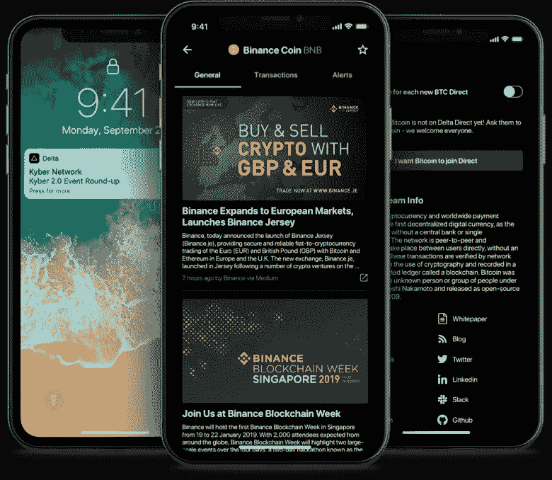

# 2021 年 7 个最佳加密投资组合追踪器(经过测试)

> 原文：<https://medium.com/coinmonks/7-best-crypto-portfolio-trackers-for-2020-tried-tested-4a362711a3bf?source=collection_archive---------1----------------------->

您正在寻找当今市场上最好的加密投资组合跟踪器吗？你来对地方了。

我们已经在加密领域工作了很多年，也看到了相当多的加密投资组合跟踪器。见鬼，我们甚至帮助团队[建造它们](https://zabo.com/use-cases/financial-tracking)。我们已经亲自使用了几乎每一个加密跟踪器，并坐下来尝试这个职位。

市场上有如此多的加密货币投资组合追踪器，我们是如何为这个列表选择的呢？**与其他“最佳榜单”不同——我们写这个**没有报酬。我们做了研究，排除了噪音，把最好的选择放在一起。

我们的选择标准很简单:

*   **设计质量和整体用户体验。**简单来说，该产品使用起来真的很容易并且*有趣*吗？
*   **深度特征。**该产品对客户关系和资产有可靠的覆盖吗？有没有有用的周边特色？
*   **独特的价值主张。**相对于其他投资组合跟踪工具，该产品有什么特别之处或与众不同之处吗？

因此，事不宜迟，让我们深入了解 2021 年最佳加密投资组合追踪器！

# 组合证券

如果你在 crypto 工作过一段时间，你可能对 [Blockfolio](https://blockfolio.com/) 很熟悉。Blockfolio 成立于 2014 年，拥有超过 600 万用户，是加密投资组合跟踪领域无可争议的重量级冠军。

毫不奇怪，该应用程序被 FTX 加密交易所以 1.5 亿美元收购。

Blockfolio’s mobile-first design has always been a differentiator

Blockfolio 在 2017 年加密牛市的正确时间处于正确的位置，占据了加密跟踪市场的巨大份额。但是他们不仅仅是幸运——他们很优秀。

**Blockfolio 的优势在于:**

*   Blockfolio 拥有出色的移动优先设计。卓越的设计和用户体验一直是 Blockfolio 的主要优势之一
*   它基本上支持所有的加密资产(10，000+)，并且有一个相当不错的交换连接列表(在撰写本文时有 15 个交换)
*   Blockfolio 有一个名为 Signal 的项目智能工具，它结合了新闻和其他关于你最喜欢的项目的有用数据
*   它允许你设置比特币和以太坊价格提醒(以及它们支持的任何其他资产)
*   Blockfolio 完全免费使用
*   苹果商店评分:28k 评分为 4.9 / 5.0

From left to right: Blockfolio Signal, Markets and Asset Detail views

**使用组合证券的一些潜在限制:**

*   Blockfolio 仅适用于移动设备，因此没有 Blockfolio 桌面访问。如果你想在桌面或网络上找些东西，你需要去别处看看。在那之前，我们将热切期待 Blockfolio 在 PC、Mac 或 web 上的应用！
*   Blockfolio 的加密帐户连接比其他一些顶级加密跟踪应用程序少

# 库贝拉

只跟踪你的加密货币账户很好，但你的其他金融账户和资产(银行、经纪公司、房地产)呢？

像 Mint 和 Personal Capital 这样的主流投资组合追踪器没有连接加密账户的能力，这在历史上使得了解你的总净资产非常困难。

直到库贝拉出现。

Kubera 与 [Zabo](https://zabo.com/) 合作，最终将加密货币和传统金融账户合二为一。

结果呢？现代净值追踪器:

All your financial assets in one place. A thing of beauty!

Kubera 背后的团队开发了屡获殊荣的[牛顿](https://newtonhq.com/)电子邮件应用程序，该应用程序的用户数量已超过 400 万。因此，毫不奇怪，他们建立了一个惊人的投资组合跟踪器。

**库贝拉的强项是:**

*   Kubera 让您在一个地方连接所有的金融账户，包括加密！看到你所有的账户在一起真是一种奇妙的体验
*   Kubera 的设计极其简单干净。没有杂乱，整个应用程序感觉很轻(以一种好的方式)
*   Kubera 不会跟踪你的任何数据，也不会把你卖给第三方，如果你重视隐私，这是一个很好的选择
*   Kubera 支持非常广泛的加密账户[连接](https://zabo.com/integrations)，包括所有顶级的加密货币交易所和自我托管的最爱，如 [Trezor](https://zabo.com/integrations/trezor-api) 、 [Ledger](https://zabo.com/integrations/ledger-api) 和 MetaMask
*   它有一个非常有用的遗产和受益人管理系统。这个可选的功能可以让你安装一个“死亡开关”,如果你遭遇不幸，它会将你的财务信息发送给受益人

**使用 Kubera 的一些潜在限制:**

*   Kubera 目前只支持网络，所以如果你想在本地手机(iOS 或 Android)上寻找什么，你需要去别处看看
*   Kubera 并不是不免费的，但是你可以免费试用 14 天来测试它。之后，每月费用为 12 美元或每年 120 美元

# 三角洲

[Delta](https://delta.app/en) 是 Blockfolio 之外比较流行的纯加密跟踪器之一。自 2017 年成立以来，达美航空已经获得了数百万注册用户，并拥有数十万活跃用户。

而且理由很充分；三角洲一直是一个设计精美，功能强大的加密跟踪器。

Left two: the current Delta | Right: the upcoming Delta with traditional investments

达美于 2019 年被社交交易巨头 eToro 收购。eToro 是最早进入加密领域的金融科技公司之一(早在 2014 年)，此后建立了一个拥有超过 1300 万用户的平台。

Delta 和 eToro 正在合作创建下一代 Delta 应用程序，不仅包括加密跟踪，还包括股票和其他金融资产。这绝对应该让 Delta vs Blockfolio 的辩论更有趣！

**达美的优势是:**

*   它设计得很好，具有你在纯加密跟踪器中寻找的所有功能，包括大量资产的价格细节，项目和新闻的详细信息
*   Delta 有一个相当强大的交换和钱包连接列表(在撰写本文时有 24 个交换，14 个钱包)
*   Delta 有一个名为 Delta Direct 的加密项目智能工具，它会向您发送您最喜欢的项目的新闻和更新
*   它允许你设置比特币和以太坊价格提醒(以及它们支持的任何其他资产)
*   德尔塔是免费使用的基本功能
*   苹果商店评分:7.6k 评分为 4.8 / 5.0

A look at Delta Direct — a similar feature to Blockfolio Signal

**使用德尔塔的一些潜在限制:**

*   Delta 目前只支持移动设备(iOS 和 Android)，所以如果你想在桌面或网络上寻找一些东西，你需要去别处看看
*   对于功能的完整列表，Delta 不是免费的。Delta Pro 计划的价格是 58.99 美元/年，它可以让你实现多设备同步和无限制的 exchange 连接

# 午餐钱

[午餐钱](https://lunchmoney.app/)的口号是“令人愉快的简单预算”，但远不止于此。

该应用最初是作为流行的预算工具 Mint 和 YouNeedABudget 的竞争对手出现的。虽然预算仍然是主要功能，午餐钱已经扩展到其他有用的功能。

2020 年，午餐钱与 Zabo 合作，推出了对加密货币交易所和钱包的账户连接支持。

午餐钱还发布了净值跟踪功能，使客户能够跟踪他们的总体财务状况以及他们的预算。

Lunch Money is clean and highly functional

午餐钱的疯狂之处在于*整个 app 都是一个人*打造的！尽管如此(或者正因为如此)，这款应用仍在不断推出新功能。

**午餐钱的优势是:**

*   它有一个独特的，有趣的和高度实用的设计。从整体布局到最小的按钮和图标，午餐钱在每个角落都有一种看似定制的设计风格
*   午餐钱可以跟踪所有的金融账户，包括加密货币和你的预算。没有其他预算应用程序可以做到这一点
*   由于与 Zabo 的集成，午餐钱支持所有主要的交易所和加密货币钱包，包括硬件钱包
*   它有强大的预算工具，包括一个漂亮的自动标记和分类交易的规则引擎
*   有多种方法可以导入事务，包括 CSV 导入和开发人员 API

A look at Lunch Money’s Net Worth Tracker

**使用午餐钱的一些潜在限制:**

*   午餐钱目前只在网络上提供，所以如果你想在本地移动设备(iOS 或 Android)上寻找一些东西，你需要去别处看看
*   午餐钱不是免费的。他们有 14 天的试用期，之后每月收费 6.67 美元(如果按年计费)

# CoinStats

[CoinStats](https://coinstats.app/) 号称拥有超过 50 万用户，并声称在其平台上追踪超过 50 亿美元的加密货币。

他们的策略之一是让 CoinStats 在尽可能多的平台上可用——这是他们绝对成功的地方！

CoinStats across some of its many supported platforms

**CoinStats 的强项是:**

*   CoinStats 是一个真正的跨平台产品。它支持 iOS，Android，web，Mac 桌面，iWatch 和谷歌 Chrome 扩展！
*   CoinStats 拥有最广泛的加密货币账户连接选择(在撰写本文时有 26 个交易所和 34 个钱包)
*   CoinStats 定期推出新功能并进行改进，以保持其功能的新鲜和相关性
*   以基本的方式开始使用 CoinStats 是免费的
*   苹果商店评分:42.4k 评论 4.8 / 5.0

**使用 CoinStats 的一些潜在限制:**

*   CoinStats 并不是免费的，只要有几次连接和有限的上传历史。他们每月收取 3.49 美元的专业版和 13.99 美元的高级版，给你无限的连接

## 奥尔特拉蒂

Altrady 独特的自动化加密交易工具每天都有成千上万的交易者使用，通过自动化交易来实现回报最大化。该公司提供几种类型的机器人，包括网格和信号机器人，为有经验的交易者提供了一种简单的方法，让他们在没有任何知识或技能的情况下，在快节奏的市场中占据优势。

**其他优势有:**

Altrady 网格机器人是交易者利用市场涨跌趋势的完美工具。有了它，你可以指定价格上限和下限，这样你的交易将永远是安全的，即使有一个巨大的波动！你还可以止盈止损，这使得交易比以往任何时候都容易。

**带有 TradingView Webhook 的备用信号机器人或基于加密的扫描仪信号**

信号机器人是以最小的努力参与行动的好方法。只需配置您的进入和退出设置，然后让这个机器人为您做所有的工作。为了使用带有自定义信号的信号机器人，您必须配置带有 webhook 的信号机器人

**Altrady 为每种类型的加密交易提供完整的工具集:**

*   在多个交易所和交易所账户进行交易
*   单个交易所的多个账户
*   实时盈亏平衡计算
*   离线价格和订单提醒
*   图表上的可视交易反馈
*   独特的集成市场扫描仪
*   带获利和止损的交易自动化
*   带有 tradingview webhook 或基于加密的扫描器信号的信号机器人
*   上下拖动的网格机器人
*   具有子账户的投资组合管理
*   交易分析

值得一提的是，他们正在不断改进他们的功能集，在 2022 年第 3-4 季度的简短路线图中，他们将添加:

*   新的移动应用
*   具有外部钱包支持的投资组合
*   Dex 集成
*   票据交易

利用你的知识和技能与最先进的交易平台:Altrady 14 天免费

# 额外奖励:分散财务(DeFi)跟踪系统

如果没有分散金融(DeFi)的相关内容，2021 年最佳投资组合跟踪者名单将是不完整的。

如果你不熟悉，DeFi 是一个在区块链(今天主要在以太坊)创建的平行金融系统。

你能想到的所有金融事物都有 DeFi 项目和资产:投资、借贷、有息储蓄、保险、衍生品等等。

DeFi 在 2020 年达到了兴趣的临界质量，引起了活动的爆炸和新的人检查它。与 2017 年首次发行硬币(ICO)热潮类似，创造了大量新项目和资产。

因为 DeFi 发展如此之快，而且相当新，所以一开始没有很多支持工具。这使得跟踪你所有的 DeFi 持仓相当困难。谢天谢地，已经有一些优秀的团队在努力解决这个问题。

让我们来看看你肯定想知道的两个 DeFi 投资组合跟踪工具:

# 泽里昂

[Zerion](https://zerion.io/) 成立于 2016 年，是最早押注以太坊和 DeFi 的追踪应用之一。

打赌成功了。

在最初启动公司后，2019 年 12 月，Zerion 筹集了 1000 万美元的 2M 种子资金，以继续为 DeFi 开发工具。这使他们在几个月后举行的 2020 年 DeFi 比赛中处于非常有利的位置。

The constantly improving Zerion experience

**泽里昂的强项是:**

*   泽里昂的设计很棒。分散式应用程序(dApps)因笨重和难以使用而臭名昭著，但使用 Zerion 却轻而易举。毫无疑问，Zerion 获得了 2019 年以太坊应用中的最佳 UX 奖
*   除了跟踪以太坊之外，它还覆盖了非常广泛的 DeFi 特定功能。Zerion 不断增加新的集成，以保持 DeFi 的领先地位
*   使用 DeFi，Zerion 可以让你做除了跟踪你的投资组合以外的其他事情，包括交易资产，借钱和投资
*   Zerion 有一个移动应用程序(iOS 和 Android)，这对于基于以太坊的应用程序来说是相当罕见的
*   Zerion 完全免费使用

**使用 Zerion 的一些潜在限制:**

*   目前你只能在 Zerion 中追踪以太坊和 DeFi 资产，所以它对追踪你的总加密净值或总净值没那么有用

# 遥控器

[Zapper](https://zapper.fi/) 诞生于 DeFi 早期的两个团队的合并:DeFiSnap 和 DeFiZap。与 Zerion 类似，Zapper 在 DeFi 上下了很大的赌注，并在 2020 年的 DeFi 牛市中看到了巨大的增长。

有时，他们是唯一的投资组合跟踪者，可以向你展示你持有的一些刚刚推出的新 DeFi 协议。

他们早期对 DeFi 的关注得到了回报；2020 年 8 月，Zapper 筹集了 150 万美元的种子资金，继续构建和改进产品。

Zapper’s DeFi dashboard — bringing order to the chaos

**Zapper 的强项是:**

*   Zapper 是一个设计良好的，简化的界面，可以看到你所有的 DeFi 活动。鉴于 DeFi 的复杂性，这是一项巨大的成就
*   它对流行的 DeFi 项目进行了广泛的报道，并且该团队不断地添加新的集成以保持领先地位
*   Zapper 提供了以其他方式直接与 DeFi 互动的能力，包括交易、投资和借贷
*   Zapper 在产品周围有一个活跃的社区

使用 Zapper 的一些潜在限制:

*   目前，你只能在 Zapper 中跟踪以太坊和 DeFi 资产，所以它对于跟踪你的总加密净值或总净值没有那么有用
*   Zapper 目前只支持网络，所以如果你想在本地移动设备(iOS 或 Android)上寻找什么，你需要去别处看看

# 最后的想法

有许多加密投资组合跟踪，但不是所有的都是平等的，有些有特定的优势。为了建立最好的加密组合，你需要最好的工具。我们希望这篇文章能帮助你了解一些你需要的最佳选择。

有一点是肯定的:加密货币市场发展迅速，无论是价格还是新发展都是如此。作为你整体财务状况的一部分，跟踪你的密码不仅是个好主意，也是明智之举。

你受到这些伟大的加密投资组合追踪器的启发了吗？如果你是一个想要在你的应用中建立加密货币追踪功能的开发者或公司，一定要联系。我们在 Zabo 的团队已经帮助许多团队建立了世界级的加密投资组合跟踪产品。

# 取得联系

*   推特:[@ zabo API](https://twitter.com/zaboAPI)|[@ Alex treece 1](https://twitter.com/alextreece1)
*   邮箱:【contact@zabo.com】T4|[alex@zabo.com](mailto:alex@zabo.com)
*   扎布的[不和](https://discordapp.com/invite/vGHYuUT)

*原载于* [*Zabo 博客*](https://zabo.com/blog/best-crypto-portfolio-tracker/) *。*