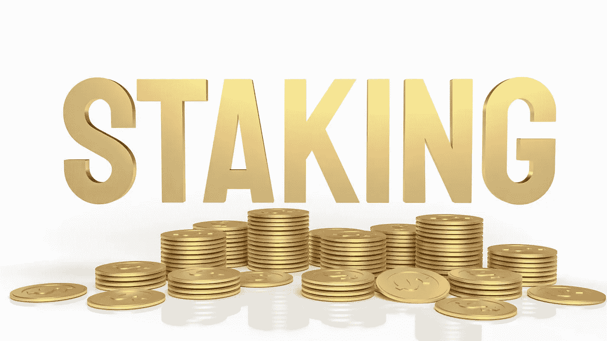
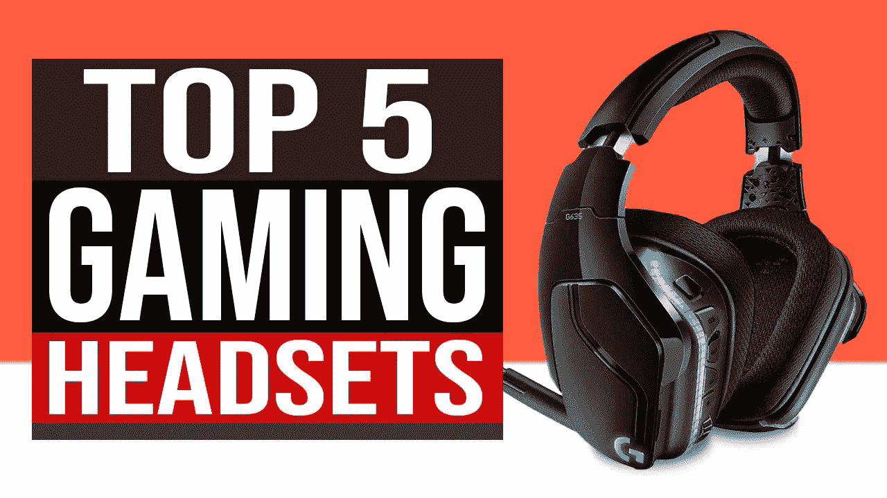

# 2022 年 7 个最佳赌注硬币

> 原文：<https://medium.com/coinmonks/7-best-staking-coins-in-2022-70dbc31adcae?source=collection_archive---------3----------------------->

**7 Best Staking Coins in 2022**

# 概述:

当我们走向 2021 年的尾声时，我们已经看到许多硬币的价值以绝对抛物线的速度增长。像卡尔达诺、索拉纳、币安和其他项目在 2021 年到目前为止已经完成了 500%到 3000%。我一直在寻找下一种能够为我们的投资带来丰厚回报的替代货币，所以在这篇文章中，我想给你我认为将在 2022 年底成为七大加密货币的名单。我整理了我的列表，我们将从数字 7 开始，以我认为将在明年年底排名第一的加密货币结束。

我们还将讨论为什么一个目前排名前五的流行密码被排除在名单之外。我要说，把自己限制在只有七个选择真的很难。我已经不再考虑稳定的硬币。当然，如果你最喜欢的硬币不在名单上，请在下面的评论区告诉我。但如果你要把它加入名单，它仍然是前七名，所以也请让我知道你会删除什么加密货币。好吧！让我们现在就开始吧。

# 7 个最好的赌注硬币:

# 7-宇宙-原子

好的，我们从单子上的第七个开始，那就是宇宙和他们的原生硬币，叫做**原子。**这款区块链的功能以及它在跨链互操作性方面的成熟程度，再加上与 Solana 和 Cardano 甚至 polka dot 等其他密码相比的当前市值，我们可以在未来几个月内轻松看到 cosmos 5x。在我忘记之前，你需要一个 [**比特币基地**](http://coinbase.com/join/hanzaz_3i?src=android-link) 账户，以防你还没有你的数字钱包。买&卖任何你想要的加密币都很有用。试着 [**开一个新账户**](http://coinbase.com/join/hanzaz_3i?src=android-link) **(通过它你会赚到几块钱)**以后你会感谢我的。

## 👉[购买 Cosmos (ATOM)](https://www.gate.io/ref/8753407)

# **6-币安-BNB**

让我们继续关注列表中的下一个六号选择，即 **Bnb** 或**币安代币。**毫无疑问，如果我去年写这篇文章，将 Bnb 列入名单将是显而易见的事情。2020 年 9 月，币安代币的交易价格约为 31 美元，现在约为 400 美元。然而，我认为我们刚刚开始了解币安的情况，我们必须记住这仍然是一家相当新的公司，他们已经是世界上排名第一的中央加密货币交易所。此外，他们还拥有全球第二大使用率极高的 defy exchange。对了，你 [**加入币安交易平台**](https://accounts.binance.com/en/register?ref=26723737) 了没有？目前最值得信赖的平台。

尽管如此，我认为我们在 2022 年将经历的增长将使这一切相形见绌。我从 [**币安平台**](https://accounts.binance.com/en/register?ref=26723737) 看到的最有希望的事情之一是，他们不仅愿意并积极主动地尝试遵守所有的法规，而且还作为密码法规的领导者。币安不仅是加密领域的领导者，也是全球金融领域的领导者。

## 👉[购买币安(BNB)](https://accounts.binance.com/en/register?ref=26723737)

# **五链环—链环**

继续移动到我清单上的第五个位置，那就是**链环。**目前，是市值排名第 13 的加密货币。但是，我确实认为它被严重低估了。你知道我鼓吹互操作性。随着这些区块链的发展，有更多的应用程序在其上运行，它们也将开始相互通信。

就像我们的现代互联网是服务器和数据库相互作用的组合。我们将很快到达这样一个点，取而代之的是区块链在进行交互，取代和消除对数据库的需求。

也就是说，Chainlink 是区块链和外部世界实时信息之间的纽带。链式链接和去中心化神谕的能力赋予了契约更智能的能力。还有其他的神谕，但 Chainlink 是迄今为止最先进的，几乎与每个主要的区块链项目都有集成和合作。

## 👉[购买链环(LINK)](https://accounts.binance.com/en/register?ref=26723737)

# **4-茄尼醇**

如今，加密领域最热门的词汇是**索拉纳和**，它在最佳赌注硬币中排名第四。索拉纳在十个月内从不到两美元暴涨到两百多美元。这不仅仅是一些泵和倾倒或夜间飞行项目。他们的技术是真实的，不同于其他一些主要玩家。

他们的区块链基于共识算法历史证明，这是他们验证事件之间的顺序和时间流逝的方法。虽然，索拉纳似乎从哪里冒出来，但他们也不会去任何地方。因为它们很快开始吸引一些主要机构投资者的注意力和金融兴趣。

## 👉[购买索拉纳(SOL)](https://accounts.binance.com/en/register?ref=26723737)

# 赞助广告:

**5 Best Gaming Headset for Metaverse Video Games**

## 🌟元宇宙电子游戏的 5 款最佳游戏耳机列表🌟

## 对于小额预算:

**🌟1.Oneodio A71 游戏耳机** https://bit.ly/3h8NQmh[✔aliexpress:](https://bit.ly/3h8NQmh)

**🌟2.eksa e 1000 7.1** https://bit.ly/3JJ32ms[✔aliexpress:](https://bit.ly/3JJ32ms)

**🌟3.dacom gh05 7.1** https://bit.ly/3JJ379K ✔aliexpress:

**🌟4.HAVIT H2002d 有线耳机游戏玩家** https://bit.ly/3v4qbM1[✔aliexpress:](https://bit.ly/3v4qbM1)

**🌟5.EKSA 游戏耳机 gamer e900/e900** https://bit.ly/3JEnV2c[✔aliexpress:](https://bit.ly/3JEnV2c)

# **3-POLKADOT — DOT**

列表中的第三个可能是我最喜欢的加密项目之一。我个人现在已经关注和谈论 **Polkadot DOT** 很久了。如果这篇文章讨论的是 2025 年的**最佳赌注硬币**，那么它们现在可能是第一名。我们处在这样一个时代，我们正等着看哪一个利害攸关的区块链会成为最有价值的国家。

我喜欢 Polkadot 处理网络扩展的方式。有时候，在技术领域，向最聪明的人展示你的才华是一出好戏。从很多方面来说，甚至从最初的以太坊创始人团队来说，加文·伍德在技术开发方面处于另一个水平。因此，当我们在 2021 年坐在这里，Polkadot 的市值不到 Cardano 的一半时，我认为这个 dot 可能会大幅上涨。

## 👉[购买波尔卡多特(DOT)](https://accounts.binance.com/en/register?ref=26723737)

# 🌟[在 USDT 创建一个币安账户并获得 100 美元奖金](https://www.binance.com/en/activity/referral/offers/claim?ref=CPA_00M6XWFUN3)🌟

**🌟** [**Create a Binance account and get 100$ Bonus in USDT**](https://www.binance.com/en/activity/referral/offers/claim?ref=CPA_00M6XWFUN3)**🌟**

# 🌟我有一个伟大的奖金给你:100 美元在币安注册后🌟

[**一旦您通过此链接**](https://www.binance.com/en/activity/referral/offers/claim?ref=CPA_00M6XWFUN3) 创建了您的币安，存款超过 50 美元，然后在到期前兑换您的 100 USDT 优惠券。

# **2-比特币-BTC**

然后有两个，这不是你的标准饼干切工名单，其中**比特币 BTC** 总是在第一的位置。所以在这个列表中，密码的鼻祖是第二位的。现在我并不是说比特币已经死了或者正在消失。远非如此，我认为这将在 2022 年稳步增长，并应超过 1.5 万亿美元的市值。我觉得我们将会看到更多的财富 500 强公司走上同样的道路，因为迈克尔的水手和微战略公司采用比特币标准来管理他们的公司财务。

然而，我确实觉得区块链和分布式账本技术不仅仅会用于金融。将会有无限多的用例受益于利益证明和智能合约技术。因此，虽然我仍然认为比特币作为价值储存手段是无与伦比的，比特币的第二层功能也应该开始进步。

我还有一种加密货币领先，那将是第一名。因此，如果你一直和我在一起，你可能会想到两种加密货币，甚至可能会想为什么我没有提到它们，只剩下一个位置了。

## 👉[购买比特币(BTC)](https://accounts.binance.com/en/register?ref=26723737)

# **1-以太坊— ETH**

我们将谈论这两个，但在我的最佳赌注硬币清单上排名第一的是**以太坊 ETH** 。是啊！翻转将发生在 2021-2022 年。目前，以太坊的市值约为 3860 亿英镑，而比特币的市值为 8510 亿英镑。但是我们从以太坊看到的是网络的赌注和支持。不仅因为他们开始合并，最终成为股权的证明，而且随着最近伦敦硬分叉的数额东方股权为 2.0，使 eth 2.0 合同的最大持有人在网络上的 eth。

当你考虑到该合同的提款还不可用时，这就更令人印象深刻了。因此，当你把它与 EIP 1559 和交易费用的燃烧，以及从比特币转向以太坊的机构兴趣激增联系在一起时，墙上的文字是以太坊将成为第一，这将发生在 2022 年。

## 👉[购买以太坊(ETH)](https://accounts.binance.com/en/register?ref=26723737)

# 我离开的那个:

现在，你不能相信我漏掉了一个人:**卡尔达诺·阿达。**听着，正如我之前说过的，很难只挑选七个人，这就像挑选一个全明星队，你可以让某人上场，但你也必须让某人下场。对于 ADA，我有一种感觉，基于 Charles Hoskinson 的炒作和良好的营销，它的出现有点早。而目前网络的技术和能力也不支持这个时候的价格。

这绝不是说卡尔达诺不好或者阿达会失败。我确实认为现在知道还为时过早，但我们看到越来越少的人在 Cardano 上开发，随着最近的 hard fork 和 smart contracts，我们可能会看到为什么越来越少的开发者在 Cardano 上开发。这是一个 UTXO 区块链。这意味着**未用完的交易产出，**简单地说，它衡量某人完成一笔交易后剩余的未用完的交易。就可伸缩性和吞吐量功能而言，这种方法有很多优势。然而，这也意味着 Cardano 为分散式应用程序使用了不同于以太坊等基于账户的区块链的编程范式。

Cardano 开发 d-app 的方法是不同的，因此它需要一个学习曲线和不同的方法。此外，我们现在确实有智能合约，但直到 Cardano 与 basho 开发的下一阶段，我们才开始获得可扩展性的增强。出于所有这些原因，卡尔达诺和阿达没有进入我 2022 年的首选名单。

***NB:*** *如果你更喜欢投资一些元宇宙密码——我习惯在* [***Gate.io 平台***](https://www.gate.io/signup/8753407) *(目前最值得信赖的平台之一，排名前 10)中找到它们，这让我有可能找到最新的元密码和可靠的项目。* [***在 gate . io***](https://www.gate.io/signup/8753407)**开户，领取 10%的奖金，享受自己每周的奖励。**

# *结论:*

*我强烈建议使用像币安这样可靠的平台来投资和交易加密货币。我在加密货币上投入了大约 1000 美元，我仍在等待合适的时机出售。我长期 HODL 我的硬币。网上赚钱这个领域需要耐心和务实。 [**只需在币安**](https://accounts.binance.com/en/register?ref=26723737) 开户，尽可能享受其特权。*

*现在，你知道 2021- 2022 年**最好的 7 个赌注硬币是什么了吧。**如果你的列表与我的不同，请告诉我 2022 年底你的七大加密货币是什么，直到下一次安全。如果你评论和分享这篇文章，我会很高兴，这是让我有动力创造更多信息内容的原因。*

*最后，请做你自己的研究，这篇文章是我自己的观点，而不是投资建议。*

*请关注并订阅，并确保分享我的作品作为激励。点击这里查看我的文章列表:[**https://medium.com/@s.hanz**](/@s.hanz)*

# *🌟如果你不是设计师，想推出自己的 NFT 系列🌟*

*[**1。Rafcreative 是一个疯狂的艺术家**](https://go.fiverr.com/visit/?bta=182994&brand=fiverrcpa&utm_campaign=freewaystopromote&landingPage=https%3A%2F%2Fwww.fiverr.com%2Frafcreative%2Fdraw-custom-character-for-nft-collection%3F) 提供了只花几美元就能得到自己的 NFT 收藏的可能性，这让他在竞争中脱颖而出。他提供了 20 个详细的物品附件及其源文件的集合。*

**

***2。** [**达米安 3d5 是 NFT 顶级艺人**](https://go.fiverr.com/visit/?bta=182994&brand=fiverrcpa&utm_campaign=friday110222&landingPage=https%3A%2F%2Fwww.fiverr.com%2Fdamian3d5%2Fdo-unique-nft-art-collection-with-100-1k-10k-attributes%3F) ，与**分野**“互联网软件&服务”**萨巴顿**等大牌合作。他提供 100，1K 和 10K NFT 的收藏。*

**

# *更多文章:*

*[**2022 年元宇宙最佳 5 个好项目——榜单 1**](/@s.hanz/best-5-metaverse-crypto-coins-with-good-projects-in-2022-list-1-687fedbe668e)*

*[***2022 年最佳 5 个元宇宙加密币好项目—榜单二***](/@s.hanz/best-5-metaverse-crypto-coins-with-good-projects-in-2022-list-2-15af2f8f01d9)*

*[**需要钱的时候要做的事情快——新招**](/@s.hanz/things-to-do-when-i-need-money-fast-new-tricks-2b68ad24406b)*

*[**2022 年 NFT 项目 7 大免费推广方式**](/coinmonks/7-free-ways-to-promote-nft-projects-in-2022-ccefc7f249e7)*

> **加入 Coinmonks* [*电报频道*](https://t.me/coincodecap) *和* [*Youtube 频道*](https://www.youtube.com/c/coinmonks/videos) *了解加密交易和投资**

# *另外，阅读*

*   *[3 commas Review](/coinmonks/3commas-review-an-excellent-crypto-trading-bot-2020-1313a58bec92)|[Pionex Review](https://coincodecap.com/pionex-review-exchange-with-crypto-trading-bot)|[coin rule Review](/coinmonks/coinrule-review-2021-a-beginner-friendly-crypto-trading-bot-daf0504848ba)*
*   *[莱杰 vs n rave](/coinmonks/ledger-vs-ngrave-zero-7e40f0c1d694)|[莱杰 nano s vs x](/coinmonks/ledger-nano-s-vs-x-battery-hardware-price-storage-59a6663fe3b0) | [币安评论](/coinmonks/binance-review-ee10d3bf3b6e)*
*   *[Bybit Exchange 审查](/coinmonks/bybit-exchange-review-dbd570019b71) | [Bityard 审查](https://coincodecap.com/bityard-reivew) | [Jet-Bot 审查](https://coincodecap.com/jet-bot-review)*
*   *[3 commas vs crypto hopper](/coinmonks/3commas-vs-pionex-vs-cryptohopper-best-crypto-bot-6a98d2baa203)|[赚取加密利息](/coinmonks/earn-crypto-interest-b10b810fdda3)*
*   *最好的比特币[硬件钱包](/coinmonks/hardware-wallets-dfa1211730c6) | [BitBox02 回顾](/coinmonks/bitbox02-review-your-swiss-bitcoin-hardware-wallet-c36c88fff29)*
*   *[BlockFi vs Celsius](/coinmonks/blockfi-vs-celsius-vs-hodlnaut-8a1cc8c26630)|[Hodlnaut 点评](/coinmonks/hodlnaut-review-best-way-to-hodl-is-to-earn-interest-on-your-bitcoin-6658a8c19edf) | [KuCoin 点评](https://coincodecap.com/kucoin-review)*
*   *[Bitsgap 审查](/coinmonks/bitsgap-review-a-crypto-trading-bot-that-makes-easy-money-a5d88a336df2) | [Quadency 审查](/coinmonks/quadency-review-a-crypto-trading-automation-platform-3068eaa374e1) | [Bitbns 审查](/coinmonks/bitbns-review-38256a07e161)*