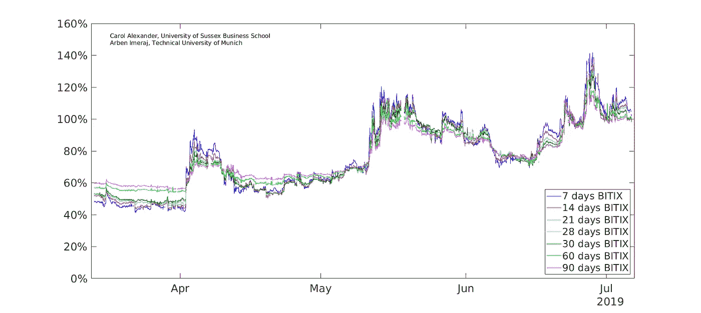
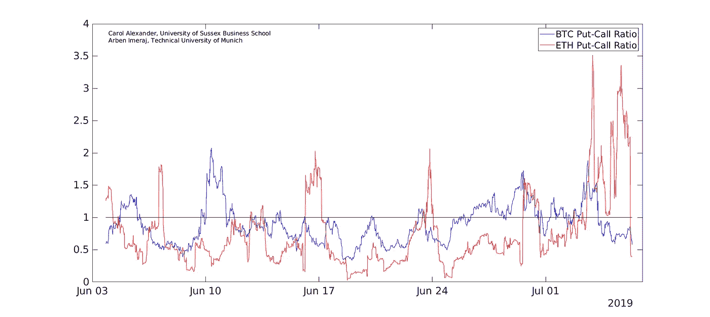

# 7 天比特币恐惧指数创下 138%的历史新高

> 原文：<https://medium.com/coinmonks/7-day-bitcoin-fear-gauge-hits-all-time-high-of-138-10c35c15f55b?source=collection_archive---------1----------------------->

关于比特币恐惧指数有很多炒作。[1]甚至还有一个“恐惧和贪婪”指数。[2]所以要小心取名字。

**最初的“投资者恐惧指标”是 VIX 指数**

VIX 完全来自标准普尔 500 的标准欧洲看跌期权和看涨期权的当前价格快照。这是一个指数，俗称股市*恐惧指标*。

指数公式是未来 30 天已实现波动率的公允价值互换率。[3]因此，它代表了知情交易者对下个月 S&P 股票价格波动的看法。CBOE 提供 30 天 VIX 的每日报价。

同样，BITIX 是一个比特币*恐惧指标*，完全来自比特币看跌期权和看涨期权的价格快照 [t](#_msocom_2) 。[4]但是潜在的比特币价格比股票价格波动得更快。所以，我们不仅仅提供 30 天指数的每日报价。我们提供每 15 分钟更新一次的 BITIX 指数报价，以预测未来 1 周至 3 个月的比特币波动性*。[5]*

**n 日 BITIX 使用 n 日比特币期权价格的快照来暗示知情交易员对未来 n 日比特币价格平均波动性的看法。**

我们使用 Deribit API 下载比特币期权的交易价格数据，进行标准的 VIX 式计算。这样，我们为 7 到 90 天的时间范围引用 BITIX(和 ETHIX)。[6]

上图显示了过去 4 个月 BITIX 期限结构的演变。[7]6 月 26 日，7 天期 BITIX 创下 138%的历史新高。就在 3 个月前，这一比例仅为 40%。7 天 BITIX 的变化比长期 BITIX 大得多，因为对未来一个月或未来 3 个月基础比特币价格平均波动性的看法不会随着时间的推移而发生太大变化。目前，7 天期 BITIX 比长期 BITIX 指数高 10%，但 3 月份时却低了 20%。

像 VIX 一样，BITIX 会经历波动的现货溢价期(短期 BITIX 大于长期 BITIX)和较为平静的期货溢价期(反之亦然)。然而，虽然 VIX 只在股市崩盘时才会上涨，但目前比特币价格只有在比特币价格上涨时才会上涨。简而言之，这意味着比特币价格上涨后的回报率往往比同等规模的下跌后更不稳定。这与股票正好相反。

但这只是在过去的几个月里，所有的加密市场都处于高波动状态。在低波动状态下，比特币的行为更像股票。因此，如果/当我们进入一个更平静的时期，BITIX 指数将随着比特币价格的下跌而上涨，而不是上涨。[8]

一个相关的指标是看涨看跌期权比率(PCR)，它是代表交易者对价格变化的未来*方向*的观点的有力工具。这是由看跌期权的 24 小时交易量除以看涨期权的 24 小时交易量得出的。PCR 大于 1 意味着交易的看跌期权多于看涨期权，这表明交易者预计比特币价格会下跌。

上图描绘了过去一个月中，每 15 分钟比特币 PCR 和以太 PCR 的演变。整个 6 月，BTC PCR 都不到 1，这表明交易员预计比特币价格会上涨，但 6 月 5 日、6 月 10 日和 6 月 26 日之后的 3 天除外。

对乙醚价格上涨的预期(表明 ETH PCR 比 1 小得多)在 6 月份更加强烈。然而，就在最近几天，乙醚看跌期权的一些异常大的交易(例如，7 月 4 日的一次交易中有 700 个期权)使乙醚 PCR 变得疯狂。超过 3 的 PCR(即交易的看跌期权是乙醚看涨期权的三倍)刚刚回到一个更正常的水平，这个水平远低于。在过去的 24 小时内，有 8243 笔看涨期权和 1848 笔看跌期权在 Deribit 上交易，交易量较小。这是乙醚价格即将上涨的又一个强烈迹象。

**卡罗尔·亚历山大和阿尔本·伊梅拉杰【2019 年 7 月 6 日**

亚历山大教授领导苏塞克斯大学量化金融科技网络(QFIN)的加密资产风险小组。Arben Imeraj 是慕尼黑工业大学数学专业的硕士研究生。

注意事项:

[1]*2014 年 12 月，比特币基地:BitMEX 推出比特币“恐惧”指数。*记者 Joon Ian Wong 报道，标准的 30 天历史波动率将成为比特币的第一个 VIX。还是已实现波动率指数？BitMEX 首席执行官阿瑟海斯(Arthur Hayes)表示:“这将让我们一窥市场参与者认为未来波动性将在哪里实现。”。我们说…..胡扯。你无法从历史比特币回报中窥见未来。只有基于期权的指数才能做到这一点。

[2]比特币所谓的“恐惧和贪婪”情绪指数可以在 coininquire.com 和 alternative.me 等几个地方找到——但这些只是从比特币价格、交易量、twitter、谷歌趋势等得出的标准指标。苏塞克斯大学的加密货币市场风险小组正在使用所有这些数据和更多数据为几个硬币开发情绪指数，并使用包括 NLP(自然语言处理)在内的机器学习工具进行分析。请关注此媒体频道，了解更多消息。

[3]已实现波动率是一个前瞻性的统计波动率。统计波动率完全基于潜在回报，与期权价格无关。但是期权价格对于隐含期权交易者行为的前瞻性预期是必要的——特别是场外看涨和看跌期权交易。

[4]我们本可以把我们的比特币恐惧指标命名为 BIX，以 VIX 命名，但我们不能——BIX 已经是(航运业的)掩体指数了。无论如何，我们也引用 ETHIX(相同的术语结构，每 15 分钟一次),这是对以太的类似恐惧指数——鉴于所有关于加密的宣传，ETHIX 是一个贴近我们内心的名字。

[5]请注意，自今年 1 月以来，LedgerX 提供了名为 LXVX 的 30 天指数报价。首席执行官解释说，这是一个跟踪比特币**预期波动**的指数。“(波动指数)告诉你市场预测的**预期确定性**…”我们的重点。抱歉，但预期不是一个既可以用于波动性(即标准差)也可以用于确定性(即概率)的形容词。但撇开名字不谈，30 天对比特币市场来说是一段非常非常长的时间。而 LXVX 每 2 小时才报价一次。

[6]众所周知，这个公式具有跳跃和离散化误差，这使得它在高度不稳定时期不准确。从期权价格计算波动性恐惧指标，还有其他几种更好的方法。参见 Leontsinis，s .和 C. Alexander 的“算术方差互换”定量金融第 17 卷(第 4 期)551–569 页，也可了解计算偏斜度和峰度恐惧指标的公式。

[7]30 天指数(深绿色线)就像 LXVX，除了我们不过滤从 25%到 75% delta 的范围。也就是说，这与现金罢工相比并没有太大的不同。如果有足够的交易量，我们的期权数据会深入到场外(OTM)——这样，BITIX 就真正抓住了对价格大幅上涨的担忧。

[8]这些陈述是完全合理的，并在 Alexander，c .和 M. Dakos 的“加密货币数据和分析的关键调查”的第 5 节中进行了详细解释。即将出版的《量化金融》第 20 卷(1)。

【BITIX 图注释:

**02 年 04 月 05:00 至 03 年 04 月 03:00 BTC 现货回报+20%** 7 天期 BITIX 从 45%至 85%→对未来一周波动性的强烈担忧
30 天期 BITIX 从 50%至 70%→对未来一个月波动性的轻度担忧

**5 月 11 日 06:00 至 5 月 13 日 16:00 BTC 现货回报+17%** 7 天期 BITIX 从 72%升至 115%→对未来一周波动性的强烈担忧
30 天期 BITIX 从 72%升至 105%→对未来一个月波动性的担忧
90 天期 BITIX 从 71%升至 95%→对未来 3 个月波动性的轻度担忧

**6 月 26 日 BTC 从 11，750 美元跃升至 13，900 美元，然后又回到 11，750 美元** 7 天期 BITIX 从 98%升至 138%→非常担心未来一周的波动性
30 天期 BITIX 从 97%升至 120%→非常担心未来一个月的波动性
90 天期 BITIX 从 94%升至 110%→非常担心未来 3 个月的波动性

> [直接在您的收件箱中获得最佳软件交易](https://coincodecap.com/?utm_source=coinmonks)

