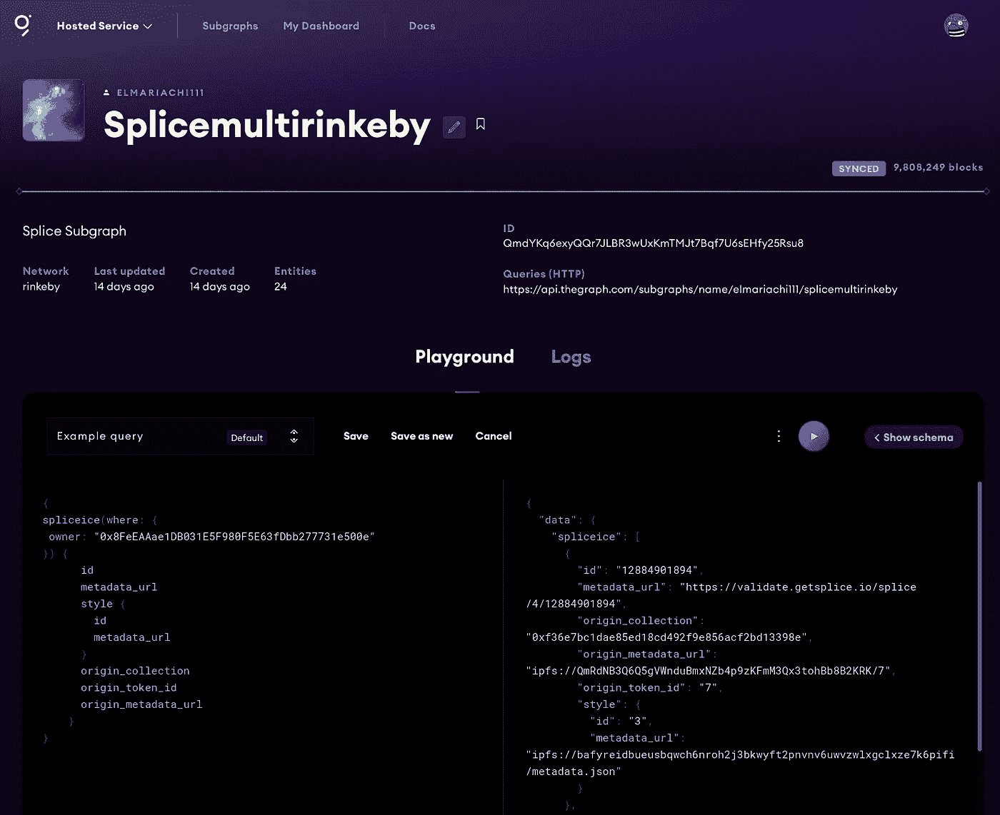

# 智能合同开发人员的 7 个关键见解:我们从构建拼接中学到了什么

> 原文：<https://medium.com/coinmonks/7-key-insights-for-smart-contract-developers-what-weve-learned-building-splice-995dbb7bc2d6?source=collection_archive---------4----------------------->

我们即将推出一款新的 web3 产品，并希望分享我们在这一过程中学到的一些最重要的东西:

*   如何将关注点分离到不同的契约中？
*   验证所有权并允许初步铸造
*   如何保证没有人能在元数据上作弊？
*   组合令牌 id
*   我们是否应该转用 L2 的网络来降低汽油费？
*   如何降低仓储成本？
*   如何保证支付安全？

首先快速概述一下我们已经构建了什么:Splice 允许您使用您已经拥有的 NFT 来播种新生成的 NFT。请访问我们的 Dapp，网址为 [https://getsplice.io](https://getsplice.io) ，并选择您的一个 NFT。Splice 将提取其元数据和颜色，并将其注入到您选择的生成艺术风格的代码中。结果是一个独特的艺术品，你可以作为 NFT 铸币。我们推出了艺术风格来生成横幅图像，您可以将其植入您的 PFP，并在 Twitter 或 Discord 上使用，如下所示:


A Splice background image minted of [Fangster #5409](https://opensea.io/assets/0x9d418c2cae665d877f909a725402ebd3a0742844/5409) and the Style “A Beginning is A Very Delicate Time”

拼接的规模超越了横幅图像，并将以各种方式发展。我们的合同准备将不止一个 NFT 作为原产地，[我们最终将把更多的输入参数](https://github.com/SpliceNFT/splicenft/issues/86)交给风格代码，包括原产地 NFT 的特征、额外的图像分析数据或稀有度得分。这将使艺术家能够为更高级的用例构建风格。拼接将能够选择 [Loots](https://opensea.io/collection/lootproject) 或[颜色](https://opensea.io/collection/the-colors-dot-art)或 [DevDAO 的 NFTs](https://opensea.io/collection/devs-for-revolution) 作为输入，并创建新的元宇宙项目。

这个想法把我们带入了《EthOnline21》的大结局。你可以从 10 月 21 日(7:16)在黑客马拉松的 Splice 版本上观看我们的最终项目推介:

这是我们的 Dapp 经过大约 2 个月的微调和功能添加后的样子。[请随意尝试一下](https://getsplice.io) —在撰写本文时，我们支持在您的 mainnet 资产上预览样式，您将能够在 Rinkeby 测试网络上对选定的集合进行拼接。


[https://getsplice.io](https://getsplice.io)

# 如何将关注点分离到不同的契约中？

我们的[拼接契约](https://github.com/SpliceNFT/splicenft/tree/main/packages/contracts/contracts)涵盖了两个主要用例。首先，拼接合同本身是一个 ERC721 兼容的 NFT，用于跟踪预制拼接的所有权。其次，Splice 的**样式**由另一个契约(Splice Style NFT)管理，该契约控制样式的所有权并存储样式代码及其元数据的固定位置。每种风格的 NFT 都会强制执行一些规则，比如一种风格可以铸造多少个拼接，铸造是否仅限于某些原产地系列，铸造者是否拥有独家铸造权，以及最重要的是，一个铸币厂有多贵。

为了分离关注点，我们决定将拼接架构分为三个合同:拼接、风格和价格策略(静态)。我们在部署/样式创建过程中通过将成员属性类型化为组合契约来连接所有这些契约。

```
contract **Splice** { **SpliceStyleNFT** public styleNFT; function **setStyleNFT**(SpliceStyleNFT _styleNFT) public onlyOwner {
    styleNFT = _styleNFT;
  } function quote(IERC721 nft, uint32 style_token_id) 
    public view 
    returns (uint256 fee) { 
      return **styleNFT**.quoteFee(nft, style_token_id);
  }
}contract **SpliceStyleNFT** { address public **spliceNFT**; function **setSplice**(address _spliceNFT) external onlyOwner {
    spliceNFT = _spliceNFT;
  } function quoteFee(IERC721 nft, uint32 style_token_id)
    external 
    view 
    returns (uint256 fee) {
      fee = styleSettings[style_token_id].**priceStrategy**.quote(
        this,
        nft,
        style_token_id,
        styleSettings[style_token_id]
      );
    }
  function mint(
    ...
    **ISplicePriceStrategy** _priceStrategy,
    bytes32 _priceStrategyParameters
  ) {
    styleSettings[style_token_id] = StyleSettings({
      **priceStrategy**: _priceStrategy,
      **priceParameters**: _priceStrategyParameters
    })
 }}struct **StyleSettings** {
  uint32 mintedOfStyle;
  uint32 cap;
  ISplicePriceStrategy **priceStrategy**;
  bytes32 **priceParameters**;
  bool salesIsActive; 
  bool collectionConstrained;
  bool isFrozen;
  string styleCID;
}contract **SplicePriceStrategyStatic** { function quote(
    SpliceStyleNFT **styleNFT**, 
    IERC721 collection, 
    uint256 token_id,
    StyleSettings memory styleSettings
  ) external pure override returns (uint256) {
    return uint256(styleSettings.**priceParameters**);
  }}
```

在可靠性中分离关注点可能是一个架构上的挑战，因为一旦契约被部署，它们通常不能被改变。我们的`priceStrategy`乍一看似乎是不必要的，因为它只是返回一个样式制作者在制作过程中提供的静态费用。我们这样做的原因是基于前瞻性的假设。智能合约的设计必须足够开放，以便从第一天起就可以扩展，因为一旦它们进入状态并被广泛使用，改变它们将是一场噩梦。

我们的 *PriceStrategy* 抽象允许在未来添加更复杂的价格计算，而不需要我们对现有合同做任何修改。它的实现接收足够的信息，以支持任意复杂的定价策略。一个简单的扩展可以是线性结合的铸造费用算法，它随着每个拼接铸造而略微增加费用，或者是荷兰式拍卖，它根据自上次铸造以来经过的时间而改变费用。

# 谁去造币厂？验证所有权并允许初步铸造

确保某人拥有一个原点是相当简单的，您只需将原点集合的地址转换为 IERC721，并检查它的`ownerOf`方法是否为传入的令牌 ID 产生了`msg.sender`:

```
function mint(
    **IERC721**[] memory origin_collections,
    uint256[] memory origin_token_ids,
    uint32 style_token_id,
    bytes32[] memory allowlistProof,
    bytes calldata input_params
) {
for (uint256 i = 0; i < origin_collections.length; i++) {
      if (origin_collections[i].**ownerOf**(origin_token_ids[i]) != msg.sender) {
        revert NotOwningOrigin();
      }
}
```

但是还有更多。一个艺术家可能会决定建立一种只适用于三个专门的原创系列的风格。如果是这样的话，这些收藏的地址可以在我们的风格 NFT 的`collectionAllowed`成员中提供。当原始集合未列在约束列表中时，具有集合约束的样式将恢复拼接薄荷。默认情况下，风格并不局限于特定的集合，所以拼接可以铸造任何原产地 NFT。

最后，我们决定添加一个对每种风格的 NFT 都独一无二的特征。如果您想简单地构建 allowlists，您可以只添加一些类型为`mapping(uint32 => mapping(address => bool))`的成员，但是在部署新样式时必须初始化映射。如果一个样式创建者想要在一个 allowlist 上有 200 个地址，那就需要在创建事务中发送大量的 gas。因为我们想让这个功能更节能，所以我们必须想出一个更好的解决方案。

我们决定使用 [Merkle 树证明](https://media.consensys.net/ever-wonder-how-merkle-trees-work-c2f8b7100ed3)来确定 mint 请求是否是由一个被允许的用户发出的。幸运的是，OpenZeppelin 为我们介绍了他们的 Merkle proofs 的[参考实现](https://docs.openzeppelin.com/contracts/4.x/utilities#verifying_merkle_proofs)，所以实现这个特性只需要一行实际代码:

```
///SpliceStyleNFT.solfunction **verifyAllowlistEntryProof**(
  uint32 style_token_id, 
  bytes32[] memory allowlistProof,
  address requestor
) public view returns (bool) {
  return **MerkleProof.verify**(
    allowlistProof,
    allowlists[style_token_id].merkleRoot,
    keccak256(abi.encodePacked(requestor))
  );
}///Splice.sol:mintif (
  allowlistProof.length == 0 || 
  !styleNFT.**verifyAllowlistEntryProof**(
    style_token_id,
    allowlistProof,
    msg.sender
  ) {
    revert NotAllowedToMint('no reservations left or proof failed');
  }
)
```

这种方法的缺点是 allowlist 成员必须保存在一个安全的地方，并且必须为每个用户单独生成证明，但是因为这个特性无论如何都处理许可的数据，所以没有必要以 100%分散的方式解决它。创建相应证明数组的客户端代码如下所示:

```
import { MerkleTree } from 'merkletreejs';
import keccak256 from 'keccak256';function createMerkleProof(allowedAddresses: string[]): MerkleTree {
  const leaves = allowedAddresses.map((x) => keccak256(x));
  return new MerkleTree(leaves, keccak256, {
    sort: true
  });
}const allowedAddresses: string[] = [/* many 0xaddresses */]const merkleTree = createMerkleProof(allowedAddresses);
const leaf = utils.keccak256(_allowedAddresses[0]);// this grows linearly with the overall amount of allowed addresses
const proof = merkleTree.getHexProof(leaf);const verified = await styleNft.**verifyAllowlistEntryProof**(
  1,
  proof,
  allowedAddresses[0] 
);expect(verified).to.be.true;
```

# 热保证没人能在元数据上作弊？

我们最初实现 Splice 的[是基于这样一个假设，即用户完全控制他们的拼接结果:代码在用户的机器上呈现拼接结果，将其编码为 PNG，在 IPFS 上发布(使用](https://showcase.ethglobal.com/ethonline2021/splice) [nft.storage](https://nft.storage/) )，然后使用其 IPFS 内容散列调用契约的 mint 方法。

然后我们意识到，这个实现很容易被用户欺骗:他们实际上可以将任何他们喜欢的 IPFS 散列输入到 mint 函数中，实际上能够铸造任何东西。这肯定不是我们想要允许的，所以我们想到了使用 oracle 来请求专用的验证后端，以验证我们用户的新“请求”实际上包含与用户在他们的机器上使用的输入参数相匹配的有效拼接图像(您可以在我们的回购历史中找到该[的实现)。](https://github.com/SpliceNFT/splicenft/blob/77ce12f9843ef53b310fec6454994f965ce288b5/packages/backend/lib/validate.js)

随着专用风格 NFT 的引入，我们不赞成这个验证步骤。到目前为止，Splice 本身根本不存储任何 IPFS 元数据。我们为链上的每个拼接保留的唯一信息是在拼接过程中计算的其“**出处**:

```
/// Splice.sol:mintbytes32 provenanceHash = keccak256(
  abi.encodePacked(
    origin_collections, origin_token_ids, style_token_id
  )
);
```

对于每个拼接输入来说，出处(或者我们历史上称之为遗产)是唯一的。用户本身不提供任何其他信息，除了他们期望的原始输入和样式令牌 id，该 id 确定在输入上执行哪个样式代码，以及哪个本身锚定在 IPFS 上。因此，任何知道导致出处的输入的人都可以确定性地再现渲染图像。

# 组合令牌 id

如果你看一下 [Splice 的令牌 id](https://testnets.opensea.io/assets/0xea934c468e6c8c0c60e6e62797ae57dbd601970f/12884901892)，例如“ *12884901894* ”，你会注意到它们似乎不是递增生成的。基本上是，但是很难看到。Splice 将每个令牌的两个增量 ID 组合成一个唯一的 ID 值。它将选定的样式 id 和增量(每种样式)拼接标记 ID 组合成一个唯一的标记 id (uint64，按照 ERC721 的要求存储为 uint256):

```
/// SpliceStyleNFTfunction incrementMintedPerStyle(uint32 style_token_id)
    external
    onlySplice
    returns (uint32)
{
      if (mintsLeft(style_token_id) == 0) {
        revert StyleIsFullyMinted();
      }

      styleSettings[style_token_id].mintedOfStyle += 1;
      return styleSettings[style_token_id].mintedOfStyle;
}/// Splice.sol
uint32 nextStyleMintId = styleNFT.incrementMintedPerStyle(style_token_id);token_id = BytesLib.toUint64(
  **abi.encodePacked(style_token_id, nextStyleMintId),** 
  0
);
```

这种方法允许您计算每个拼接 NFT 的风格遗产。取其最低有效的 64 位，分成两个 uint32 值。第一个表示样式 ID，第二个表示该样式的增量接头 ID:

```
/// Splice.tspublic static tokenIdToStyleAndToken(**tokenId**: BigNumber) {
    const hxToken = ethers.utils.arrayify(
      utils.zeroPad(tokenId.toHexString(), 8)
    );
    return {
      **style_token_id**: BigNumber.from(hxToken.slice(0, 4),
      **token_id**: BigNumber.from(hxToken.slice(4))
    };
  }
```

十进制读为`12884901894`的令牌 ID 转换为十六进制字符串`0x0300000006`(或填充为 8 字节/ uint64: `0x0000000300000006`)，因此它实际上转换为“style #3 的 splice #6”。


# 我们是否应该转用 L2 的网络来降低汽油费？

最小化 L1 造币厂的额外网络成本应该是每个 web3 项目的主要关注点。乍一看，拼接实际上是 L2 明廷的一个很好的候选，但这样做会引入一个额外的架构复杂性层。记住，拼接依赖于关于某些资产所有权的知识(原始 NFT)。为了铸造一个拼接，合同必须确保铸造者实际上拥有他们的原产地 NFT。如果你想在 L2 网络上对 L1 现有的资产进行拼接，你需要创建一个所有权关系的密码确定性证明，并使用在各层之间传递知识的消息桥进行通信[。更糟糕的是，该证明在创建后可以通过将原始资产转移到另一个账户而立即被否定，只有通过将原始资产锁定在第三方托管中才能进行补救，以确保其安全，直到 L2 的造币厂最终确定。最终，你要么决定使拼接成为 L2 优先协议，这意味着用户不能在 mainnet 上伪造拼接，要么你必须想出一个非常聪明的 ID 缺口，以便用户可以将拼接从 L2 迁移到 L1，而不会与现有的 ID 冲突。](https://developer.offchainlabs.com/docs/l1_l2_messages)

鉴于大多数有价值的资产仍然锚定在 mainnet 上，而 Splice 的主要目标是为这些资产增值，我们认为将它部署为纯 L1 协议是目前最好的方式(这并不意味着不会很快出现 Polygon、zkSync 或 Arbitrum 版本的 Splice)。

# 如何降低仓储成本？

以太坊高油价的主要驱动力是数据存储。状态树上的每个存储槽必须被所有参与节点复制，并且它们中最昂贵的操作是[分配新的存储槽](/coinmonks/storing-on-ethereum-analyzing-the-costs-922d41d6b316)，这发生在创建新的映射元素或追加数组元素时。事实证明，有史以来最方便的 NFT 加法之一充分利用了这些操作:[可枚举集合](https://docs.openzeppelin.com/contracts/4.x/api/token/erc721#ERC721Enumerable)。它们允许客户端迭代一个用户的所有条目，这个问题通过添加另一个映射和一个索引表在内部得到解决。

删除此功能会减少三分之一(！)和[其他人报告见证了](https://shiny.mirror.xyz/OUampBbIz9ebEicfGnQf5At_ReMHlZy0tB4glb9xQ0E)可比较的结果。

[](https://github.com/SpliceNFT/splicenft/blob/38bf9fad2e4889f33e912106501418f3d7570e3b/packages/contracts/test/gas-comparison.txt) [## splice NFT/gas-comparison . txt at 38 BF 9 fad 2e 4889 f33e 912106501418 f3d 7570 e3b splice NFT/splice NFT

### 可升级| Solc 版本:0.8.10 启用优化器:真实运行次数:200 块限制:30000000 gas……

github.com](https://github.com/SpliceNFT/splicenft/blob/38bf9fad2e4889f33e912106501418f3d7570e3b/packages/contracts/test/gas-comparison.txt) 

我们可以从拼接契约的初稿中删除的另一个存储槽是拼接令牌的“遗产”。事实证明，需要直接存储在链上的唯一信息是拼接遗产的出处散列(32 字节),以确定某个项目是否已经被铸造。这种优化将薄荷的用气量又减少了 30%。

## 那么在哪里存储原始信息呢？拯救之图！

您在 chain 上节省的每个存储插槽都会损失一些功能。当应用上述优化时，我们丢失了两个重要的视图函数，这两个函数以前可以直接在 chain 上请求:1。*拼接标记*和 2 的确切来源是什么。*账户拥有哪些拼接令牌*。

事实证明，这两个特征都是由[子图](https://thegraph.com/en/)索引和查询的完美候选。子图由基于 WASM (AssemblyScript)的索引脚本组成，这些脚本在索引器节点上执行，以构建 onchain 信息的二级数据库，并使用 GraphQL API 公开查询它。尽管该图提供了一种完全去中心化的方式来在激励的索引和监管层上部署子图，但是我们选择了使用它们非常方便(并且免费)的[托管服务](https://thegraph.com/hosted-service/)。

子图映射监听由契约发出的事件，并相应地对它们做出反应。在 Splice 中，一个 minting 事务发出两个事件:一个自定义事件`Minted(bytes32 origin, uint64 token_id, uint32 style_token_id)`和`Transfer`(由基本 ERC721 契约发出)。注意，仅仅通过跟踪`Minted`事件，您仍然不能找出原始集合或令牌 id:我们实际上必须分析的是发出事件的`mint`调用的**事务输入**。我们的子图的`handleMinted`处理程序展示了如何实现这一点:

在从我们的`Mint`事件中提取一些未编码的值之后，我们正在获取发起`mint`方法调用的输入数据(第 18 行),并去掉方法签名的前 4 个字节。现在，我们遇到了底层 [ABI 解码器的 Rust 实现](https://github.com/graphprotocol/ethabi)的一个缺点:它只能解码单个值，例如元组、单位或数组，但**不能像`event.transaction.input`中存储的那样直接解码普通函数调用。我们用来欺骗解码器正确解码我们的函数调用的方法是在参数前加上 [ABI 编码器对元组类型](https://docs.soliditylang.org/en/latest/abi-spec.html#handling-tuple-types) (0x20)的签名，并让解码器对该值进行操作(第 21–32 行):**

```
const decoded = ethereum.decode(
    '**(address[],uint[],uint,bytes32[],bytes)**',
    tupleInputBytes
);
```

我们还制作了一个 Rust 样本来证明这种方法是可行的:

[](https://github.com/SpliceNFT/splicenft/blob/main/packages/subgraph/testdecode/src/main.rs) [## 主拼接处的拼接/主 rs

### 此文件包含双向 Unicode 文本，其解释或编译可能与下面显示的不同…

github.com](https://github.com/SpliceNFT/splicenft/blob/main/packages/subgraph/testdecode/src/main.rs) 

拼接子图可在图的托管服务上公开查询:[https://The Graph . com/hosted-service/subgraph/elmariachi 111/splicemulturinkeby](https://thegraph.com/hosted-service/subgraph/elmariachi111/splicemultirinkeby)并且它为拼接 Dapp 的[“我的拼接”页面提供动力。(注意，由于尚未发现的原因，GraphQL 模式的复数版本`splice`是`spliceice`)](https://getsplice.io/#/my-splices)



a query to retrieve all splice tokens owned by an user

# 如何保证支付安全？

最后，根据 [Consensys 的智能合同安全最佳实践](https://consensys.github.io/smart-contract-best-practices/recommendations/#favor-pull-over-push-for-external-calls)，我们非常小心地确保所有涉及我们合同的付款尽可能安全。我们并没有将铸造费推给收款人，而是要求他们通过自己发布拉交易来撤回铸造费。为了确保所有参与者的资金安全，我们集成了一个[内部令牌](/@ethdapp/using-the-openzeppelin-escrow-library-6384f22caa99) `[escrow](/@ethdapp/using-the-openzeppelin-escrow-library-6384f22caa99)`，它只将资金转移给有资格的参与者，并且由主合同拥有，因此没有人可以劫持托管本身。铸造时，所有费用根据当前有效的协议设置进行分割(艺术家 85%，拼接 15%)，并托管，直到其受益人撤回:

```
import '@openzeppelin/contracts-upgradeable/utils/escrow/EscrowUpgradeable.sol';EscrowUpgradeable private **feesEscrow**;function initialize(...) public initializer {
  /// ...
  feesEscrow = new **EscrowUpgradeable**();
  feesEscrow.initialize();
}function withdrawShares() external nonReentrant whenNotPaused {
    uint256 balance = shareBalanceOf(msg.sender);
    feesEscrow.**withdraw**(payable(msg.sender));
    emit Withdrawn(msg.sender, balance);
}function shareBalanceOf(address payee) public view returns (uint256) {
  return feesEscrow.**depositsOf**(payee);
}//called inside the mint method
function splitMintFee(uint256 amount, uint32 style_token_id) internal {
  uint256 feeForArtist = ARTIST_SHARE * (amount / 100);
  uint256 feeForPlatform = amount - feeForArtist;
  address beneficiaryArtist = styleNFT.ownerOf(style_token_id);
  feesEscrow.**deposit**{ value: feeForArtist }(beneficiaryArtist);
  feesEscrow.**deposit**{ value: feeForPlatform }(platformBeneficiary);                                 }
```

# 卷曲

我们当然可以谈论我们在拼接协议实施过程中发现的许多其他知识。首先，我们可以推荐一件事:自己阅读公共契约准则！你会偶然发现很多别人在你之前已经发现的东西。在我们的案例中，我们通过分析 [ArtBlocks](https://etherscan.io/address/0xa7d8d9ef8d8ce8992df33d8b8cf4aebabd5bd270#code) 、 [Brotchain](https://etherscan.io/address/0xd31fc221d2b0e0321c43e9f6824b26ebfff01d7d#code) 和 [Divine Anarchy](https://etherscan.io/address/0xc631164b6cb1340b5123c9162f8558c866de1926#code) 的合同学到了很多东西。

如果你喜欢你读过的东西，并且你想成为拼接之旅的一部分，不要犹豫，直接在 Discord 或 Twitter 上联系我们。你可能还会发现阅读我们的[开发人员文档](https://splicenft.github.io/splicenft/developers/)有助于更深入地了解拼接协议的内部工作原理。我们很乐意接受任何问题和建议。

> 加入 Coinmonks [电报频道](https://t.me/coincodecap)和 [Youtube 频道](https://www.youtube.com/c/coinmonks/videos)了解加密交易和投资

## 也阅读

[](/coinmonks/leveraged-token-3f5257808b22) [## 杠杆代币[多头代币]终极指南

### 杠杆化令牌是具有杠杆化风险敞口的 ERC20 令牌，不考虑保证金、要求、管理…

medium.com](/coinmonks/leveraged-token-3f5257808b22) [](https://blog.coincodecap.com/crypto-exchange) [## 最佳加密交易所| 2021 年十大加密货币交易所

### 加密货币交易所的加密交易需要了解市场，这可以帮助你获得利润。之前…

blog.coincodecap.com](https://blog.coincodecap.com/crypto-exchange) [](https://blog.coincodecap.com/best-swap-platforms) [## 2021 年最佳加密交换平台| CoinCodeCap

### 编辑描述

blog.coincodecap.com](https://blog.coincodecap.com/best-swap-platforms) [](/coinmonks/top-5-crypto-lending-platforms-in-2020-that-you-need-to-know-a1b675cec3fa) [## 2021 年最佳加密借贷平台| 6 大比特币借贷平台

### 获得比特币和其他加密货币的最佳贷款利率

medium.com](/coinmonks/top-5-crypto-lending-platforms-in-2020-that-you-need-to-know-a1b675cec3fa) [](/coinmonks/the-best-cryptocurrency-hardware-wallets-of-2020-e28b1c124069) [## 2021 年 6 大最佳硬件钱包|顶级加密硬件钱包[更新]

### 最好的加密货币硬件钱包是绝对必要的。我们将在 NGRAVE、Ledger Nano X 和…

medium.com](/coinmonks/the-best-cryptocurrency-hardware-wallets-of-2020-e28b1c124069) [](/coinmonks/crypto-trading-bot-c2ffce8acb2a) [## 2021 年最佳免费加密交易机器人

### 2021 年币安、比特币基地、库币和其他密码交易所的最佳密码交易机器人。四进制，位间隙…

medium.com](/coinmonks/crypto-trading-bot-c2ffce8acb2a) [](/coinmonks/best-crypto-signals-telegram-5785cdbc4b2b) [## 最佳 4 个加密交易信号电报通道

### 这是乏味的找到正确的加密交易信号提供商。因此，在本文中，我们将讨论最好的…

medium.com](/coinmonks/best-crypto-signals-telegram-5785cdbc4b2b) [](https://blog.coincodecap.com/bitsgap-review) [## 获取信号、交易机器人和套利

### 编辑描述

blog.coincodecap.com](https://blog.coincodecap.com/bitsgap-review)