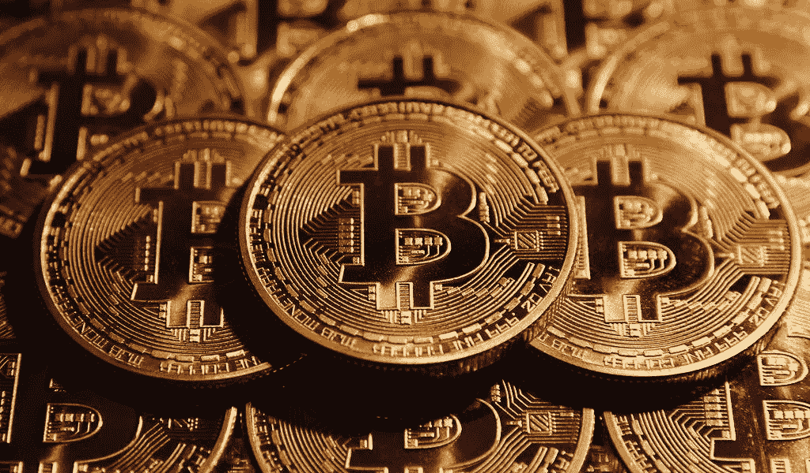
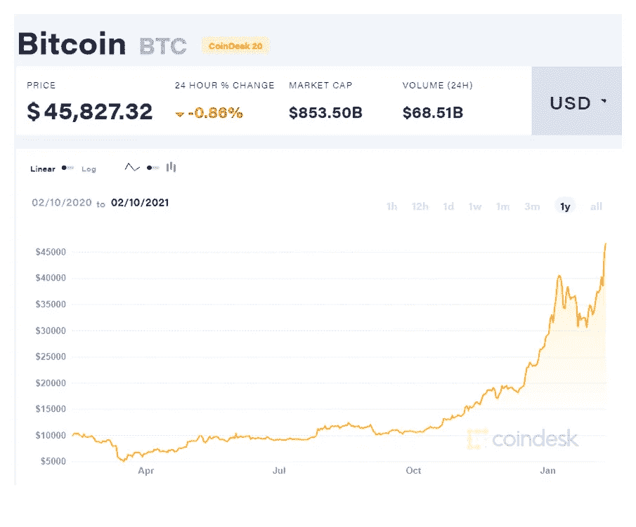
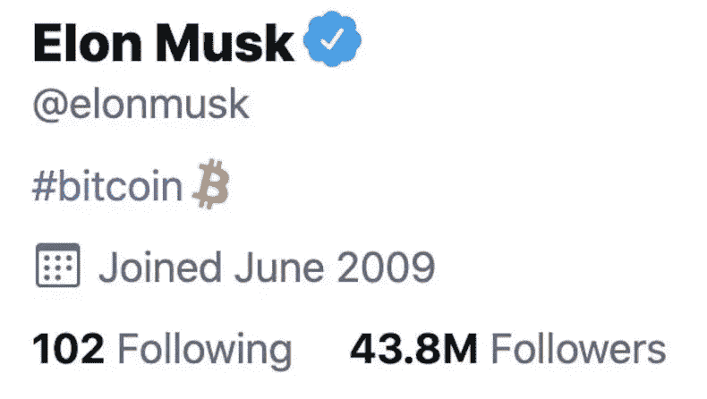

# 投资比特币正当其时的 7 个理由

> 原文：<https://medium.com/coinmonks/7-reasons-why-it-is-the-right-time-to-invest-in-bitcoin-7c0648ea3220?source=collection_archive---------1----------------------->

Bitcoin… the currency of the future? — image credit toshitimes.com

似乎比特币以这样或那样的方式经常出现在丑闻或日常新闻中。难怪人们无法完全理解这种加密货币到底是怎么回事，也无法判断投资它的最佳时机。

尽管开局艰难，但比特币一直是人们和投资者的魅力之源，这种魅力至今仍未消退。众所周知，它是世界上最受欢迎和最有价值的数字货币之一。比特币在 2021 年初经历了一场史诗般的上涨。根据 Coin Metrics 的数据，该资产在 2 月 9 日创下了 48200 美元的[历史新高](https://www.cnbc.com/2021/01/08/bitcoin-btc-price-hits-41k-up-40percent-so-far-in-2021.html)。

由于这种加密货币的波动性，投资者往往对其投资犹豫不决。然而，这种货币以前所未有的速度恢复其损失，这使得它成为一个值得重新考虑的选择。

在 2017 年概念形成之初，比特币经历了令人难忘的一年，牛市为投资者带来了 1350%的回报和 20，000 美元的历史新高，作为提前的圣诞礼物。在那之后，比特币在接下来的一年里经历了坎坷，从 1 月份的 14000 美元跌至年底的不到 4000 美元。在 2020 年和疫情之前的几年里，市场短暂崩溃，但 2020 年 3 月的损失恢复得非常好。

到 2021 年，随着 COVID 疫苗的推出，标准普尔 500 已经扭转了 2020 年以来的所有损失，并继续其多年的牛市。以下是你现在也应该考虑投资比特币的 7 个理由。

# 1.比特币的可用性

据报道，大约 80%的比特币已经被开采，自那以后，开采过程在过去几年中有所下降。虽然这是一种有价值的资产，但加密货币是有限的，据说只有 2100 万左右。

这使得数字货币行业陷入狂热，比特币的稀缺性增加。因此，在比特币成为白日梦之前，这是投资比特币的最佳时机。

# 2.它已经在游戏中领先了

比特币被吹捧为加密行业的先驱。在 2009 年首次开采后，在人们探索更多货币选择之前，它一直是一种存在了整整两年的货币。它仍然是游戏的主角。

随着第二个密码的推出，大约 800 多万比特币在网络上流通，市值超过 1 亿美元。时至今日，没有任何一种货币能接近这一水平，无论其市场份额如何。这也暗示了超过一半的加密货币是比特币。考虑到这一点，投资比特币变得更加有利可图。

# 3.价格持续上涨

在看到比特币在过去十年中的表现后，人们更倾向于将他们的资本投入比特币。这对于加密货币本身及其投资者来说非常好，因为它影响了比特币的需求和价值。

Current Price of Bitcoin as of Posting this article — image credit coindesk

使用比特币作为主要货币增加了其价值，并将随着其被公众接受而不断增长。企业更倾向于用比特币增加其资本的价值，并将其视为处理货币日常问题的最终解决方案。

# 4.华尔街正在走向加密

当比较黄金和其他股票时，比特币在 2020 年表现异常出色。多年来，它的出色表现没有逃过华尔街分析师、企业和投资者的注意。

A tweet from Elon Musk days before Tesla invested 1.5 million USD into the Crypto — image credit twitter.com

就在我们说话的时候，华尔街正在进行看涨分析，他们对人民币的兴趣正处于历史最高水平。分析师认为，在新冠肺炎疫情之后，“激进的量化宽松政策可能会导致未来比特币价格爆炸式增长。”随着华尔街的认可，比特币在不久的将来可能会有更多的投资

# 5.它是分散的

就像黄金不会受到经济危机或战争局势的极大影响一样，加密货币也具有这一优势，这使得它们更加受欢迎。如果你在投资比特币之前考虑了当前的经济气候或全球经济的表现，尽管你的担忧不是没有根据的，但它不太可能影响加密货币。

比特币的优势在于它处于一个分散的网络中，这意味着它不会受到不稳定性的影响。经济危机不太可能影响加密货币的价值。

# 6.它超过了崩盘后的前期高点

如果我们要比较比特币的历史价格数据，该货币在最近十年经历了许多波峰和波谷。许多人报告说这是一个死胡同，批评它的存在。然而，随着比特币经历的每一次崩盘，它都设法超越了最近的历史高点。

因此，如果你问应该买比特币吗？答案是，为什么不呢？所有证据表明，迄今为止，比特币已经成功收复了之前的所有失地，而且还大获全胜。

数据表明，比特币有望再次超过其历史最高水平，2020 年 12 月，它再次超过了历史最高水平。

# 7.比特币受到青睐的转变

作为一种与任何政府或公司都没有联系的公共货币，比特币越来越受欢迎，因为它不属于任何单一实体。然而，要使用比特币，需要得到政府的批准。

截至目前，世界各国政府已允许人们交易比特币，合法验证其用于交易和存储资产。在因其高安全性赢得政府批准后，随着投资的增加，比特币将获得前所未有的成功。

无论“存量到流量”模型是否成立，人们对比特币的兴趣很大，这将维持缓慢而稳定的价格上涨。因此，你没有理由对购买比特币并获得它提供的以及未来将提供的好处有所犹豫。

*作者免责声明:此信息是作者的观点。不能保证这项投资是安全的，也不能保证会让你赚钱。如果你不确定在投资前应该采取什么步骤，请咨询财务顾问或会计师。

Shayn Satten
金融大师

> 加入 Coinmonks [Telegram group](https://t.me/joinchat/EPmjKpNYwRMsBI4p) ，了解加密交易和投资

## 另外，阅读

*   什么是[闪贷](https://blog.coincodecap.com/what-are-flash-loans-on-ethereum)？
*   最好的[密码交易机器人](/coinmonks/crypto-trading-bot-c2ffce8acb2a) | [网格交易](https://blog.coincodecap.com/grid-trading)
*   [3 商业评论](/coinmonks/3commas-review-an-excellent-crypto-trading-bot-2020-1313a58bec92) | [Pionex 评论](/coinmonks/pionex-review-exchange-with-crypto-trading-bot-1e459d0191ea) | [Coinrule 评论](https://blog.coincodecap.com/coinrule-review-a-perfect-trading-bot)
*   [AAX 交易所评论](/coinmonks/aax-exchange-review-2021-67c5ea09330c) | [德里比特评论](/coinmonks/deribit-review-options-fees-apis-and-testnet-2ca16c4bbdb2) | [FTX 交易所评论](/coinmonks/ftx-crypto-exchange-review-53664ac1198f)
*   [n ave 零点回顾](/coinmonks/ngrave-zero-review-c465cf8307fc) | [Phemex 回顾](/coinmonks/phemex-review-4cfba0b49e28) | [PrimeXBT 回顾](/coinmonks/primexbt-review-88e0815be858)
*   [Bybit Exchange 审查](/coinmonks/bybit-exchange-review-dbd570019b71) | [Bityard 审查](https://blog.coincodecap.com/bityard-reivew) | [CoinSpot 审查](https://blog.coincodecap.com/coinspot-review)
*   [3Commas vs Cryptohopper](/coinmonks/3commas-vs-pionex-vs-cryptohopper-best-crypto-bot-6a98d2baa203)
*   最好的比特币[硬件钱包](/coinmonks/the-best-cryptocurrency-hardware-wallets-of-2020-e28b1c124069?source=friends_link&sk=324dd9ff8556ab578d71e7ad7658ad7c) | [BitBox02 回顾](/coinmonks/bitbox02-review-your-swiss-bitcoin-hardware-wallet-c36c88fff29)
*   [莱杰 vs n rave](https://blog.coincodecap.com/ngrave-vs-ledger)|[莱杰 nano s vs x](https://blog.coincodecap.com/ledger-nano-s-vs-x)
*   [加密拷贝交易平台](/coinmonks/top-10-crypto-copy-trading-platforms-for-beginners-d0c37c7d698c) | [比特码拷贝交易](https://blog.coincodecap.com/bityard-copy-trading)
*   [Vauld Review](https://blog.coincodecap.com/vauld-review)|[you hodler Review](/coinmonks/youhodler-4-easy-ways-to-make-money-98969b9689f2)|[BlockFi Review](/coinmonks/blockfi-review-53096053c097)
*   最好的[加密税务软件](/coinmonks/best-crypto-tax-tool-for-my-money-72d4b430816b) | [硬币追踪评论](/coinmonks/cointracking-review-a-reliable-cryptocurrency-tax-software-5114e3eb5737)
*   最佳[加密借贷平台](/coinmonks/top-5-crypto-lending-platforms-in-2020-that-you-need-to-know-a1b675cec3fa) | [杠杆代币](/coinmonks/leveraged-token-3f5257808b22)
*   [莱杰纳米 S vs 特雷佐 one vs 特雷佐 T vs 莱杰纳米 X](https://blog.coincodecap.com/ledger-nano-s-vs-trezor-one-ledger-nano-x-trezor-t)
*   [block fi vs Celsius](/coinmonks/blockfi-vs-celsius-vs-hodlnaut-8a1cc8c26630)|[Hodlnaut Review](https://blog.coincodecap.com/hodlnaut-review)
*   [Bitsgap 审查](/coinmonks/bitsgap-review-a-crypto-trading-bot-that-makes-easy-money-a5d88a336df2) | [Quadency 审查](/coinmonks/quadency-review-a-crypto-trading-automation-platform-3068eaa374e1)
*   [埃利帕尔泰坦评论](/coinmonks/ellipal-titan-review-85e9071dd029) | [赛克斯斯通评论](https://blog.coincodecap.com/secux-stone-hardware-wallet-review)
*   [DEX Explorer](https://explorer.bitquery.io/ethereum/dex) | [区块链 API](https://explorer.bitquery.io/graphql)|[local bitcoins 审核](https://blog.coincodecap.com/localbitcoins-review)
*   最佳[区块链分析](https://bitquery.io/blog/best-blockchain-analysis-tools-and-software)工具| [赚比特币](https://blog.coincodecap.com/earn-bitcoin)
*   [加密套利](/coinmonks/crypto-arbitrage-guide-how-to-make-money-as-a-beginner-62bfe5c868f6)指南:新手如何赚钱
*   最佳[加密制图工具](/coinmonks/what-are-the-best-charting-platforms-for-cryptocurrency-trading-85aade584d80) | [最佳加密交易所](/coinmonks/crypto-exchange-dd2f9d6f3769)
*   了解比特币的[最佳书籍有哪些？](/coinmonks/what-are-the-best-books-to-learn-bitcoin-409aeb9aff4b)

> [直接在您的收件箱中获得最佳软件交易](/coinmonks/newsletters/coinmonks)

