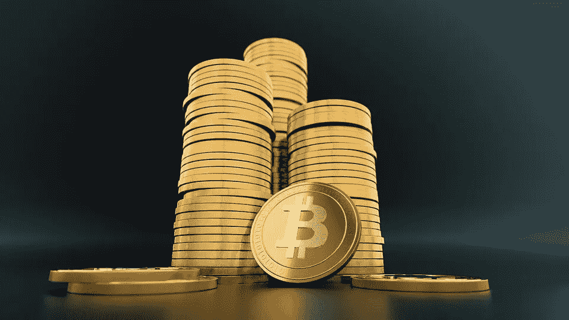

# 7 个迹象表明加密货币在市场上已经过于昂贵

> 原文：<https://medium.com/coinmonks/7-signs-that-a-cryptocurrency-is-already-too-expensive-in-the-markets-d2f680043bb5?source=collection_archive---------10----------------------->

Bitcoin

随着投资变得更加民主，有更多的用户对投资加密货币感兴趣。

但总有一个疑问，你是在以非常昂贵的价格购买代币，还是有良好的长期可能性。这就像一个人想买一栋他需要的房子:他不得不这么做，但从财务角度来看，迈出这一步的时间很重要。

加密货币是一种非常不稳定的资产，因此很难定义投资它们的最佳时机。在没有警告的情况下，一个谣言或一条推文就足以让它们的价值下跌或飙升。HeyTrade 的首席执行官兼联合创始人 Ramiro Martinez-Pardo 告诉 Business Insider Spain 说:“无论如何，我们可以确定某些反复重复的周期，所以如果你有一段历史，就值得记录和观察某个特定的价值处于哪个点。”

因此，在投资加密货币时，重要的是要了解你投资的是什么，接受风险并学习如何管理它们。

马丁内斯·帕尔多解释道:“如果我们想要的是将我们的储蓄用于投资，从而获得比银行更高的收益，那么市场上还有其他波动性更小的投资选择，可以让我们更加安心地生活。”。

专家们同意一个非常相似的观点:小心寻找合适的价格。“加密货币没有‘合适的价格’，而是市场，投资者对项目的信心，标志着它的价值，”他们从 Bitpanda 告诉 Business Insider Spain。

他们补充称:“的确，有一部分投资者在价值变化的驱动下投资或撤资，这使得每一种变化都更加激进。”

Bitnovo 的业务控制负责人哈维尔·卡斯特罗-阿库尼亚(Javier Castro-acua)认为，认为一个代币是贵还是便宜是相对的:“一个比特币今天 45000 美元贵吗？如果和 4 月份的 6.3 万比，也许是便宜了；今年 9 月它值 1 万美元，非常昂贵，5 年前它值 500 美元，非常昂贵，”他描述道。

“要知道现在是否是购买加密货币的最佳时机，最基本的技巧之一是一方面分析加密资产的历史价格演变；另一方面，对围绕该项目发生的最重要的新闻进行汇编，并检查它们如何影响这些新闻的价格”，Coinmotion Spain 的业务负责人劳尔·洛佩兹在给 Business Insider Spain 的声明中也这样认为。

正因如此，需要谨慎，谨慎遵循度量标准。

然而，正如塞维利亚大学金融学教授和博士、Olivachain I+D+i 首席执行官伊萨梅尔·圣地亚哥(Isamel Santiago)为 Business Insider Spain 分析的那样，一些指标可以警告投资时加密资产的某种高估。IEB 区块链和数字创新专业项目教授阿尔贝托·费尔南德斯。

# 用户采用程度低

根据费尔南德斯的说法，当一种加密货币在投机的驱动下具有很高的价值时，它通常会伴随着用户采用率的下降。

“通常情况下，这些加密货币将大量精力放在营销上，以获得比它们真正提供的更高的估值，”他说。

在这个类别中，我们发现加密货币与其他货币没有区别价值，并且在生产中只有一小部分承诺的功能。为了衡量采用情况，可以使用生产和开发中的应用程序数量指标。

这位专家补充说:“对于分散化金融来说，钱包数量和锁定在这种加密货币中的资本的数据也很重要。”

# **El 比率 MVRV(市场价值对实现价值)**

A bitcoin artwork by Stacey Coon, Anastasia Sultzer and Nanu Berk at the Bitcoin 2021 convention.

这个比率衡量一项资产的市场资本总额与其市场资本总额之间的关系。他认为这是一个关键的基准。“当 MVRV 指标超过某个值的 3.7 倍时，一项加密资产通常会被认为估值过高，”他保证道。

“当我们得到一个负的 MVRV 比率时，它告诉我们市场参与者没有或只有极小的收益，”他指出。

同时，如果 MVRV 为正，则表明加密资产持有者可能获利。

“总而言之，当 MVRV 指标超过 3.7 时，加密资产通常被视为高估，当该值等于或低于 1 时，则被视为低估，”santiago 描述道。

# 流动性低于市场资本总额的 5%

虽然这不是过高价值的约束信号，但流动性低的加密货币在买入和卖出之间的幅度更大。

正如费尔南德斯指出的那样，大量购买会导致上升趋势，用户可能会“被抓住把柄”。

“最好是研究他们的行为，了解什么是进入的好时机，以避免高估的高峰，”他建议。

# 不存在的创新和发展

如果作为 100%创新工具的加密货币没有持续发展，它将面临被遗忘的风险，因此会逐渐贬值。

“我们只需要打开历史上的 CoinMarketCap，就可以看到 2014 年至 2016 年的许多加密货币在竞争力和价值上都落后于其他货币，”这位 IEB 教授表示。

“唯一没有遇到这个问题的货币是比特币，因为它作为一种价值储存手段已被全世界接受，”他补充道。

# 迈尔倍数

当一个令牌的价值低于 1 时，此指标可用于指示该令牌是否处于看跌阶段。

圣地亚哥表示，迈耶倍数是一个指标，允许我们确定何时是买卖比特币和其他加密货币的最佳时机。

“该指标将当前价格与 200 天移动平均线进行比较，告诉我们当前价格与该移动平均线有多近或多远，”他评论道。“这将表明，当它的价值高于 1 时，我们将处于看涨阶段，当它低于 1 时，我们将处于看跌阶段，”他补充道。

# 关注 SOPR(支出产出利润率)值

这是一个指标，反映了供应链上所有货币的已实现损益程度。

“在牛市中，SOPR 值高于 1，在熊市中，SOPR 值低于 1，因此，基于这一点，理想的卖出时间是 SOPR 高于 1 的时候，”Santiago 强调说。

# 过度膨胀的协议

从费尔南德斯的角度来看，明年很有可能是赌博在当前利润之上具有更高的突出地位和盈利能力的一年。

“在需求和发行-供应组合之间没有实现平衡的协议将会下跌，直到它们进行适当的调整，”他总结道。

> 加入 Coinmonks [电报频道](https://t.me/coincodecap)和 [Youtube 频道](https://www.youtube.com/c/coinmonks/videos)了解加密交易和投资

## 也阅读

 [## 最佳加密交易所| 2021 年十大加密货币交易所

### ICON _ PLACEHOLDEREstimated 预计阅读时间:28 分钟加密货币交易所的加密交易需要知识…

blog.coincodecap.com](https://blog.coincodecap.com/crypto-exchange)  [## 2021 年 10 大最佳加密贷款平台| CoinCodeCap

### 当谈到加密货币贷款时，大量因素等同于良好的收入状况。此外，借款的一部分…

blog.coincodecap.com](https://blog.coincodecap.com/crypto-lending)  [## 2021 年最佳免费加密交易机器人

### 2021 年币安、比特币基地、库币和其他密码交易所的最佳密码交易机器人。四进制，位间隙…

medium.com](/coinmonks/crypto-trading-bot-c2ffce8acb2a)  [## 最佳 4 个加密交易信号电报通道

### 这是乏味的找到正确的加密交易信号提供商。因此，在本文中，我们将讨论最好的…

medium.com](/coinmonks/best-crypto-signals-telegram-5785cdbc4b2b)  [## BlockFi 评论 2021:利弊和利率| CoinCodeCap

### 今天，我们提出了一个全面的 BlockFi 评论，这是一个成立于 2017 年的加密贷款平台，拥有其…

blog.coincodecap.com](https://blog.coincodecap.com/blockfi-review)  [## 如何在印度购买比特币？2021 年购买比特币的 7 款最佳应用[手机版]

### 如何使用移动应用程序购买比特币印度

medium.com](/coinmonks/buy-bitcoin-in-india-feb50ddfef94)  [## 加密税务软件——五大最佳比特币税务计算器[2021]

### 不管你是刚接触加密还是已经在这个领域呆了一段时间，你都需要交税。

medium.com](/coinmonks/best-crypto-tax-tool-for-my-money-72d4b430816b)