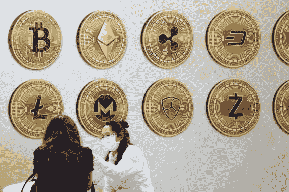
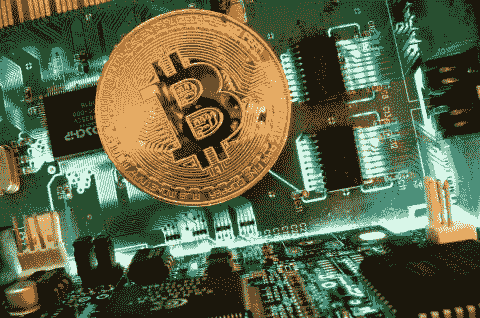

# 投资加密货币时少缴税的 7 种方法

> 原文：<https://medium.com/coinmonks/7-ways-to-pay-less-taxes-when-investing-in-cryptocurrencies-939002b4ed34?source=collection_archive---------4----------------------->

Bitcoin

投资加密货币是许多投资者在 2021 年遵循的策略。

押注比特币、以太坊或其他代币等资产已成为一种常见的动态。面对流动性泛滥和来自疫情的储蓄增加，这被视为一个好机会。

许多投资者认为加密货币是一种很好的投资，但不认为他们应该为他们的利润纳税，因为最终，它在某种程度上限制了获得的盈利能力。

加密货币是一种相对较新的资产类别，为押注虚拟货币的早期投资者创造了可观的利润。但无论何时财富产生，都有可能最终被税务机构以某种方式征税。

当你以高于买入价格的价格卖出加密货币，并将投资保持一年或更短时间时，就会产生短期资本收益。这种类型的兑换，无论是另一种虚拟货币还是法定货币，都必须在 IRPF 申报，包括在储蓄应税基础的资本利得和损失部分:第一个€6，000 的 19%，€6，000 和€50，000 之间的 21%，€50，000 以上的 23%。

加密货币开采被视为一种经济活动，因此收到的金额必须在 IRPF 申报为来自经济活动的收入。此外，这还允许扣除开展活动产生的费用。

但是，加密货币的买卖免征增值税。对于税务机构来说，出于实用目的，加密货币被认为是一种货币；因此，这是根据关于传统货币兑换的现行立法，传统货币的兑换须缴纳增值税，但免缴增值税。

类似地，当进行加密货币交易时，比如将比特币转换成乙醚，投资者将不得不为产生的利润或损失缴税。为了知道应纳税额，有必要从已交付货物的购置价值中减去以下两个概念中的较高值:已交付货物的市场价值或已收到货物的市场价值。

然而，对于加密领域的投资者来说，有一些方法可以在一定程度上减少其加密货币投资的税收。

# 1.投资受益于加密资产的养老金计划

Getty Images

如果你专注于养老金计划，或许可以投资具有税收优势的加密货币。

众所周知，这种类型的产品在西班牙领土上有税收减免，所以如果你押注于一种从加密环境的增长风中喝酒的工具，它在税收方面可能是有益的。你将获得税收补偿，此外，你还将获得这类资产的投资回报。

# 2.对加密资产的投资是收入的来源

Getty Images

如果你用加密货币来换取商品和服务，或者开采加密货币，税收就会有所不同。在这些情况下，您的加密货币在收到时会被视为收入。您必须记录并报告您收到的加密货币的公平市场价值，并在纳税申报表中将其作为收入。

当你申报这笔收入时，它是按普通所得税税率征税的。这些税率高于资本利得税。你收到的加密货币是一个税收术语，用来定义你收到它时硬币的初始价值，它的基础是你报告的收入金额。

当您最终处置加密货币时，使用该基础来计算您可能拥有的任何资本收益，并支付相应的资本收益。

# **3。长期持有加密货币**

Dado Ruvic/Reuters

只要你持有 x 种加密货币作为投资，并且不产生收入，一般来说，在你处理掉这些代币之前，你不需要缴纳代币税。因此，如果你在给定的纳税年度不出售任何加密资产，你就可以避税。

然而，你可能最终想要出售你的加密货币。为了减少税收负担，请确保您持有的加密货币超过一年。

# 4.用损失抵消加密货币的利润

Dado Ruvic/Reuters

当你结束一项投资，并使其具有流动性时，你就获利或亏损。这取决于你何时出售资产及其成本。关于西班牙税收立法的好消息是，资本利得和损失可以相互抵消。

如果你有意识地利用这一点，这就是所谓的税收流失收获。

技术上，同类型的收益和损失首先相互抵消。短期收益将抵消短期损失，长期税收项目也是如此。

# 5.在低收入年份出售资产

Getty

你的收入越低，税率就越低。你可以通过出售你知道将获得长期利润的加密货币来节省税收，你知道你将被以更低的税率征税。

出售加密货币可能会导致部分收入被征收更高的税率，但这并不意味着你的所有收入都会像许多人认为的那样以更高的税率计算。

# 6.捐赠给非政府组织

Pixabay

对一个组织的捐赠可以产生税收减免。为此，您必须在捐赠之前拥有该资产至少一年。

捐赠一些资产，如加密货币，可能会涉及优惠的税收待遇。一般可以扣除公允价值，但是不用交资本利得税。

# 7.在有生之年投资于加密资产

Getty Images

如果你不需要获得你投资于加密资产的钱，你可能会想把它作为一个世代财富积累的工具。

你必须相信加密货币的长期价值才能发挥作用，但这种策略可能会提供特殊的税收待遇。

> 加入 Coinmonks [电报频道](https://t.me/coincodecap)和 [Youtube 频道](https://www.youtube.com/c/coinmonks/videos)了解加密交易和投资

## 也阅读

 [## 最佳加密交易所| 2021 年十大加密货币交易所

### ICON _ PLACEHOLDEREstimated 预计阅读时间:28 分钟加密货币交易所的加密交易需要知识…

blog.coincodecap.com](https://blog.coincodecap.com/crypto-exchange)  [## 2021 年 10 大最佳加密贷款平台| CoinCodeCap

### 当谈到加密货币贷款时，大量因素等同于良好的收入状况。此外，借款的一部分…

blog.coincodecap.com](https://blog.coincodecap.com/crypto-lending)  [## 2021 年最佳免费加密交易机器人

### 2021 年币安、比特币基地、库币和其他密码交易所的最佳密码交易机器人。四进制，位间隙…

medium.com](/coinmonks/crypto-trading-bot-c2ffce8acb2a)  [## 最佳 4 个加密交易信号电报通道

### 这是乏味的找到正确的加密交易信号提供商。因此，在本文中，我们将讨论最好的…

medium.com](/coinmonks/best-crypto-signals-telegram-5785cdbc4b2b)  [## BlockFi 评论 2021:利弊和利率| CoinCodeCap

### 今天，我们提出了一个全面的 BlockFi 评论，这是一个成立于 2017 年的加密贷款平台，拥有其…

blog.coincodecap.com](https://blog.coincodecap.com/blockfi-review)  [## 如何在印度购买比特币？2021 年购买比特币的 7 款最佳应用[手机版]

### 如何使用移动应用程序购买比特币印度

medium.com](/coinmonks/buy-bitcoin-in-india-feb50ddfef94)  [## 加密税务软件——五大最佳比特币税务计算器[2021]

### 不管你是刚接触加密还是已经在这个领域呆了一段时间，你都需要交税。

medium.com](/coinmonks/best-crypto-tax-tool-for-my-money-72d4b430816b)  [## 存储比特币的最佳加密硬件钱包[2021] | CoinCodeCap

### 保管您的数字资产很容易，但找到正确的存储方式却是一项繁琐的任务。在线钱包有一个风险…

blog.coincodecap.com](https://blog.coincodecap.com/best-hardware-wallet-bitcoin)