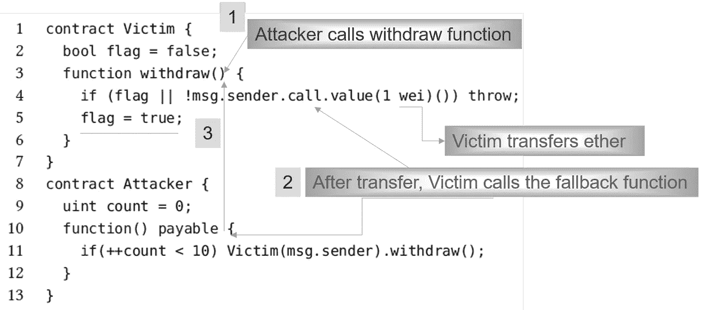
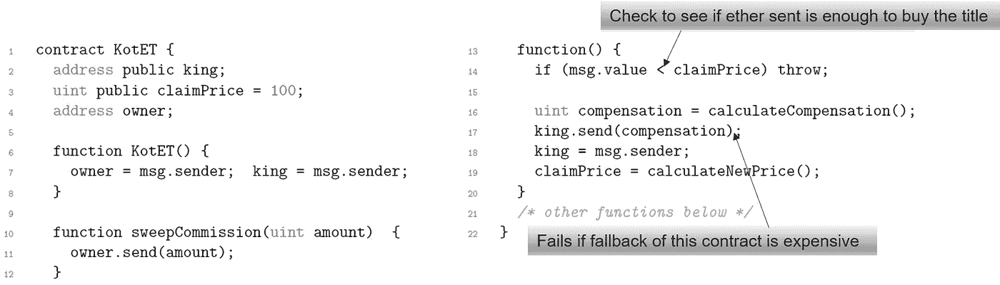
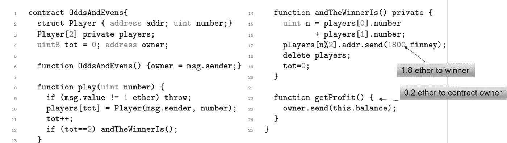

# 以太坊智能合约中现在可以轻松避免的 7 个安全漏洞！

> 原文：<https://medium.com/coinmonks/8-security-vulnerabilities-in-ethereum-smart-contracts-that-can-now-be-easily-avoided-dcb7de37a64?source=collection_archive---------1----------------------->

## 可通过可靠性更新避免的应用级安全漏洞


由于以太坊智能合约主要应用于电子商务应用，我们认为这些应用更容易受到攻击。在这些智能合约中，我们主要关注于识别智能合约的程序员和用户必须避免的漏洞。这篇文章旨在解释这七个应用程序级安全漏洞及其早期采用的预防方法。我们主要关注的是最新的 Solidity v0.6.0 版本，它修复了一些漏洞。

## 1.可重入

可重入攻击可以耗尽智能协定的以太，可以帮助入侵协定代码。当对另一个不受信任的协定执行外部调用函数，并且攻击者获得了对该不受信任的协定的控制时，他们可以对原始函数进行递归调用，意外地重复本来不会运行的事务，并最终耗尽所有 gas。



Figure 1\. Reentrancy example — Simple DAO Attack

DAO 攻击中的可重入性漏洞利用(如图 1 所示)分四步完成，

*   **第一步:**`Attacker`通过调用`Victim`的`Withdraw` 函数发起交易；
*   **第二步:**`Victim`转账并调用`Attacker`的`fallback`函数；
*   **第三步:**`fallback`函数再次递归调用`withdraw`函数，即重入；
*   **步骤 4:** 在一个迭代范围内，额外的以太网将被多次传输到`Attacker`。

## 1.1 早先建议的避免此漏洞的最佳实践

通过确保在通过外部调用将以太送出契约之前提交状态改变逻辑，可以防止重入漏洞。将对未知地址执行外部调用的任何逻辑放在程序执行的最后一个操作中也是一个很好的编码实践。这就是所谓的检查-效果-交互模式。另一种技术是通过添加一个在代码执行期间锁定契约的状态变量来使用互斥体，从而防止可重入的函数调用。

## 2.呼唤未知

当函数调用或以太网传输意外调用被呼叫者/接收者的回退函数时。导致这种情况的一些基本的可靠性语言是:

*   `call`用于调用一个函数或传送以太
*   `send`，用于将乙醚从正在运行的合约转移到其他合约
*   `delegatecall`，用于调用一个函数或调用方环境中的以太
*   直接调用(参见清单 1)

如果被调用函数的签名与任何现有函数都不匹配，那么这个调用将导致调用接收方的`fallback`函数。

## 2.1 早先建议的避免此漏洞的最佳实践

Solidity 提供了通过使用关键字 library 来实现库契约。这些库契约是无状态的，非自毁的。强制库成为无状态减少了攻击者直接修改库的状态以影响依赖于库代码的契约的攻击。因此，当使用 call、DelegateCall 时，可以通过构建无状态库来防止可能改变受害者协定状态的未知调用攻击。

## 减少可重入性和调用未知漏洞的可靠性版本更新

Solidity V0.6.0 将早期`fallback`函数背后的逻辑分成两个不同的函数，一个使用`fallback`关键字，另一个使用`receive`关键字定义接收以太函数。receive ether 函数是隐式的`payable`，只要调用数据为空就会被调用。然而，新的 fallback 函数，现在带有关键字`fallback`，在没有其他函数匹配时被调用。这个`fallback`功能可能是也可能不是`payable`。如果不是`payable`，则不匹配任何其他发送值的函数的事务将恢复。

因此，这个可靠性更新将解决当调用外部智能契约的`fallback`函数时意外代码被执行的问题。

## 3.错误处理的异常

在许多情况下，Solidity 会出现异常，但处理这些异常的方式并不总是相同的。异常处理基于契约之间的交互。这使得契约容易受到攻击，因为如果这些异常没有被正确处理并且事务被恢复，程序员将不会意识到任何以太丢失。

```
contract Alice { 
    function ping(uint) {
        returns (uint)}}
contract Bob { 
    uint x=0;
    function pong(Alice c){
        x=1; 
        c.ping(42); 
        x=2; 
        } }
```

在上面的代码中，契约`Bob`执行后变量`x`的值根据函数调用的方法而变化。如果使用直接调用来调用合同`Alice`的 ping 函数，那么`x` 的值将为 0。然而，如果使用 Solidity 的内置函数调用来调用同一个函数，那么`x`的值将是 2。此外，在例外情况下，如果没有指定边界，那么所有可用的气体都将丢失。

## 3.1 早先建议的避免此漏洞的最佳实践

避免这种漏洞的一种技术是始终使用一种外部调用方法。然而，这不是理想的预防技术，因为外部呼叫的不同变化可能是必要的。因此，该漏洞需要更新 Solidity 语言，以使抛出异常的后果一致。

## 4.外部调用漏洞造成拒绝服务

当控制流转移到外部协定时，调用方协定的执行可能会意外或故意失败，这可能会导致调用方协定中出现 DoS 状态。当事务由于外部调用失败而被还原时，调用方协定可能处于 DoS 状态，或者被调用方协定故意使事务被还原以中断调用方协定的执行。

```
contract HYIP {
    Lenders[] private lender;
    function sendPayment() {
        for(uint i = lender.length; i−− > 0; ) {
            uint payment=(lenders[i].amount*/1000;if(!lenders[i].addr.send(payment)) throw;
            }
    }
}
 contract AttackerContract {
    bool private attack = true;
    function() payable {
        if (attack) throw; // callee fails the caller execution deliberately
    }
    function stopAttack() {
        if(msg.sender == owner) attack = false;
    }
 }
```

## 4.1 早先建议的避免此漏洞的最佳实践

此漏洞的存在是因为对条件语句和迭代语句的异常处理不足。将由被调用方协定发起的任何外部调用放入单独的事务中，有助于减少此漏洞造成的损害。使用以下模式隔离语句有助于避免此漏洞:

*   条件中有外部函数调用的`if` 语句，语句体中有`throw`或`revert`；
*   条件中带有外部函数调用的`for`或`if`语句。

## Solidity 版本更新，可缓解处理不当的异常和拒绝服务漏洞

Solidity V0.5.3 支持使用`try` / `catch`语句和以下便利函数捕获异常:

*   `assert`函数应该只用于测试内部错误，以及检查不变量，因为`assert`风格的异常消耗了所有可用于调用的 gas。
*   `require`函数应用于确保在执行前无法检测到的有效条件。
*   `revert`函数是从其他代码块中触发异常的另一种方式，以标记错误并恢复当前调用。

## 5.气体耗尽异常

在合同之间转移乙醚时，基元函数 send 可能会导致意外的缺气异常。有一个预先固定的 gas 单元可用于允许执行一组有限的字节码指令，如果没有足够的 gas 单元可用，调用函数将会以 gas-out 异常结束。



Figure 2\. Out-of-Gas Exception example— King of Ether Attack

## 5.1 早先建议的避免此漏洞的最佳实践

可以通过使用`Transfer`函数而不是`Send`来防止此漏洞，因为如果外部事务恢复，前者将恢复本地事务。但是，如果需要使用`Send`函数，则需要监控该函数的返回值。另一种技术是采用撤销模式，其中要求每个用户调用一个独立的函数来管理其他事务，并且不影响合同执行的其余部分。因此，使得事务管理独立于失败的`Send`事务的后果。

## Solidity 版本更新缓解了缺气漏洞

在 Solidity V0.5.0 之前，如果一个契约收到 Ether，则执行`fallback`函数，如果它没有`fallback`函数，则 Ether 将被拒绝并抛出异常。但是，在执行`fallback`功能期间，合同当时只能使用 2300 气。这个气限不足以修改`storage`。这种“汽油津贴”限制解决了汽油耗尽的问题，但效率不高。

随着 V0.6.0 的新 Solidity 更新，`fallback`函数和`recieve`函数的划分在更大程度上解决了缺气漏洞，因为在`recieve`函数中不能执行任何昂贵的代码，因此，使程序员能够分析他们在交易期间将花费的气体量。

## 6.类型转换

Solidity 编译器可以检测一些类型错误的事实可能会使程序员认为它也检查被调用的契约的地址，并且由调用者函数声明的接口与被调用者的实际接口相匹配。在存在这种类型不匹配错误的情况下执行协定不会在运行时引发异常，并且调用方不知道在运行时导致三种不同情况的错误:

*   被调用方函数的协定地址不正确，调用返回时不执行任何代码，
*   被调用函数的联系地址与任何其他函数的签名匹配，则执行该函数
*   被调用函数的联系地址与任何函数的签名都不匹配，则执行其回退。

## 6.1 早先建议的避免此漏洞的最佳实践

为了防止恶意契约的类型转换，可以使用关键字`new`。这样，如果不修改协定，就无法更改被引用协定的实例，因为它是在部署时创建的。另一种技术是在契约中硬编码任何外部契约`address`,以避免恶意契约被引用。

## 缓解类型转换漏洞的可靠性版本更新

从 [Solidity V0.5.3](https://solidity.readthedocs.io/en/v0.5.3/050-breaking-changes.html?highlight=field%20modifiers) 开始，合同类型不包括`address`成员。因此，在使用`address`成员之前，有必要显式地将契约类型的值转换为地址。例如:如果`c`是合同，将`c.transfer(...)`改为`address(c).transfer(...)`，将`c.balance`改为`address(c).balance`。

此外，Solidity V0.5.3 不允许不相关的合同类型之间的显式转换。合同现在只能转换到其基础。

`address`型分为`address`和`address payable`，其中只有`address payable`提供`transfer`功能。一个`address payable`可以直接转换成一个`address`，但是不允许反过来。

## 7.弱场修改器

智能合约中的字段可以标记为公共或私有。但是，这些属性不足以保护字段的值。这是因为 Solidity 中的默认访问修饰符 afield 是 public。每当一个字段的值被改变时，该改变被发布在 BT 链上，并且攻击者有可能通过先前的散列和新的事务散列来推断改变的值。



Figure 4\. Weak Field Modifiers example — Odd/Even Game

## 7.1 早先建议的避免此漏洞的最佳实践

为了避免这个智能契约的漏洞，对函数使用 `internal` 修饰符，而不是使用`public`修饰符。

## 缓解弱场修改器漏洞的可靠性版本更新

该漏洞仍然对智能合约中包含的敏感数据构成威胁。但是，0.5.3 的 solidity 版本更新使得对函数可见性的处理比以前好了很多。从这个版本开始，显式函数可见性是强制性的，这可以通过将`public`添加到每个函数和构造函数中，将`external`添加到每个尚未指定其可见性的 `fallback`或接口函数中来实现。

从此次更新开始，struct、array 或 mapping 类型的所有变量的显式数据位置也是强制性的，这适用于函数参数和返回变量。例如，将`uint[] x = m_x`更改为`uint[] storage x = m_x`，将`function f(uint[][] x)`更改为`function f(uint[][] memory x)`，其中`memory`是数据位置，可以相应地替换为`storage`或`calldata`。注意`external`函数需要数据位置为`calldata`的参数。

## 结论

这篇文章简要分析了以太坊智能合约的安全漏洞，并给出了一些利用这些漏洞的真实案例，以及之前提出的防范技术。我针对以太坊智能合约中应用层的七个安全漏洞。因此需要在编程级别以改变形式的预防技术。这突出了 Solidity 版本更新，在开发 DApps 和智能合约时，必须注意这些更新以避免这些漏洞。

> [直接在您的收件箱中获得最佳软件交易](https://coincodecap.com/?utm_source=coinmonks)

[](https://coincodecap.com/?utm_source=coinmonks)