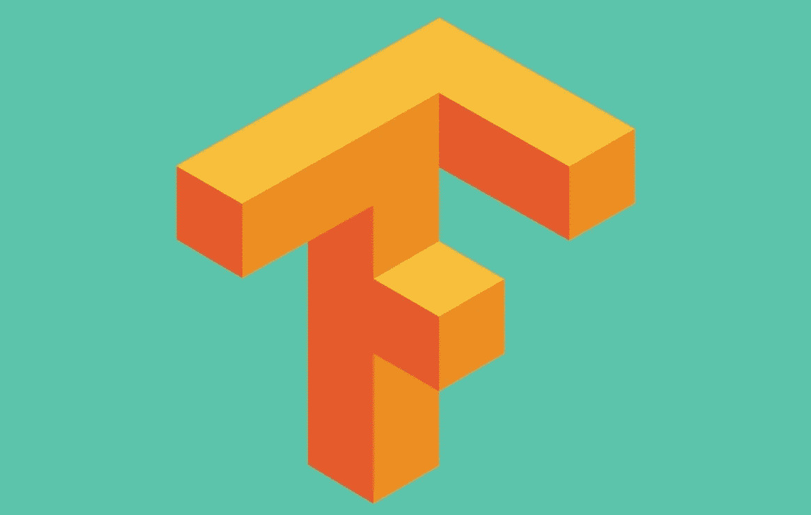

# 在 Tensorflow 的热切执行模式下，需要做的 8 件不同的事情

> 原文：<https://medium.com/coinmonks/8-things-to-do-differently-in-tensorflows-eager-execution-mode-47cf429aa3ad?source=collection_archive---------3----------------------->

更新: [Tensorflow 2.0 beta](https://www.tensorflow.org/beta) 出来了，默认使用急切执行。本文中的许多建议仅适用于 Tensorflow 的 1.x 版本。我推荐迁移到 2.0！:)

Tensorflow 2018 开发峰会中我最喜欢的视频[之一是 Alex Passos 介绍 Tensorflow 新的热切执行模式的视频。它为不灵活的图形系统提供了一种替代方案，在这种系统中，我们可以简单地用`tf.enable_eager_execution()`开始我们的文件，然后实际上*在我们创建张量*时打印出它们的值，而不必创建一个会话。](https://www.youtube.com/watch?v=T8AW0fKP0Hs&t=805s)

我尝试了我的最后一个项目，一个有趣的小 RNN 来产生新的口袋妖怪名字。在构建它的时候，我发现使用 Eager 比使用`tf.enable_eager_execution()`有更多的好处，尤其是对于我们这些已经习惯了传统 Tensorflow 做事方式的人来说。一般来说，“远距离操作”的方法对 Eager 不起作用——如果你想改变一个值，你需要显式地设置它。还有几个重要的 Tensorflow 库尚未与 Eager 兼容，而且可能永远也不会兼容，这时您将需要使用一个对 Eager 友好的替代库。

最终，我发现渴望执行更加直观。学习使用它主要是一个*放弃*使用会话的过程。



## **#1。导入和设置**

在开始之前，一定要导入渴望的`contrib`库并启用渴望执行。重要的是使能发生在任何其他张量流代码之前。

```
import tensorflow as tf
import tensorflow.contrib.eager as tfetf.enable_eager_execution()
```

## #2.打印张量

关于 Eager 模式的最美妙的事情之一是，您可以在每一行看到张量值，而无需在会话中运行它。这使得理解代码中发生的事情和调试变得更加容易。

```
x = tf.constant([[1.,2.,3.],[4.,5.,6.]])
print(x.numpy())
    => [[1\. 2\. 3.]
        [4\. 5\. 6.]]
print(x.shape)
    => (2,3)
print(x.dtype)
    => <dtype: ‘float32’>
```

## #3.占位符

在急切模式下不支持占位符。如果你试图创建一个`tf.placeholder`的实例，你会得到一个错误。这是有意义的，因为占位符是会话工作流的核心部分，而整个 Eager 的目的就是摆脱会话。相反，只需将数据作为参数传递给函数。反正这个直观多了。

## #4.变量

`tf.Variable`在急切模式下不受支持，如果您尝试使用它，将会出现错误。相反，使用`tfe.Variable`，并为该变量传递您想要的初始值。那你就完了！不需要额外初始化变量。你仍然可以从一个`Optimizer`中更新你的变量。

```
initial_value = tf.random_normal([2,3], stddev=0.2)
w = tfe.Variable(initial_value, name=‘weights’)
```

## #5.迭代数据

Eager 中仍然使用数据集，但是对它们进行迭代要简单一些。不必创建迭代器并调用`iterator.get_next()`，您可以简单地迭代数据集本身。

```
words = tf.constant([‘cat’, ‘dog’, ‘house’, ‘car’])
dataset = tf.data.Dataset.from_tensor_slices(words)
for x in dataset:
    print x
```

## #6.计算梯度

幸运的是，和 Tensorflow 的其他部分一样，急切执行支持自动微分。由于`tf.gradients`不会在 eager 模式下工作，所以最好使用*梯度带*，它可以灵活地跟踪其块内的操作，并根据这些操作构建计算图。下面是一个在培训中如何使用梯度胶带的例子:

```
variables = [w1, b1, w2, b2]
optimizer = tf.train.AdamOptimizer()**with tf.GradientTape() as tape:**
 y_pred = model.predict(x, variables)
 loss = model.compute_loss(y_pred, y)
 **grads = tape.gradient(loss, variables)**
 optimizer.apply_gradients(zip(grads, variables))
```

## **#7。记录日志**

要记录训练详情以便在 Tensorboard 中查看，首先需要将其保存到事件文件中。不幸的是，通常处理这个的`tf.summary`模块在 Eager 中不被支持。可以用`tf.contrib.summary`代替。这里有一个例子:

```
summary_writer = tf.contrib.summary.create_file_writer(‘logs’, flush_millis=10000)
summary_writer.set_as_default()
global_step = tf.train.get_or_create_global_step()def log_loss(loss):
    with tf.contrib.summary.always_record_summaries:
        tf.contrib.summary.scalar(‘loss’, loss)# In your training loop
global_step.assign_add(1)
loss = some value….
log_loss(loss)
```

## **#8。保存**

要在训练中保存检查点，必须使用`tfe.Saver` 而不是`tf.train.Saver`。急切保存程序不是保存整个会话，而是简单地检查变量的当前值，您可以在以后加载这些值。

```
variables = [w1, b1, w2, b2]
saver = tfe.Saver(variables)
# do some training…
saver.save(‘checkpoints/checkpoint.ckpt’, global_step=step)
```

要从检查点恢复，可以从检查点文件加载变量列表，如下所示:

```
checkpoint_path = tf.train.latest_checkpoint(‘checkpoints’)
saver.restore(checkpoint_path)
```

变量现在将有它们保存的值。

> 加入 Coinmonks [电报频道](https://t.me/coincodecap)和 [Youtube 频道](https://www.youtube.com/c/coinmonks/videos)获取每日[加密新闻](http://coincodecap.com/)

## 另外，阅读

*   [复制交易](/coinmonks/top-10-crypto-copy-trading-platforms-for-beginners-d0c37c7d698c) | [加密税务软件](/coinmonks/crypto-tax-software-ed4b4810e338)
*   [网格交易](https://coincodecap.com/grid-trading) | [加密硬件钱包](/coinmonks/the-best-cryptocurrency-hardware-wallets-of-2020-e28b1c124069)
*   [密码电报信号](http://Top 4 Telegram Channels for Crypto Traders) | [密码交易机器人](/coinmonks/crypto-trading-bot-c2ffce8acb2a)
*   [最佳加密交易所](/coinmonks/crypto-exchange-dd2f9d6f3769) | [印度最佳加密交易所](/coinmonks/bitcoin-exchange-in-india-7f1fe79715c9)
*   [面向开发人员的最佳加密 API](/coinmonks/best-crypto-apis-for-developers-5efe3a597a9f)
*   最佳[密码借贷平台](/coinmonks/top-5-crypto-lending-platforms-in-2020-that-you-need-to-know-a1b675cec3fa)
*   杠杆代币的终极指南
*   [AscendEx Staking](https://coincodecap.com/ascendex-staking)|[Bot Ocean Review](https://coincodecap.com/bot-ocean-review)|[最佳比特币钱包](https://coincodecap.com/bitcoin-wallets-india)
*   [Bitget 评论](https://coincodecap.com/bitget-review) | [双子星 vs BlockFi](https://coincodecap.com/gemini-vs-blockfi) | [OKEx 期货交易](https://coincodecap.com/okex-futures-trading)
*   [美国最佳加密交易机器人](https://coincodecap.com/crypto-trading-bots-in-the-us) | [经常性回顾](https://coincodecap.com/changelly-review)
*   [在印度利用加密套利赚取被动收入](https://coincodecap.com/crypto-arbitrage-in-india)
*   [霍比审核](https://coincodecap.com/huobi-review) | [OKEx 保证金交易](https://coincodecap.com/okex-margin-trading) | [期货交易](https://coincodecap.com/futures-trading)
*   [麻雀交换评论](https://coincodecap.com/sparrow-exchange-review) | [纳什交换评论](https://coincodecap.com/nash-exchange-review)