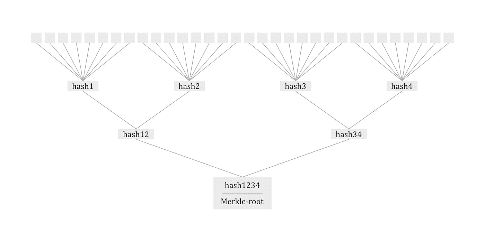
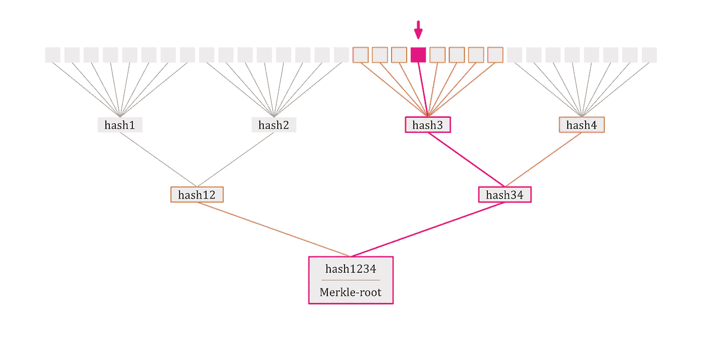

# 降低智能合同油耗的 8 种方法

> 原文：<https://medium.com/coinmonks/8-ways-of-reducing-the-gas-consumption-of-your-smart-contracts-9a506b339c0a?source=collection_archive---------0----------------------->

我目前正在做一个 Dapp 项目( [Shape](https://medium.com/u/f4b3a95f66b7?source=post_page-----9a506b339c0a--------------------------------) )，它的第一个主要开发阶段已经接近尾声。由于交易成本一直是开发人员关心的一个大问题，我想通过这篇文章来分享我在过去几周/几个月中在优化方面获得的一些见解。


“closeup photo of 100 US dollar banknotes” by [Pepi Stojanovski](https://unsplash.com/@timbatec?utm_source=medium&utm_medium=referral) on [Unsplash](https://unsplash.com?utm_source=medium&utm_medium=referral)

下面，我给出了一个优化技术的列表，其中一些参考了关于这个主题的更详细的文章，您可以将它们应用到您的合同设计中。我将从一些更基本、更熟悉的概念开始，然后随着我们的进展变得更复杂。

# 目录

## 1.首选数据类型

## 2.在契约的字节码中存储值

## 3.通过 SOLC 将变量打包到单个插槽中

## 4.用程序集将变量打包到单个插槽中

## 5.连接函数参数

## 6.减少存储负载的 Merkle 证明

## 7.无状态合同

## 8.存储 IPFS 的数据

## 1.首选数据类型

这可以用几句话来回答:**使用 256 位变量**，因此 uint256 和 bytes32！乍一看，这似乎有点违背直觉，但是当你更仔细地思考以太坊虚拟机(EVM)是如何操作的，这就完全说得通了。每个存储槽有 256 位。因此，如果你只存储一个 uint8，EVM 会用零填充所有缺失的数字——这很费油。此外，计算也毫无例外地由 EVM 在 uint256 中执行，因此这里除了 uint256 之外的任何类型也必须被转换。

注意:一般来说，你的目标应该是调整变量的大小，使整个存储槽都被填满。在“*通过 SOLC 将变量打包到单个槽中”*一节中，当使用少于 256 位的变量更有意义时，这一点会变得更加清楚。

> 交易新手尝试[密码交易机器人](/coinmonks/crypto-trading-bot-c2ffce8acb2a)或[复制交易](/coinmonks/top-10-crypto-copy-trading-platforms-for-beginners-d0c37c7d698c)

## 2.在契约的字节码中存储值

一种相对便宜的存储和读取信息的方式是，当在区块链上部署智能合约时，将它们直接包含在智能合约的字节码中。不利的一面是，这个值以后不能改变。然而，加载和存储数据的气体消耗将大大减少。有两种可能的实现方式:

1.  将关键字*常量*附加到变量声明中
2.  将变量硬编码到任何需要使用它的地方。

```
uint256 public v1;
uint256 public **constant** v2;function calculate() returns (uint256 result) {
    return v1 * v2 * 10000
}
```

变量 *v1* 将是契约状态的一部分，而 *v2* 以及 *1000* 是契约字节码的一部分。

*(读取 v1 是通过 SLOAD 操作进行的，仅 SLOAD 操作就已经消耗了 200 气。)*

## 3.通过 SOLC 将变量打包到单个插槽中

当您在区块链上永久存储数据时，汇编命令 SSTORE 将在后台执行。这是最昂贵的命令，花费 20，000 汽油，所以我们应该尽量少用它。在结构内部，通过简单地重新排列变量，可以减少所执行的存储操作的数量，如下例所示:

```
struct Data {
    uint64 a;
    uint64 b;
    uint128 c;
    uint256 d;
}Data public data;constructor(uint64 _a, uint64 _b, uint128 _c, uint256 _d) public {
    Data.a = _a;
    Data.b = _b;
    Data.c = _c;
    Data.d = _d;
}
```

请注意，在该结构中，所有总共可以填充 256 位槽的变量都是彼此相邻排序的，以便编译器可以在以后将它们堆叠在一起(如果变量覆盖的位少于 256 位，这也适用)。在这个特定的例子中，SSTORE 操作将只使用两次，一次用于存储 *a* 、 *b* 和 *c* ，另一次用于存储 *d* 。这同样适用于结构之外的变量。此外，请记住，将多个变量放入同一个槽中所节省的空间要比填满整个槽(首选数据类型)所节省的空间大得多。

*注意:记得激活 SOLC 的优化*

## 4.用程序集将变量打包到单个插槽中

将变量堆叠在一起以减少要执行的存储操作的技术也可以手动应用。下面的代码将 4 个 uint64 类型的变量一起堆叠到一个 256 位的槽中。

**编码:将变量合并成一个。**

```
function encode(uint64 _a, uint64 _b, uint64 _c, uint64 _d) internal pure returns (bytes32 x) {
    assembly {
        let y := 0
        mstore(0x20, _d)
        mstore(0x18, _c)
        mstore(0x10, _b)
        mstore(0x8, _a)
        x := mload(0x20)
    }
}
```

为了读取，需要对变量进行解码，这可以通过第二个函数来实现。

**解码:将一个变量拆分成它的初始部分。**

```
function decode(bytes32 x) internal pure returns (uint64 a, uint64 b, uint64 c, uint64 d) {
    assembly {
        d := x
        mstore(0x18, x)
        a := mload(0)
        mstore(0x10, x)
        b := mload(0)
        mstore(0x8, x)
        c := mload(0)
    }
}
```

比较这种方法和上述方法的气体消耗，您会发现这种方法明显更便宜，原因如下:

1.  **Precision:** 使用这种方法，您可以在位打包方面做任何事情。例如，如果您已经知道不需要变量的最后一位，您可以通过添加一个与 256 位变量结合使用的一位变量来轻松优化。
2.  **读一次:**因为你的变量实际上是一起存储在一个槽中，你只需要执行一次加载操作就可以接收所有的变量。如果变量将被结合使用，这是特别有益的。

那么，为什么还要用之前的那个呢？看一下这两种实现，很明显我们也放弃了可读性，因为使用汇编来对变量进行解码，从而使第二种方法更容易出错。此外，由于我们将不得不为每个特定情况包含 *en* 和*解码*功能，部署成本也将显著上升。然而，如果你真的需要降低你的函数的消耗，这是一条可行之路！(与另一种方法相比，在一个槽中装入的变量越多，节省的成本就越高。)

## 5.连接函数参数

正如您可以使用上面的 *en-* 和 *decode* 函数来优化读取和存储数据的过程一样，您也可以使用它们来连接函数调用的参数，以减少调用数据的负载。尽管这导致交易的执行成本略有增加，但基本费用将会减少，因此总的来说，你的交易会更便宜。

本文比较了两个函数调用，一个使用了这种技术，另一个没有使用这种技术(位压缩),并完美地展示了实际发生的情况:

[](/coinmonks/techniques-to-cut-gas-costs-for-your-dapps-7e8628c56fc9) [## 为您的 Dapps 削减汽油成本的技巧

### 对于每个基于以太坊的 Dapp 来说，天然气成本在长期运行中扮演着重要的角色。我们分享几种实践技巧…

medium.com](/coinmonks/techniques-to-cut-gas-costs-for-your-dapps-7e8628c56fc9) 

## 6.减少存储负载的 Merkle 证明

简而言之，merkle 证明使用单个数据块来证明大量数据的有效性。

如果您不熟悉 merkle 样张背后的想法，请先查看这些文章，以便获得基本的了解:

[](https://media.consensys.net/ever-wonder-how-merkle-trees-work-c2f8b7100ed3) [## 想知道 Merkle 树是如何工作的吗？

media.consensys.net](https://media.consensys.net/ever-wonder-how-merkle-trees-work-c2f8b7100ed3) [](/crypto-0-nite/merkle-proofs-explained-6dd429623dc5) [## Merkle 证明解释。

### 这篇文章解释了如何获得和什么是 merkle 证明。

medium.com](/crypto-0-nite/merkle-proofs-explained-6dd429623dc5) 

merkle 校样带来的好处真的很惊人。让我们看一个例子:

假设我们想要保存一个汽车的购买交易，包含所有，比如说，32 个配置，已订购。创建一个有 32 个变量的结构，每个变量对应一个配置是非常昂贵的！这就是 merkle 校样的用武之地:

1.  首先，我们查看哪些信息将被一起请求，并相应地对 32 个属性进行分组。假设我们发现了 4 个组，每个组包含 8 个配置，以便保持简单。
2.  现在，我们根据 4 个组中的数据为每个组创建一个散列，并根据前面的标准再次对它们进行分组。
3.  我们将重复这个过程，直到只剩下一个散列，merkle-root (hash1234)。



Merkle-Tree for Car-Example

我们之所以将它们分组，取决于两个元素是否会同时使用，是因为对于每个验证，该分支的所有元素(在图中用颜色表示)都是必需的，并且也是自动验证的。这意味着只需要一个验证过程。例如:



Merkle-Proof for the pink Element

我们在这里的链上需要存储的只是 merkle-root，通常是一个 256 位的变量(keccak256 ),然而，假设汽车制造商给你送来了一辆颜色错误的汽车，你可以很容易地证明这不是你订购的汽车。

```
bytes32 public merkleRoot; //Let a,...,h be the orange base blocksfunction check
(
    bytes32 hash4,
    bytes32 hash12,
    uint256 a,
    uint32 b,
    bytes32 c,
    string d,
    string e,
    bool f,
    uint256 g,
    uint256 h
)
    public view returns (bool success)
{ bytes32 hash3 = keccak256(abi.encodePacked(a, b, c, d, e, f, g, h));
    bytes32 hash34 = keccak256(abi.encodePacked(hash3, hash4));
    require(keccak256(abi.encodePacked(hash12, hash34)) == merkleRoot, "Wrong Element");

    return true;}
```

请记住:如果某个变量需要非常频繁地被访问或者不时地被修改，那么以传统的方式存储这个特定的值可能更有意义。此外，注意你的分支不要变得太大，因为否则你将超过这个事务可用的堆栈槽的数量。

## 7.无状态合同

无状态契约利用了这样一个事实，即事务数据和事件调用完全保存在区块链上。因此，您需要做的是发送一个事务并传递您想要存储的值，而不是不断地更改契约的状态。由于 SSTORE 操作通常占了大部分的事务成本，所以无状态契约消耗的 gas 只是有状态契约的一小部分。下面的文章完美地解释了无状态契约背后的概念，以及如何创建一个无状态契约及其后端对应物。

[](/@childsmaidment/stateless-smart-contracts-21830b0cd1b6) [## 无状态智能合约

### 无状态智能契约或哑契约是一种设计模式，用于大幅降低以太坊的气体成本…

medium.com](/@childsmaidment/stateless-smart-contracts-21830b0cd1b6) 

将这个应用到上面的汽车示例中，我们将发送一个或两个事务，这取决于我们是否可以连接函数参数 *(5。串联函数参数)*，我们将汽车的 32 种配置传递给它。只要我们只需要从外部验证信息，这很好，甚至比 merkle 校样还要便宜一点。然而，另一方面，如果不牺牲集中化、成本或用户体验，从合同内部访问这些信息实际上是不可能的。

## 8.存储 IPFS 的数据

IPFS 网络是分散的数据存储，其中每个文件不是通过 URL 而是通过其内容的散列来识别的。这里的优点是散列不能被改变，因此，一个特定的散列将总是指向同一个文件。因此，我们可以将我们的数据广播到 IPFS 网络，然后在我们的契约中保存各自的散列，以便在以后引用这些信息。关于如何工作的更详细的解释可以在本文中找到:

 [## 离线数据存储:以太坊和 IPFS

### 节省汽油

medium.com](/@didil/off-chain-data-storage-ethereum-ipfs-570e030432cf) 

就像无状态契约一样，这种方法并不真正允许实际使用智能契约中的数据(对于 Oracles 来说是可能的)。尽管如此，尤其是如果你想存储特别大量的数据，比如视频，这种方法是目前最好的方法。(附带说明:Swarm 是一种不同的分散式存储系统，作为 IPFS 的替代方案也值得考虑。)

由于 6、7 和 8 的用例非常相似，这里总结了何时使用哪一个:

*   **Merkle-trees:** 中小型数据。/ Data 可以在协定内部使用。/更改数据相当复杂。
*   **无状态契约:**中小型数据。/ Data 不能在协定内使用。/数据可以更改。
*   **IPFS:** 大量的数据。/在合同中使用数据相当麻烦/更改数据相当复杂。

> 加入 Coinmonks [电报频道](https://t.me/coincodecap)和 [Youtube 频道](https://www.youtube.com/c/coinmonks/videos)获取每日[加密新闻](http://coincodecap.com/)

## 另外，阅读

*   [复制交易](/coinmonks/top-10-crypto-copy-trading-platforms-for-beginners-d0c37c7d698c) | [加密税务软件](/coinmonks/crypto-tax-software-ed4b4810e338)
*   [网格交易](https://coincodecap.com/grid-trading) | [加密硬件钱包](/coinmonks/the-best-cryptocurrency-hardware-wallets-of-2020-e28b1c124069)
*   [密码电报信号](http://Top 4 Telegram Channels for Crypto Traders) | [密码交易机器人](/coinmonks/crypto-trading-bot-c2ffce8acb2a)
*   [最佳加密交易所](/coinmonks/crypto-exchange-dd2f9d6f3769) | [印度最佳加密交易所](/coinmonks/bitcoin-exchange-in-india-7f1fe79715c9)
*   开发人员的最佳加密 API
*   最佳[密码借贷平台](/coinmonks/top-5-crypto-lending-platforms-in-2020-that-you-need-to-know-a1b675cec3fa)
*   [杠杆代币](/coinmonks/leveraged-token-3f5257808b22)终极指南