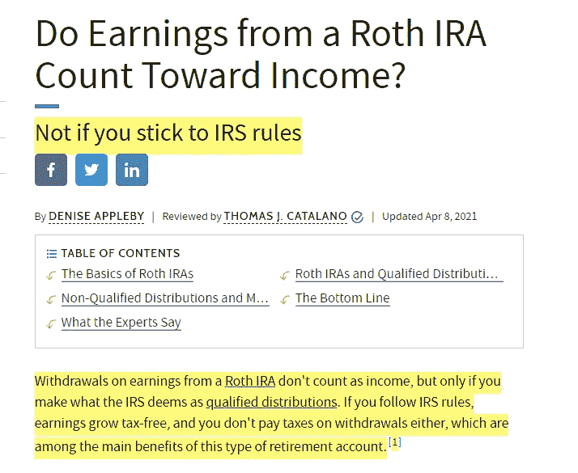
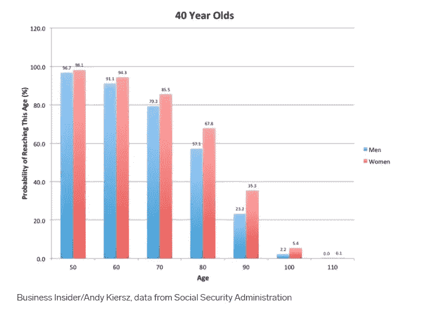

# 投资前需要回答的 9 个关键比特币个人退休账户/加密个人退休账户问题

> 原文：<https://medium.com/coinmonks/9-crucial-questions-to-answer-before-investing-in-a-bitcoin-ira-crypto-ira-6760d9d09c91?source=collection_archive---------4----------------------->

Some people want to retire in a grand castle, I’d be too scared of ghosts!

《杂色傻瓜》在一篇题为《你应该投资比特币个人退休账户吗》的文章中写道:“即使比特币对投资者有意义，比特币个人退休账户可能也不是投资退休金的好方法。”

我没有反对作者的意思，我确实找到了有用的信息，但如果我或其他人应该投资比特币个人退休账户，像这样一篇关于复杂主题的快速文章无助于做出更明智的决定。

这个话题比一篇 682 字的文章所暗示的更复杂，需要更深入地探究比特币个人退休账户或加密个人退休账户是否值得投资。

在阅读了这篇文章和许多其他文章后，我无法找到做出更好决定所需的信息。

考虑到创造改变生活的财富的潜在收益或可能失去我的血汗钱，我需要更多一点的信息。

作为我日常工作的商业顾问，我需要更详细的分析。我做了大量深入的数据分析，以获得关于我们应该做出什么决定的见解，所以我编写了一个工具/财务模型来进行分析，但我将在下一篇文章中深入探讨这一点。

首先，在知道比特币/加密 IRA 是否适合我之前，我必须回答 9 个关键问题。

I recorded a YouTube video if you prefer watching a video instead. You can go here to watch it: [**https://youtu.be/rpZIbhWdccA**](https://youtu.be/rpZIbhWdccA)

***免责声明:*** *此外，我不是财务顾问，所以我在视频中讲述的是我的财务观点，不应被视为财务建议，所以请将其用于教育和信息目的。请做额外的研究，看看这是否对你自己独特的财务状况有意义。*

为了获得更好的想法，如果我应该投资比特币个人退休账户/加密个人退休账户，首先要回答一系列问题。

我深入研究了我的收入贡献，以及我的退休投资在我的 401k 或比特币/加密 IRA 中是否会有更好的表现。

如果你想要 25 美元的免费比特币，你可以点击下面的推荐链接，注册我最喜欢的加密经纪应用 Voyager。在平台上交易 100 美元后，你将获得 25 美元的免费比特币。(我也会赢，赢对不对？！)

[https://voyager.onelink.me/WNly/referral?af_sub5=JEF2D0](https://voyager.onelink.me/WNly/referral?af_sub5=JEF2D0)

# **# 1——我知道什么是比特币个人退休账户或加密个人退休账户吗？**

这基本上是一个退休储蓄账户(IRA =个人退休账户)，允许你使用税后资金持有和交易比特币和其他加密货币。

而 401k 是税前资金，当你退休时从 401k 中提取，税就会被扣除。

由于在将这笔钱投资到比特币个人退休账户/加密个人退休账户之前，你已经对这笔钱征税了，所以你不用缴纳额外的税，也不用为你在账户中持有的比特币或加密货币的资本收益缴税。

这是开设这些账户的主要吸引力之一，当你出售比特币和加密货币时，你的收益不会被征税。

比特币/加密 IRA 与在交易所或经纪公司(如比特币基地或航海家)拥有账户的区别在于，比特币/加密 IRA 账户有很多好处，如免税交易和延税或免税收益。

在撰写本文时，记录、出售、交换或消费加密货币在美国会产生应税事件。这取决于你的税级和你持有密码的时间。你要么被征收短期资本利得税(持有时间短于一年)，要么被征收长期资本利得税。

其他应税事件:

Source: [https://www.coindesk.com/crypto-tax-2021-guide](https://www.coindesk.com/crypto-tax-2021-guide)

同样，我不是财务或税务顾问，所以请咨询您的财务和税务专业人士，以了解您的详细情况。

从现在开始，当我在交易所或经纪公司出售或交换比特币或其他密码并获利时，我将被征税。

如果我持有不到一年，我将按照我的 IRS 所得税等级纳税。如果我持有超过一年，我将被征收长期资本利得税。

因为我的收入超过六位数，所以我属于 24%的税级。但是记住，任何额外的收入都会把你推向另一个税级。

意味着你会被征收更高的税。

Source: [https://www.bankrate.com/taxes/tax-brackets/](https://www.bankrate.com/taxes/tax-brackets/)

比方说，我卖了 crypto，赚了 11 万美元。这将使我的总收入超过 21 万美元。(耶！)

但是这个收益让我上升了两个税级，我将被征收 35%的税！(哦，不！)

Source: [https://www.kiplinger.com/taxes/capital-gains-tax/602224/capital-gains-tax-rates-for-2021-vs-2020](https://www.kiplinger.com/taxes/capital-gains-tax/602224/capital-gains-tax-rates-for-2021-vs-2020)

我的长期资本利得税将是 15%。

而比特币/加密个人退休账户(本质上是罗斯个人退休账户)的收入不计入收入。

Source: [https://www.investopedia.com/ask/answers/05/iraearningsmagi.asp#:~:text=The%20easy%20answer%20is%20that,they%20definitely%20are%20not%20taxable.&text=Generally%2C%20they%20still%20do%20not,considered%20a%20non%2Dqualified%20distribution](https://www.investopedia.com/ask/answers/05/iraearningsmagi.asp#:~:text=The%20easy%20answer%20is%20that,they%20definitely%20are%20not%20taxable.&text=Generally%2C%20they%20still%20do%20not,considered%20a%20non%2Dqualified%20distribution).

# 第二——我相信我能活到退休的时候吗？

除非在 59 岁半之前有特殊情况，否则可以在 59 岁半之后提取大量的个人退休帐户。

根据 Business Insider 的一篇文章“这是你的死期”([https://www . Business Insider . com/social-security-life-table-charts-2014-3)](https://www.businessinsider.com/social-security-life-table-charts-2014-3))

根据美国社会保障数据，基于精算的预期寿命数据，如果你年龄在 20 到 50 岁之间，你至少有 90%的机会活到 60 岁。

基于这一点，我相信我会活到 59 岁半，并享受潜在的税收优惠。

# **# 3——你长期相信比特币还是加密货币？**

比特币是过去十年中增长最快的资产类别…

Source: [https://finance.yahoo.com/news/bitcoin-becomes-best-performing-asset-132208120.html](https://finance.yahoo.com/news/bitcoin-becomes-best-performing-asset-132208120.html)

这是雅虎财经上的一篇文章根据复合资本顾问公司首席执行官汇编的数据做出的陈述。在这里，他们分析了自 2011 年以来表现最佳的 17 个资产类别。

文章称，“比特币的累计收益已经超过 2000 万%…

不，你的眼睛没看错。不是错别字。

20,000,000%!!

纳斯达克 100 指数排名第二，但比特币比第一名高出 10 倍。

Source: [https://compoundadvisors.com/2020/the-last-10-years-and-the-next-10](https://compoundadvisors.com/2020/the-last-10-years-and-the-next-10)

这些发现基于截至 2020 年 12 月 16 日的数据，而分析时间更久。

但这是在比特币约 21000 美元区间时报道的。

而在过去几个月的最低点，我们从大约 65，000 美元到大约 28，000 美元有超过 50%的修正(或者如果你更悲观的话，崩溃)。

这仍然比复合资本顾问公司首席执行官发布报告时高出 8000 美元。([https://compound advisors . com/2020/the-last-10-years and-the-next-10](https://compoundadvisors.com/2020/the-last-10-years-and-the-next-10))

在我写这篇文章的时候，比特币正在重新获得动力，大约为 40，000 美元。

At the time of final editing, Bitcoin is now at $44,000!

# **# 4——我是否已经处理好了我的主要个人财务领域？**

**我的工作提供 401(k)吗，他们提供 401(k)匹配吗？**

我的投资是否足以获得 100%的 401(k)匹配？

如果没有，这是你错过的免费资金。免费的 401(k)匹配资金损失了数十亿美元。

Source: [https://www.cnbc.com/2015/05/12/yees-missing-out-on-24b-of-free-money.html](https://www.cnbc.com/2015/05/12/yees-missing-out-on-24b-of-free-money.html)

我有信用卡债务吗？

还清你的信用卡债务。此外，还清任何其他高息债务。

我喜欢把任何高息债务视为比你投资或储蓄所得更高的东西。

作为比较，这里是财务平均收益率。

标准普尔 500 =约 10%(投资媒体)

Source: [https://www.sofi.com/learn/content/401k-rate-of-return/](https://www.sofi.com/learn/content/401k-rate-of-return/)

401k =约 9.5%

储蓄、CDs 和市场账户利率=通常低于 1%，少数异常值高于 1%

Source: [https://www.fdic.gov/regulations/resources/rates/](https://www.fdic.gov/regulations/resources/rates/)

我有应急基金吗？(里面应该有多少？)

Source: [https://www.ramseysolutions.com/saving/quick-guide-to-your-emergency-fund](https://www.ramseysolutions.com/saving/quick-guide-to-your-emergency-fund)

戴夫·拉姆齐网站上的这篇文章也强调了一个很好的指导方针，如果你欠了消费者的债，就要有 1000 美元的启动应急基金

一旦你出去了，就在你的应急基金里存 3-6 个月的费用(如果你的收入和家庭稳定，你需要的钱就越少)。

# **# 5——我能忍受熊市中 80%至 90%的大幅波动吗？(我的风险承受能力是多少？)**

Source: [https://www.cnbc.com/2018/11/26/bitcoin-nears-its-worst-ever-bear-market-down-more-than-80percent-from-the-high.html](https://www.cnbc.com/2018/11/26/bitcoin-nears-its-worst-ever-bear-market-down-more-than-80percent-from-the-high.html)

作为一个在 2018 年熊市期间一直是活跃的比特币日和摆动交易者(并且盈利)的人。我的投资从 3000 美元增加到了 11000 美元左右。

我有一个很好的风险管理策略，并在之前的早些时候减少了损失…

对于 2020-2021 年的牛市，我变得自大和过度自信。

我放弃了最初的投资策略，开始在小型、微型和新发布的代币活动中尝试高风险、高回报的加密货币。

这很令人兴奋，我……关键词是挣很多钱。

但随着价格从今年的高点 65，000 美元左右暴跌至 28，000 美元左右，这是长达 3 个月令人沮丧和紧张的价格走势。

比特币可能暴跌了 50%以上，但我的高风险加密投资暴跌了 90%以上。

这告诉我，我的风险承受能力是适中的，因为我仍然相信比特币和其他大型的“蓝筹”加密货币，如以太坊…

…但是看到我不相信会长期持续的项目价值损失 90%以上，这是一颗难以下咽的药丸。

在这几个月里，我也搞砸了我的加密日交易账户。我成了投资人，只是积累。

我离开了 crypto，但我坚持不懈地投资，因为我相信长期，相信市场最终会逆转。

如果需要的话，我准备再等 4 年。

问问你自己，你能否应对从开始比特币/加密个人退休帐户到退休期间不可避免会发生的巨大潜在波动。

# 我有其他退休来源吗？

即使我相信未来的比特币和其他加密货币，但我无法预测未来。(虽然我很想假装自己是灵媒，但我没有超能力。)

Source: [https://www.investopedia.com/terms/d/diversification.asp](https://www.investopedia.com/terms/d/diversification.asp)

我将我的退休账户多样化，以降低风险和投资的影响，如果我错了。

在退休方面，我也有 401(k)计划。我分配到我的加密个人退休帐户的收入只占我退休收入的 44%。

由于比特币的全球增长、全球采用和固有的稀缺性(只有 2100 万 BTC 会被创造出来)，我愿意打赌，并愿意接受失去通过其他投资工具投资的潜在收益。

# **# 7——我是马上就需要这笔钱，还是在退休前的任何时候都需要？**

如果我需要钱来生存，或者如果我需要钱来购买像房子或婚礼这样的大件商品，我不会把钱投资在长期投资上。

我使用的一个伟大的经验法则是只投资我能承受损失的钱。

因为加密货币波动大，我只投资能赔的。

简单而有效的策略，因为意外总是会发生。

# **# 8——在比特币个人账户中使用这笔钱的机会成本是多少？(这是我的钱的最佳用途吗？)**

我使用这笔钱的下一个最佳选择是什么？想出 3 种情景供你参考:乐观情况、保守情况和最坏情况

将它与比特币/加密个人退休账户相比，这是你的下一个最佳选择。

你愿意冒着最坏情况的风险，用最坏情况的可能性来回报一个保守的案例吗？

在下一个视频中，我将深入探讨这个问题，讲述我是如何计算和分析每个案例的。

以及我最终是如何决定将我的每月分配从 18%改为 10%。

现在有 8%的资金投入到一个加密的个人退休帐户中。

成为 Medium ( *或在 YouTube 上订阅:*[*https://www.youtube.com/user/jefflosaria*](https://www.youtube.com/user/jefflosaria))的粉丝，以便在我深入研究数据分析和我创建的金融工具时得到通知。

尽管我的分析是针对我自己的情况，但它应该能帮助你得到更好的想法，所以请阅读下一篇文章

虽然我们无法预测未来，但一点点计划和数学会大有帮助。这一切都围绕着你自己的研究和信仰

# 比特币/加密个人退休帐户的税收优惠是否值得？

有句老话是这么说的，“关键不在于你做了什么。而是你保留的东西！”

这是要做的最大比较之一，即节税是否值得帐户的总支出。

以下是比特币/加密个人退休账户相对于非个人退休账户的一些主要优势。

Source: Source: [https://itrustcapital.com/cms/crypto-investing-through-an-ira-vs-non-ira/](https://itrustcapital.com/cms/crypto-investing-through-an-ira-vs-non-ira/)

要知道你是否能够利用这些好处，你需要知道费用是多少。

让我们以 iTrustCapital 为例，因为他们的费用比大多数比特币/加密 IRA 低，而且客户服务很好。

【剧透】这是我目前正在使用的一家公司，使用我的附属链接在 https://bit.ly/3ep9N0k**获得 1 个月免费。如果你注册的话，我会得到一点佣金，但不会额外增加你的成本。**

*我选择了 iTrustCapital，因为他们不像其他大型比特币/加密 IRA 公司那样在网上搜索客户评论时收取隐藏费用。*

*你会看到这是许多比特币/加密个人退休帐户客户对其提供商的主要抱怨。*

*缺乏沟通和糟糕的客户服务。*

*根据我的经验和研究，iTrustCapital 有很好的客户服务，他们的总部就在我日常工作的办公室附近。*

*这是他们的定价:*

**

*[See a comparison of iTrustCapital vs. other Bitcoin IRA Providers here](https://itrustcapital.com/cms/why-choose-us/?referralcode=LOSARIA&utm_source=partner&utm_medium=cpa&utm_campaign=LOSARIA)!*

*1%的加密交易费+29.95 美元的月账户费。*

***注意:**需要支付 25 美元的银行电汇费用，或者您可以免费寄送实物支票。*

*目前，我把我的银行电汇限制在每年 3 次，总计每年 75 美元的银行电汇费。*

*好的一面是，我联系了团队，看他们是否会实施 ACH 和直接存款转移，这样我们就可以避免这些费用。*

*“在 2021 年第四季度末，他们将进行平台更新，其中将包括 ACH 支付以及带赌注的止损/限价单！!"— iTrustCapital 客户服务团队*

*最初，这些都是主要的不利因素:必须支付额外的 25 美元才能将钱打入账户，并且没有赌注可用。*

*在其他平台上，一些交易所、经纪公司和加密协议/应用程序提供赌注。*

*我不得不重写这篇文章，因为没有在比特币/加密中下注的机会成本是巨大的，因为 Blockfi、Celsius 和 Voyager 等平台为下注加密提供了很高的利率。*

**

*Voyager’s July 2021 Interest Rates (not all crypto is shown)*

**

**Like 5.75% on Bitcoin on the Voyager app, again get $25 free Bitcoin when you signup and trade $100 in the app using my link* [https://voyager.onelink.me/WNly/referral?af_sub5=JEF2D0](https://voyager.onelink.me/WNly/referral?af_sub5=JEF2D0)*

*简单地说，赌注实质上是锁定你的密码，以获得对该密码的兴趣。你把你的密码锁在平台上，让平台出于各种原因使用它，比如流动性池或贷款。*

*这是一个主要的不利因素和机会成本，我最初在视频中提到，你可以把你的密码押在另一个平台上，获得更高的复利。*

*我还不知道利率，但我喜欢 iTrustCapital 将它添加到这些类型的 IRA 中，从而增加加密货币的复合增长。*

*目前，以下是年度总支出:*

*   *359.40 美元账户总费用*
*   *总共 75 美元的银行电汇费*
*   *1%的交易费*

*我将做一个简单的分析，以比较将我的比特币放在低成本交易所与将比特币放在比特币/加密 IRA 中。*

*我今年 36 岁，计划在 60 岁退休时出售我个人退休帐户中的比特币和其他密码。*

*那大约是 24 年，但是我在 35 岁开始我的加密个人退休帐户，所以那是 25 年。*

*这个分析很简单，但是我将在以后进行更复杂的分析。是的，可能会遗漏一些细微差别，但是这个粗略的估计会比我什么都不做更有助于我做出明智的决定。*

*以下是 25 年的总支出:*

*8，985 美元总账户费+5，625 美元银行电汇费=总计 14，610 美元*

*估计比特币累计= .5882 *(我将在以后的文章中详细介绍我是如何计算出来的，但我基本上是使用 Excel 中的工具进行粗略预测，应用 4 年的季节性周期。)**

*我个人认为比特币将在 300，000 美元以上，但使用我预测的数字= $268，262.83*

*更糟糕的比特币场景:(比特币停滞不前，不再增长。我不相信会发生这种情况，但我想分析一下可能的最坏情况是什么。)*

*   *没有变化= 40 000 美元*
*   *. 5882 * 40，000 美元= 23，538 美元—235.28 美元(1%交易费)*
*   *退休时的比特币价值= 8692.72 美元(回报率为-14845.28 美元)*

*我的保守预测= 268，262.83 美元*

**

*My rough analysis done inside Excel*

*假设:*

*   *错过 iTrustCapital 赌注利率*
*   *我每年只购买 3 次，利率为 1%，最大贡献为 6000 美元= 60 美元/年= 25 年* 60 美元=额外的 1500 美元购买交易费*
*   *比特币在 25 年内只会回报 20%的利润*
*   *我只交易比特币*

*尽管在 Binance.us 这样的交易所交易(我使用它是因为费用低)可能会有更高的预期回报，但我还是冒险拥有一个比特币/加密 IRA，因为没有赌注利率。*

*此外，我认为比特币的回报风险更高，可能会超过 20%的回报率，比特币的价值可能会超过 30 万美元。*

*这只是假设一种投资策略，但如果我做更多的短期交易，免税的好处会变得更加明显。*

*   *另外，除非你知道自己在做什么，否则不建议你在你的 IRA 账户内积极交易，但我是一个盈利的日间交易者和摇摆交易者，并计划做更多的交易。因为我交易越多，我就能从税收优惠中获得更多好处。*

*这也是假设我只投资比特币，而不是以太坊或其他大型股，事实并非如此。*

*我将长期交易其他加密货币(我认为这些货币有更大的增长潜力)。*

*现在，即使我的粗略分析预测会好一点，6000 美元。*

*如果我考虑其他因素:*

*   *失踪的赌注*
*   *交易除比特币之外的其他加密货币*
*   *一种认为比特币在 25 年后回报率将高于 20%的信念…*
*   *我对把钱存在 401(k)账户或把收入重新分配到比特币/加密个人退休账户的更深入分析。*

*由于我对上述问题的回答以及其他因素，我决定投资一个加密 IRA，并最终选择了 iTrustCapital。*

*我以后会做一个回顾和比较的视频，不过这里有 [iTrustCapital 的网站可以了解更多信息。](https://itrustcapital.com/cms/why-choose-us/?referralcode=LOSARIA&utm_source=partner&utm_medium=cpa&utm_campaign=LOSARIA)(附属链接)*

*但是等一下！*

*还有一个问题我回答了…*

# ***# 10——如果像查马斯或安东尼·庞皮拉诺这样的风险投资家有可能正确预测 100 万美元以上的价格，那该怎么办***

**

*Source: [https://www.cnbc.com/2017/12/12/social-capitals-palihapitiya-says-bitcoin-is-going-to-1-million-in-the-next-20-years.html](https://www.cnbc.com/2017/12/12/social-capitals-palihapitiya-says-bitcoin-is-going-to-1-million-in-the-next-20-years.html)*

**

*Source: [https://dailyhodl.com/2021/01/23/heres-how-bitcoin-could-go-to-1-million-according-to-morgan-creek-digitals-anthony-pompliano/](https://dailyhodl.com/2021/01/23/heres-how-bitcoin-could-go-to-1-million-according-to-morgan-creek-digitals-anthony-pompliano/)*

*如果他们是对的呢？他们的分析和基本原理有可能对我有意义吗？(我将在以后的文章中介绍原因。)*

*我相信什么？我会更后悔什么？投资并以糟糕或平庸的案例结束。还是不投资看他们是对的？*

*因为我相信有很小的机会，我愿意投资我整个投资组合的一小部分，因为潜在的收益。*

*对我来说，回报不对称的风险是值得的，因为我不会拿我的退休来冒险，而是拿我的短期舒适来冒险。*

*那你相信什么？*

> *加入 [Coinmonks 电报频道](https://t.me/coincodecap)，了解加密交易和投资*

## *另外，阅读*

* [## 加密税务软件——五大最佳比特币税务计算器[2021]

### 不管你是刚接触加密还是已经在这个领域呆了一段时间，你都需要交税。

medium.com](/coinmonks/best-crypto-tax-tool-for-my-money-72d4b430816b)  [## 最佳加密交易所| 2021 年十大加密货币交易所

### 加密货币交易所的加密交易需要了解市场，这可以帮助你获得利润…

blog.coincodecap.com](https://blog.coincodecap.com/crypto-exchange)*