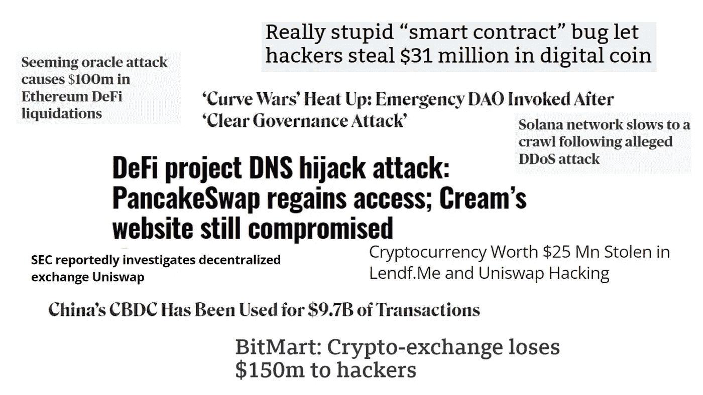

# 你应该知道的 9 个 DeFi 风险

> 原文：<https://medium.com/coinmonks/9-defi-risks-you-should-know-about-12afa6b4aeed?source=collection_archive---------10----------------------->

## 智能合同风险、治理攻击、CBDC、法规等等！

DeFi Risks

分散金融(DeFi)是区块链/加密货币领域的一个新兴领域。它为用户提供了绝佳的交易/投资机会。然而，像任何其他新技术一样，DeFi 也不是没有风险的。

> 新技术不好还是…