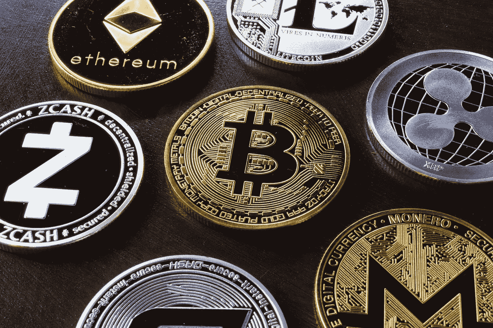

# 掌握 2022 年加密货币成功的 9 大事实

> 原文：<https://medium.com/coinmonks/9-powerful-facts-to-master-your-success-in-cryptocurrency-through-2022-4d575cfa859d?source=collection_archive---------3----------------------->

1.  预计比特币将维持 36000 美元的价格下限。

“有数据驱动的证据表明，消费者准备在 [**购买并持有大约 36，000 美元**](https://bit.ly/3GqOwPC) 的比特币，我们预计它将在 2022 年夏天保持在这一价格水平，”报告称。

2.**人们将齐心协力让比特币成为投资的“黄金标准”。**

购买比特币的第一波投资者准备忽略它的许多问题和风险，但下一代投资者预计这些问题将得到解决。“预计明年加密货币行业将有大量工作要做，并将比特币提升到传统投资的成熟‘金本位标准’。"

3.**ESG(环境、社会和治理)问题即使没有解决，也会得到有力的解决。**

一位大型投资者表示:“我们将看到加密货币行业提供大量关于开采硬币和代币的能源和气候后果的数据，并采取措施尽量减少这种足迹——就像人们现在使用可再生能源或补偿一样。”。**“**[**该行业将开始应对环境、社会和治理(ESG)挑战，这应该会提振投资者的信心**](https://bit.ly/3GqOwPC) **。”虽然加密货币的去中心化性质使得协同行动比石油等传统行业更加困难，但预计比特币采矿委员会等组织将继续积累影响力，以实现真正的变革，而以太坊的节能证据升级将得到实施。**

4.更多的法规即将出台。他们可能会首先触及稳定的信贷和分散的金融。

“在接下来的一年里，我们将会看到很多‘周边设置’，许多机构宣称，‘这在我们的控制范围之内’，”该报告称。**“**[**有监管会有成本，但我期待它能加速比特币的采用，这是最重要的**](https://bit.ly/3GqOwPC) **。”**采用率的提高导致需求增加，进而导致价格上涨。

## **阅读这个**:[*这是我今年在两个最大的加密货币*](/coinmonks/heres-my-secret-sauce-for-success-in-two-of-the-biggest-cryptocurrencies-this-year-2b4196e38522) 中取得成功的秘密酱料。”

5.对于巨额投资者来说，比特币和以太坊将继续占据至高无上的地位。

**[**根据报告，这两种成熟的加密货币形式最适合投资者**](https://bit.ly/3GqOwPC) **，**。“在我们即将进入的不可预测的通胀环境中，持有它们具有战略意义。”**

**6.犯罪活动将会减少——至少在一个方面是如此。**

****[**该报告称，加密货币的非法使用在总交易中所占的比例将会下降，尽管随着采用率的上升，其绝对数量将会攀升**](https://bit.ly/3GqOwPC) **，】**，该报告还指出，打击犯罪的努力已经取得了具体成果。“例如，反洗钱计划现在可以跟踪和捕捉发生在比特币上的重大非法行为和洗钱。随着监管机构和执法部门越来越熟练，犯罪分子未来将面临更大的挑战。”****

****7.担心灾难性崩溃的怀疑论者数量将继续下降。****

****“过去几年，随着加密货币从 2017 年的一个小行业发展到 2020 年的一个全球经济产业，并创造了成为成熟资产类别所需的关键基础设施，前景发生了巨大变化，”报告称。在短短三年时间里，该行业建立了合适的公司结构，找到了大规模执行交易的方法，解决了托管问题，让投资者可以安全地存放资产，并看到大型银行接受了这一点。**[**所有这些成就，以及该行业在 2021 年经历了一些重大压力测试的事实，都在向许多之前的怀疑者灌输信心，即加密货币将继续存在**](https://bit.ly/3GqOwPC) **。”********

****8.投资者会对市场的基本面有更好的了解。****

****投资者将越来越多地将这些因素纳入投资决策，类似于他们对传统资产类别的做法，而 [**将更少依赖于评估短期市场势头**](https://bit.ly/3GqOwPC) **。******

****9.成熟的标准必须在成长中得到体现。****

****投资者可能不再认为 crypto 从 2017 年到 2020 年的快速而混乱的扩张是一个不合格的特征，但在任何领域重演这一点都可能导致他们的舒适消失。“另一个快速、不受控制的扩张时代可能会对加密货币业务产生重大负面影响，并显著降低市场流动性——行业对此心知肚明，”报告称。**“**[**他们认识到，如果有更快速的发展**](https://bit.ly/3GqOwPC) **，他们必须以非常清晰的方式向投资者解释正在发生的事情。”******

> ****[**点击此处获得成为密码百万富翁的可靠途径**](https://bit.ly/3GqOwPC)****

## ****阅读这篇文章:“[这是我今年在两个最大的加密货币](/coinmonks/heres-my-secret-sauce-for-success-in-two-of-the-biggest-cryptocurrencies-this-year-2b4196e38522)中取得成功的秘方。”****

****如果你喜欢这篇文章，一定要关注我的博客。谢谢❣****

> ****加入 Coinmonks [电报频道](https://t.me/coincodecap)和 [Youtube 频道](https://www.youtube.com/c/coinmonks/videos)了解加密交易和投资****

## ****另外，阅读****

*   ****[币安 vs 比特邮票](https://blog.coincodecap.com/binance-vs-bitstamp) | [比特熊猫 vs 比特币基地 vs Coinsbit](https://blog.coincodecap.com/bitpanda-coinbase-coinsbit)****
*   ****[如何购买 Ripple (XRP)](https://blog.coincodecap.com/buy-ripple-india) | [非洲最好的加密交易所](https://blog.coincodecap.com/crypto-exchange-africa)****
*   ****[非洲最佳加密交易所](https://blog.coincodecap.com/crypto-exchange-africa) | [胡交易所评论](https://blog.coincodecap.com/hoo-exchange-review)****
*   ****[eToro vs robin hood](https://blog.coincodecap.com/etoro-robinhood)|[MoonXBT vs Bybit vs Bityard](https://blog.coincodecap.com/bybit-bityard-moonxbt)****
*   ****[交易信号是什么？](https://blog.coincodecap.com/trading-signal) | [Bitstamp vs 比特币基地](https://blog.coincodecap.com/bitstamp-coinbase)****
*   ****[ProfitFarmers 回顾](https://blog.coincodecap.com/profitfarmers-review) | [如何使用 Cornix Trading Bot](https://blog.coincodecap.com/cornix-trading-bot)****
*   ****[如何在势不可挡的域名上购买域名？](https://blog.coincodecap.com/buy-domain-on-unstoppable-domains)****
*   ****[印度的加密税](https://blog.coincodecap.com/crypto-tax-india) | [altFINS 审查](https://blog.coincodecap.com/altfins-review) | [Prokey 审查](/coinmonks/prokey-review-26611173c13c)****
*   ****[Blockfi vs 比特币基地](https://blog.coincodecap.com/blockfi-vs-coinbase) | [BitKan 评论](https://blog.coincodecap.com/bitkan-review) | [Bexplus 评论](https://blog.coincodecap.com/bexplus-review)****
*   ****[南非的加密交易所](https://blog.coincodecap.com/crypto-exchanges-in-south-africa) | [BitMEX 加密信号](https://blog.coincodecap.com/bitmex-crypto-signals)****
*   ****[MoonXBT 副本交易](https://blog.coincodecap.com/moonxbt-copy-trading) | [阿联酋的加密钱包](https://blog.coincodecap.com/crypto-wallets-in-uae)****
*   ****[雷米塔诺审查](https://blog.coincodecap.com/remitano-review)|[1 英寸协议指南](https://blog.coincodecap.com/1inch)****
*   ****[iTop VPN 审查](https://blog.coincodecap.com/itop-vpn-review) | [曼陀罗交易所审查](https://blog.coincodecap.com/mandala-exchange-review)****