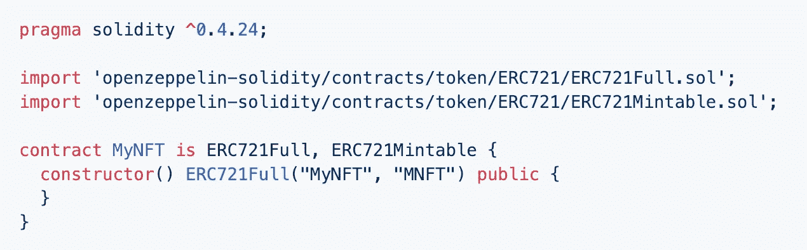
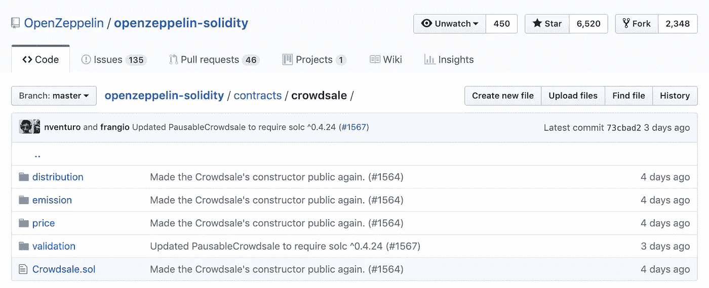
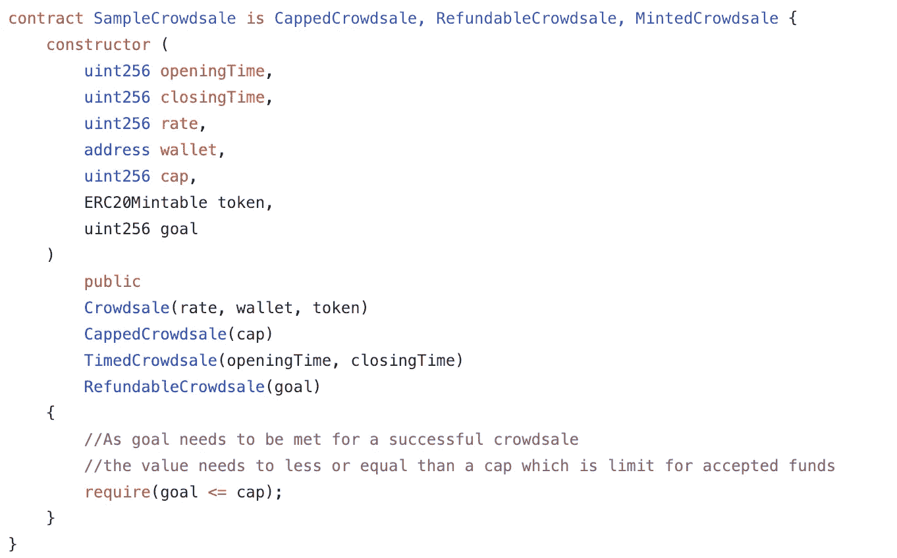

# 获得以太坊智能合约的 9 个技巧

> 原文：<https://medium.com/coinmonks/9-tips-on-getting-your-ethereum-smart-contract-right-4981a7d9883c?source=collection_archive---------1----------------------->

Credits: [ethereum.org](http://ethereum.org).

建立一份明智的合同很难，但以正确的方式建立它更难，这里有 9 个建议可以帮助你开始。

# 懒惰，不要重新发明轮子

以太坊智能合约生态系统由许多了不起的人组成，他们可能已经解决了你目前面临的问题。**使用某种类型的库**，而不是编写易于重用的代码。

我个人更喜欢用 [OpenZeppelin](https://openzeppelin.org/) ，他们的代码被各种项目广泛使用和*审计*。它们的组件涵盖了 ERC20 和 ERC721 令牌的创建，以及众筹销售或更具体的使用案例，如访问控制、加密甚至合同的生命周期。因此，您可以重用已经可用且广泛使用的代码，而不是每次重新键入 100 行来做一个 ERC721 令牌。

Example of an ERC721 token with OpenZeppelin (taken from their GitHub repository).

# 使用坚固性

当你写一份智能合同时，可靠性是默认语言，还有其他语言，但是你应该忘记它们，原因有很多:

*   坚固是为以太坊平台建造的
*   如果不是所有的组件，你想要重复使用的大部分都是由 Solidity 制造
*   有许多为 Solidity 构建的工具可以帮助你构建、测试和验证合同，比如 [Truffle](https://truffleframework.com/)
*   如果你有一个问题或错误，它会更容易找到帮助
*   非常容易学习和使用！

# 在编写代码之前对其进行测试

每当你写代码的时候，你都需要为它写测试。对于智能合约来说，这甚至更重要，代码将处理金钱，并且您希望最小化代价高昂的错误。

最好的方法是使用像前面提到的 Truffle 这样的框架，这将使编写测试更加容易。更好的是，**您应该在编写代码之前编写测试**。这有助于你清楚地定义你的目标，避免有偏见的观点，这种观点可能会使你走捷径，从而导致严重的错误。

# 在使用合同之前，先对其进行测试

即使你的合同已经完成，并且经过了 100%的测试，你也应该部署一个测试网络，让一些人使用它(并尝试破坏它)。他们会发现你忘记了什么，或者帮助找出你在编码时遗漏了什么。

# 避免循环

> 不要对或 while 循环使用*，不要使用递归函数调用。*

应该尽可能避免智能合约中的循环。Loops 意味着您在契约中进行大量的计算，可能会使运行成本非常高。此外，您可能不知道循环何时结束，并且会在代码完成之前消耗掉执行事务所支付的所有 gas(从而导致事务失败)。此外，它更难调试。

# 把你能做的事情转移到合同之外

**运行和存储智能合约极其昂贵**，智能合约也比前端的代码更难升级。所以如果你能在你的 DAPP(去中心化应用)前端做一些事情，那就去做吧。这将使你的合同更小，更便宜，更容易编码，维护和理解。

# 模块化

糟糕或单一的代码很难维护。您应该通过避免代码重复和隔离不同的组件(使测试更容易)来使用非常模块化的代码。

Organization of OpenZeppelin’s crowdsale contracts.

一个很好的例子是齐柏林的[众筹合同](https://github.com/OpenZeppelin/openzeppelin-solidity/tree/master/contracts/crowdsale)，他们有一个主合同，然后从这个合同中拿走不同的部分。例如，他们将逻辑隔离并模块化，以控制销售的分配、排放、价格和验证。如果您想要一个特定的验证逻辑，您可以编写这个特定的组件，并将标准的组件用于其他部分。现在，如果你看一下[的销售合同样本](https://github.com/OpenZeppelin/openzeppelin-solidity/blob/master/contracts/examples/SampleCrowdsale.sol)，你会发现组件可以很容易地组装在一起(就像乐高积木一样)，你最终会得到一个极其简洁易懂的代码。

Example of crowdsale contract.

拥有独立的组件使得它们非常容易测试，在销售合同的情况下，OpenZeppelin 团队在没有其他组件的情况下测试每个组件，这使得测试更小并且更容易使用。如果你有每种销售的合同(这意味着大量的代码被复制)，你将不得不写很长的测试，并为每个用例重复它们。

# 使最优化

我们已经说过合同的存储和使用成本很高。只要有可能，您应该减少执行操作所需的代码量，代码越少意味着要执行的指令越少，这意味着执行事务的成本越低。如果你的合同得到了很好的优化，维护起来也会更容易。

# 审计

你的合同会看到和使用钱，如果你对你的项目很认真，你应该雇人来审计他们，找到你看不到的弱点。

你不会希望自己的结局像[平价钱包](https://blog.zeppelin.solutions/on-the-parity-wallet-multisig-hack-405a8c12e8f7)或[刀](http://hackingdistributed.com/2016/06/18/analysis-of-the-dao-exploit/)一样。

埃利奥特·特尼耶([eliott.teissonniere.org](http://eliott.teissonniere.org))与❤️共同撰写，鼓掌并关注更多类似的帖子！

> [在您的收件箱中直接获得最佳软件交易](https://coincodecap.com/?utm_source=coinmonks)

