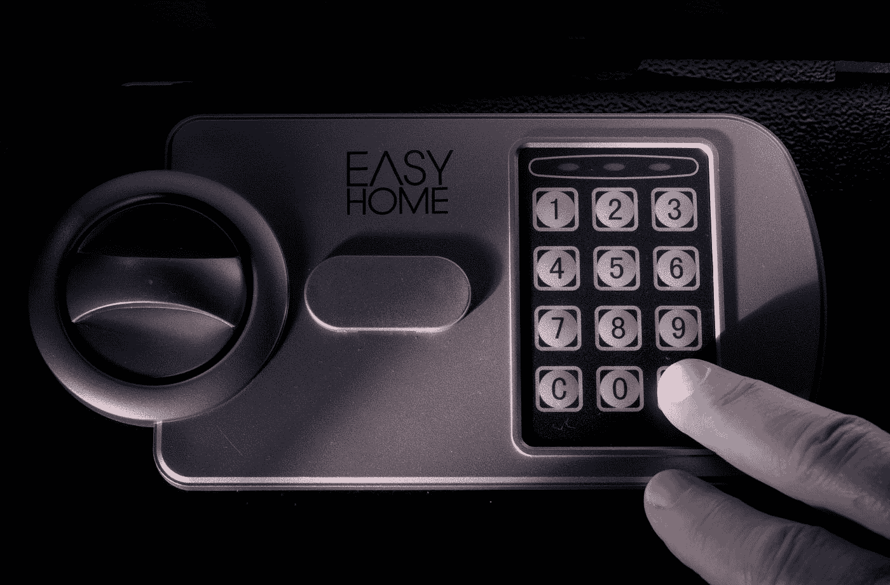

# 保证密码安全的 9 种方法

> 原文：<https://medium.com/coinmonks/9-ways-to-keep-your-crypto-safe-d969aa791070?source=collection_archive---------7----------------------->

Photo by [Immo Wegmann](https://unsplash.com/@macroman?utm_source=medium&utm_medium=referral) on [Unsplash](https://unsplash.com?utm_source=medium&utm_medium=referral)

投资加密货币时，安全性是一个关键考虑因素。即使你到目前为止只投资了很少的金额，crypto 的妙处就在于你的投资可以随时暴涨。当这种情况发生时，您可能会开始对现有的安全措施(或缺乏这些措施)感到不安。在一天结束时，如果出了问题，你丢失了你的密码，这是非常不可能的，你将能够恢复它。

加密领域存在多种风险——从你的数字钱包或设备被黑客攻击，到成为骗局的受害者并泄露你的一些安全细节，到只是丢失你的密码和种子短语并无法访问你的钱包(我相信你至少听说过一些人以这种方式损失价值数百万比特币的故事)。

幸运的是，你可以采取一些安全措施来保护你的数字资产。我将在下面介绍所有这些方法，然后你可以根据你的个人情况来决定你想要实现哪些方法。

# 1.可信设备和网络

这应该是非常明显的，但环境有时会让它变得有点棘手。当访问您的钱包或登录您的加密交换帐户时，您应该始终使用您信任的设备和网络，最好是您自己的计算机或电话以及一个安全的、受密码保护的网络。当然，环境可能会迫使您使用，例如，一个开放的公共网络，但这只是强调了使用下面描述的其他安全方法的需要。

澄清一下——我与本文中提到的任何软件和硬件制造商都没有任何关系，也没有因为推荐这些产品而获得任何佣金。我只是根据我个人的积极经验推荐它们。

# 2.防病毒软件

既然我们在谈论你用来访问你的密码的设备，那就值得考虑安装一些像样的防病毒软件，让你的系统保持最新，同时避免访问不可靠的网站，以减少发现间谍软件或恶意软件的可能性。

# 3.虚拟专用网络

我认为一个好的 VPN 是必须的。尤其是考虑到即使不投资 crypto 也很有用。我使用 Nord VPN，因为它易于使用，价格合理，似乎不会减慢我的互联网连接速度，而且功能强大。有很多选项可用(几个流行的选项是[快速 VPN](https://www.expressvpn.com/) 或[网络幽灵](https://www.cyberghostvpn.com/en_US/))，但是你应该检查你的 VPN 是否有以下功能:

*   良好的加密
*   严格的无日志策略
*   该公司位于不属于 5 Eyes 或 14 Eyes 的国家/地区(例如瑞士或巴拿马)
*   有一个自动关闭开关(如果 VPN 停止工作，关闭您的互联网连接)
*   具有 DNS 泄漏保护
*   阻止访问有害网站
*   有某种暗网监视器，它检查你的详细资料是否在暗网上。

请记住，如果攻击者已经知道了您的真实 IP 地址，VPN 将无法保护您。

# 4.勇敢的网络浏览器

我使用 Safari 和 Chrome 很多年了，但最终，我改用了 [Brave](https://brave.com/) ，部分原因是它真的很容易传输你的数据(书签、密码等)。)也是因为 Brave 有一些非常棒的功能:

*   它比其他浏览器更安全
*   它会屏蔽广告
*   它允许你在浏览网页时获得密码

# 5.纸质钱包

因此，你有你的设备，网络和浏览器排序，现在到你的加密钱包。千万不要存储在电脑、手机、邮箱、云端等。您的密码或种子短语。保证它们安全的最好方法是把它们写在一张纸上，复制一两份，然后把它们都存放在安全的地方——家里的某个地方，银行保险箱，信任的朋友或家人，等等。你应该至少有一个备份，以防你自己的副本丢失或损坏，但一定要确保所有副本都保存在安全的地方！

如果你是加密货币的新手，我建议你首先阅读我的[文章](/coinmonks/top-7-mistakes-people-make-when-investing-in-crypto-24a4ade5056)，关于人们开始投资加密时经常犯的其他常见错误。

# 6.2FA(双因素身份验证)

您应该在所有交易所、钱包、银行账户等处启用它。这是一个非常标准的特性，我们大多数人现在都已经习惯了(即使有时有点痛苦！)但是在任何可能的地方使用它真的很重要。登录时的那一点点不便，总有一天能保护你的钱。

# 7.Yubikey

这只是 2FA 的另一种形式。它是一个小设备，通过 USB 或 NFC 连接到你的手机或电脑，需要按下按钮来授权登录或转移资金。每个 Yubikey 都必须单独与一个应用程序或网站配对，尽管如果你想有一个备份密钥，你可以配对多个密钥。如果您丢失了密钥或无法访问它，您可以尝试使用不同的 2FA 方法(如您的电子邮件或电话)登录，但许多功能，例如从交易所转移密码或资金，将被阻止 24-48 小时。

虽然大多数主要交易所都支持 Yubikey，但你可能会发现一些加密钱包，例如 MetaMask，还没有这样的支持。

你应该只直接从[制造商的网站](https://www.yubico.com/)购买 Yubikey，以最大限度地降低购买假冒产品的风险。

# 8.硬件钱包

它们是存储大量密码或任何长期 hodl 组合的必备工具。你必须把你的密码从交易所或软件钱包转移到你的硬件钱包，这需要支付网络费用，可能需要一点时间。当然，如果你交易量很大，这不是特别方便，所以你可能想在交易所保留一些资金以备不时之需，但大部分资金应该放在硬件钱包中，这样可以避免交易所被黑客攻击、离线等。

和 Yubikey 一样，只从厂家直接购买硬件钱包([总账](https://www.ledger.com/)或[特雷佐](https://trezor.io/))。据我所知，所有关于硬件钱包被黑的故事，原来都是在亚马逊、易贝等上买的钱包。仅仅为了节省几美元而让你的资金冒险是没有意义的。

请记住，每当加密市场蓬勃发展，它遍布主流媒体，许多新人进入加密，硬件钱包突然需求很高，可能需要几周才能得到一个，所以最好提前购买一个。

# 9.常识

最后但肯定不是最不重要的一点——运用你的常识:-)如果你只是泄露你的登录信息或将你的密码发送给某个承诺通过“神奇空投”或其他方式让密码翻倍的人，再多的技术也无法保护你。我们都喜欢认为我们是明智的，不会上当，但骗子们不断想出新的想法和方法，让我们以为我们非常安全，直到我们突然点击了一个错误的链接。

有很多方法可以在 crypto 赚到改变生活的钱。不要太贪婪，不要匆忙，仔细检查每件事，甚至可能有一点点偏执，以保持安全；-)

我希望这篇文章对你有所帮助，并让你感兴趣。如果你对加密教程和加密市场评论感兴趣，请查看我的 [YouTube 频道](https://www.youtube.com/channel/UCyg8fnd8xctdTL3eyPHFraA)并在 [Twitter](https://twitter.com/iamcryptobadger) 上关注我。

— —

*免责声明*

*本视频涵盖的内容不被视为投资建议。*

*我不是财务顾问。以上只是我自己的一些推测性的观点、想法和理论。*

*不要纯粹根据本文提供的信息进行交易或投资。*

> 加入 Coinmonks [电报频道](https://t.me/coincodecap)和 [Youtube 频道](https://www.youtube.com/c/coinmonks/videos)了解加密交易和投资

## 另外，阅读

*   [电网交易机器人](https://blog.coincodecap.com/grid-trading) | [Cryptohopper 审核](/coinmonks/cryptohopper-review-a388ff5bae88) | [Bexplus 审核](https://blog.coincodecap.com/bexplus-review)
*   [7 个最佳零费用加密交易平台](https://blog.coincodecap.com/zero-fee-crypto-exchanges)
*   [分散交易所](https://blog.coincodecap.com/what-are-decentralized-exchanges) | [比特 FIP](https://blog.coincodecap.com/bitbns-fip) | [Pionex 评论](https://blog.coincodecap.com/pionex-review-exchange-with-crypto-trading-bot)
*   [加密套利](/coinmonks/crypto-arbitrage-guide-how-to-make-money-as-a-beginner-62bfe5c868f6)指南| [如何做空比特币](/coinmonks/how-to-short-bitcoin-568a2d0b4ae5) | [1xBit 回顾](https://blog.coincodecap.com/1xbit-review)