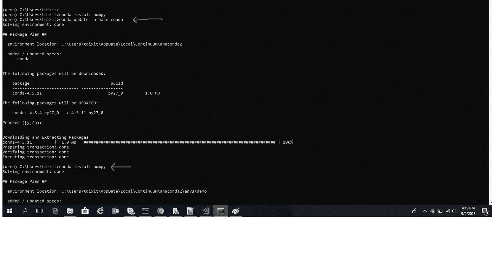

# 在笔记本电脑上设置机器学习和深度学习的 10 分钟指南

> 原文：<https://medium.com/coinmonks/a-10-minute-guide-to-setup-machine-learning-and-deep-learning-on-your-laptop-5ec127c044bc?source=collection_archive---------0----------------------->

我知道在开始项目之前设置你的笔记本电脑是相当麻烦的。但是幸运的是，对于 ML/DL 项目来说，并不需要这样。

我听人们说过，当他们开始 ML 项目时，他们花了 2-3 个小时在笔记本电脑上设置好一切。几年前这可能是真的。但是如果你今天面对这样的事情，你现在肯定是做错了。

我将带你通过 10 分钟的指南来设置你的机器。请注意，这不包括安装时间。这只是包括你将保持参与的时间。另外请注意，这是一份 **Windows** 指南。

步骤 1:安装 Python

你可以从这里下载最新版本的 Python:【https://www.python.org/downloads/ 

按下下载按钮。它会下载一个你可以运行的 exe 文件。继续按下一步，安装完成后，别忘了更新系统和环境变量。

在环境变量中，您会看到一个名为“路径”的变量。只需用 C:\Python{version}，C:\ Python { version } \ Lib \ site-packages，C:\Python{version}\Scripts 更新即可

所以我有一个 python 2.7 版本。所以我的路径变量看起来像上面的图片。

步骤 2:下载 Anaconda

 [## 下载-蟒蛇

### 下载 Anaconda 发行版|发布日期:下载对象:高性能发行版轻松安装…

www.anaconda.com](https://www.anaconda.com/download/#windows) 

你可以从上面的链接下载 Anaconda。安装大约需要 15-20 分钟。

安装 anaconda 后，打开 anaconda 提示符。

蟒蛇有一种叫做环境的东西。假设你的笔记本电脑上有 python 2.7(我也有)，但是我需要使用只能在 python 3.6 上运行的库。您可以创建一个类似于隔离的虚拟容器的环境，您可以在其中安装 python 3.6 并安装您的库和代码。

conda list envs —列出在 Anaconda 中创建的所有环境

conda create -n 环境名称-创建新环境

conda activate env_name —激活并开始在特定环境中工作

现在，Anaconda 的伟大之处在于它非常适合安装 python 库和依赖项。

所以基本上如果我想让我的下一个项目在 Keras 中，我可以直接给出命令:conda install keras

Anaconda 将负责 python 的正确版本，在您的环境中更新它，如果没有安装 tensorflow，也会安装它。

这样，您就可以开始您的 python 项目并开始编码了。您的环境已经准备好了您需要的所有库。

实际编码，可以用 iPython 笔记本。它们是构建项目原型的伟大工具。在我的下一篇文章中会有更多关于 jupyter 笔记本的内容。

> [在您的收件箱中直接获得最佳软件交易](https://coincodecap.com/?utm_source=coinmonks)

感谢阅读！！！