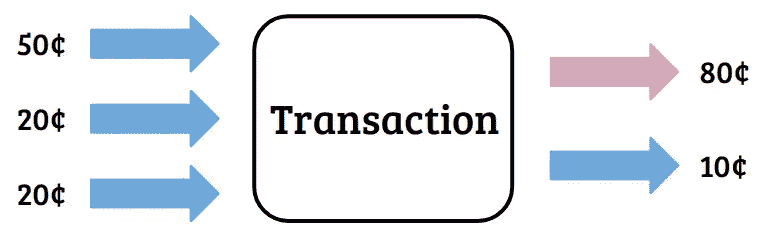
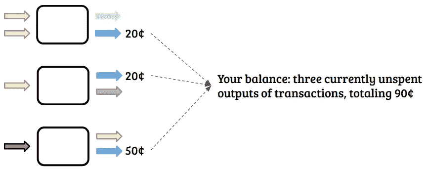

# 比特币交易的基本介绍

> 原文：<https://medium.com/coinmonks/a-basic-introduction-to-bitcoin-transactions-5633b83d518a?source=collection_archive---------1----------------------->

Photo by [Cytonn Photography](https://unsplash.com/@cytonn_photography?utm_source=unsplash&utm_medium=referral&utm_content=creditCopyText) on [Unsplash](https://unsplash.com/search/photos/handshake?utm_source=unsplash&utm_medium=referral&utm_content=creditCopyText)

## ..以及它们带来的奇怪后果

本文是详述比特币内部运作的系列文章的一部分。找到 [*这里介绍*](/@barp.edoardo/understanding-bitcoins-a-series-6c557a6fe844?sk=b7d559aee312c413253fb1c9885b7ebb) *。*

自从货币诞生以来，它就像每一种货币一样，是人们或实体之间交换和交易的工具。然而，尽管大多数现代货币的交易相当直接(尤其是现金交易)，比特币却复杂得多。没有实体的银行票据，也没有一个中央委托实体来持有你的财富并充当中间人。在比特币中，所有的交易都是完全公开的，你可以用任何一台普通的电脑加入进来，成为验证网络的一部分。那么，这一切是如何实现的呢？

先来一个简单的比喻。你去商店，你有一些硬币，比如 50，20，20。你想买一根香蕉，水果的价格是 80 英镑。你给你的三个硬币，拿回一根香蕉和 10 英镑。只看现金流，你刚刚做了一笔交易，投入是你给的三个硬币，有两个产出:80 给商店，10 给你。

交易输入和输出的概念是理解比特币的基础。如果你想一想，从它们被伪造的那一天起，这些硬币就一直在从一个交易到另一个交易，从一个所有者到另一个所有者。在成为你的之前，它们被别人拥有，也许是路边的冰淇淋车。

You used three previous Txouts (outputs of transaction), and generated two new unspent outputs, one to you, and the other to the shopkeeper.

使用硬币时，证明你目前拥有硬币的证据是简单而直接的:你实际上把它们拿在手中。另一方面，在比特币中，**你证明自己拥有一定数量比特币的方式，是通过展示之前与某个人的交易，证明这个人就是你。**(证明所有权的细节如下)

因此，从这个意义上来说，你只能花你能证明是以前交易的接收者的比特币。因此，**你从来没有实际“持有”比特币**，没有一个比特币银行账户有余额；**你所拥有的被存储为对你**(或者更确切地说，对你的地址)进行的交易的输出列表，这些交易还没有被花费。因此，这很像拥有支票，而你是支票的收款人。你不能把一张支票切成两半，然后得到两张面值一半的支票，也不能把两张支票粘在一起，或者诸如此类的事情，但是你可以在一次交易中把它们合在一起，如果超出了你实际需要支付的金额，就把零钱拿回来。

因此，在你与店主的交易结束时，10 英镑的零钱会存储在比特币网络中，作为下文所述的“交易输出”之一，你可以在未来的交易中使用它们，方法是引用它，并证明你是所有者。

Example of transactions in which you are recipient of three outputs. Those will be available to use as inputs in a future transactions.

## 地址和所有权

我已经引用了几次地址和所有权，但是它们是如何工作的呢？如前所述，不存在你存钱的比特币银行账户。相反，您所拥有的是对您(即您的地址)的所有当前未用完的交易输出的总和。但是这些地址是什么呢？我如何证明我是这个地址的主人，而不是想偷钱的骗子？

简单地说，在密码学中，有一些算法允许创建成对的公钥和私钥。重要的是，一个私钥只与一个公钥相关联，反之亦然。再者，在比特币中，也有地址，是直接从公钥中生成的。

但是你如何使用它们呢？事实证明，由于它们产生的方式，它们有一些非常重要的性质，我们现在会看到。有一个加密过程，允许您为任何信息(如文本、声音、图像)创建“数字签名”..)使用您的私钥。这种签名可以有不同的形式，但通常看起来像一长串看似随机的字母和数字。但是有趣的是,**公钥可以用来证明签名是使用与其关联的私钥**生成的。

例如，假设您想要发送一条消息，例如“我特此向约翰支付 3 美元”。你可以拿这个句子，用你的私钥签名，然后出示你的公钥来证明是你写了这个消息。现在，网络会查看您的余额，如果您有足够的余额，就会接受交易。

但是这太容易了..没有银行账户余额，用比特币，那你怎么办？这就是我们之前学到的地址派上用场的地方。如前所述，交易是针对一个地址进行的。现在一个地址直接连接到一个公钥，公钥直接连接到一个私钥。因此，您可以通过证明您拥有公钥来证明对您进行了交易。你是怎么做到的？用你的私钥签署交易。

惊呆了吧。所以回到店主的例子。你要做的是**将三笔未用完的交易存入你的地址，用你的私钥对每笔交易进行签名，并将它们用作输入，**向网络提供三笔交易参考以及新生成的签名。您现在已经证明您拥有未用完的金额，网络可以使用您提供的公钥对此进行验证，因此将验证交易。

## 这一天有趣的暗示

如果你觉得这有点奇怪，那就为接下来的事情做好准备。正如我们所见，在一次比特币交易中，你可以(几乎)随心所欲地投入和产出。这些输出不一定需要交给同一个人，就像我们在店主的例子中看到的那样，有两个接收者，你自己和出纳员。但是，更有趣的是，输入也可以来自不同的来源！

每个事务输入都被视为一个独立的部分，有其地址和值。因此，在理论上，您可以与某人就交易达成一致，交给他们一个部分完成的交易，其中您的输入已经由您自己“签名”(即验证)，该人可以添加他们的额外输入，然后将最终交易发送到网络进行处理！实际上，只有当一个人拥有多个地址，并且需要合并来自两个地址的事务时，这种情况才会发生，但这仍然是一个有趣的想法。

这是关于比特币交易的一个非常基本的介绍，故意保持非技术性，既不想让它太长，又允许任何人阅读。在下一章中，我们将深入探讨地址和所有权证明是如何工作的，以及与它们相关的安全性。这将让我们充分理解拥有比特币、签名和验证以及所有其他与交易相关的核心概念意味着什么。如果你已经喜欢到现在为止，不要犹豫跟随，这样你会在下一集出版时得到通知！

> [在您的收件箱中直接获得最佳软件交易](https://coincodecap.com/?utm_source=coinmonks)

