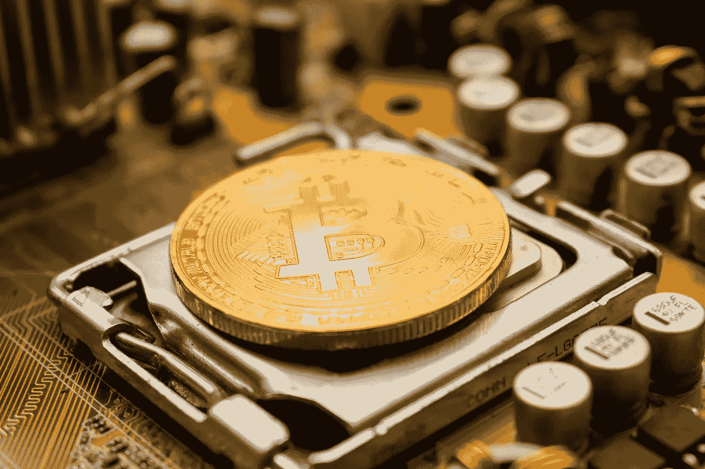

# 比特币入门指南及其重要性

> 原文：<https://medium.com/coinmonks/a-beginners-guide-to-bitcoin-and-why-it-matters-45c3a4a36970?source=collection_archive---------0----------------------->

## 凯撒的东西归凯撒，人民的东西归人民。

> “信任是任何货币体系的核心。要让它发挥作用，人们必须相信，一种货币会受到他人的正确尊重。”

Photo by [Dmitry Moraine](https://unsplash.com/@wildbook?utm_source=unsplash&utm_medium=referral&utm_content=creditCopyText) on [Unsplash](https://unsplash.com/search/photos/bitcoin?utm_source=unsplash&utm_medium=referral&utm_content=creditCopyText)