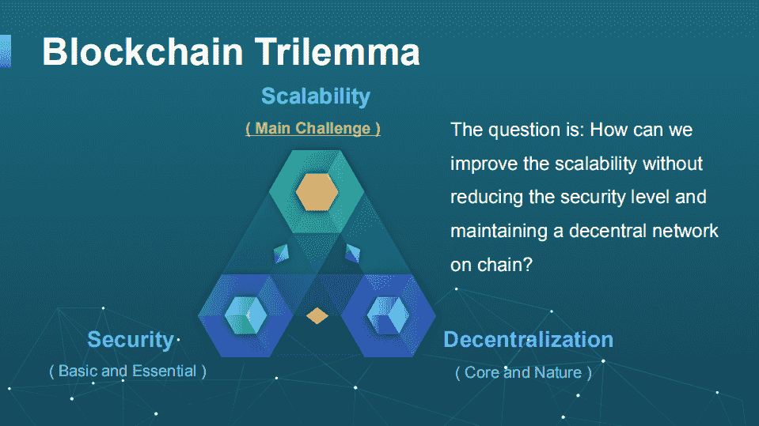

# 加密初学者指南——我最喜欢的资源目录

> 原文：<https://medium.com/coinmonks/a-beginners-guide-to-crypto-a-directory-of-my-favorite-resources-40cc8ee8d05b?source=collection_archive---------11----------------------->

## 作者:Robert Yang—Twitter @ roberty thoughts

首先，我想声明我不是专家。实际上，我认为这给了我更多的信任，因为像你们中的许多人一样，我知道在 crypto 中从 0 开始是什么感觉。但是不要担心，有比以往更多的资源供你学习。我已经在专题部分编辑了一份这样的资源列表，这样你就可以开始你的隐世之旅了。

开始之前，请注意以下几点:

1.  弄清楚所有的术语(有很多)
2.  忽略迂腐的看门人(这个空间太新了)
3.  HODL

## 比特币

啊，如果没有我们的国父中本聪和他美丽的发明比特币，加密是什么？比特币开辟了第一种加密货币的道路，并为区块链技术奠定了基础。在你深入研究加密生态系统之前，我建议你先搞清楚比特币的基本原理。在你未来的研究中，你会发现比特币和其他密码体之间有很强的主题相似性。

**资源**

1.  [比特币白皮书](https://bitcoin.org/bitcoin.pdf)比特币的创始文件。被认为是密码的构成。
2.  [区块链:简单解释了一下](https://www.youtube.com/watch?v=SSo_EIwHSd4) 区块链运作的简明视频。
3.  [高盛报告(Crypto:一种新的资产类别)](https://www.goldmansachs.com/insights/pages/crypto-a-new-asset-class.html) 对比特币“数字黄金”用例的机构调查
4.  [比特币能源消耗背后的争论](https://hbr.org/2021/05/how-much-energy-does-bitcoin-actually-consume) 好好看看能源争论的双方。
5.  [比特币的历史:从 5 个不同的角度讲述](https://theconversation.com/a-history-of-bitcoin-told-through-the-five-different-groups-who-bought-it-98359) 一篇很棒的文章，详细介绍了比特币的故事
6.  [比特币革命](/@nic__carter/a-most-peaceful-revolution-8b63b64c203e) 深入探究比特币的货币含义

## 智能合同

现在你应该有足够的知识平静地向你的优步司机兜售比特币了。但你只是触及了加密革命的皮毛。作为一个关键的发展，一些聪明人决定在区块链事务中存储代码。这导致了一个可怕的可能性:一切的去中心化。想象一个过程不能被公司或政府利益干预的世界。这个世界现在已经成为现实。

**资源**

1.  [智能合约讲解](https://www.youtube.com/watch?v=pWGLtjG-F5c) 一个为初学者描述智能合约的简明视频
2.  [12 个去中心化的应用](https://www.youtube.com/watch?v=oPIupbsVimc) 一个展示去中心化潜力的视频
3.  以太坊创始人维塔利克·布特林的标志性演讲

## 缩放三元悖论

现在你已经看到了密码在破坏我们未来方面的巨大潜力。正如你现在所知道的，crypto 的目标不是存在于真空中，而是存在于大量的未来用例中。但在这一点实现之前，还有一系列可扩展性问题阻碍网络实现大规模采用。目前，一整类协议正在努力解决这些基础设施问题。我警告你，这一节确实更多地涉及了区块链基础设施，所以它确实有点技术性。

**资源**

1.  [区块链三难困境概述](https://medium.com/r?url=https%3A%2F%2Fwww.gemini.com%2Fcryptopedia%2Fblockchain-trilemma-decentralization-scalability-definition%23section-solving-the-blockchain-trilemma) 深入了解三难困境及其解决方案。
2.  [以太坊 2.0 讲解](https://www.youtube.com/watch?v=pycVClxWUN8) 一个视频，供初学者了解以太坊缩放举措。
3.  [第 2 层伸缩解释](https://www.youtube.com/watch?v=BgCgauWVTs0&t=300s) 一段描述以太坊伸缩性问题解决方案的视频。

## 挑战

自 2020 年夏天以来，DeFi 或分散式金融出现了巨大的繁荣。这是因为 DeFi 是 crypto 获得重大成功的首批主要应用之一。它还有很长的路要走，但现在正在铺设的基础设施总有一天会破坏我们所知道的金融。

**资源**

1.  《华尔街日报》对 DeFi 的一个很好的概述
2.  [什么是 DeFi](https://www.youtube.com/watch?v=17QRFlml4pA) 
3.  [什么是丰产栽培](https://www.youtube.com/watch?v=ClnnLI1SClA&t=9s) 一段描述丰产栽培过程的视频
4.  [什么是流动性池](https://www.youtube.com/watch?v=dVJzcFDo498&t=25s) 描述 DeFi 中一项关键创新的视频:流动性池
5.  [什么是自动做市商
    一个描述另一项关键创新的视频:自动做市商](https://www.youtube.com/watch?v=1PbZMudPP5E&t=16s)

## NFTs

你可能已经看过新闻了。人们通过在互联网上出售和交易 jpg 赚取了数百万美元。我们正处在数字淘金热的起跑线上。当你可以把你的推特头像换成一只无聊的猩猩时，就没有必要再通过一辆兰博基尼来展示你的财富了。我知道，听起来像个骗局。但是 NFT 不是骗局(尽管，一些收藏可能正在经历泡沫)。它们在现实世界中有巨大的效用。

**资源**

1.  [什么是 NFTS？《华尔街日报》的一段视频描述了 NFTs 背后的宣传和效用。](https://www.youtube.com/watch?v=zpROwouRo_M)
2.  [了解 NFT 市场](https://hbr.org/2021/11/making-sense-of-the-nft-marketplace) 一篇深入研究 NFT 经济和市场的文章。
3.  [即玩即赚、元宇宙和 NFTs](https://www.coindesk.com/business/2021/09/14/play-to-earn-is-already-the-biggest-star-in-the-metaverse/) 加密游戏的成功和元宇宙 NFTs 的未来。

## 祝贺

你完了。你已经完成了速成课程。你比所有人都超前好几光年，你的收入能力刚刚暴涨。凭借你新发现的知识，你可以为新的数字时代做出贡献，从一系列加密货币中获利，或者只是在不和谐中游荡。你觉得合适就行。
我挑选了一些额外的资源，可以帮助你继续前进。请记住，加密正以疯狂的速度增长。学习完基础知识后，理解发生了什么的最好方法是先尝试一下。

打开加密钱包。开始在交易所交易(集中或分散)。上 Twitter 或 Discord 寻找吸引你眼球的新协议。GLHF！WAGMI！

**额外资源**

*   [CoinDesk](https://www.coindesk.com/)
*   [硬币电报](https://cointelegraph.com/)
*   [精细数学](https://www.youtube.com/channel/UCh1ob28ceGdqohUnR7vBACA)
*   [白板加密](https://www.youtube.com/c/whiteboardcrypto)
*   [梅萨里加密论文](https://medium.com/r?url=https%3A%2F%2Fmessari.io%2Fcrypto-theses-for-2022)
*   [CoinMarketCap](https://coinmarketcap.com/)
*   [共计量研究](https://coinmetrics.io/insights/original-research/)

作者罗伯特杨。罗伯特是 Personify 公司的创始人，该公司正致力于在区块链创建一份“智能简历”。Robert 还是 NEU 区块链协会的研究分析师和东北大学的学生。请随时在 twitter @robertythoughts 上联系他，或者发邮件到 yang.rob@northeastern.edu。

> 加入 Coinmonks [电报频道](https://t.me/coincodecap)和 [Youtube 频道](https://www.youtube.com/c/coinmonks/videos)了解加密交易和投资

## 也阅读

 [## 2021 年最佳免费加密交易机器人

### 2021 年币安、比特币基地、库币和其他密码交易所的最佳密码交易机器人。四进制，位间隙…

medium.com](/coinmonks/crypto-trading-bot-c2ffce8acb2a)  [## 最佳 4 个加密交易信号电报通道

### 这是乏味的找到正确的加密交易信号提供商。因此，在本文中，我们将讨论最好的…

medium.com](/coinmonks/best-crypto-signals-telegram-5785cdbc4b2b)  [## 获取信号、交易机器人和套利

### 在本文中，我们将讨论 bits gap——一个满足您所有交易需求的一站式加密交易平台…

blog.coincodecap.com](https://blog.coincodecap.com/bitsgap-review)  [## 40 个最佳电报频道，用于加密、电影、表演和演讲| CoinCodeCap

### 编辑描述

blog.coincodecap.com](https://blog.coincodecap.com/best-telegram-channels)  [## BlockFi 评论 2021:利弊和利率| CoinCodeCap

### 编辑描述

blog.coincodecap.com](https://blog.coincodecap.com/blockfi-review)  [## 如何在印度购买比特币？2021 年购买比特币的 7 款最佳应用[手机版]

### 如何使用移动应用程序购买比特币印度

medium.com](/coinmonks/buy-bitcoin-in-india-feb50ddfef94)  [## 加密税务软件——五大最佳比特币税务计算器[2021]

### 不管你是刚接触加密还是已经在这个领域呆了一段时间，你都需要交税。

medium.com](/coinmonks/best-crypto-tax-tool-for-my-money-72d4b430816b)  [## 存储比特币的最佳加密硬件钱包[2021] | CoinCodeCap

### 编辑描述

blog.coincodecap.com](https://blog.coincodecap.com/best-hardware-wallet-bitcoin)  [## Pionex 评论 2021 |免费加密交易机器人和交换

### Pionex 是为交易自动化提供工具的后起之秀。Pionex 上提供了 9 个加密交易机器人…

medium.com](/coinmonks/pionex-review-exchange-with-crypto-trading-bot-1e459d0191ea)